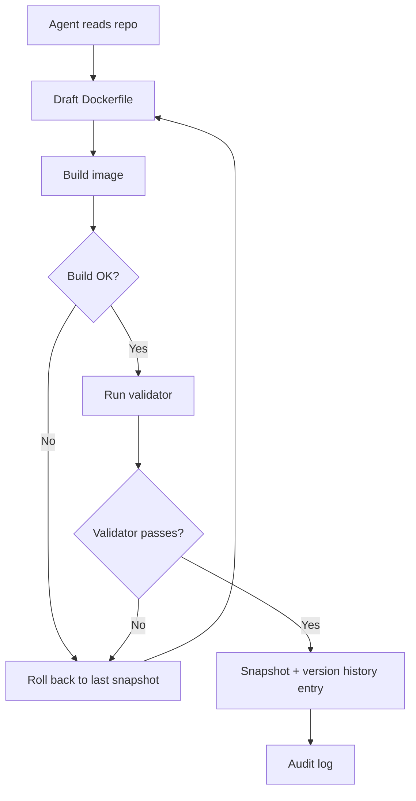

# Agent-Led Dev-Environment Iteration with Validation and Rollback

> An agent authors and iterates on its own Dockerfile, gated by a smoke test, with snapshot rollback per attempt and an audit log per change.

Agent-led dev-environment iteration is the workflow where the coding agent — not an operator — writes the environment spec (Dockerfile, dependency manifest, build steps), runs a validator against the resulting image, and only promotes the new spec when the validator passes. Failed attempts roll back to the previous working snapshot. Every change lands in a version history with an audit log.

This is the next shape after [operator-authored bootstrapping](agent-environment-bootstrapping.md). Bootstrapping is what an operator does once and freezes; agent-led iteration is what the harness does on every dependency change.

## When To Use It

Four preconditions decide whether this workflow saves time or quietly adds risk:

1. **Deterministic validator exists.** A fast, reliable command (project unit tests, `make build`, a smoke-test script) returns non-zero when the env is broken. Without it, the rollback signal never fires and the agent promotes broken configs.
2. **Snapshot-and-rollback substrate is in place.** Either per-command snapshotting (Repo2Run-style, via `docker commit`) or per-environment version history (Cursor-style). Failed attempts must cost only the build time, not the working baseline.
3. **Layer caching is effective.** Most layers stay cached across attempts. On stacks where most layers invalidate per change (heavy native builds, monorepos with cross-cutting base images), iteration cost can exceed the savings.
4. **Audit-log review cadence exists.** Someone reads the env-change log. Without it, the log is theatre and the agent's freedom to edit infrastructure becomes an undetected drift vector.

If any precondition is missing, fall back to operator-authored bootstrapping or treat env work as a human-gated change.

## How It Works



Two reference implementations:

**Repo2Run (academic — the mechanism).** [Hu et al. (2025)](https://arxiv.org/abs/2502.13681) describe a dual-environment design: the agent operates inside a Docker container sandbox while the external harness manages snapshots. Each command is wrapped — `docker commit` snapshots state, the command runs, and a non-zero exit code triggers an atomic rollback to the previous snapshot. Only successful commands are synthesised into the final Dockerfile, with version constraints replaced by the actual resolved versions. Reaches 86.0% success on 420 Python repos vs. SWE-agent's 9.0% — a 77.0-point gap attributable to the atomic-execution substrate ([arxiv 2502.13681](https://arxiv.org/abs/2502.13681)).

**Cursor cloud agent environments (production — the controls).** Cursor's [2026-05-13 release](https://cursor.com/changelog) added agent-led env authoring for cloud agents: the harness inspects the repos, generates a Dockerfile, asks clarifying questions, flags missing credentials, and validates the build before promoting it ([Cursor blog](https://cursor.com/blog/cloud-agent-development-environments)). Layer caching makes cached builds 70% faster, which is what makes per-change iteration economical. Build secrets are scoped to the build step and not exposed to the running agent. Every environment has its own version history with admin-restrictable rollback and a team-wide audit log of every change ([Cursor blog](https://cursor.com/blog/cloud-agent-development-environments)). If configuration fails, the harness falls back to a base image with explicit warnings rather than hard-failing.

## Why It Works

The mechanism has three coupled parts. The validator gives the agent a binary `worked / did not work` signal per attempt. The snapshot-and-rollback substrate makes failed attempts cost only build time, not the working baseline. Layer caching makes the per-attempt cost low enough that the iteration converges instead of being abandoned for cost reasons.

Without snapshotting, every failed command pollutes the environment state and the agent cannot distinguish whether the next failure is a new bug or residue from the previous one ([Repo2Run, arxiv 2502.13681](https://arxiv.org/html/2502.13681v2)). With snapshotting, each attempt is independent and the agent can converge — which is why the Repo2Run benchmark gap of 77.0 points opens against SWE-agent precisely on the rollback dimension.

This is the same loop-strategy reasoning as [Convergence Detection](../agent-design/convergence-detection.md) and [Rollback-First Design](../agent-design/rollback-first-design.md) applied to infrastructure rather than code.

## When This Backfires

- **No deterministic validator.** Without a fast `worked / did not work` gate, the harness promotes configs that build cleanly but break runtime — the agent's smoke test is only as strong as the conditions it exercises.
- **Cold-cache stacks.** Heavy native builds (Rust, C++) where most layers invalidate per change make each iteration attempt expensive enough that manual env authoring is faster. The 70% caching speedup in the [Cursor announcement](https://cursor.com/blog/cloud-agent-development-environments) assumes most layers stay cached.
- **Regulated infrastructure.** Sectors that require human change-management approval for env edits (SOX, HIPAA-scoped infra) cannot delegate spec authorship without invalidating the control. A rollback button does not substitute for prior review.
- **Lethal-trifecta exposure on the build step.** If the agent holds private-data read, build secrets, and egress (e.g. `RUN curl` against a private registry it can also exfiltrate to), agent-authored Dockerfiles become a prompt-injection surface — a malicious README in a dependency can rewrite the Dockerfile to leak credentials. Cursor mitigates this by scoping build secrets to the build step only ([Cursor blog](https://cursor.com/blog/cloud-agent-development-environments)); teams without that scoping inherit the risk. Agent-authored Dockerfiles have been observed exposing unnecessary ports, installing outdated packages, and embedding hardcoded credentials, with the failure modes only surfacing at runtime after the build passes ([Docker: Secure AI Agents at Runtime](https://www.docker.com/blog/secure-ai-agents-runtime-security/)).
- **No audit-log review cadence.** The Cursor audit log only protects you if someone reads it. For teams without a security on-call who reviews env changes, the log accumulates without gating anything.
- **Even with the substrate, iteration is bounded.** Cursor's environments are "configured at a point in time and rebuilt when they fall out of sync with the codebase" ([Cursor blog](https://cursor.com/blog/cloud-agent-development-environments)) — not continuously adaptive. Agent-led iteration is a discrete loop triggered by drift, not a perpetual background process.

## Contrast with the Bootstrap Pattern

| Dimension | [Operator-authored bootstrap](agent-environment-bootstrapping.md) | Agent-led iteration |
|---|---|---|
| Spec author | Human, once per env | Agent, per change |
| Failure handling | Partial env, agent proceeds | Snapshot rollback, retry |
| Change cost | Pull request + CI | Build attempt, cached layers |
| Audit surface | Git history of the spec file | Per-env version history + audit log |
| Blast radius | Spec file only | Whole env infrastructure |
| Required controls | Code review on the spec | Validator + rollback + audit-log review |

Bootstrap is the right default. Agent-led iteration earns its place when dependency churn or repo-shape changes exceed the rate at which humans want to edit the bootstrap file — and when all four preconditions hold.

## Example

A minimal agent-led iteration loop using `docker commit` as the snapshot substrate, modelled on the [Repo2Run](https://arxiv.org/html/2502.13681v2) mechanism:

```bash
SNAPSHOT="env:baseline"
docker tag "$SNAPSHOT" env:working

for attempt in 1 2 3 4 5; do
  # Agent proposes a Dockerfile edit; build it
  docker build -t env:candidate -f Dockerfile.draft .
  build_rc=$?
  if [ $build_rc -ne 0 ]; then
    # Build failed — discard candidate, agent edits Dockerfile, retry
    continue
  fi

  # Run the validator inside the candidate image
  docker run --rm env:candidate make smoke-test
  val_rc=$?
  if [ $val_rc -eq 0 ]; then
    # Promote: snapshot becomes the new working baseline
    docker tag env:candidate env:working
    docker tag env:candidate "env:v$(date +%s)"
    break
  fi
  # Validator failed — agent reads logs, edits Dockerfile, retry against env:working
done
```

The validator (`make smoke-test`) is the gate. `env:working` is the rollback target — if all attempts fail, the agent reports failure and the team keeps the previous baseline. The timestamped tag is the version-history entry.

## Key Takeaways

- Agent-led env iteration requires four preconditions: deterministic validator, snapshot/rollback substrate, effective layer caching, and an audit-log review cadence
- The mechanism is atomic execution — snapshot per attempt, rollback on validator failure — not just "agent runs `docker build` until it works"
- Repo2Run reaches 86.0% success on automated env authoring (vs. SWE-agent's 9.0%) directly because of the snapshot substrate
- Cursor's production implementation adds build-step-scoped secrets, version history, admin-gated rollback, and a per-team audit log — the controls the bare mechanism does not provide
- Prefer operator-authored bootstrap as the default; promote to agent-led iteration only when dependency churn justifies it and all four preconditions hold
- Without the lethal-trifecta controls Cursor builds in, agent-authored Dockerfiles are a documented prompt-injection surface

## Related

- [Agent Environment Bootstrapping](agent-environment-bootstrapping.md) — the operator-authored predecessor pattern this workflow contrasts against
- [Rollback-First Design](../agent-design/rollback-first-design.md) — the design discipline this workflow applies to infrastructure
- [Convergence Detection](../agent-design/convergence-detection.md) — deciding when iteration has stopped making progress
- [Agent Self-Review Loop](../agent-design/agent-self-review-loop.md) — the analogous validate-then-promote loop applied to code rather than infrastructure
- [Pre-Completion Checklists](../verification/pre-completion-checklists.md) — what the smoke-test validator looks like in practice
