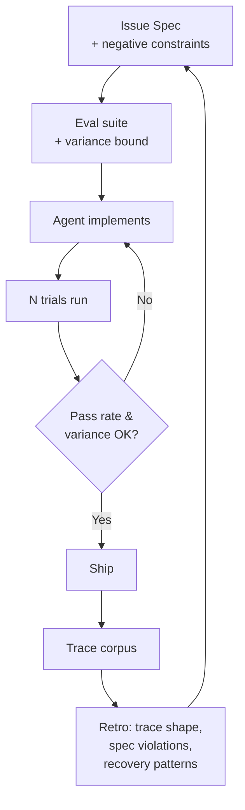

# Agentic-Agile: Adapting Agile Rituals for Agent Work

> A selective import of three agile rituals — definition of done as an eval threshold with a variance bound, acceptance criteria written as pass-rate plus negative constraints, and retrospectives on trace corpora — for teams whose unit of work is a non-deterministic agent.

Agentic-agile is a narrow workflow: it adapts three specific agile rituals to non-deterministic agent development and explicitly drops the rest. The carry-over is not metaphor — the same statistical reason agile retrospectives work for uncertain human-paced work is why trace-corpus retrospectives work for non-deterministic agent work. The cost is real: applied without the preconditions below, the rituals become theatre that legitimises feel-based approval under a new vocabulary.

## Preconditions

The workflow only pays off when these three are already in place. Adopting the rituals before the underlying instrumentation exists is worse than not adopting them.

- **An eval suite exists** with measurable success criteria — not a vibes check. [Eval-Driven Development](eval-driven-development.md) defines this prerequisite.
- **Trace instrumentation exists** — every agent run produces an inspectable artefact (transcript, tool calls, verdict). Outcome-only logging is insufficient because procedural failures like incorrect workflow routing, unsafe tool usage, and prompt-rule violations are invisible without trace-level review ([arXiv 2603.23806: Willful Disobedience / AgentPex](https://arxiv.org/abs/2603.23806)).
- **The team is past prompt-only iteration** — there are issue-based specifications with acceptance criteria. Microsoft frames this as the entry condition: prompt-driven workflows lack "a structured list of what needs to be built", "concept of done", and "phased delivery" ([Microsoft Developer Blog](https://developer.microsoft.com/blog/agentic-agile-why-agent-development-needs-agile-not-just-prompts)).

Without these, skip this workflow and stay on [Failure-Driven Iteration](failure-driven-iteration.md) until the instrumentation lands.

## The Three Rituals That Carry Over

### 1. Definition of Done = Eval Threshold + Variance Bound

A single passing run is not evidence the change is good. "The same agent running the same task twice can take different paths and produce different results" — running multiple trials per task produces a more stable pass rate ([Braintrust: Agent Evaluation](https://www.braintrust.dev/articles/agent-evaluation)). A 68% pass on one run can hide an interval anywhere from 50% to 80%.

The adapted DoD has two numbers, not one:

- **Pass rate** over N trials (Braintrust recommends averaging across 3+ runs to absorb non-deterministic variance) ([Braintrust](https://www.braintrust.dev/articles/agent-evaluation))
- **Variance bound** — the spread across trials must be below a threshold the team commits to before implementation

The "before implementation" ordering is load-bearing. Microsoft's adaptation defines DoD "that maps directly to eval checks" and runs evaluations on output artefacts rather than conversational responses ([Microsoft Developer Blog](https://developer.microsoft.com/blog/agentic-agile-why-agent-development-needs-agile-not-just-prompts)). This mirrors the [Sprint Contracts](../agent-design/sprint-contracts.md) discipline of locking the rubric before the generator runs — pre-commitment prevents post-hoc rationalisation.

Long-horizon work needs a stricter version. Software-engineering pass rates dropped from 0.90 to 0.44 as task horizon grew, and "capability and reliability rankings diverge substantially, with multi-rank inversions at long horizons" — pass@1 is structurally inadequate for production agent features ([arXiv 2603.29231: Beyond pass@1](https://arxiv.org/abs/2603.29231)).

### 2. Acceptance Criteria = Pass Rate + Negative Constraints

The Microsoft framing makes acceptance criteria explicit and bi-directional: positive checks (what the feature must do) and **negative constraints** (what it must not do) ([Microsoft Developer Blog](https://developer.microsoft.com/blog/agentic-agile-why-agent-development-needs-agile-not-just-prompts)). Negative constraints are the half that gets dropped when acceptance criteria are imported unchanged from human workflows — humans default-comply with social rules an agent will not.

Negative constraints map onto spec-violation detection. AgentPex extracts behavioural rules from agent prompts and evaluates traces for compliance — on 424 traces across telecom, retail, and airline customer-service domains it surfaced "specification violations that are not captured by outcome-only scoring" ([arXiv 2603.23806](https://arxiv.org/abs/2603.23806)). Acceptance criteria written as machine-checkable negative constraints turn the spec into a continuously-runnable test rather than a document.

### 3. Retrospectives on Trace Corpora, Not Outcomes

Outcome-only retros miss the signal. "Failed trajectories consistently exceed successful ones in length and exhibit greater variability"; agents pinpoint problem files 72–81% of the time even in failures but struggle on the fix ([arXiv 2511.00197: Code Agent Trajectories](https://arxiv.org/abs/2511.00197)). Retro signal lives in trace shape and persistence — length distributions, tool-call sequences, recovery patterns — not in the pass/fail bit.

Scrum.org's adaptation for mixed human-agent teams shifts the retro role split: the agent reviews session files, git commit logs, and PR history to surface trace-level improvement areas; humans review collaboration health and decide which failure patterns are worth a prompt or harness change ([Scrum.org](https://www.scrum.org/resources/blog/how-run-sprint-retrospective-when-half-your-team-ai-agents)). This pairs directly with [Traces Need Feedback to Power Learning](../observability/traces-need-feedback-to-power-learning.md) — without verdict-labelled traces the retro produces trajectories nobody can act on.

## The Rituals That Do Not Carry Over

Three canonical Scrum elements lose their job when the agent feedback loop is hours rather than weeks.

- **Timed sprints** — AI coding agents deliver features in hours instead of weeks ([doubleslash blog](https://blog.doubleslash.de/en/software-technologien/devops/sprints-in-the-ai-age-ai-coding-agents/)), so a fixed two-week cycle is orders of magnitude slower than the underlying iteration loop. Replace with small batches and staggered reviews on a continuous flow.
- **Daily stand-ups as the synchronisation primitive** — when the agent commits every minute, synchronisation happens in CI and dashboards, not in a meeting. The remaining human ceremony is the trace retro, not the standup.
- **Demo as the primary gate** — demos surface stakeholder misalignment after weeks of building. With agent work, that gate moves earlier: the spec (with negative constraints) and the eval suite become the gate. Demos remain useful for stakeholder feedback on direction, not for change approval.

## Diagram



## Why It Works

Agile rituals are mechanisms for shrinking feedback loops between decision and consequence. Agent development inherits two structural feedback gaps that those rituals are well-shaped to close: a **variance gap** — identical inputs produce different outputs, so one observation is not evidence the change is good — and a **trace gap** — a passing outcome can hide procedural failures only visible across a corpus of traces ([arXiv 2603.23806](https://arxiv.org/abs/2603.23806); [arXiv 2511.00197](https://arxiv.org/abs/2511.00197)). The three ported rituals address these gaps directly: pre-committed eval thresholds with variance bounds force batch-before-judge over single-run approval; negative-constraint acceptance criteria expose spec violations outcome-only scoring misses; trace-corpus retros surface failure-shape patterns invisible at the pass/fail level. The carry-over is causal, not analogical. Variance amplification is itself a capability signature in frontier models — high-capability systems exhibit higher variance, not lower — so the need for variance-aware acceptance grows with model strength rather than fading as models improve ([arXiv 2603.29231](https://arxiv.org/abs/2603.29231)).

## When This Backfires

- **No eval suite, no trace instrumentation** — adopting eval-threshold DoD without an eval suite produces theatre. Teams rename feel-based approval as "passing the rubric" and the ritual legitimises the failure mode it was supposed to fix.
- **Solo developer or single-agent context** — sprint planning and demo cadence add friction with no synchronisation payoff when one developer iterates in minutes. Continuous flow plus automated trace diagnostics is the correct ceiling.
- **Pure machine-checkable evaluation** — if "done" is fully encoded by tests plus eval threshold, a human retro adds nothing the eval dashboard does not already say. Skip the retro ritual until trace-level review surfaces something the dashboard hides.
- **Punishing variance in retros** — treating agent flakiness as a defect to blame rather than a signal to investigate amplifies the failure mode the retro was supposed to surface. Teams over-constrain prompts or drop high-variance-high-value patterns; the retrospective becomes hostile to the variance carrying the diagnostic signal.
- **Frontier-model jumps** — harness scaffolding for sprint-style decomposition pays off less as model capability improves. The [Sprint Contracts](../agent-design/sprint-contracts.md) page documents the same dynamic: an Anthropic post was later updated to describe removing the sprint construct once a more capable model could plan and self-review over a full run ([Anthropic Engineering](https://www.anthropic.com/engineering/harness-design-long-running-apps)). Revisit ritual adoption when models change tier.
- **Replacement-not-adaptation school is right for some teams** — Agentsway argues Agile and Kanban are "increasingly inadequate" for agent-inclusive teams and proposes wholesale replacement by an agent-role lifecycle ([arXiv 2510.23664](https://arxiv.org/abs/2510.23664)). On heavily agent-driven projects with mature instrumentation, replacing rituals with closed-loop trace → eval → patch automation may carry more signal than adapting them.

## Example

A team shipping a customer-support triage agent runs the workflow as follows:

```yaml
# spec.yaml — locked before implementation
feature: "Route ticket to billing vs. technical queue"

acceptance_criteria:
  positive:
    - "Routes billing keywords (refund, charge, invoice) to billing queue"
    - "Routes technical keywords (error, crash, bug) to technical queue"
  negative_constraints:
    - "Never escalates without a recorded confidence score"
    - "Never modifies the ticket body"
    - "Never calls billing-API write endpoints"

definition_of_done:
  pass_rate: ">= 0.95"
  variance_bound: "std dev across 5 trials <= 0.03"
  trials: 5
  trace_review: "AgentPex-style spec-violation scan must report zero"
```

The retro at end of week reviews the trace corpus, not the outcome dashboard: median trace length per failure class, recovery patterns when the agent self-corrects, and any spec violations the eval missed. Failure variance gets investigated as signal — was the input distribution skewed, did the model regress, is a tool flaky — not assigned as blame.

## Key Takeaways

- Agentic-agile is selective adoption, not wholesale import — three rituals carry over (DoD as eval threshold + variance bound, acceptance criteria as pass rate + negative constraints, retros on trace corpora) and three do not (timed sprints, daily stand-ups, demos as gate)
- The three preconditions (eval suite, trace instrumentation, past prompt-only iteration) are not aspirational — without them the workflow becomes theatre that legitimises feel-based approval under a new vocabulary
- The variance bound is load-bearing: pass@1 is structurally inadequate for non-deterministic agents and capability rankings invert at long horizons, so single-run acceptance is unsafe even for high-capability systems
- Retro signal lives in trace shape and persistence (length distributions, tool-call sequences, spec violations) — outcome-only retros miss the procedural failures that produce most production incidents
- Treat ritual adoption as conditional on model capability — revisit when models change tier; aggressive ceremony adoption can outlive its model regime

## Related

- [Sprint Contracts](../agent-design/sprint-contracts.md)
- [Agent Development Lifecycle](../agent-design/agent-development-lifecycle.md)
- [Eval-Driven Development](eval-driven-development.md)
- [Failure-Driven Iteration](failure-driven-iteration.md)
- [Entropy Reduction Agents](entropy-reduction-agents.md)
