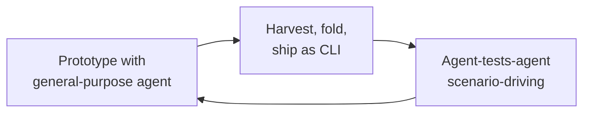

# Building Custom Agents from Substrate to Production (Agents All the Way Down)

> A framework-free methodology — two substrate preconditions, then prototype-with-general-agent, harvest as a CLI, and drive scenarios with another agent — for one-developer custom-agent builds.

The Agents All the Way Down methodology proposes that a single-purpose custom agent — one that lives inside its own application, talks to its own data and tools, enforces its own security boundaries, and carries its own brand and audit trail — can be built end-to-end without an agent framework, given two preconditions and three iterative practices ([Alier et al., 2026 — arXiv:2606.11869](https://arxiv.org/abs/2606.11869)). The methodology was distilled from the paper's case-study agent (named AAC in the paper) — a custom agent shipped for the open-source LAMB learning platform, built in approximately ten days by one developer with an AI pair-programmer and now in production ([Alier et al., 2026](https://arxiv.org/abs/2606.11869)).

## Why a Framework-Free Methodology

Most custom-agent guidance pushes engineers into a framework before they understand the problem the agent will solve. LangGraph, CrewAI, AutoGen, and the vendor SDKs each impose a runtime model and a vocabulary the engineer must learn before any agent runs. For a one-developer build, that overhead is misallocated: the framework's primitives often over-constrain the *one job* the custom agent does, and the fragmented landscape is itself a tax — "tooling and infrastructure ... fragmented across multiple services and environments" is the failure mode that drives platform consolidation ([Google Developers Blog](https://developers.googleblog.com/en/agents-cli-in-agent-platform-create-to-production-in-one-cli/), [Single-CLI Agent Platform](single-cli-agent-platform.md)). Agents All the Way Down inverts the choice: skip the framework, treat the LLM as a substrate, compose CLIs.

## When the Methodology Applies

The published evidence is one ten-day, single-developer effort. The methodology is positioned as language-and-framework-agnostic but is bounded by the conditions under which CLI composition stays cheaper than framework orchestration: one engineer who can hold the substrate in their head, one runtime ecosystem so CLI composition is uniform, and an agent fleet small enough that coordination overhead has not yet bitten. DIY composition loses visibility and starts paying port-conflict and lost-session costs at roughly **3–5 cooperating agents** ([Augment Code — DIY Multi-Agent Setups vs Intent](https://www.augmentcode.com/tools/diy-multi-agent-setups-vs-intent)); past that scale, an orchestration layer such as the AWS [CLI Agent Orchestrator](https://aws.amazon.com/blogs/opensource/introducing-cli-agent-orchestrator-transforming-developer-cli-tools-into-a-multi-agent-powerhouse/) or a full agent framework starts paying for its overhead.

## Two Preconditions: Substrate and Building Blocks

The preconditions are crossed once and kept. They are not part of the iterative loop — they constrain the surface area the loop operates on.

### Layer 1: Substrate (P1)

Frame the LLM as a software component along three axes: tools, system prompt, and messages, all under prompt caching ([Alier et al., 2026](https://arxiv.org/abs/2606.11869)). The substrate is not "an LLM" — it is the controllable three-surface API a custom agent will configure repeatedly. Treating it as a component, not a chat partner, is the precondition that makes the rest of the methodology tractable: tool definitions and system prompts become cacheable inputs, and the cost model becomes legible.

### Layer 2: Building Blocks (P2)

The methodology names eight building blocks: function calling, the Model Context Protocol, CLI orchestration, the liteshell pattern, the agent loop, skills, characters, hooks, and scaffolding ([Alier et al., 2026](https://arxiv.org/abs/2606.11869)). Each is a known, vendor-independent abstraction the engineer already has access to — function calling via the LLM API, MCP via open standard servers, CLI orchestration via the shell, hooks via the harness, and so on. The precondition is that the engineer knows the blocks well enough to assemble them; the methodology supplies the order, not the blocks themselves.

## Three Practices: Prototype, Harvest, Agent-Tests-Agent



The practices repeat for the agent's life ([Alier et al., 2026](https://arxiv.org/abs/2606.11869)).

### Layer 3: Prototype with a General-Purpose Agent (P3)

Build the first version of the custom agent inside a general-purpose agent — Claude Code, Copilot, or equivalent — rather than from a blank file. The general-purpose agent provides scaffolding, tool plumbing, and an interactive harness for free; the engineer focuses on the *one job* the custom agent will do. This is the same shape the project documents as [Prototype Before Optimizing](prototype-before-optimizing.md): defer compression and framework choice until the prototype reveals what the agent actually needs.

The prototype shape matters. Unlike a [throwaway-prototype skill](throwaway-prototype-skill.md) — where the rule is *build to discard, keep only the verdict* — the Agents All the Way Down prototype is built to be **harvested**. The polish budget is still low, but the structural decisions (tool boundaries, system prompt shape, message contract) carry forward.

### Layer 4: Harvest, Fold, and Ship as a CLI — the Turtle Pattern (P4)

Once the prototype answers the one job correctly often enough, harvest it: extract the prompt, tools, and message-handling into a standalone CLI binary ([Alier et al., 2026](https://arxiv.org/abs/2606.11869)). The paper calls this the **Turtle pattern** — turtles all the way down because the resulting CLI is, itself, a callable building block for the next agent up the stack. Multi-agent orchestration reduces to CLI composition: one shell script invokes the harvested custom agent, captures its structured output, and passes it to the next agent — no framework primitives, no message bus, no DAG runtime.

The harvested CLI is the same shape this project documents as the [Single-CLI Agent Platform](single-cli-agent-platform.md), but inverted in scope: the Single-CLI Agent Platform bundles *lifecycle commands* (scaffold, run, eval, deploy) for an agent product, while a Turtle-harvested CLI bundles *one agent's behaviour* into one invocation. Both rely on the same observation — a CLI is the smallest stable agent-readable interface — but they answer different questions.

### Layer 5: Agent-Tests-Agent (P5)

A general-purpose agent drives the harvested CLI through behavioural scenarios; the paper explicitly frames this as **a complement to classical testing, not a replacement** ([Alier et al., 2026](https://arxiv.org/abs/2606.11869)). The scenario-driving agent supplies the labour that hand-authored test corpora cannot — adversarial probes, edge-case discovery, conversational drift — while deterministic tests still cover invariants on the critical path.

This is structurally adjacent to [LLM-as-judge evaluation](llm-as-judge-evaluation.md) but the role assignment is different: agent-tests-agent uses the general-purpose agent as the *driver* of scenarios, with verdicts assigned by code, asserts, or a separate judge. The substitution is labour-saving, not verdict-quality-saving.

## Triggers and Constraints

The methodology runs on a developer-paced manual loop, not a schedule. Each pass — prototype, harvest, agent-tests-agent — terminates when the engineer judges the custom agent's behaviour acceptable for the one job. The constraint is **substrate ownership**: the engineer must keep the tools/system/messages surface in their head between passes, which is what bounds the methodology to small teams. Multi-tool coverage is uniform — Claude Code, Copilot CLI, Cursor, and Gemini CLI can each serve as the general-purpose driver in P3 and P5, since the methodology speaks to substrate-level abstractions rather than tool-specific harnesses.

## Why It Works

Each precondition closes one degree of freedom, and each practice substitutes a known-cheap discipline for an expensive one. P1 (substrate) collapses the model into three controllable surfaces, so prompt caching can pay off — repeated tool definitions and system prompts hit cache rather than burn tokens, a substrate-level optimisation impossible without the framing ([Alier et al., 2026](https://arxiv.org/abs/2606.11869)). P2 (building blocks) makes the assembly vocabulary explicit, so the engineer composes named primitives rather than inventing them — the same gain a project takes from running on top of [structured agentic software engineering](../agent-design/structured-agentic-software-engineering.md) primitives.

P3 (prototype-with-general-purpose-agent) uses an off-the-shelf agent as a discovery harness, deferring scaffolding decisions until the requirements clarify — the same baseline-first logic as [Prototype Before Optimizing](prototype-before-optimizing.md). P4 (Turtle pattern) substitutes CLI composition for framework orchestration: the shell is already a tested composition runtime, and a CLI is what other agents expect ([Single-CLI Agent Platform](single-cli-agent-platform.md)). P5 (agent-tests-agent) substitutes scenario-driving general-purpose agents for hand-authored behavioural corpora — labour-saving where scenarios outnumber hands — while leaving classical tests on invariants ([Alier et al., 2026](https://arxiv.org/abs/2606.11869)).

The methodology is internally coherent: each step makes the next cheaper, and dropping any one of the five would force the engineer to rebuild what the others assume.

## Trade-offs

The methodology trades the framework's pre-built primitives for the engineer's substrate ownership. The paper frames this as the cost the framework-free choice pays for portability and substrate-direct caching, with the team-size and substrate-coverage bounds documented in [When This Backfires](#when-this-backfires) ([Alier et al., 2026](https://arxiv.org/abs/2606.11869)).

| Approach | Trade |
|----------|-------|
| Agents All the Way Down (CLI composition) | Substrate framing makes prompt-caching gains legible and CLI composition reuses the shell as orchestration runtime — at the cost of single-developer evidence, shell-shaped observability, and coordination overhead past ~3–5 cooperating agents ([Augment Code](https://www.augmentcode.com/tools/diy-multi-agent-setups-vs-intent)) |
| Framework-first (e.g., LangGraph, CrewAI) | Framework primitives are presented as the alternative the methodology displaces; the paper does not benchmark them ([Alier et al., 2026](https://arxiv.org/abs/2606.11869)). When evaluating a framework, treat its own docs as the authoritative source for retry, state, and observability semantics |
| Vendor SDK (e.g., [Claude Agent SDK](../tools/claude/agent-sdk.md), OpenAI Agents SDK) | A vendor SDK is *one possible substrate carrier* — it can serve as the P1 substrate when the team is comfortable with the vendor coupling. Its lifecycle position differs from a Turtle-harvested CLI; see the SDK page and [Single-CLI Agent Platform](single-cli-agent-platform.md) for the full contrast |

## When This Backfires

The methodology is *qualified*, not universal. Specific conditions under which it backfires:

- **Team scale beyond one or two engineers.** The case-study agent was built by one developer in ten days ([Alier et al., 2026](https://arxiv.org/abs/2606.11869)). CLI composition past ~3–5 agents loses visibility and starts paying tax in port conflicts and orphaned sessions ([Augment Code](https://www.augmentcode.com/tools/diy-multi-agent-setups-vs-intent)).
- **Polyglot or multi-runtime stacks.** "Framework-free" assumes a shared substrate. A fleet that mixes Python, TypeScript, and Go agents pays a translation cost between CLIs that a framework would have hidden.
- **Compliance or regulated paths.** The paper frames agent-tests-agent as a *complement* to classical testing, not a replacement ([Alier et al., 2026](https://arxiv.org/abs/2606.11869)). Where reproducible audit evidence is required, the classical tests on the critical path stay — and the agent-driven scenarios are additive.
- **Teams without a senior who owns the substrate.** P1 and P2 assume the engineer already understands prompt caching, MCP, function-calling, and CLI orchestration. Juniors get more lift from a framework's guardrails than from a substrate-framing methodology.
- **Long-lived agents that outgrow the harvested shape.** P4 explicitly ships the prototype's shape. Without a refactoring discipline, accidental decisions made under the prototype's polish budget propagate into production — the methodology does not supply a "second harvest" rule.

The 3–5 agent threshold is the cleanest decision point: above it, evaluate AWS [CLI Agent Orchestrator](https://aws.amazon.com/blogs/opensource/introducing-cli-agent-orchestrator-transforming-developer-cli-tools-into-a-multi-agent-powerhouse/), a framework, or a hosted agent platform; below it, the Turtle pattern's overhead is the right size for the problem.

## Example

The paper's case study (the LAMB-platform agent) is the worked example for the full Turtle iteration; the snippet below is an **illustrative composition** showing the end-state structure of one P4 → P5 pass in shell form — it is not a verbatim transcript from the paper, just the shape any harvested-CLI plus scenario-driver loop ends up in.

```bash
# P4 output: one harvested CLI binary the rest of the stack calls
$ my-agent --input request.json --format json
{"category": "...", "confidence": 0.92, "rationale": "..."}

# P5: a general-purpose agent drives scenarios against the CLI
$ claude --headless --prompt @scenarios/edge-cases.md \
    --allow-tool 'Bash(my-agent *)'
# The general-purpose agent generates adversarial payloads,
# pipes them to my-agent, and reports failures.

# Classical tests retained for invariants:
$ pytest tests/test_my_agent_invariants.py -q
```

The harvested CLI is the unit other agents call; the scenario-driving agent is the unit the team calls; deterministic tests cover the contract neither agent can be trusted to enforce.

## Key Takeaways

- Two preconditions plus three practices — substrate, building blocks, prototype, Turtle harvest, agent-tests-agent — sized for one engineer, one substrate, one job ([Alier et al., 2026](https://arxiv.org/abs/2606.11869)).
- The Turtle pattern reduces multi-agent orchestration to CLI composition by harvesting the prototype as a CLI rather than embedding it in a framework.
- Agent-tests-agent is additive: it substitutes scenario-driving for hand-authored corpora; deterministic tests still own invariants.
- The methodology is qualified — single-developer ten-day evidence base, with composition overhead biting past ~3–5 cooperating agents ([Augment Code](https://www.augmentcode.com/tools/diy-multi-agent-setups-vs-intent)).

## Related

- [Prototype Before Optimizing](prototype-before-optimizing.md) — the baseline-first logic P3 inherits.
- [Throwaway-Prototype Skill](throwaway-prototype-skill.md) — sibling prototyping discipline that discards instead of harvesting.
- [Single-CLI Agent Platform](single-cli-agent-platform.md) — adjacent CLI-as-interface idea at the lifecycle level, not the agent-behaviour level.
- [Agent Development Lifecycle](../agent-design/agent-development-lifecycle.md) — the four-phase product loop this methodology slots inside.
- [Claude Agent SDK](../tools/claude/agent-sdk.md) — SDK-specific contrast: one vendor's substrate carrier.
- [Agent Composition Patterns](../agent-design/agent-composition-patterns.md) — composition vocabulary the Turtle pattern reduces to CLI composition.

The workflows-pages contract asks for at least one outbound link to a `docs/patterns/` or `docs/techniques/` page. The named building blocks in P2 (function calling, MCP, the agent loop, hooks, scaffolding) do not yet have dedicated patterns/techniques pages on this site; the rule directs surfacing the gap rather than inventing a destination — recorded here as a follow-up for the next coverage pass.
