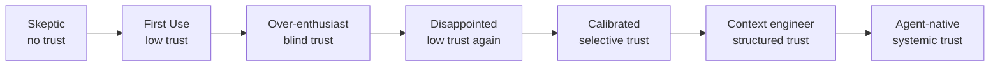

# The AI Development Maturity Model: From Skeptic to Agentic

> You move through recognizable phases when adopting AI coding tools — understanding your current phase clarifies what to learn next and what traps to avoid.

## Why Phases Matter

Adoption of AI coding tools isn't linear, and the mistakes at each phase are different. If you are over-trusting, you make different errors than if you are under-trusting. If you are stuck in prompt tinkering, you have different problems than if you are building multi-agent pipelines. The phases provide a map: where you are now, where the traps are, and what the next phase looks like.

Practitioners who have systematically observed developer AI adoption describe a recognizable phase progression. The model below synthesizes that framing with observed patterns in team adoption and trust calibration.

## The Phases

### Phase 1: Skepticism

You don't believe AI tools produce useful output. You may have tried an early or poorly configured tool and dismissed it. Usage is minimal or zero. The risk here is missing productivity gains that compound over time.

The exit condition: a task where the agent saves you meaningful time or produces output you couldn't produce as quickly alone.

### Phase 2: First Experiments

You use the tool occasionally, on low-stakes tasks. Output quality seems inconsistent. There's no systematic approach — just occasional invocation and occasional surprise.

The trap: concluding that inconsistency reflects the tool's ceiling rather than the quality of your input (prompt, context, task specification). Most inconsistency at this phase is driven by underspecified prompts and missing context.

### Phase 3: Over-Enthusiasm

The tool seems to work. You delegate broadly, review output superficially, and may ship agent-generated code with minimal verification. Errors begin to appear in production or reviews.

The trap: [trust without verify](../anti-patterns/trust-without-verify.md). Agent output can be plausible and wrong. This phase produces the war stories that create skeptics.

### Phase 4: Calibrated Disappointment

You have seen enough failures to be cautious but haven't yet developed systematic verification habits. Usage contracts. You revert to manual work for "important" tasks.

The trap: over-generalizing from failures to conclude the tool isn't useful, rather than identifying which task types and contexts produce reliable output.

### Phase 5: Calibrated Use

You understand which task types produce reliable output and apply the tool there systematically. Verification habits are established. You use the tool as an accelerator for well-defined work, not as a replacement for judgment.

This is the productive baseline. Many experienced practitioners operate here indefinitely.

### Phase 6: Context Engineering

You move beyond prompt writing to thinking about what context the agent has access to at runtime. You structure project files, instructions, and task specifications to improve agent output systematically rather than prompt-by-prompt.

Skills shift from "how do I phrase this prompt" to "how do I structure this project so agents produce better output by default." See [Seeding Agent Context](../context-engineering/seeding-agent-context.md) and [Context Priming](../context-engineering/context-priming.md).

### Phase 7: Agent-Native Workflows

You design workflows around agent capabilities from the start. Multi-step pipelines, parallel agent execution, agent-generated pull requests, automated review — the agent is a participant in your development process, not a tool invoked ad hoc.

The transition to this phase requires architectural thinking about agent inputs, outputs, and failure modes, not just prompt quality.

## Trust Calibration Arc

Trust doesn't increase monotonically. Most developers pass through a trough at Phase 4 before reaching calibrated use.

## Team Dynamics

Teams rarely move through phases in sync. Your team may have members at Phase 2 and Phase 6 simultaneously. This creates friction: the Phase 6 member builds infrastructure the Phase 2 member doesn't use; the Phase 2 member reviews agent output without the verification habits the Phase 6 member takes for granted.

Surfacing the model explicitly helps teams identify gaps and set baseline expectations. Not everyone needs to reach Phase 7, but Phase 5 (calibrated use with verification habits) is a reasonable minimum for teams working in agent-assisted codebases.

## Common Traps Across Phases

**[The Prompt Tinkerer](../anti-patterns/prompt-tinkerer.md)** (stuck between Phase 2 and 5): Endlessly adjusting prompt wording without addressing the underlying context or task specification problem. More prompt iteration rarely solves what better context or task decomposition would fix in one step.

**The Permanent Skeptic** (stuck at Phase 1): Dismisses the tool based on early failures or others' war stories without fresh evaluation. Tool capabilities change substantially between model generations; a dismissal formed during early adoption may not reflect current behavior.

**The Plateau** (stuck at Phase 5): Reaches calibrated use but doesn't invest in context engineering. Continues to work prompt-by-prompt rather than building infrastructure that compounds.

## Example

A developer joins a team that already uses Claude Code for feature development. Their trajectory:

**Week 1 — Phase 2:** They try the tool on a small bug fix. Output quality seems hit or miss. They paste a function and ask for fixes; sometimes it works, sometimes the suggestion is wrong. They conclude the tool is unreliable.

**Month 1 — Phase 3:** After seeing a colleague ship a full feature in hours, they start delegating entire tasks. They accept agent-generated PRs with light review. Two bugs reach production that a closer read would have caught.

**Month 2 — Phase 4:** The production bugs erode trust. They revert to writing code manually for "important" tasks, using the agent only for low-stakes refactoring. Usage drops by 70%.

**Month 3–4 — Phase 5:** A post-mortem reveals the bugs came from accepting output without verifying assumptions about the database schema. They develop a habit: always review agent output against the schema before merging. Output quality stabilizes because the inputs (task specs, context) are tighter. Velocity increases and holds.

**Month 6 — Phase 6:** They add a `AGENTS.md` to the repo documenting conventions, a `.claude/commands/` directory with reusable task templates, and a seed file that gives agents access to the domain model at runtime. Per-task prompt quality matters less; the infrastructure carries context by default.

**Month 9 — Phase 7:** Feature delivery is structured as a pipeline: agent drafts, human reviews decisions, agent implements feedback, automated checks gate the PR. The developer spends more time on architecture and edge cases, less on implementation.

The key observation: Phase 4 feels like the tool doesn't work. It does — the inputs were wrong. The exit is systematic verification, not abandonment.

## When This Backfires

The phase model is an observational heuristic, not a universal law. It breaks down in specific conditions:

- **Non-linear adoption paths**: Developers who switch tools mid-career, move between teams with different AI maturity, or return after extended absences often skip phases or regress. The model assumes a single continuous adoption arc; fragmented experience violates that assumption.
- **Phase misidentification**: Labeling yourself as "Phase 5 calibrated" can mask under-investment in verification habits. Self-assessed phase doesn't track actual output quality. The [Stack Overflow 2025 Developer Survey](https://survey.stackoverflow.co/2025/ai) found that 84% of developers use AI tools while only 29% trust them — usage and calibration are independent variables, not sequential phases. [METR's randomized controlled trial](https://metr.org/blog/2025-07-10-early-2025-ai-experienced-os-dev-study/) of experienced open-source developers reinforces the gap: participants estimated AI sped them up by 20% while it actually slowed them by 19%, a perception error that is indistinguishable from "Phase 5" self-assessment.
- **Team-level anchoring**: Teams that surface the model explicitly sometimes use phase labels to dismiss concerns ("they're just Phase 4") rather than addressing underlying tool or process problems. The model explains behavior; it doesn't excuse it.
- **Tool category differences**: The phases describe adoption of conversational code-generation tools. Developers adopting purpose-built agents (CI agents, code review agents) often enter at Phase 5 directly because the trust boundary is narrower and the output is more auditable. Applying the full seven-phase arc to specialized tooling adds unnecessary friction.

## Key Takeaways

- You move through recognizable phases; knowing your phase clarifies what to learn next
- Over-enthusiasm (Phase 3) and calibrated disappointment (Phase 4) are predictable traps, not indicators of tool quality
- Calibrated use (Phase 5) is the productive baseline; context engineering (Phase 6) is where compounding gains begin
- Teams often have members at different phases — surfacing this prevents friction and misaligned expectations
- The goal is effective human-agent collaboration, not full automation

## Related

- [The 7 Phases of AI-Assisted Feature Development](7-phases-ai-development.md) — feature-lifecycle phase model (distinct from this career-adoption arc)
- [Team Onboarding for Agent Workflows](team-onboarding.md)
- [Agent-Powered Codebase Q&A and Onboarding](codebase-qa-onboarding.md)
- [Agent Debugging](../observability/agent-debugging.md)
- [Seeding Agent Context: Breadcrumbs in Code](../context-engineering/seeding-agent-context.md)
- [Context Priming](../context-engineering/context-priming.md)
- [Steering Running Agents: Mid-Run Redirection and Follow-Ups](../agent-design/steering-running-agents.md)
- [CLI-IDE-GitHub Context Ladder for AI Agent Development](cli-ide-github-context-ladder.md)
- [Human-in-the-Loop Placement](human-in-the-loop.md)
- [Compound Engineering: Learning Loops That Make Each Feature](compound-engineering.md)
