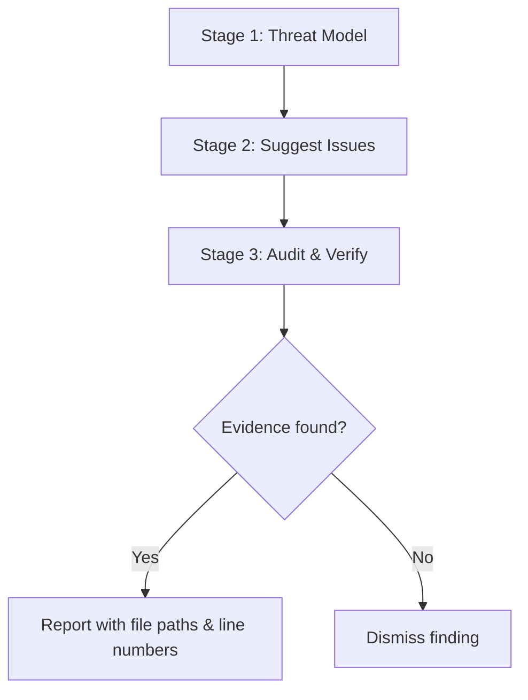

# AI-Powered Vulnerability Triage

> Decompose security analysis into sequential stages — threat modeling, issue suggestion, and evidence-based audit — to reduce hallucination and produce findings with concrete file paths and line numbers.

## The Workflow

AI models hallucinate when asked to perform end-to-end vulnerability analysis in a single prompt. They invent plausible-sounding vulnerabilities without verifiable evidence — the [GitHub Security Lab framework](https://github.blog/security/ai-supported-vulnerability-triage-with-the-github-security-lab-taskflow-agent/) was built specifically because LLMs "often omit steps in large, unstructured prompts" and require discrete tasks to stay reliable. Task decomposition solves this by splitting the analysis into stages, each with a fresh context and distinct objective.

GitHub Security Lab's [Taskflow Agent](https://github.blog/security/community-powered-security-with-ai-an-open-source-framework-for-security-research/) implements this as an open-source framework built on YAML-based taskflow orchestration and MCP (Model Context Protocol) interfaces.

## Three-Stage Pipeline



### Stage 1: Threat Modeling

The model [divides the repository into functional components, identifying entry points, web-specific details, and intended user capabilities](https://github.blog/security/how-to-scan-for-vulnerabilities-with-github-security-labs-open-source-ai-powered-framework/). This establishes security boundaries — what constitutes legitimate behavior versus a security violation.

The output is a structured map of attack surface, not a list of vulnerabilities. No auditing happens at this stage.

### Stage 2: Issue Suggestion

Based on the threat model, the LLM [proposes vulnerability categories likely present in each component, emphasizing untrusted input exposure and privilege implications](https://github.blog/security/how-to-scan-for-vulnerabilities-with-github-security-labs-open-source-ai-powered-framework/). The model deliberately avoids performing actual auditing — it generates hypotheses, not findings.

Treating suggestions as unvalidated alerts (similar to external tool output) prevents the self-validation loop where the model confirms its own speculation. The framework's [fresh-context-per-stage design](https://github.blog/security/how-to-scan-for-vulnerabilities-with-github-security-labs-open-source-ai-powered-framework/) is the structural mechanism that enforces this separation.

### Stage 3: Audit Verification

A fresh context processes suggestions with [rigorous criteria, requiring concrete attack scenarios, specific file paths, and line numbers before marking findings as vulnerabilities](https://github.blog/security/how-to-scan-for-vulnerabilities-with-github-security-labs-open-source-ai-powered-framework/). The model must produce:

- Specific file paths and line numbers (not endpoint names)
- Realistic attack scenarios with technical prerequisites
- Concrete code references showing the vulnerability mechanism
- Explicit acknowledgment when no vulnerability exists

This stage functions as triage, not self-validation. Findings without concrete evidence are dismissed.

## Why Task Decomposition Reduces Hallucination

Breaking analysis into separate tasks with fresh context [prevents the model from taking shortcuts](https://github.blog/security/how-to-scan-for-vulnerabilities-with-github-security-labs-open-source-ai-powered-framework/). Each stage has distinct prompts emphasizing different concerns: breadth in suggestion, rigor in verification.

The framework also [stores results of each task in a database](https://github.blog/security/ai-supported-vulnerability-triage-with-the-github-security-lab-taskflow-agent/) rather than passing them through a single [prompt chain](../context-engineering/prompt-chaining.md). This enables fresh context windows for each task, granular debugging when a stage produces poor results, and the ability to rerun individual stages without repeating the full pipeline.

## Multi-Model Analysis

LLM non-determinism means a single model run misses vulnerabilities. The framework supports [running audits multiple times using different models](https://github.blog/security/how-to-scan-for-vulnerabilities-with-github-security-labs-open-source-ai-powered-framework/) because different models surface entirely different vulnerabilities in identical codebases. Running both GPT and Claude on the same suggestions produces complementary results.

## Results at Scale

From testing across 40+ repositories, the framework [generated 1,003 suggested issues](https://github.blog/security/how-to-scan-for-vulnerabilities-with-github-security-labs-open-source-ai-powered-framework/):

- 139 marked as exploitable during audit
- 91 after deduplication
- 19 reported (21% of deduplicated findings confirmed as real vulnerabilities)
- 22% rejected as false positives; 57% as low-severity

Vulnerability detection rates varied by category: business logic issues had the highest rate at 25%, IDOR/access control at 15.8%, and authentication issues at 16.5%. SQL injection, XXE, and open redirect categories showed 0% — the framework proved [more effective at logical vulnerabilities than memory-safety or injection issues](https://github.blog/security/how-to-scan-for-vulnerabilities-with-github-security-labs-open-source-ai-powered-framework/).

The team [discovered approximately 30 real-world vulnerabilities since August](https://github.blog/security/ai-supported-vulnerability-triage-with-the-github-security-lab-taskflow-agent/), many of which have been fixed and published.

## YAML Taskflow Orchestration

Taskflows are [declarative YAML files describing sequential tasks](https://github.blog/security/community-powered-security-with-ai-an-open-source-framework-for-security-research/) — functionally similar to GitHub Actions workflows. Each taskflow includes:

- **Personalities** — role definitions scoping the model's security expertise
- **Toolboxes** — MCP server instructions for code introspection and GitHub API access
- **Prompts** — structured instructions for each stage with explicit output format requirements

The framework is available as two PyPI packages: `seclab-taskflow-agent` (core engine) and `seclab-taskflows` (community taskflow suite).

## Example

Install the framework from PyPI and run a taskflow against a target repository:

```bash
pip install seclab-taskflow-agent seclab-taskflows
seclab-taskflow-agent run --taskflow vulnerability-triage --repo "$REPO_URL"
```

A minimal taskflow YAML defines each stage with a personality, toolbox, and prompt:

```yaml
name: vulnerability-triage
tasks:
  - id: threat-model
    personality: security-researcher
    toolbox: code-introspection
    prompt: |
      Divide the repository into functional components. Identify entry points,
      untrusted input sources, and privilege boundaries. Output a structured
      attack surface map — do not suggest vulnerabilities yet.

  - id: suggest-issues
    depends_on: threat-model
    personality: security-researcher
    toolbox: code-introspection
    prompt: |
      Based on the threat model, propose vulnerability categories likely present
      in each component. Emphasize untrusted input exposure and privilege
      implications. Output hypotheses only — do not audit yet.

  - id: audit-verify
    depends_on: suggest-issues
    personality: security-auditor
    toolbox: [code-introspection, github-api]
    prompt: |
      For each suggested issue, provide concrete evidence: specific file paths,
      line numbers, and a realistic attack scenario. If no evidence exists,
      dismiss the finding explicitly.
```

Each task runs in a fresh context; results are stored in a database between stages rather than passed through a single prompt chain.

## Key Takeaways

- Decompose vulnerability analysis into threat modeling, issue suggestion, and evidence-based audit — never ask a model to do all three in one prompt
- Require concrete evidence (file paths, line numbers, attack scenarios) in the audit stage to suppress hallucinated findings
- Run multiple models on the same suggestions for complementary coverage — different models find different vulnerabilities
- The framework detected a 21% real vulnerability rate among deduplicated audit findings across 40+ repositories
- Logical vulnerabilities (business logic, access control) are detected more reliably than injection or memory-safety issues

## When This Backfires

- **Injection and memory-safety vulnerabilities**: SQL injection, XXE, and open redirect categories showed [0% detection rate](https://github.blog/security/how-to-scan-for-vulnerabilities-with-github-security-labs-open-source-ai-powered-framework/) across the test set. Use dedicated static analysis or fuzzing tools for these classes instead of the LLM pipeline.
- **Resource-constrained environments**: Each run consumes significant API quota through extensive tool calls and can [take 1–2 hours on a medium-sized repository](https://github.blog/security/how-to-scan-for-vulnerabilities-with-github-security-labs-open-source-ai-powered-framework/). Running multiple models multiplies both time and cost.
- **Tasks requiring automated validation**: The framework [generates bug reports for human review rather than verified exploits](https://github.blog/security/ai-supported-vulnerability-triage-with-the-github-security-lab-taskflow-agent/) — it cannot confirm exploitability programmatically. If downstream workflows require machine-readable proof-of-concept output, this approach does not provide it.
- **Narrow or well-typed codebases**: The approach is most valuable for ["fuzzy" semantic patterns that traditional static analysis misses](https://github.blog/security/ai-supported-vulnerability-triage-with-the-github-security-lab-taskflow-agent/). For codebases where CodeQL or Semgrep rules already cover the threat surface, the marginal value is lower.

## Related

- [Agent-Assisted Code Review](../code-review/agent-assisted-code-review.md)
- [Close Attack-to-Fix Loop](../security/close-attack-to-fix-loop.md)
- [Defense in Depth for Agent Safety](../security/defense-in-depth-agent-safety.md)
- [Oracle Task Decomposition](../multi-agent/oracle-task-decomposition.md)
