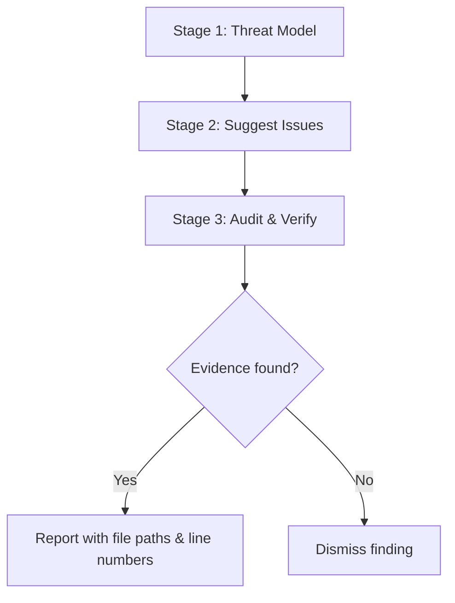

# AI-Powered Vulnerability Triage

> Vulnerability triage decomposes security analysis into staged threat-model, suggest, and audit phases to suppress hallucinated findings and produce evidence with file paths and line numbers.

## The workflow

AI models hallucinate when you ask them to do end-to-end vulnerability analysis in a single prompt. They invent plausible-sounding vulnerabilities without verifiable evidence. The [GitHub Security Lab framework](https://github.blog/security/ai-supported-vulnerability-triage-with-the-github-security-lab-taskflow-agent/) exists for this reason: LLMs "often omit steps in large, unstructured prompts" and need discrete tasks to stay reliable. Task decomposition fixes this. It splits the analysis into stages, each with a fresh context and a distinct objective.

GitHub Security Lab's [Taskflow Agent](https://github.blog/security/community-powered-security-with-ai-an-open-source-framework-for-security-research/) implements this as an open-source framework built on YAML-based taskflow orchestration and [MCP (Model Context Protocol)](../standards/mcp-protocol.md) interfaces.

## Three-stage pipeline


```mermaid
graph TD
    A[Stage 1: Threat Model] --> B[Stage 2: Suggest Issues]
    B --> C[Stage 3: Audit & Verify]
    C --> D{Evidence found?}
    D -->|Yes| E[Report with file paths & line numbers]
    D -->|No| F[Dismiss finding]
```

### Stage 1: Threat modeling

The model [divides the repository into functional components, identifying entry points, web-specific details, and intended user capabilities](https://github.blog/security/how-to-scan-for-vulnerabilities-with-github-security-labs-open-source-ai-powered-framework/). This sets the security boundaries — what counts as legitimate behavior versus a security violation.

The output is a structured map of the attack surface, not a list of vulnerabilities. No auditing happens at this stage.

### Stage 2: Issue suggestion

Based on the threat model, the LLM [proposes vulnerability categories likely present in each component, emphasizing untrusted input exposure and privilege implications](https://github.blog/security/how-to-scan-for-vulnerabilities-with-github-security-labs-open-source-ai-powered-framework/). The model deliberately avoids auditing here — it generates hypotheses, not findings.

Treat the suggestions as unvalidated alerts, similar to external tool output. This stops the self-validation loop where the model confirms its own speculation. The framework's [fresh-context-per-stage design](https://github.blog/security/how-to-scan-for-vulnerabilities-with-github-security-labs-open-source-ai-powered-framework/) enforces this separation.

### Stage 3: Audit verification

A fresh context processes the suggestions against [rigorous criteria, requiring concrete attack scenarios, specific file paths, and line numbers before marking findings as vulnerabilities](https://github.blog/security/how-to-scan-for-vulnerabilities-with-github-security-labs-open-source-ai-powered-framework/). The model must produce:

- Specific file paths and line numbers (not endpoint names)
- Realistic attack scenarios with technical prerequisites
- Concrete code references showing the vulnerability mechanism
- Explicit acknowledgment when no vulnerability exists

This stage works as triage, not self-validation. Findings without concrete evidence are dismissed.

## Why task decomposition reduces hallucination

Breaking analysis into separate tasks with fresh context [prevents the model from taking shortcuts](https://github.blog/security/how-to-scan-for-vulnerabilities-with-github-security-labs-open-source-ai-powered-framework/). Each stage has distinct prompts that emphasize different concerns: breadth in suggestion, rigor in verification.

The framework also [stores the results of each task in a database](https://github.blog/security/ai-supported-vulnerability-triage-with-the-github-security-lab-taskflow-agent/) rather than passing them through a single [prompt chain](../context-engineering/prompt-chaining.md). This gives each task a fresh context window, lets you debug a single stage that produces poor results, and lets you rerun one stage without repeating the full pipeline.

The same staged structure appears in other open-source harnesses. Vercel's [deepsec](https://vercel.com/blog/deepsec) runs coding agents through a scan, investigate, revalidate, and enrich loop, and reports roughly a 10 to 20% false-positive rate — a parallel take on the scan, suggest, and audit pattern described here.

## Multi-model analysis

LLM non-determinism means a single model run misses vulnerabilities. The framework supports [running audits multiple times with different models](https://github.blog/security/how-to-scan-for-vulnerabilities-with-github-security-labs-open-source-ai-powered-framework/) because different models surface entirely different vulnerabilities in identical codebases. Running both GPT and Claude on the same suggestions produces complementary results.

## Results at scale

In testing across 40+ repositories, the framework [generated 1,003 suggested issues](https://github.blog/security/how-to-scan-for-vulnerabilities-with-github-security-labs-open-source-ai-powered-framework/):

- 139 marked as exploitable during audit
- 91 after deduplication
- 19 reported (21% of deduplicated findings confirmed as real vulnerabilities)
- 22% rejected as false positives; 57% as low-severity

Detection rates varied by category: business logic issues had the highest rate at 25%, IDOR/access control at 15.8%, and authentication issues at 16.5%. SQL injection, XXE, and open redirect categories showed 0% — the framework proved [more effective at logical vulnerabilities than memory-safety or injection issues](https://github.blog/security/how-to-scan-for-vulnerabilities-with-github-security-labs-open-source-ai-powered-framework/).

The team [found about 30 real-world vulnerabilities since August](https://github.blog/security/ai-supported-vulnerability-triage-with-the-github-security-lab-taskflow-agent/), many of which have been fixed and published.

## YAML taskflow orchestration

Taskflows are [declarative YAML files that describe sequential tasks](https://github.blog/security/community-powered-security-with-ai-an-open-source-framework-for-security-research/) — similar to GitHub Actions workflows. Each taskflow includes:

- Personalities — role definitions that scope the model's security expertise
- Toolboxes — MCP server instructions for code introspection and GitHub API access
- Prompts — structured instructions for each stage with explicit output format requirements

The framework ships as two PyPI packages: `seclab-taskflow-agent` (the core engine) and `seclab-taskflows` (the community taskflow suite).

Once findings exist, the downstream triage surface tends to move from human-gated to programmatic. Sourcegraph describes a [human-gated incident-response pipeline](https://sourcegraph.com/blog/detect-vulnerabilities-react-quickly) — detection queries plus drafted response scaffolding, advanced by a single Slack reaction — and a [later move from that Slack triage bot to expression-based auto-close SIEM rules](https://sourcegraph.com/blog/from-slackops-to-programmatic-siem-triage), tightening the human gate as confidence in the rules grows.

## Example

Install the framework from PyPI and run a taskflow against a target repository:

```bash
pip install seclab-taskflow-agent seclab-taskflows
seclab-taskflow-agent run --taskflow vulnerability-triage --repo "$REPO_URL"
```

A minimal taskflow YAML defines each stage with a personality, toolbox, and prompt:

```yaml
name: vulnerability-triage
tasks:
  - id: threat-model
    personality: security-researcher
    toolbox: code-introspection
    prompt: |
      Divide the repository into functional components. Identify entry points,
      untrusted input sources, and privilege boundaries. Output a structured
      attack surface map — do not suggest vulnerabilities yet.

  - id: suggest-issues
    depends_on: threat-model
    personality: security-researcher
    toolbox: code-introspection
    prompt: |
      Based on the threat model, propose vulnerability categories likely present
      in each component. Emphasize untrusted input exposure and privilege
      implications. Output hypotheses only — do not audit yet.

  - id: audit-verify
    depends_on: suggest-issues
    personality: security-auditor
    toolbox: [code-introspection, github-api]
    prompt: |
      For each suggested issue, provide concrete evidence: specific file paths,
      line numbers, and a realistic attack scenario. If no evidence exists,
      dismiss the finding explicitly.
```

Each task runs in a fresh context; results are stored in a database between stages rather than passed through a single prompt chain.

## Key Takeaways

- Decompose vulnerability analysis into threat modeling, issue suggestion, and evidence-based audit — never ask a model to do all three in one prompt
- Require concrete evidence (file paths, line numbers, attack scenarios) in the audit stage to suppress hallucinated findings
- Run multiple models on the same suggestions for complementary coverage — different models find different vulnerabilities
- The framework detected a 21% real vulnerability rate among deduplicated audit findings across 40+ repositories
- Logical vulnerabilities (business logic, access control) are detected more reliably than injection or memory-safety issues

## When this backfires

- Injection and memory-safety vulnerabilities: SQL injection, XXE, and open redirect categories showed [0% detection rate](https://github.blog/security/how-to-scan-for-vulnerabilities-with-github-security-labs-open-source-ai-powered-framework/) across the test set. Use dedicated static analysis or fuzzing tools for these classes instead of the LLM pipeline.
- Resource-constrained environments: each run consumes significant API quota through extensive tool calls and can [take 1 to 2 hours on a medium-sized repository](https://github.blog/security/how-to-scan-for-vulnerabilities-with-github-security-labs-open-source-ai-powered-framework/). Running multiple models multiplies both time and cost.
- Tasks requiring automated validation: the framework [generates bug reports for human review rather than verified exploits](https://github.blog/security/ai-supported-vulnerability-triage-with-the-github-security-lab-taskflow-agent/) — it cannot confirm exploitability programmatically. If downstream workflows require machine-readable proof-of-concept output, this approach does not provide it.
- Narrow or well-typed codebases: the approach is most valuable for ["fuzzy" semantic patterns that traditional static analysis misses](https://github.blog/security/ai-supported-vulnerability-triage-with-the-github-security-lab-taskflow-agent/). For codebases where CodeQL or Semgrep rules already cover the threat surface, the marginal value is lower.

## Related

- [Agent-Assisted Code Review](../code-review/agent-assisted-code-review.md)
- [Close Attack-to-Fix Loop](../security/close-attack-to-fix-loop.md)
- [Defense in Depth for Agent Safety](../security/defense-in-depth-agent-safety.md)
- [Oracle Task Decomposition](../multi-agent/oracle-task-decomposition.md)
- [Continuous AI: A Navigation Map of Always-On Agent Workflows](continuous-ai.md) — the parent map placing this in the triage family alongside the continuous-* workflows
- [Harness Composition for Scaled Security Audits](../security/security-audit-harness-composition.md) — composing steering, scaling, and stacking primitives so an audit harness yields triage-worthy findings rather than slop
