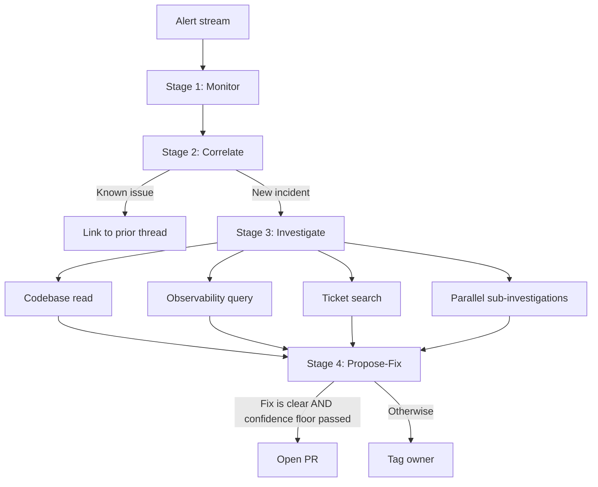

# Auto-Triage Workflow: Bug-Monitoring Agent that Connects Related Reports and Opens Fix PRs

> An agent that monitors alerts, correlates against prior incidents, investigates, and opens a fix PR — only safe under three named preconditions.

Auto-triage is a bug-monitoring agent wired to alert streams: it watches a webhook firehose (Sentry, Datadog, Linear, Slack, GitHub), groups related reports against memory of prior investigations, drives an investigation with codebase and observability tools, and either tags the right human owner or opens a fix PR — replacing the human triage layer with a structured workflow ([Cognition: Introducing Auto-Triage, 2026-05-18](https://cognition.ai/blog/auto-triage)).

## Why Auto-Triage

Traditional alerting "usually stop[s] at detection: they create a message, ticket, or alert, and then a human has to reconstruct the context around it" ([Cognition: Introducing Auto-Triage](https://cognition.ai/blog/auto-triage)). The context-reconstruction step has measurable cost — production SOC deployments still see false-positive rates "approach 99% in some cases" with 40-45% of enterprise alerts flagged as false positives ([Security Boulevard: AI Alert Triage, Apr 2026](https://securityboulevard.com/2026/04/ai-alert-triage-reducing-false-positives-analyst-fatigue/)), and ~25% of CI failures in large systems are flake rather than real defects ([Slack Engineering: Handling Flaky Tests at Scale](https://slack.engineering/handling-flaky-tests-at-scale-auto-detection-suppression/)). An on-call human moving through monitor → correlate → investigate → propose-fix pays a fresh context-loading cost at each transition; auto-triage exists to collapse that chain into one agent context.

The workflow is worth adopting only when **all three** of the following preconditions hold:

- A failure classifier sits upstream of dispatch. Architecture changes, database migrations, security-sensitive code, and ambiguous business logic are explicitly outside the safe scope of autonomous fix generation; running auto-triage on an un-classified stream produces `sleep` patches around races and retry wrappers around real outages.
- A confidence floor exists on the propose-fix branch. Cognition's published contract relies on the agent self-assessing that "the fix is clear" ([Cognition: Introducing Auto-Triage](https://cognition.ai/blog/auto-triage)); Devin specifically "does not always surface uncertainty or flag dangerous actions" ([Idlen: Devin Review 2026](https://www.idlen.io/blog/devin-ai-engineer-review-limits-2026/)). Without an external confidence gate, the human-tag branch is starved and the PR branch over-fires.
- Reviewer attention is not at capacity. **30 of 32 successfully merged AI fix PRs depended on actionable review loops** ([arXiv:2602.19441](https://arxiv.org/html/2602.19441v1)); teams whose reviewers rubber-stamp the auto-triage output collapse the workflow's final gate and ship agent-judgement code unsupervised.

If any one is missing, the workflow transfers diagnostic cost to reviewers instead of removing it.

## Four Implementation Stages



The four stages are not unique to Cognition. The same decomposition appears as perception → reasoning → planning → action in an independent LLM incident-response agent that achieves **23% faster recovery than frontier-LLM baselines** ([arXiv:2602.13156](https://arxiv.org/abs/2602.13156)); a survey of LLM-driven bug-tracking workflows expands the list to seven stages but the four are its core ([arXiv:2510.08005](https://arxiv.org/abs/2510.08005)).

### Stage 1: Monitor

Auto-triage subscribes to event sources rather than polling: Cognition names Slack messages, Linear events, GitHub activity, schedules, and incoming webhooks as the alert sources ([Cognition: Introducing Auto-Triage](https://cognition.ai/blog/auto-triage)). The agent does not own the alert thresholds — those live in the upstream system (Sentry rule, Datadog monitor) and are the responsibility of the failure classifier precondition above.

### Stage 2: Correlate

The agent groups related reports by querying long-running memory of prior investigations: "If a known issue fires new alerts, Devin can connect that to the earlier thread, de-duplicating incidents and saving significant triage time" ([Cognition: Introducing Auto-Triage](https://cognition.ai/blog/auto-triage)). The mechanism is memory-based, not rule-based — there is no per-incident fingerprint hash, no clustering algorithm in the published description. The same memory holds team routing preferences so that downstream tagging hits the right owner.

This stage carries the **oracle-poisoning surface**: a single mislabeled dedupe in week 3 can compound across months of correlated alerts, because Cognition publishes no expiry policy on the memory store. Auto-triage's correlation behaviour drifts in the direction of its mistakes unless the memory is bounded or periodically rotated — the same long-lived-memory failure mode catalogued in [audit-trojan-hippo-memory](../agent-readiness/audit-trojan-hippo-memory.md).

### Stage 3: Investigate

The agent investigates with a fixed tool palette: codebase inspection (repo read), observability tool queries, related ticket/thread search, and "sub-Devins to investigate in parallel" ([Cognition: Introducing Auto-Triage](https://cognition.ai/blog/auto-triage)). The parallel sub-agent dispatch is the load-bearing speed mechanism — sequential investigation across three observability systems exceeds the context budget faster than the response window allows.

The investigation context that survives this stage feeds the propose-fix stage without re-fetching, which is the four-stage workflow's actual cost saving — context-loading happens once across the chain rather than once per stage.

### Stage 4: Propose-Fix

The agent opens a PR when "the fix is clear", or tags the right owner when not ([Cognition: Introducing Auto-Triage](https://cognition.ai/blog/auto-triage)). The decision is binary in the published contract — no confidence score is surfaced, no per-incident-class threshold is documented. This is the stage where the three preconditions above pay off: missing any one of them turns the propose-fix branch into autonomous PR generation against alerts the agent does not understand.

Adjacent failure-rate data bounds the expected error rate of this stage: **15.3% of unmerged AI fix PRs were closed for "incorrect or incomplete fixes" and 18.1% for introducing new test failures** ([arXiv:2602.00164](https://arxiv.org/html/2602.00164)); the propose-fix branch inherits these rates from the broader AI-fix-PR population at minimum. The [agent circuit breaker](../agent-design/agent-circuit-breaker.md) pattern provides the per-fingerprint retry budget that prevents stacked low-confidence fixes against the same alert.

## Triggers and Constraints

The auto-triage workflow is **push-driven** — the agent runs on each inbound event from a subscribed source, not on a schedule. Constraint surface differs by stage:

| Stage | Authority bound by |
|---|---|
| Monitor | Upstream alerting rule (Sentry rule, Datadog monitor); no agent authority over thresholds |
| Correlate | Long-running memory store; should be bounded by TTL and rotated on detected miscorrelations |
| Investigate | Read-only tool palette (codebase, observability, tickets) — no side effects |
| Propose-Fix | PR creation against a constrained class list; tag-owner is the fallback when classification or confidence fails |

Side-effecting authority is concentrated in stage 4. Tightening the gate at stage 4 — by partitioning out-of-scope alert classes, requiring an external confidence evaluator, or following the Seer default below — is the safest place to add a control without redesigning the workflow.

## The Two Published Defaults: Cognition vs. Seer

The auto-triage shape has converged across vendors, but the default posture on stage 4 has not. Two production implementations ship opposite defaults:

| Vendor | Default behaviour at stage 4 | Justification given |
|---|---|---|
| **Devin Auto-Triage** | Opens a PR when the agent self-assesses "the fix is clear" ([Cognition: Introducing Auto-Triage](https://cognition.ai/blog/auto-triage)) | Memory-driven correlation and prior-fix patterns are enough signal; human-tag branch is the escape valve when not. |
| **Sentry Seer** | No PR without explicit user prompt; PR creation can be disabled globally; code generation can be delegated to Claude Code or Cursor Cloud Agents ([Sentry Docs: Seer](https://docs.sentry.io/product/ai-in-sentry/seer/)) | Investigation is high-value and low-risk because it has no side effects; the propose-fix stage transfers cognitive cost to reviewers without removing it unless gated explicitly. |

A reasonable practitioner can defend stopping at stage 3 entirely — monitor, correlate, investigate, **deliver an investigation summary tagged to the right owner**, and let the human decide whether the fix is mechanical enough to delegate downstream to a separate cloud coding agent. This is the Seer default and it is not a degraded form of the workflow; it is the conservative choice when stage 4's preconditions cannot be met. The [bootstrap-human-review-gate-pr](../agent-readiness/bootstrap-human-review-gate-pr.md) runbook is the matching control surface for either default.

## Multi-Tool Coverage

The four-stage shape is **tool-agnostic** — Cognition's Devin Auto-Triage and Sentry's Seer both ship it, and the underlying ReAct-style perception/reasoning/planning/action decomposition is independent of any vendor harness ([arXiv:2602.13156](https://arxiv.org/abs/2602.13156)). Tool choice matters at stage 4: Cognition's harness opens the PR itself; Seer can delegate to Claude Code or Cursor Cloud Agents for the code-generation step ([Sentry Docs: Seer](https://docs.sentry.io/product/ai-in-sentry/seer/)). The delegation option is the cleanest way to keep the investigate stage in the alerting platform while moving the propose-fix stage into a coding-agent harness with separate retry and review controls.

## Why It Works

Auto-triage produces faster recovery than serial human triage because it **collapses four cognitive context-switches into one agent context**. An on-call human moving through monitor → correlate → investigate → propose-fix pays a fresh context-loading cost at each stage: opening the alert, querying the ticket tracker for related incidents, pulling code and logs into a working state, drafting a patch. An agent that holds investigation context across the chain dispatches sub-investigations in parallel and re-uses telemetry already fetched in the correlate stage — the four-stage decomposition demonstrates 23% faster recovery than frontier-LLM baselines specifically because in-context refinement avoids redundant retrieval ([arXiv:2602.13156](https://arxiv.org/abs/2602.13156)). The Cognition published mechanism — known-issue alerts short-circuiting to known patches without re-investigating — is the same effect: memory-driven correlation lets stage 2 hand stage 4 a pre-validated patch context that would otherwise cost a full investigation cycle ([Cognition: Introducing Auto-Triage](https://cognition.ai/blog/auto-triage)).

## When This Backfires

- **Upstream alert quality is poor.** Auto-triage inherits the alerting platform's grouping; dedupe-by-memory cannot fix a stream where every "incident" is a distinct fingerprint of the same underlying flake, nor can it separate a stream where genuinely-distinct bugs share a fingerprint. Per [Slack Engineering](https://slack.engineering/handling-flaky-tests-at-scale-auto-detection-suppression/), roughly a quarter of CI failures in large systems are flake — running auto-triage on an un-classified stream produces `sleep` patches and retry wrappers shaped like fixes.
- **Reviewer attention is saturated.** Empirically, agent-PR merge success correlates with **actionable** review loops ([arXiv:2602.19441](https://arxiv.org/html/2602.19441v1)). Teams where reviewers are at capacity will rubber-stamp the auto-triage output, collapsing the workflow's final gate; the design then ships agent-judgement code unsupervised at scale.
- **The agent does not surface uncertainty.** Cognition's escalation contract assumes the agent self-assesses confidence accurately, but Devin specifically "does not always surface uncertainty or flag dangerous actions" ([Idlen: Devin Review 2026](https://www.idlen.io/blog/devin-ai-engineer-review-limits-2026/)). Without an external confidence floor — a separate classifier that rejects low-signal investigations before they reach stage 4 — the propose-fix branch over-fires.
- **High-blast-radius alert classes are not partitioned out.** Architecture changes, database migrations, security-sensitive code, ambiguous business logic, and zero-day attacks fall outside the safe scope of autonomous fix generation ([Idlen review](https://www.idlen.io/blog/devin-ai-engineer-review-limits-2026/); [Panther: AI Alert Triage Automation](https://panther.com/blog/alert-triage-automation)). Auto-triage against an alert stream that emits these classes without a per-incident-class gate at the dispatcher is unsafe.
- **Long-lived memory drifts.** The dedupe-by-memory mechanism has no published expiry policy ([Cognition: Introducing Auto-Triage](https://cognition.ai/blog/auto-triage)). A single mislabeled dedupe compounds across months of correlated alerts; the correlation surface drifts in the direction of the agent's earliest mistakes unless the memory store is bounded or rotated explicitly — see [audit-trojan-hippo-memory](../agent-readiness/audit-trojan-hippo-memory.md).

## Example

The minimal four-stage trigger contract for a Sentry → auto-triage → fix-PR loop, with the three preconditions surfaced as explicit dispatcher controls:

```yaml
# Auto-triage dispatcher contract (Sentry → bug-monitoring agent)
on:
  sentry_event:
    types: [issue_alert]

preconditions:
  # Precondition 1: failure classifier upstream of dispatch
  classify:
    flake_detector: sentry-flake-rule@v2
    in_scope_classes: [null_pointer, type_error, missing_import, simple_logic]
    out_of_scope_classes: [migration, auth, infrastructure, business_logic]
  # Precondition 2: confidence floor on the propose-fix branch
  confidence:
    min_score_for_pr: 0.85       # below this, escalate (tag owner only)
    require_external_evaluator: true
  # Precondition 3: reviewer-budget circuit breaker
  retry_budget:
    max_attempts_per_fingerprint: 1
    cooldown_minutes: 60

stages:
  monitor: subscribe(sentry, datadog, github)
  correlate:
    memory_ttl_days: 30          # bound the oracle-poisoning surface
    rotate_on_miscorrelation: true
  investigate:
    tools: [repo_read, logs_query, traces_query, ticket_search]
    parallel_subagents: 3
  propose_fix:
    output: [pr, owner_tag]      # both branches enumerated
    no_pr_classes: [migration, auth, security]
```

The contract makes the three preconditions executable rather than implicit — each is a named field with a value that fails closed if missing. The `out_of_scope_classes` list and the `no_pr_classes` list overlap deliberately: a class is either fully ineligible for dispatch (classifier rejects) or eligible only for stage-3 output (investigation summary, owner tag, no PR).

## Key Takeaways

- The four-stage decomposition — monitor, correlate, investigate, propose-fix — has converged across Cognition's Devin Auto-Triage, Sentry's Seer, and independent academic LLM incident-response agents; the shape is canonical, not vendor-specific.
- Stage 2's dedupe-by-memory is the load-bearing speed mechanism but also the oracle-poisoning surface — bound the memory store's TTL and rotate on miscorrelation.
- Stage 4 has two published defaults; Cognition opens a PR when "the fix is clear", Seer requires explicit prompt. The conservative default (stop at stage 3, hand off to a separate coding agent downstream) is not a degraded form of the workflow.
- The workflow is only safe when three preconditions hold: a failure classifier upstream of dispatch, a confidence floor on the propose-fix branch, and reviewer attention that is not at capacity. Missing any one transfers cost to reviewers instead of removing it.

## Related

- [Agent Circuit Breaker](../agent-design/agent-circuit-breaker.md) — the per-fingerprint retry budget pattern that prevents stacked low-confidence fixes against the same alert
- [Audit: Trojan Hippo Memory](../agent-readiness/audit-trojan-hippo-memory.md) — the long-lived-memory failure mode the correlate stage inherits
- [Bootstrap: Human Review Gate (PR)](../agent-readiness/bootstrap-human-review-gate-pr.md) — the matching control surface for either the Cognition or Seer stage-4 default
- [Incident Log Investigation Skill: Parallel Queries](incident-log-investigation-skill.md) — the stage-3 investigate sub-pattern in isolation, with parallel observability queries and eval-backed precision
- [Closed-Loop CI Failure Remediation with Cloud Coding Agents](closed-loop-ci-failure-remediation.md) — the propose-fix branch's three required preconditions documented for the adjacent CI-failure trigger
