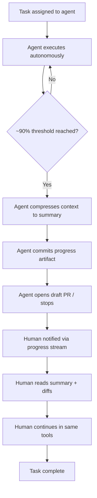

<!-- source: nibzard/awesome-agentic-patterns (Apache 2.0, https://github.com/nibzard/awesome-agentic-patterns) — retain attribution per license -->
---
title: "Seamless Background-to-Foreground Handoff"
description: "Transfer work from a background agent to a human at the ~90% completion mark using distilled context summaries and artifact-based handoff points."
tags:
  - workflows
  - tool-agnostic
  - human-factors
aliases:
  - "background foreground agent handoff"
  - "async to sync agent transition"
  - "90 percent handoff pattern"
---

# Seamless Background-to-Foreground Handoff

> Enable humans to take over from background agents at the ~90% completion mark — using distilled context summaries and durable artifacts — rather than cold-starting from raw output or waiting for full automation to reach 100%.

## The Problem

Background agents running autonomously handle well-defined work efficiently, but most complex tasks have a nuanced tail: the final 10% requires judgment, aesthetic evaluation, or domain knowledge the agent cannot reliably supply. Without a structured handoff, humans face two bad options:

- **Cold start**: pick up from artifacts (draft PR, file diffs) with no context on what the agent tried, what failed, or why decisions were made
- **Over-automation**: let the agent push to 100%, accepting errors on the nuanced tail, then fix them in review

The [nibzard/awesome-agentic-patterns catalog](https://github.com/nibzard/awesome-agentic-patterns/blob/main/patterns/seamless-background-to-foreground-handoff.md) names this the seamless background-to-foreground handoff, attributed to Aman Sanger (Cursor): "quickly move between the background and the foreground is really important."

## The Handoff Design

Four components make this work:

### 1. Completion Threshold

The agent stops before nuanced judgment calls — not at failure and not at 100%. The ~90% figure is illustrative; the real criterion is "the remaining work requires human judgment." Triggering points include:

- Confidence falls below a threshold on a decision with external impact
- Multiple valid options exist and the choice reflects preference, not correctness
- The task requires testing against infrastructure or environments the agent cannot reach

### 2. Context Preservation via Distilled Summaries

The handoff passes a compact summary, not the full conversation history. The [nibzard/awesome-agentic-patterns catalog](https://github.com/nibzard/awesome-agentic-patterns/blob/main/patterns/seamless-background-to-foreground-handoff.md) describes significant compression between the agent's full execution trace and the handoff summary. The summary captures:

- What was completed and what remains
- Decisions made and alternatives rejected
- Blockers and open questions for the human

Anthropic's [Effective Context Engineering for AI Agents](https://www.anthropic.com/engineering/effective-context-engineering-for-ai-agents) describes the same mechanism for agent context resets — compaction and structured note-taking (e.g., `NOTES.md`) — directly applicable to human handoffs.

### 3. Artifact-Based Handoff Points

The handoff medium is a durable artifact the human can pick up in their native tooling:

- **Draft PR** on a named branch — cloneable, openable in any IDE, independently continuable
- **Progress file** (e.g., `claude-progress.txt`) — records what the agent completed and what it was about to do next
- **Git history** — every commit the agent made is part of the handoff; the human reads diffs, not agent logs

Anthropic's [Effective Harnesses for Long-Running Agents](https://www.anthropic.com/engineering/effective-harnesses-for-long-running-agents) describes `claude-progress.txt` plus git history as the artifact pair for session resumption — the same mechanism works for human takeover.

### 4. Tool Parity

The human picks up using the same tools the agent used: same IDE, same terminal commands, same MCP servers. When tool interfaces match, the human can apply the agent's context summary directly — no translation of "what the agent did" into "what I can do." Tool parity reduces the impedance mismatch between agent execution and human continuation — the human operates in the same environment the agent described in its summary.

## Progress Visibility

Real-time progress visibility changes when and how the human engages. Without it, the human either polls for completion or misses the handoff window. The relevant property: the human sees incremental agent output and can intervene before the agent reaches its stopping point, not just after.

## Handoff Flow



## Distinction from Related Patterns

This pattern is often conflated with two others:

| Pattern | Trigger | Direction | Purpose |
|---------|---------|-----------|---------|
| [Human-in-the-Loop](human-in-the-loop.md) | Before irreversible action | Agent pauses mid-task | Gate to prevent errors |
| [Cloud-Local Agent Handoff](cloud-local-agent-handoff.md) | Surface transition | Environment switch | Continue agent work on different infra |
| Background-to-Foreground Handoff | Near-complete task | Agent to human | Human completes nuanced tail |

HITL gates interrupt the agent pipeline at risk points. Cloud-local handoff moves work across execution surfaces. Background-to-foreground handoff transfers *ownership* from agent to human at a planned completion threshold.

## Example

A background agent is assigned: "Implement the pagination component from the design spec." After 45 minutes, it has:

- Implemented all page navigation logic and keyboard shortcuts
- Written unit tests (all passing)
- Opened draft PR `feat/pagination-component` with 12 commits

The remaining work: visual polish that requires subjective judgment on spacing and animation timing that the spec leaves ambiguous.

The agent stops, writes a summary to `claude-progress.txt`:

```
Completed: Core pagination logic, keyboard nav, unit tests (23 passing).
Remaining: Animation timing on page transitions (spec says "smooth" — no ms value).
           Hover state color — design system has two candidates, neither specified.
Open question: Should pagination reset on filter change? Product decision needed.
Draft PR: feat/pagination-component (branch: feat/pagination-component)
```

The developer opens the branch in their IDE, reads the summary, makes three targeted edits, and merges.

## When This Backfires

The pattern assumes the agent can reliably identify the 90% threshold and produce an accurate handoff summary. Both assumptions can fail:

- **No reliable stopping signal**: agents that lack explicit completion criteria or confidence thresholds stop at arbitrary points — sometimes too early (wasting the handoff), sometimes too late (after the agent has already made the irreversible judgment calls the pattern was meant to preserve for the human).
- **Summary drift**: if the agent's summary omits or misrepresents decisions made during execution, the human picks up from a false starting point. A draft PR with misleading context can be harder to untangle than starting fresh from requirements.
- **Tool parity absent**: when the human's environment differs from the agent's — different branch state, missing MCP servers, inaccessible infrastructure — the handoff degrades to a cold start regardless of summary quality.

In these conditions, a hard 100% automation loop with post-hoc review is often more reliable than a mid-task ownership transfer.

## Key Takeaways

- Stop at the judgment threshold, not at failure or 100% — the goal is handing off the nuanced tail, not the whole task
- Distilled summaries, not raw conversation history — compress what matters, discard the rest
- Draft PRs and progress files are the durable handoff artifacts; the human should be able to pick up from git alone
- Tool parity reduces translation friction: human and agent use the same interfaces
- Progress visibility is a prerequisite — the human needs a signal to know when to engage

## Related

- [Human-in-the-Loop Placement](human-in-the-loop.md)
- [Cloud-Local Agent Handoff](cloud-local-agent-handoff.md)
- [Parallel Agent Sessions](parallel-agent-sessions.md)
- [Escape Hatches](escape-hatches.md)
- [Agent Handoff Protocols](../multi-agent/agent-handoff-protocols.md)
