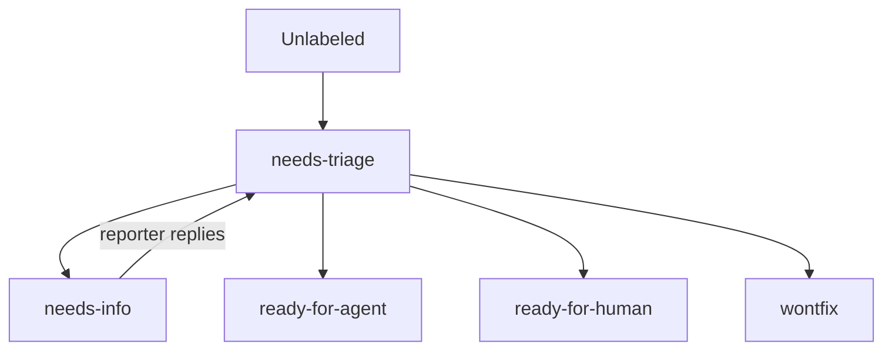

# Backlog Triage as a Named Agent Skill

> A skill encodes a state machine into issue labels — each item carries one category and one state, then hands off a durable agent brief.

A named triage skill sits between human intent and AFK agent execution. It takes whatever lands on the issue tracker — half-written bug reports, customer notes, idea fragments, design-doc snippets — and decides whether the item is ready for an agent, a human, more information, or rejection. The worked example below is Matt Pocock's open-source [`/triage` skill](https://github.com/mattpocock/skills/blob/main/skills/engineering/triage/SKILL.md). The pattern is portable.

## State machine in labels

Two category roles describe the work:

- `bug` — something is broken
- `enhancement` — new feature or improvement

Five state roles describe lifecycle position:

| State | Meaning |
|-------|---------|
| `needs-triage` | maintainer needs to evaluate |
| `needs-info` | waiting on reporter for more information |
| `ready-for-agent` | fully specified, ready for an AFK agent |
| `ready-for-human` | needs human implementation |
| `wontfix` | will not be actioned |

Every triaged issue carries exactly one category role and one state role. The skill flags conflicting states before any action ([SKILL.md](https://github.com/mattpocock/skills/blob/main/skills/engineering/triage/SKILL.md)).



The labels are the prompt. Five states collapse the open-ended question "what should happen with this issue?" into one of ten cells (state × category). Each cell has a fixed output shape — agent brief, needs-info template, out-of-scope record, polite close — so the skill cannot produce unstructured comments. This is the same constraint-as-prompt mechanism that gives [structured tool use](https://www.anthropic.com/engineering/advanced-tool-use) its reliability: the model picks a slot, not a format.

## Per-issue process

For one issue, the skill runs six steps ([SKILL.md](https://github.com/mattpocock/skills/blob/main/skills/engineering/triage/SKILL.md)):

1. Gather context — read the body, comments, prior triage notes, ADRs in the affected area, and `.out-of-scope/*.md`. Surface any prior rejection that resembles this issue.
2. Recommend category and state with reasoning, then wait for direction.
3. Reproduce (bugs only) — trace the relevant code, run tests or commands, report repro / no-repro / insufficient-detail ([SKILL.md](https://github.com/mattpocock/skills/blob/main/skills/engineering/triage/SKILL.md)). A confirmed repro produces a stronger brief.
4. Grill the issue if it needs fleshing out — run an interview-style refinement session.
5. Apply the outcome — assign labels, post the corresponding template comment, close if `wontfix`.
6. Disclaim provenance — every comment the skill posts begins with `> *This was generated by AI during triage.*`.

The maintainer can override transitions at any time. "Move #42 to ready-for-agent" trusts the maintainer and skips grilling, but the skill still asks whether to write an agent brief before promoting ([SKILL.md](https://github.com/mattpocock/skills/blob/main/skills/engineering/triage/SKILL.md)).

## The agent brief contract

`ready-for-agent` triggers an agent brief — a structured comment that becomes the authoritative spec for the downstream executor. The original issue body is context; the brief is the contract ([AGENT-BRIEF.md](https://github.com/mattpocock/skills/blob/main/skills/engineering/triage/AGENT-BRIEF.md)).

Four rules govern brief writing:

- Durability over precision — describe interfaces, types, and behavioral contracts. Never reference file paths or line numbers; the issue may sit for days while the codebase moves.
- Behavioral, not procedural — describe what the system should do, not how to implement it. The downstream executor explores the codebase fresh, reconstructing structure at run time ([issue requirements preprocessing](../agent-design/issue-requirements-preprocessing.md)).
- Complete acceptance criteria — every brief lists concrete, testable criteria. Each criterion is independently verifiable.
- Explicit scope boundaries — state what is out of scope to prevent gold-plating.

This is the upstream complement to [issue requirements preprocessing](../agent-design/issue-requirements-preprocessing.md): the brief is the structured input the executor receives, written before the executor opens its first context window. The REAgent paper measures a 17.40% lift in resolution rate when the executor reconstructs structured requirements at run time ([Kuang et al., 2026](https://arxiv.org/abs/2604.06861)) — a triage-skill brief moves that work upstream and out of the executor's context budget.

## Out-of-scope as institutional memory

Rejected enhancements are written to `.out-of-scope/<concept>.md` — one file per concept, not per issue. The file captures the decision, the reasoning, and a "Prior requests" list of every issue that asked for the feature ([OUT-OF-SCOPE.md](https://github.com/mattpocock/skills/blob/main/skills/engineering/triage/OUT-OF-SCOPE.md)). During context gathering on every new issue, the skill reads this directory and surfaces matches by concept similarity ("night theme" matches `dark-mode.md`).

The mechanism is durable institutional memory: the skill cannot re-litigate decided questions on each invocation, similar to how [agent memory patterns](../agent-design/agent-memory-patterns.md) preserve state across sessions.

## When the pattern earns its cost

The triage skill is human-invoked and deliberately keeps the maintainer in the loop. That makes it the right model when:

- The repo has an established codebase glossary or ADR set the agent can ground in
- Issue volume justifies bookkeeping but doesn't warrant lights-out automation
- The downstream executor is an AFK agent that benefits from a durable, structured brief
- The team needs explicit institutional memory for rejected requests

It is the wrong model — a different shape fits — when:

- High-volume bot issues (Dependabot, security scanners) need silence or auto-close, not classification. Run a different filter such as [continuous triage](continuous-triage.md); the state machine assumes human-authored intent.
- Lights-out triage on every event is the goal. Use [continuous triage](continuous-triage.md) on GitHub Actions with `safe-outputs: [add-label, add-comment]` ([GitHub Agentic Workflows](https://github.blog/ai-and-ml/automate-repository-tasks-with-github-agentic-workflows/)) — no maintainer in the loop.
- Batch intake from a single source (a QA session, a customer interview transcript) needs deduplication and codebase investigation across many candidates at once. Use the [QA session to issues pipeline](qa-session-to-issues-pipeline.md).
- Rigid issue-tracker workflow states (some Jira / ServiceNow configurations) cannot host the label-as-state-machine pattern without admin changes.
- The issue tracker has no codebase glossary or ADRs. Step 1 of the per-issue process depends on grounding the agent. Without it, recommendations are shallow or hallucinated.

## Failure modes

- Hallucinated agent briefs. If the maintainer skips reproduction and lets the skill auto-promote to `ready-for-agent` based on the reporter's description alone, the brief inherits any factual errors and the downstream agent burns context on a wrong-premise task. The skill's own guidance — confirm a repro before producing a brief — exists because this is the dominant failure mode ([SKILL.md](https://github.com/mattpocock/skills/blob/main/skills/engineering/triage/SKILL.md)).
- Brief drift. Briefs that reference file paths or line numbers go stale within days. The durability-over-precision rule is a hedge against this — interfaces and contracts survive renames; line numbers do not.
- Out-of-scope concept matching. Matching is by [concept similarity, not keyword](semantic-issue-search-natural-language.md). Failed matches cause the skill to re-evaluate already-rejected requests; over-eager matches close legitimately distinct issues. The maintainer confirms or rejects the match each time.
- Tight `.out-of-scope/` files for deferrals. Reasons like "we're too busy right now" are not real rejections; they are deferrals that produce out-of-scope files the maintainer later regrets. Substantive reasons reference scope, technical constraints, or strategic decisions ([OUT-OF-SCOPE.md](https://github.com/mattpocock/skills/blob/main/skills/engineering/triage/OUT-OF-SCOPE.md)).

## Example

Pocock's walkthrough on the Sandcastle repo shows the skill against a real backlog ([AI Hero post](https://www.aihero.dev/burn-through-your-backlog-with-my-triage-skill)).

```
/triage
Just give me all of the open issues that I haven't triaged yet.
```

The agent finds nine untriaged issues and labels each with a category and `needs-triage`. The maintainer then narrows: "Could you start with 477 for me?" The agent reads issue #477, finds existing triage notes with a stack trace, and recommends `ready-for-agent`. The maintainer asks the agent to reproduce the bug rather than trust the reporter:

```
Could you diagnose this yourself?
```

The agent traces task-ID variables, locates the literal-vs-placeholder mismatch, writes a regression test, applies the fix, pushes to main, and closes the issue. Context use sits at 46.5k of 100k tokens — the brief is short because the codebase grounding did the work upstream of the executor.

## Key Takeaways

- A named triage skill encodes a state machine into labels — every triaged issue carries one category and one state, with no ambiguous middle ground
- The agent brief is the hand-off contract: durable, behavioral, with testable acceptance criteria and explicit scope boundaries
- `.out-of-scope/<concept>.md` files give the skill institutional memory; the skill checks them on every new issue and surfaces matches before triaging
- The pattern is human-in-the-loop by design — choose [continuous triage](continuous-triage.md) for lights-out classification or the [QA session pipeline](qa-session-to-issues-pipeline.md) for batch intake
- Reproducing bugs before producing a brief is the most reliable defense against hallucinated specs that waste downstream agent context

## Related

- [Continuous Triage](continuous-triage.md) — automated event-time triage on GitHub Actions; complementary lights-out variant
- [QA Session to Issues Pipeline](qa-session-to-issues-pipeline.md) — multi-stage batch pipeline for intake from a single artifact
- [Issue Requirements Preprocessing](../agent-design/issue-requirements-preprocessing.md) — downstream complement: structured requirement reconstruction at executor invocation time
- [Issue-to-PR Delegation Pipeline](issue-to-pr-delegation-pipeline.md) — what runs on issues marked `ready-for-agent`
- [Issue-Tracker as Agent Dispatch Surface](issue-tracker-agent-dispatch-surface.md) — the downstream dispatch contract that the agent brief feeds into
- [Semantic Issue Search from Chat vs Query Syntax](semantic-issue-search-natural-language.md) — paraphrase-tolerant duplicate detection that complements `.out-of-scope/` concept matching
- [AI-Powered Vulnerability Triage](ai-powered-vulnerability-triage.md) — analogous classification pipeline in a security context
- [Continuous AI: A Navigation Map of Always-On Agent Workflows](continuous-ai.md) — the parent map placing this in the triage family alongside the continuous-* workflows
