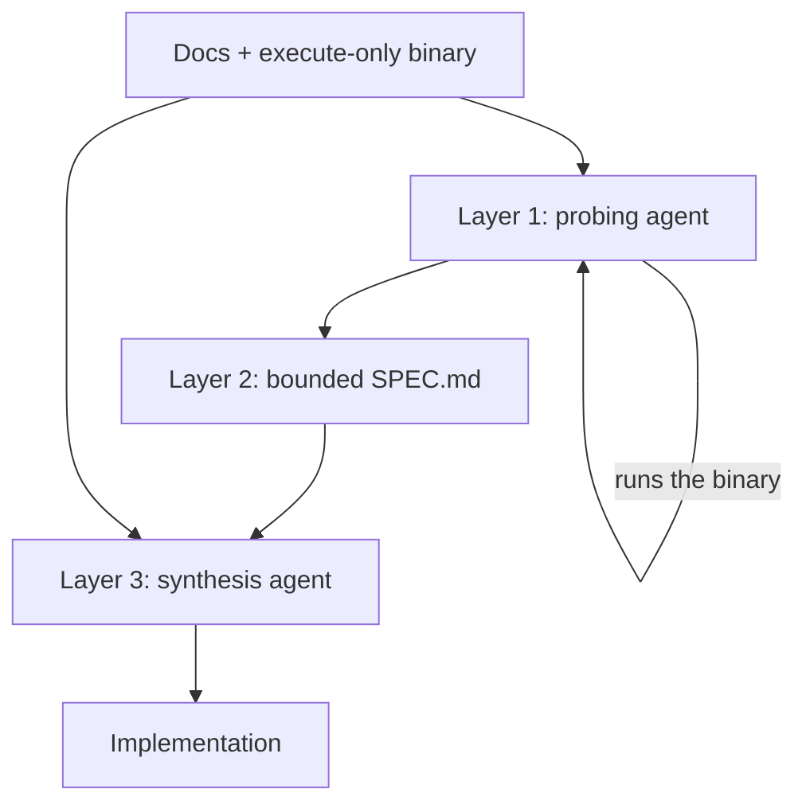

# Behavioral Specification Elicitation Before Synthesis (SpecFirst)

> Behavioral probing gets its own agent and emits a bounded specification the synthesis agent then implements against — for from-scratch builds with an executable oracle.

Run this two-agent cycle only when three conditions hold: a runnable artifact exists for the agent to probe, its behavior is deterministic and observable from the outside, and you can absorb a 48% to 130% increase in total run cost ([Chen et al., 2026](https://arxiv.org/abs/2607.27167v1)). Outside those bounds the elicitation stage has nothing to elicit from, or costs more than the accuracy it buys. Inside them, splitting exploration from implementation raised test pass rates by 6.9% to 21.3% relative across four models on ProgramBench ([Chen et al., 2026](https://arxiv.org/abs/2607.27167v1)).

## Why single-pass synthesis under-probes

Rebuilding a program from documentation plus a reference executable is much harder than editing an existing codebase. On ProgramBench — 200 tasks where the agent gets only documentation and an execute-only binary, and is graded by behavioral tests from agent-driven fuzzing — no evaluated model fully resolved a single task, and the best passed 95% of tests on only 3% of them ([Yang et al., 2026](https://arxiv.org/abs/2605.03546v1)).

The measured cause is not a budget limit. In the single-pass baseline, "zero instances reach the 1,000-turn step limit, and all instances terminate early by agent choice, consuming a median of only 22–177 turns" ([Chen et al., 2026](https://arxiv.org/abs/2607.27167v1)). The agent stops probing because it believes it understands the target, then codes against that belief. Exploration and implementation compete for the same turns and the same attention, and implementation wins early.

## Three implementation layers



### Layer 1: probe the oracle

A dedicated agent receives the documentation and the executable and does nothing but run it. Four probing patterns structure the exploration: boundary probing at the limits of accepted ranges, error-path elicitation that deliberately triggers failure conditions, combinatorial flag testing that exercises options together rather than singly, and output-format refinement that compares adjacent inputs to resolve formatting ambiguity ([Chen et al., 2026](https://arxiv.org/abs/2607.27167v1)).

This layer is the one that moves the mediating metric. Probing coverage rose from 49.2%–55.1% under single-pass synthesis to 58.3%–60.3% with a dedicated stage ([Chen et al., 2026](https://arxiv.org/abs/2607.27167v1)).

### Layer 2: emit a bounded spec artifact

The probing agent writes its findings into a fixed six-section document: Overview; Flags; Input & stdin; Output format; Error patterns; Edge cases ([Chen et al., 2026](https://arxiv.org/abs/2607.27167v1)).

The bounding is load-bearing, not cosmetic. An ablation on 50 instances with one model compared three encodings of the same stage: freeform prose scored 60.7%, an RFC 2119 and GIVEN/WHEN/THEN template scored 61.7%, and the fixed six-section form scored 62.6%, against 55.9% with no spec at all ([Chen et al., 2026](https://arxiv.org/abs/2607.27167v1)). Structure beat both formality and free text.

### Layer 3: synthesize against the spec

A second agent receives the documentation, the binary, and the spec, and implements. It keeps the ability to probe the binary directly when the spec leaves something ambiguous — the artifact is a starting reference, not a wall ([Chen et al., 2026](https://arxiv.org/abs/2607.27167v1)).

## Triggers and constraints

The cycle is manual and per-task: one target program, one spec, one implementation. There is no schedule and no push trigger.

Neither agent's turn budget is the binding constraint — both terminate on self-declared completion well inside the 1,000-turn and six-hour ceilings ([Chen et al., 2026](https://arxiv.org/abs/2607.27167v1)). What bounds Layer 1 is the six-section template, which is why the template earns its place. What bounds Layer 3 is the spec plus its retained probing access.

The cycle is tool-agnostic. Any assistant that can execute a binary, write a file, and read it back in a later session implements it; the published results come from a single scaffold, so the specific harness is not part of the claim ([Chen et al., 2026](https://arxiv.org/abs/2607.27167v1)).

## Why it works

Giving elicitation its own agent removes the objective that was cutting exploration short. Because the probing agent cannot write the implementation, "stop and code" is not a move available to it, and the only termination it can choose is "I have characterized the behavior." That is why probing coverage rises once the competing objective is removed, and why the early self-termination described above stops happening.

The second half is anchoring. Without an explicit artifact, behavioral intent "must be maintained implicitly across turns and is susceptible to drift," so an early misreading propagates silently into every later decision; a written spec is a stable reference the implementation is checked against ([Chen et al., 2026](https://arxiv.org/abs/2607.27167v1)). The format ablation is the cleanest test of that half — same information, three encodings, and the most constrained one won. This is the same preservation argument that motivates a [frozen spec file](../instructions/frozen-spec-file.md), applied to behavior the agent discovered rather than intent a human wrote down.

## When this backfires

- No executable oracle. The whole first layer presupposes something to run. Handing an agent a specification it did not derive can make from-scratch synthesis worse: Commit0 gave library-generation agents the specification document and the unit tests and found "Surprisingly, both additions reduce performance," hypothesizing that most of the content was irrelevant to the module at hand and distracted the model ([Commit0, 2024](https://arxiv.org/abs/2412.01769v1)). Retrieving only the relevant chunks at the same token budget beat the whole document.
- Cost-sensitive or high-volume runs. Total cost rises 48% to 130%, and the split is worst where the gain is smallest — the strongest model tested paid the 130% overhead for a 10.4% relative improvement ([Chen et al., 2026](https://arxiv.org/abs/2607.27167v1)).
- Non-deterministic or non-observable targets. The authors limit their claim to deterministic command-line programs and flag that it may not generalize to graphical interfaces or non-deterministic behavior ([Chen et al., 2026](https://arxiv.org/abs/2607.27167v1)).
- Implementation-bound rather than comprehension-bound work. In a 50-case failure sample, 52% were execution faults where the spec was correct and the implementation diverged anyway ([Chen et al., 2026](https://arxiv.org/abs/2607.27167v1)). A better spec does not touch the largest failure class.

The strongest case against the split is that interleaved probing characterizes exactly the behavior the current decision needs and nothing else, while a spec becomes context the synthesis agent carries on every turn — and reasoning accuracy drops sharply when irrelevant but domain-coherent content sits alongside the relevant material ([Shi et al., 2023](https://arxiv.org/abs/2302.00093)). That is [distractor interference](../patterns/anti-patterns/distractor-interference.md), and it is the mechanism Commit0's authors propose for their own result. What separates this workflow from it is derivation: every line of the spec describes behavior the agent observed in the artifact it must reproduce, and the six-section template caps how much of it there is.

## Example

Rebuilding GNU `sed` from its manual and a reference binary. The manual documents `-n` as suppressing automatic printing of the pattern space and `-i` as editing files in place, each on its own ([GNU sed manual](https://www.gnu.org/software/sed/manual/sed.html#Command_002dLine-Options)). It does not describe what they do together. Combinatorial flag testing is the probing pattern that asks, and the answer goes under Flags:

```markdown
## Flags
- `-n` suppresses automatic printing of the pattern space.
- `-i` edits the file in place.
- `-n -i` together: nothing is printed, so the in-place write
  truncates the file to zero bytes. Exit status 0.
```

That last line is the payoff. It is a combination the documentation covers only by implication, it destroys the user's file, and it exits successfully — so a synthesis agent that never ran the pair has no signal that it guessed wrong.

## Key Takeaways

- Split from-scratch builds into a probing agent and a synthesis agent only when a runnable, deterministic oracle exists to probe.
- The failure being fixed is premature self-termination of exploration, not turn exhaustion — baselines quit by choice at a median of 22–177 turns out of 1,000.
- Bound the spec to a fixed section list; the constrained form beat both freeform prose and a formal requirements template.
- Budget for it: 48% to 130% more total cost, with the worst ratio on the strongest model.
- It does not help implementation-bound work — most residual failures had a correct spec and a diverging implementation.

## Related

- [The Research-Plan-Implement Pattern](research-plan-implement.md) — the general three-phase split this specializes for the no-source-code case
- [Spec-Driven Development with Spec Kit](spec-driven-development.md) — the human-authored counterpart, where the spec precedes rather than describes an artifact
- [Frozen Spec File](../instructions/frozen-spec-file.md) — the same anchoring argument applied to intent instead of observed behavior
- [Parallel Polyglot Ports as a Spec-Ambiguity Oracle](parallel-polyglot-ports-spec-oracle.md) — the inverse move, using implementation divergence to find gaps in a spec
- [Pre-Execution Codebase Exploration](pre-execution-codebase-exploration.md) — a dedicated exploration phase for the case where source code does exist
