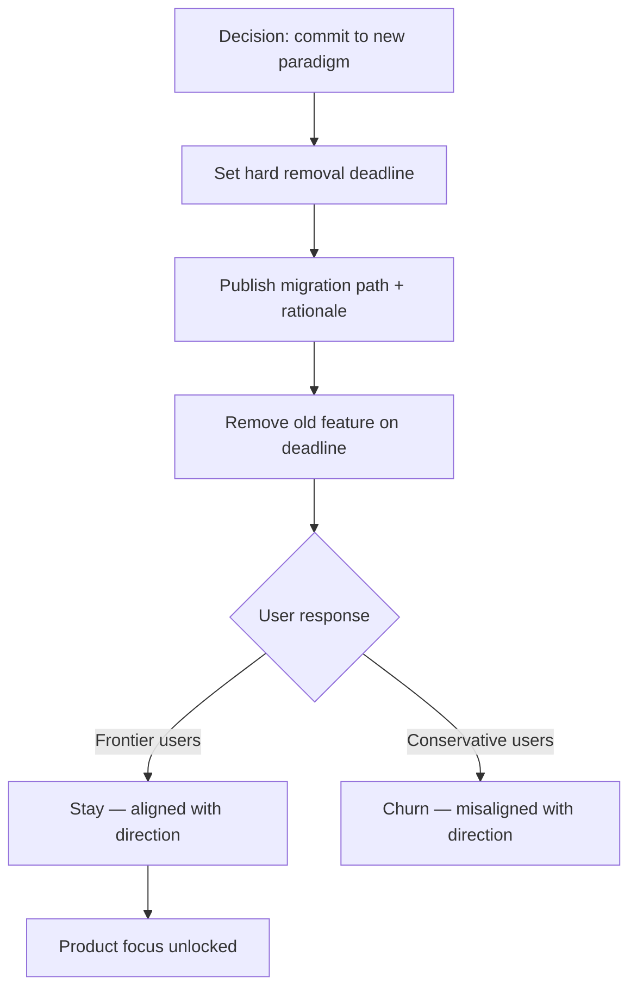

<!-- source: nibzard/awesome-agentic-patterns (Apache 2.0, https://github.com/nibzard/awesome-agentic-patterns) — retain attribution per license -->
---
title: "Burn the Boats — Commitment-Forcing Deprecation"
description: "Remove a working feature entirely — with a hard deadline and migration path — to force full commitment to a new paradigm and prevent the team from anchoring to the old approach."
tags:
  - workflows
  - tool-agnostic
aliases:
  - commitment-forcing deprecation
  - credible commitment product strategy
---

# Burn the Boats — Commitment-Forcing Deprecation

> Eliminate an old workflow path entirely rather than running it alongside the new one — the forced transition prevents split focus and accelerates adoption of the paradigm you actually want.

## The Problem With Gradual Migration

When teams support old and new workflows in parallel, neither wins. Users stick with what they know; the team splits engineering attention across both; the product attracts users whose primary criterion is "doesn't change things." Gradual sunset timelines extend this split indefinitely.

The core issue is credibility. A soft deprecation sends the signal that the old path might persist indefinitely — which is often true. This pattern is sourced from the [nibzard/awesome-agentic-patterns catalog](https://github.com/nibzard/awesome-agentic-patterns/blob/main/patterns/burn-the-boats.md), which applies Thomas Schelling's credible commitment theory from [*The Strategy of Conflict*](https://www.hup.harvard.edu/books/9780674840317) (Harvard University Press, 1960): eliminating retreat options makes a commitment believable to both users and the team itself.

## What This Pattern Looks Like

A hard-deadline removal with three components:

1. **Irreversible commitment** — the old path is removed, not hidden or flagged deprecated. No opt-out period that stretches.
2. **Migration path** — users receive explicit alternatives and rationale before removal, not just a notice that something is going away.
3. **Hard deadline** — a specific date or milestone, publicly communicated, after which the old feature stops working.

## Distinguishing This From Ordinary Deprecation

Regular deprecation is reversible in practice — user pushback commonly extends timelines, soft deadlines slip, and the old path survives indefinitely. This pattern is defined by intentional irreversibility:

| Ordinary deprecation | Burn the boats |
|---|---|
| Soft deadline, often extended | Hard deadline, publicly committed |
| Old path hidden or flagged | Old path removed |
| Team still supports both | Team commits fully to new path |
| Conservative users stay | Conservative users churn |

The distinction matters because the user-selection effect only works with genuine removal. Users who need to self-select out must believe the deadline is real.

## The AMP Case Study

AMP (an AI coding tool company) killed their VS Code extension with approximately a 60-day hard deadline, publicly stating "the sidebar is dead." Their stated rationale: "It's just a focus thing for us. We can't do that without taking our eye off the thing that you all think is 100 times more important" — referring to their headless/factory agent paradigm over interactive sidebar UX. AMP framed their product philosophy as needing to "totally re-earn all usage...every 3 months," explicitly rejecting anchoring to installed base. [Source: [nibzard/awesome-agentic-patterns](https://github.com/nibzard/awesome-agentic-patterns/blob/main/patterns/burn-the-boats.md)]

The timeline of the AMP deprecation (~60 days) is sourced from the nibzard catalog, not from a direct AMP announcement.

## When to Apply This Pattern

Most relevant for teams adopting agentic-first workflows who need to stop supporting legacy interactive patterns. The conditions that justify this pattern:

- The old and new paradigms require fundamentally different infrastructure or mental models — not just UI variations
- Split support is measurably slowing the new paradigm's development
- Conservative users are actively slowing adoption by requesting old-path features
- The team has a viable migration path to offer, not just removal

Not appropriate for: incremental feature improvements, situations where no migration path exists, or cases where removal would cause harm to users with no alternatives.

## The Trade-off

Gains: internal focus, engineering momentum on the new paradigm, user base self-selected for the direction you're building toward.

Accepts: short-term churn from users who depended on the old path. This churn is intentional and a feature of the pattern, not a side effect to minimize.

## Safety Boundary: Not an Agent Design Pattern

The nibzard catalog entry explicitly warns against applying irreversibility logic to AI agent systems themselves. Giving agents irreversible operations with broad permissions creates catastrophic risk from prompt injection or context overflow. This pattern applies to *product strategy* — what features a team maintains or removes — not to agent autonomy design. Agents should be designed with reversible, bounded operations.

## Key Takeaways

- Hard deadlines create believable commitment — soft deadlines do not
- Migration paths are required alongside removal; users need alternatives, not just notice
- The user-selection effect is intentional: conservative users churn, frontier users stay
- This is distinguishable from ordinary deprecation by irreversibility and intentionality
- Apply to product feature decisions only — not to agent operation design, where irreversibility is a risk, not a tool

## Related

- [Factory Over Assistant: Orchestrating Parallel Agent Fleets](factory-over-assistant.md) — The headless paradigm that commitment-forcing deprecation enables
- [The AI Development Maturity Model](ai-development-maturity-model.md) — Phases of adoption where this pattern commonly appears
- [Canary Rollout for Agent Policy Changes](canary-rollout-agent-policy.md) — The opposite discipline: gradual rollout when blast radius must be controlled
