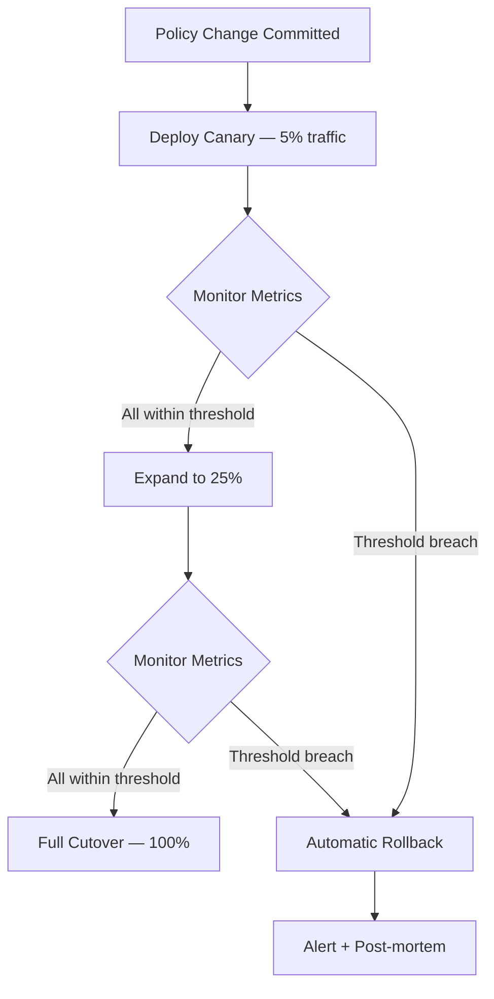

<!-- source: nibzard/awesome-agentic-patterns (Apache 2.0, https://github.com/nibzard/awesome-agentic-patterns) — retain attribution per license -->
---
title: "Canary Rollout for Agent Policy Changes"
description: "Progressively expose agent policy updates to a small traffic slice, monitor key metrics, and roll back automatically before full cutover — the same discipline software deployments use, applied to the LLM policy layer."
tags:
  - workflows
  - tool-agnostic
aliases:
  - canary deployment for agent policies
  - progressive policy rollout
---

# Canary Rollout for Agent Policy Changes

> Apply traffic-split deployment discipline to agent policy updates — route a small percentage of requests to the new policy, monitor behavior under load, and trigger automatic rollback if monitored thresholds breach.

## Why Policy Changes Need Deployment Discipline

Agent policy changes — system prompt updates, model swaps, tool configuration changes, permission scope adjustments — carry blast-radius risk proportional to traffic volume. A policy change that looks correct in offline testing can still degrade production behavior in ways that only emerge at scale: latency spikes, elevated safety flag rates, unexpected spend patterns, or goal achievement regressions.

Full-cutover is the common failure mode. Teams update the policy and immediately route 100% of traffic to it. If something is wrong, the entire user base experiences the degradation before it is caught.

Canary rollout applies the same traffic-split discipline that software deployment uses to the policy layer.

## Mechanism



**Traffic split**: Route a configurable slice (typically 5–10%) of incoming requests to the candidate policy while the remainder continue on the stable policy. Split at the router level, not inside the agent — the agent receives one policy and executes it.

**Monitored metrics**: Define pass/fail thresholds before rollout begins:

| Metric | Typical threshold |
|---|---|
| Task completion rate | ≥ baseline − 2% |
| Safety flag rate | ≤ baseline + 0.5% |
| p95 latency | ≤ baseline × 1.2 |
| Token spend per task | ≤ baseline × 1.15 |
| Human escalation rate | ≤ baseline + 1% |

**Rollback trigger**: If any metric breaches its threshold within the observation window, revert the canary slice to the stable policy automatically. Do not wait for human review.

**Bake time**: Hold each traffic percentage for a minimum observation window (typically 1–4 hours depending on volume) before expanding. Low-volume deployments may require longer windows to accumulate statistical significance.

## Implementation

The policy router sits in front of agent instantiation:

```python
import random

def get_policy(request_id: str, canary_config: dict) -> str:
    """Select policy version for this request."""
    if canary_config.get("enabled") and random.random() < canary_config["canary_fraction"]:
        return canary_config["candidate_policy"]
    return canary_config["stable_policy"]
```

Attach the policy version to every telemetry event so metrics can be segmented by version:

```python
span.set_attribute("agent.policy_version", policy_version)
span.set_attribute("agent.is_canary", policy_version == canary_config["candidate_policy"])
```

The rollback check runs on a schedule or event-driven on each telemetry flush:

```python
def check_rollback(metrics: dict, thresholds: dict, canary_config: dict) -> None:
    for metric, threshold in thresholds.items():
        canary_value = metrics["canary"].get(metric)
        if canary_value is not None and not threshold["check"](canary_value):
            canary_config["enabled"] = False  # Immediate revert
            alert(f"Canary rolled back: {metric}={canary_value} breached threshold")
            return
```

## Rollout Schedule

A standard schedule for moderate-volume deployments:

| Phase | Canary % | Bake time | Pass condition |
|---|---|---|---|
| Canary | 5% | 2 hours | All metrics within threshold |
| Early majority | 25% | 2 hours | All metrics within threshold |
| Majority | 50% | 1 hour | All metrics within threshold |
| Full cutover | 100% | — | Stable |

Skip phases only when volume is high enough to reach statistical significance faster.

## When to Use

- Any system prompt change that affects agent decision boundaries (not cosmetic wording)
- Model version upgrades or swaps
- Tool permission scope changes (adding or removing tool access)
- Significant few-shot example changes
- Any change following a prior production incident

Skip canary rollout for: documentation-only prompt changes, fixing obvious bugs with no behavioral surface, and internal tooling with a single operator.

## Key Takeaways

- Gate every substantive policy change behind a traffic split — do not full-cutover by default
- Define rollback thresholds before the rollout begins, not during incident response
- Attach policy version to all telemetry so canary vs stable metrics are always segmentable
- Automate rollback — human review during a live degradation is too slow
- Treat policy changes with the same deployment discipline as code changes

## Related

- [Agent Observability in Practice](../observability/agent-observability-otel.md) — Wire up OTel for the metrics this pattern depends on
- [Continuous Autonomous Task Loop](continuous-autonomous-task-loop.md) — Long-running loops where policy drift compounds over cycles
- [Staggered Agent Launch](../multi-agent/staggered-agent-launch.md) — Complementary technique for blast-radius control at launch time
