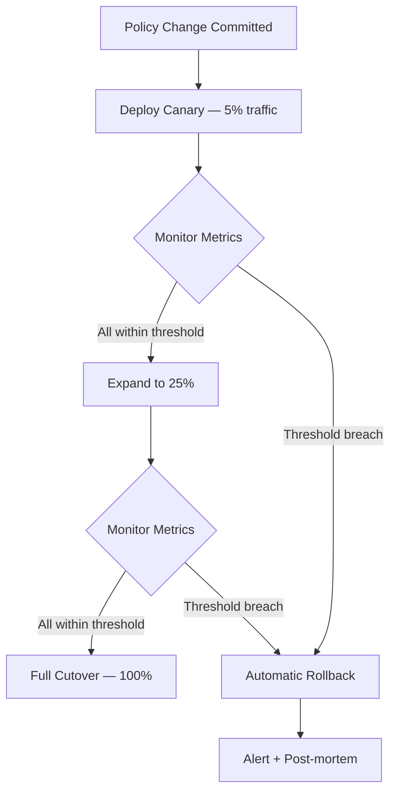

<!-- source: nibzard/awesome-agentic-patterns (Apache 2.0, https://github.com/nibzard/awesome-agentic-patterns) — retain attribution per license -->

# Canary Rollout for Agent Policy Changes

> Apply traffic-split deployment discipline to agent policy updates — route a small percentage of requests to the new policy, monitor behavior under load, and trigger automatic rollback if monitored thresholds breach.

## Why policy changes need deployment discipline

Agent policy changes carry risk that grows with traffic volume. These changes include system prompt updates, model swaps, tool configuration changes, and permission scope adjustments. A change that looks correct in offline testing can still degrade production behavior at scale. The damage shows up as latency spikes, higher safety flag rates, unexpected spend, or goal achievement regressions.

The common failure mode is full cutover. Teams update the policy and immediately route 100% of traffic to it. If something is wrong, the whole user base hits the degradation before anyone catches it.

Canary rollout brings the same traffic-split discipline that software deployment uses to the policy layer.

## Mechanism


```mermaid
graph TD
    A[Policy Change Committed] --> B[Deploy Canary — 5% traffic]
    B --> C{Monitor Metrics}
    C -->|All within threshold| D[Expand to 25%]
    D --> E{Monitor Metrics}
    E -->|All within threshold| F[Full Cutover — 100%]
    C -->|Threshold breach| G[Automatic Rollback]
    E -->|Threshold breach| G
    G --> H[Alert + Post-mortem]
```

Traffic split. Route a configurable slice of incoming requests, typically 5 to 10%, to the candidate policy. The rest continue on the stable policy. Split at the router level, not inside the agent. The agent receives one policy and runs it.

Monitored metrics. Define pass and fail thresholds before the rollout begins:

| Metric | Typical threshold |
|---|---|
| Task completion rate | ≥ baseline − 2% |
| Safety flag rate | ≤ baseline + 0.5% |
| p95 latency | ≤ baseline × 1.2 |
| Token spend per task | ≤ baseline × 1.15 |
| Human escalation rate | ≤ baseline + 1% |

Rollback trigger. If any metric breaches its threshold within the observation window, revert the canary slice to the stable policy automatically. Do not wait for human review.

Bake time. Hold each traffic percentage for a minimum observation window before expanding, typically 1 to 4 hours depending on volume. Low-volume deployments may need longer windows to reach statistical significance.

## Implementation

The policy router sits in front of agent instantiation:

```python
import random

def get_policy(request_id: str, canary_config: dict) -> str:
    """Select policy version for this request."""
    if canary_config.get("enabled") and random.random() < canary_config["canary_fraction"]:
        return canary_config["candidate_policy"]
    return canary_config["stable_policy"]
```

Attach the policy version to every telemetry event so you can segment metrics by version:

```python
span.set_attribute("agent.policy_version", policy_version)
span.set_attribute("agent.is_canary", policy_version == canary_config["candidate_policy"])
```

Run the rollback check on a schedule, or trigger it on each telemetry flush:

```python
def check_rollback(metrics: dict, thresholds: dict, canary_config: dict) -> None:
    for metric, threshold in thresholds.items():
        canary_value = metrics["canary"].get(metric)
        if canary_value is not None and not threshold["check"](canary_value):
            canary_config["enabled"] = False  # Immediate revert
            alert(f"Canary rolled back: {metric}={canary_value} breached threshold")
            return
```

## Rollout schedule

A standard schedule for moderate-volume deployments:

| Phase | Canary % | Bake time | Pass condition |
|---|---|---|---|
| Canary | 5% | 2 hours | All metrics within threshold |
| Early majority | 25% | 2 hours | All metrics within threshold |
| Majority | 50% | 1 hour | All metrics within threshold |
| Full cutover | 100% | — | Stable |

Skip phases only when volume is high enough to reach statistical significance faster.

## When to use

- Any system prompt change that affects agent decision boundaries (not cosmetic wording)
- Model version upgrades or swaps
- Tool permission scope changes (adding or removing tool access)
- Significant few-shot example changes
- Any change following a prior production incident

Skip canary rollout for: documentation-only prompt changes, fixing obvious bugs with no behavioral surface, and internal tooling with a single operator.

## When this backfires

Canary rollout is not a default. It is a control that assumes two things: enough traffic to produce a statistically significant signal within a reasonable observation window, and metrics that capture the kind of regression the change can produce. Several conditions flip the cost-benefit:

- Low-volume agent traffic. With fewer than roughly 50 samples per metric inside the bake window, noise dominates threshold breaches and the router oscillates between canary and stable. Google's SRE-led canary analysis work emphasizes that thin canary populations produce more false-positive rollbacks than real-signal catches ([Google canary-analysis lessons](https://cloud.google.com/blog/products/devops-sre/canary-analysis-lessons-learned-and-best-practices-from-google-and-waze)). For low-QPS internal tools, shadow-traffic replay against production inputs gives a cleaner signal without exposing any user to the candidate policy.
- Multi-turn conversational agents. Randomized per-request routing splits a single session across both policies, which confuses users and masks per-policy behavior. Route at the session or user level, or use shadow testing until the candidate is ready for a flagged cohort.
- Regressions that only appear across long trajectories. You cannot measure goal achievement, compounding drift, and retention effects inside a 1 to 4 hour bake window. A canary that passes on p95 latency and safety-flag rate can still ship a policy that degrades week-over-week user outcomes.
- Quantitative thresholds alone miss behavioral regressions. OpenAI's April 2025 GPT-4o sycophancy post-mortem reported that offline evals and A/B tests showed positive results, while expert testers flagged that the model "felt" off. The quantitative signals did not capture the qualitative shift before full rollout ([OpenAI post-mortem](https://openai.com/index/sycophancy-in-gpt-4o/), [expanded analysis](https://openai.com/index/expanding-on-sycophancy/)). Pair every canary with a human "vibe check" gate on behavioral dimensions that the threshold table cannot list.

## Key Takeaways

- Gate every substantive policy change behind a traffic split — do not full-cutover by default
- Define rollback thresholds before the rollout begins, not during incident response
- Attach policy version to all telemetry so canary vs stable metrics are always segmentable
- Automate rollback — human review during a live degradation is too slow
- Treat policy changes with the same deployment discipline as code changes

## Related

- [Agent Observability in Practice](../observability/agent-observability-otel.md) — Wire up OTel for the metrics this pattern depends on
- [Continuous Autonomous Task Loop](continuous-autonomous-task-loop.md) — Long-running loops where policy drift compounds over cycles
- [Staggered Agent Launch](../multi-agent/staggered-agent-launch.md) — Complementary technique for blast-radius control at launch time
- [Agent Governance Policies](agent-governance-policies.md) — Enterprise-level policy controls for agent mode, MCP, and model availability
- [Model Deprecation Lifecycle](model-deprecation-lifecycle.md) — Migration cadence for the upstream model swaps a canary protects against
- [Model Deprecation Migration Protocol](model-deprecation-migration-protocol.md) — Step-by-step migration that uses canary rollout to validate a replacement model
