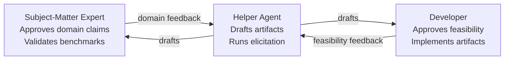
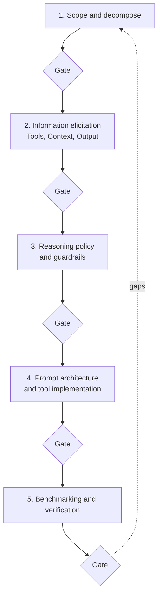

# CARE: Three-Party Stage-Gated Agent Engineering

> Collaborative Agent Reasoning Engineering (CARE) splits agent construction across SMEs, developers, and helper agents, with five stage-gated phases producing reviewable artifacts at every gate.

CARE is a disciplined alternative to ad-hoc prompt iteration for building LLM agents in domains where correctness depends on knowledge that lives outside the engineering team. It organises construction around four design targets, five named phases, and three roles, with helper agents drafting the artifacts that humans approve at gates ([Ramachandran, Jha & Ramasubramanian, 2026](https://arxiv.org/abs/2604.28043)).

## Four Design Targets

CARE treats every agent as the intersection of four interacting concerns. Each phase produces artifacts that pin one or more of them down ([§2 Design Targets, Ramachandran et al. 2026](https://arxiv.org/abs/2604.28043)):

- **Interaction policy** — how the agent interprets intent, decomposes tasks, manages uncertainty, asks clarifying questions, and performs critique or verification.
- **Domain grounding** — the authoritative knowledge that constrains interpretation and reduces incorrect outputs.
- **Tool orchestration** — available tools, their input/output shapes, choice logic, and error handling.
- **Evaluation/verification** — success criteria and performance measurement on realistic tasks.

These map cleanly onto pre-existing concerns: [interaction policy](../instructions/specification-as-prompt.md) lives in `instructions/`, [domain grounding](../instructions/grounding-md-field-scoped-instructions.md) in `instructions/`, [token-efficient tool design](../tool-engineering/token-efficient-tool-design.md) in `tool-engineering/`, and [eval-driven development](eval-driven-development.md) in `workflows/`. CARE's contribution is the workflow that produces them in a defined order.

## Three Roles

Helper agents act as "facilitation infrastructure" — they generate phase-aligned questions, draft candidate artifacts in consistent Markdown, and revise them iteratively from SME and developer feedback ([§3, Ramachandran et al. 2026](https://arxiv.org/abs/2604.28043)). Humans hold every approval gate; helper agents never ship artifacts unreviewed.

## The Five Phases

Each phase produces a versioned artifact gated by SME and developer approval ([§3 CARE Methodology, Ramachandran et al. 2026](https://arxiv.org/abs/2604.28043)).

| Phase | Artifact | Helper agent role |
|------|---------|-------------------|
| 1. Scope and decompose | Constraints, decomposition targets, intended users | Drafts the initial scoped artifact set to seed SME and developer review |
| 2. Information elicitation | Tools, Context, and Output-format specs in Markdown | Runs structured elicitation by generating targeted, phase-aligned questions and drafting the artifacts |
| 3. Reasoning policy and guardrails | Policies for uncertainty, errors, ambiguous queries | Drafts candidate policies and revises them iteratively from SME and developer feedback |
| 4. Prompt architecture and tool implementation | Implementable prompt with grounding injection, tool schemas, routing logic | Generates a prompt aligned to upstream artifacts; implementation is structured translation |
| 5. Benchmarking and verification | Benchmark queries, scoring rubrics, pass/fail thresholds | Elicits responses from SMEs and generates candidate benchmark items for SME validation |

The structure matches the externalising-intent mechanism behind [spec-driven development](spec-driven-development.md) and the phase-isolation principle behind [discrete phase separation](../agent-design/discrete-phase-separation.md), but adds two things both of those omit: explicit non-developer SMEs in the loop, and a verification phase with versioned benchmarks.

## Evidence

The CARE authors built a NASA Earth Science data discovery agent that invokes the CMR API and compared a CARE-designed configuration (`cmr_care_v1`) against a baseline (`cmr_simple`) using identical model and tool access ([§4 Evaluation, Ramachandran et al. 2026](https://arxiv.org/abs/2604.28043)):

| Benchmark | Agent | Recall@1 | Recall@5 |
|-----------|-------|----------|----------|
| Synthetic (n=621) | CARE | 71.7% | 85.2% |
| Synthetic (n=621) | Baseline | 69.1% | 82.4% |
| Gold (n=43) | CARE | 7.8% | 27.2% |
| Gold (n=43) | Baseline | 9.7% | 20.2% |

The CARE configuration narrowly beat the baseline on synthetic Recall@1 and on gold Recall@5; the baseline edged it on gold Recall@1. Single-domain, single-team evidence — read it as a directional signal, not a settled result.

## When CARE Pays Off

The methodology's overhead is real: artifact authoring, gate reviews, and helper-agent coordination across multiple phases. It pays off when:

- **SME knowledge sits outside the engineering team.** The three-party structure has nothing to gate against if the developer is the domain expert. CARE's mechanism is the same as classical requirements engineering — externalising decisions into reviewable artifacts to surface tacit assumptions — applied to LLM agents.
- **Verification stakes are high.** Phase 5's versioned benchmarks justify the upstream artifact discipline. For low-stakes assistants, a simple eval set will converge faster.
- **The domain has stable ground truth.** The CARE authors flag benchmark sensitivity, leakage, and overfitting to "iterative refinement of artifacts and prompts to the benchmark distribution" as threats to validity ([§5, Ramachandran et al. 2026](https://arxiv.org/abs/2604.28043)). Domains without stable ground truth iterate against a moving target.

## When It Backfires

- **Solo or small-team builds with no external SME.** The gate structure adds coordination tax for a review the developer is already running in their head. A tighter prompt-iteration loop converges faster.
- **Fast-evolving model or tool surface.** Frozen reasoning-policy and tool-spec artifacts go stale faster than gates can re-approve them. Practitioner reports on spec-driven development describe the same failure: agents execute stale specs confidently, masking divergence ([Augment Code, 2026](https://www.augmentcode.com/blog/what-spec-driven-development-gets-wrong); [Isoform, 2025](https://isoform.ai/blog/the-limits-of-spec-driven-development)).
- **Exploratory agents with unclear ground truth.** Phase 5 cannot produce meaningful pass/fail signals when the benchmark is unstable, so artifact-driven iteration drifts.

## Example: Mapping CARE to a Code-Search Agent

A team building a code-search agent for a regulated codebase, where compliance officers (SMEs) own the rules for what may be returned, but the engineering team owns the agent itself.

- **Phase 1** — helper agent drafts a scope: "answer questions about the codebase, exclude files tagged `secret/` or matching the compliance redaction list." SME approves redaction list; developer approves feasibility.
- **Phase 2** — helper agent generates elicitation questions ("which fields are PII?", "which tools may an SME-approved query use?") and drafts Tools, Context, and Output specs.
- **Phase 3** — helper agent drafts guardrails: "if the query touches `secret/`, refuse and surface the rule that triggered." SME validates wording.
- **Phase 4** — developer translates artifacts into the prompt and tool-call code. Implementation is mechanical because the upstream artifacts named the schema, routing, and grounding.
- **Phase 5** — SMEs supply gold queries with expected redactions; helper agent generates additional synthetic queries; both feed a benchmark that fails the build when redaction recall drops.

The contrast with ad-hoc construction: every compliance rule is a named artifact reviewed at a gate, not a sentence buried in a prompt that no SME ever reads.

## Key Takeaways

- CARE organises agent construction around four design targets, five phases, and three roles, with helper agents drafting artifacts that humans approve at gates.
- The mechanism is classical requirements engineering — externalising decisions into reviewable artifacts — applied to the four LLM-agent design targets.
- The methodology's overhead is justified mainly when SME knowledge is external, verification stakes are high, and the domain has stable ground truth.
- Single-domain, single-team evidence (NASA Earth Science CMR) shows directional gains, not a settled result.

## Related

- [Spec-Driven Development with Spec Kit](spec-driven-development.md)
- [The Research-Plan-Implement Pattern](research-plan-implement.md)
- [Discrete Phase Separation](../agent-design/discrete-phase-separation.md)
- [Eval-Driven Development](eval-driven-development.md)
- [Specification as Prompt](../instructions/specification-as-prompt.md)
- [7 Phases of AI Development](7-phases-ai-development.md)
