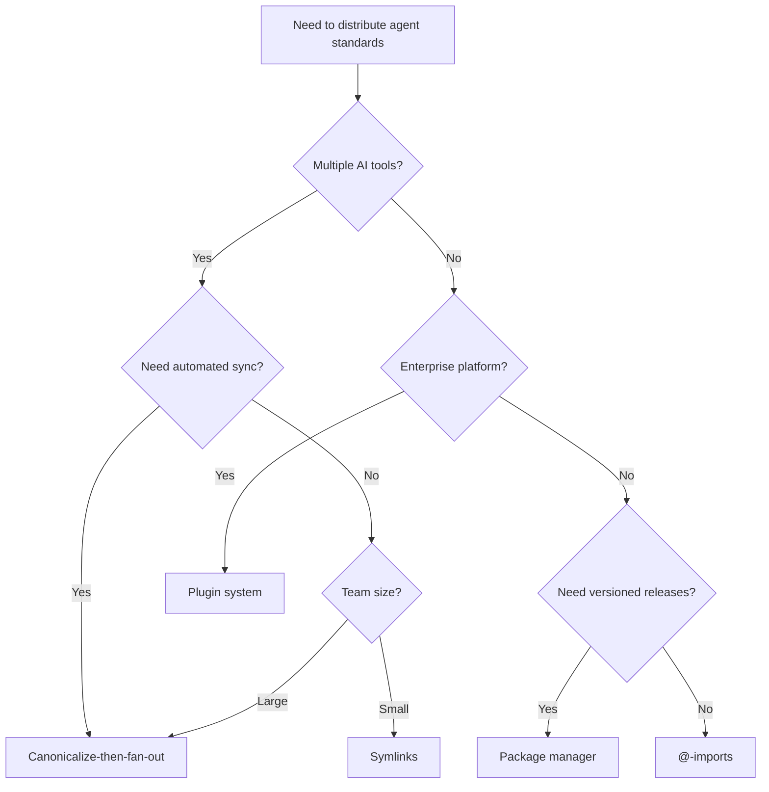

# Architecting a Central Repo for Shared Agent Standards

> Distribute shared agent skills, instruction files, and coding conventions from a central repository to downstream projects — enforcing consistency without monolithic coupling.

## The Multi-Repo Drift Problem

When agent instructions live only in individual repositories, drift is inevitable. Team A updates their linting conventions, Team B copies an older version, and Team C writes their own from scratch. Within months, agents across the organization follow different standards for the same concerns — code style, commit format, security checks, naming patterns.

The problem compounds because agent instruction files lack the dependency management that code has. No `package.json` pins a version of your AGENTS.md. No lockfile detects when a downstream copy diverges from the canonical source.

A [canonicalize-then-fan-out](https://dev.to/tawe/one-memory-to-rule-them-all-taming-ai-cli-instruction-sprawl-2m8l) architecture solves this: maintain one canonical source and distribute it to every project that needs it.

## What Belongs Centralised vs Local

Not everything belongs in a central repo. Centralise standards that are uniform across the organization; keep project-specific knowledge local.

| Centralised | Local |
|---|---|
| Language style guides | Project architecture |
| Commit message format | Service-specific API patterns |
| Security and compliance rules | Local build/test commands |
| Shared skills (research, review, drafting) | Team-specific workflow overrides |
| Naming conventions | Domain model documentation |
| CI/CD agent policies | Feature flags and toggles |

The dividing line: if changing the standard in one project should change it everywhere, centralise it. If a project legitimately needs a different value, keep it local. For how to structure the local side of this boundary, see [Layered Instruction Scopes](../instructions/layered-instruction-scopes.md).

## Distribution Mechanisms

Five mechanisms exist for pushing central standards into downstream repositories. Each has different trade-offs in automation, cross-tool support, and versioning granularity.

| Mechanism | How It Works | Versioning | Cross-Tool | Automation | Best For |
|---|---|---|---|---|---|
| **Symlinks** | Symlink files from a shared checkout into each repo | Git ref of shared repo | All tools | Manual setup | Small teams, single machine |
| **@-imports** | Tool-specific import syntax (e.g., `@path/to/file` in CLAUDE.md — see [@import Composition Pattern](../instructions/import-composition-pattern.md)) | None built-in | Tool-specific | Manual | Quick prototyping |
| **Canonicalize-then-fan-out** | Pre-commit hooks or CI generate tool-specific files from a canonical source | Git ref + CI validation | All tools | Automated | Cross-tool orgs |
| **Package managers** | Distribute as npm/pip packages containing SKILL.md or instruction files | Semver | All tools | `npm install` / `pip install` | Open-source skills, versioned releases |
| **Plugin systems** | Platform-native distribution (Claude Code plugins, Copilot extensions) | Platform-managed | Single platform | Auto-install | Enterprise single-vendor |

Sources: [sync approaches comparison](https://coding-with-ai.dev/posts/sync-claude-code-codex-cursor-memory/), [@intellectronica/ruler](https://github.com/intellectronica/ruler), [npm skill distribution](https://gist.github.com/uhyo/e42484189de45c3e1c6f26154c1f2fc0), [Claude Code plugins](https://claude.com/blog/cowork-plugins-across-enterprise).

### Choosing a Mechanism



## Enterprise Distribution

Platform vendors now offer first-class organizational distribution, removing the need to build custom sync infrastructure.

**GitHub Copilot** supports [organization-level custom instructions](https://docs.github.com/en/copilot/how-tos/configure-custom-instructions/add-organization-instructions) configured through the organization settings UI. Instructions apply to all Copilot users in the organization without per-repo configuration. The [Enterprise AI Controls and Agent Control Plane](https://github.blog/changelog/2026-02-26-enterprise-ai-controls-agent-control-plane-now-generally-available/) extends this with governance policies for agent behavior. [Agent HQ](../tools/copilot/agent-hq.md) provides a unified control plane for managing multiple agents across repositories.

**Claude Code** supports [managed-settings.json](https://code.claude.com/docs/en/settings) distributed via MDM or OS-level configuration, enforcing settings across all users in an organization. The [enterprise plugin marketplace](https://claude.com/blog/cowork-plugins-across-enterprise) enables private org-scoped plugin distribution with auto-install from GitHub repo sync.

These platform capabilities complement — not replace — a central standards repo. The repo remains the canonical source; platform distribution is one of the fan-out targets.

## Versioning and Sync Strategies

Central standards without versioning create a different problem: silent breaking changes. When the central repo updates a convention, downstream repos may not be ready to adopt it.

**Pin to a version.** Use git tags, npm semver, or commit SHAs to let downstream repos control when they upgrade. The [canonicalize-then-fan-out](https://dev.to/tawe/one-memory-to-rule-them-all-taming-ai-cli-instruction-sprawl-2m8l) pattern supports this through CI validation that checks downstream repos against a pinned version of the canonical source.

**Validate on CI.** A downstream repo's CI pipeline should verify that its local instruction files match the expected version of the central source. Fail the build if they drift. This catches both unauthorized local edits and missed updates.

**Staged rollout.** For large organizations, roll out standard changes in waves: canary repos first, then wider adoption. Treat standard updates like dependency upgrades — test before shipping.

## The Central Repo Architecture

A recommended directory structure for the canonical standards repository:

```
agent-standards/
├── AGENTS.md                    # Self-describes the repo for agents working on it
├── skills/                      # Shared skills in Agent Skills format
│   ├── code-review/
│   │   └── SKILL.md
│   ├── security-audit/
│   │   └── SKILL.md
│   └── commit-standards/
│       └── SKILL.md
├── conventions/                 # Language and framework conventions
│   ├── typescript.md
│   ├── python.md
│   └── go.md
├── policies/                    # Security, compliance, CI/CD rules
│   ├── security-baseline.md
│   └── ci-requirements.md
├── templates/                   # Starter AGENTS.md / CLAUDE.md for new repos
│   ├── AGENTS.md.template
│   └── CLAUDE.md.template
├── generators/                  # Scripts that produce tool-specific output
│   ├── generate-claude-md.py
│   ├── generate-copilot-instructions.py
│   └── generate-cursor-rules.py
└── dist/                        # Generated tool-specific files (git-ignored or committed)
    ├── .claude/
    ├── .github/copilot-instructions.md
    └── .cursor/rules/
```

For the Agent Skills format used in the `skills/` directory, see [Agent Skills Standard](../standards/agent-skills-standard.md). For how skills, agents, and commands relate in this structure, see [Separation of Knowledge and Execution](../agent-design/separation-of-knowledge-and-execution.md).

The [Nx monorepo approach](https://nx.dev/blog/nx-ai-agent-skills) demonstrates this at scale: a central `nx-ai-agents-config` generates CLAUDE.md and AGENTS.md files from a single source definition. [Datadog's approach](https://dev.to/datadog-frontend-dev/steering-ai-agents-in-monorepos-with-agentsmd-13g0) uses a root AGENTS.md as a router map, with team-owned subdocuments handling domain-specific conventions.

## Example

A team uses canonicalize-then-fan-out to distribute coding standards to three downstream repos. The central repo contains canonical skill and convention files; a CI job generates tool-specific outputs.

**Central repo structure:**

```
agent-standards/
├── skills/
│   └── code-review/
│       └── SKILL.md
├── conventions/
│   └── typescript.md
├── generators/
│   ├── generate-claude-md.py
│   └── generate-copilot-instructions.py
└── dist/
    ├── .claude/CLAUDE.md
    └── .github/copilot-instructions.md
```

**Downstream repo pins a version via git submodule:**

```bash
# Add the central standards repo as a submodule pinned to a tag
git submodule add -b v2.3.0 \
  https://github.com/acme/agent-standards.git \
  .agent-standards

# Pre-commit hook copies generated files into the repo
cp .agent-standards/dist/.claude/CLAUDE.md .claude/CLAUDE.md
cp .agent-standards/dist/.github/copilot-instructions.md \
   .github/copilot-instructions.md
```

**CI validates that local files match the pinned version:**

```yaml
# .github/workflows/standards-check.yml
name: Validate Agent Standards
on: [pull_request]
jobs:
  check:
    runs-on: ubuntu-latest
    steps:
      - uses: actions/checkout@v4
        with:
          submodules: true
      - name: Verify standards match pinned version
        run: |
          diff .claude/CLAUDE.md .agent-standards/dist/.claude/CLAUDE.md
          diff .github/copilot-instructions.md \
               .agent-standards/dist/.github/copilot-instructions.md
```

To upgrade, a team bumps the submodule tag and re-runs the copy step. The CI diff catches any unauthorized local edits.

## Antipatterns

**Monolithic instruction file.** A single massive file that covers every convention for every tool. It exceeds context windows, confuses agents with irrelevant rules, and creates merge conflicts. Use [modular rules directories](https://claudefa.st/blog/guide/mechanics/rules-directory) with path-specific YAML frontmatter targeting instead.

**Copy-paste distribution.** Manually copying instruction files between repos. Without automated sync, copies diverge as the source evolves — there is no mechanism to detect or prevent drift. See [The Copy-Paste Agent](../anti-patterns/copy-paste-agent.md) for the full anti-pattern. Use any of the five distribution mechanisms above instead.

**No versioning.** Pushing changes to all downstream repos simultaneously with no opt-in. Breaks projects that depend on specific convention versions. Pin versions and validate on CI.

**Centralising everything.** Putting project-specific architecture decisions in the central repo. Forces unnecessary coupling and creates conflicts when teams legitimately diverge. Apply the centralised-vs-local table above.

**Ignoring the local layer.** Distributing central standards without allowing local overrides. Teams work around the system instead of with it. Use [layered instruction scopes](../instructions/layered-instruction-scopes.md) so local files can extend or override central defaults.

## Key Takeaways

- Maintain a single canonical repository for organization-wide agent standards; distribute to downstream repos through automated mechanisms.
- Centralise language conventions, security policies, and shared skills. Keep project architecture and domain knowledge local.
- Canonicalize-then-fan-out is the most robust cross-tool distribution mechanism; plugin systems are the most automated for single-vendor environments.
- Version your standards and validate compliance on CI — treat standard updates like dependency upgrades.
- Platform-native enterprise distribution (GitHub Copilot org instructions, Claude Code managed-settings.json) complements but does not replace a canonical source repo.

## Related

- [AGENTS.md: A README for AI Coding Agents](../standards/agents-md.md) — the open standard for project-level agent instruction files
- [Encode Project Conventions in Distributed AGENTS.md Files](../instructions/agents-md-distributed-conventions.md) — what to encode in distributed instruction files
- [Layered Instruction Scopes](../instructions/layered-instruction-scopes.md) — global-to-project-to-directory instruction layering
- [Separation of Knowledge and Execution](../agent-design/separation-of-knowledge-and-execution.md) — skills, agents, and commands as independent layers
- [Plugin and Extension Packaging](../standards/plugin-packaging.md) — packaging agent capabilities for distribution
- [Agent Skills Standard](../standards/agent-skills-standard.md) — portable SKILL.md format for shared skills
- [Getting Started: Setting Up Your Instruction File](getting-started-instruction-files.md)
- [Agent Governance Policies](agent-governance-policies.md) — enterprise-level policy controls for agent mode, MCP, and model availability
- [Enterprise Skill Marketplace](enterprise-skill-marketplace.md) — scaling a shared skill library with MDM distribution, usage telemetry, and quality evals
