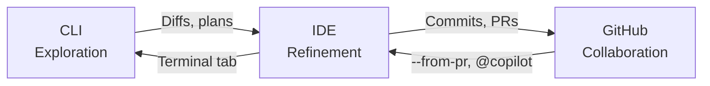

# CLI-IDE-GitHub Context Ladder

> A three-surface workflow that matches the right AI environment to each development phase — CLI for exploration, IDE for refinement, GitHub for durable collaboration — with context preservation across transitions.

## The Three-Surface Model

Development with AI assistants spans three distinct surfaces, each optimized for a different phase of work. GitHub's Copilot CLI guide frames this explicitly: "CLI proves value quickly, IDE refines precision, GitHub ships durably" ([GitHub Blog](https://github.blog/ai-and-ml/github-copilot/from-idea-to-pull-request-a-practical-guide-to-building-with-github-copilot-cli/)).



The ladder is not strictly linear. You move between surfaces based on what the current task demands, carrying context through structured artifacts at each transition.

## CLI Surface: Exploration and Scaffolding

The CLI excels at low-ceremony, high-speed exploration. Nothing runs automatically — you inspect everything before deciding what to execute ([GitHub Blog](https://github.blog/ai-and-ml/github-copilot/from-idea-to-pull-request-a-practical-guide-to-building-with-github-copilot-cli/)).

**Best suited for:**

- Scaffolding minimal projects from natural-language intent
- Running tests at point of failure and diagnosing errors
- Mechanical repo-wide changes (renames, migrations)
- Exploring problem spaces before committing to a design

**Copilot CLI** offers `/plan`, `/diff`, `/explain`, `/suggest`, and `/delegate` commands with built-in specialized agents (Explore, Task, Code Review, Plan) ([GitHub Changelog](https://github.blog/changelog/2026-02-25-github-copilot-cli-is-now-generally-available/)) [unverified].

**Claude Code CLI** follows Unix philosophy — pipeable, scriptable, composable with other tools. Plan mode (`--permission-mode plan`) restricts to read-only operations, useful for exploration before implementation ([Claude Code docs](https://code.claude.com/docs/en/common-workflows)).

The CLI produces diffs and plans as intermediate artifacts — concrete outputs that bridge exploration to the next surface.

## IDE Surface: Refinement and Implementation

The IDE is where precision matters more than speed. This is where you "make decisions you'll defend in review" ([GitHub Blog](https://github.blog/ai-and-ml/github-copilot/from-idea-to-pull-request-a-practical-guide-to-building-with-github-copilot-cli/)).

**Best suited for:**

- Multi-file reasoning and semantic understanding
- Visual diff review before committing
- Edge case handling and API refinement
- Inline suggestions and targeted code generation

**VS Code Copilot agent mode** provides autonomous multi-step execution — it breaks work into steps, edits files, runs commands, and self-corrects on errors ([VS Code docs](https://code.visualstudio.com/docs/copilot/overview)).

**Claude Code** is available across VS Code, JetBrains, and Desktop — the same engine, CLAUDE.md files, and MCP servers work across all surfaces ([Claude Code docs](https://code.claude.com/docs)).

## GitHub Surface: Durable Collaboration

GitHub is where individual work becomes durable through PRs, CI pipelines, and async review.

**Best suited for:**

- Opening PRs that trigger CI validation
- Asynchronous code review with teammates
- Agent-driven iteration via `@copilot` or `@claude` comments
- Long-running autonomous work (coding agent, GitHub Actions)

The Copilot coding agent works asynchronously via GitHub Actions: it plans work, writes code, runs tests, self-reviews, runs security scanning, and opens a PR ([GitHub Docs](https://docs.github.com/en/copilot/concepts/agents/coding-agent/about-coding-agent)).

## Context Preservation Across Surfaces

The ladder works only if context survives transitions. Several mechanisms serve as connective tissue:

### Instruction Files

CLAUDE.md files work across all Claude Code surfaces (terminal, VS Code, JetBrains, Desktop). Project instructions in `./CLAUDE.md` persist across transitions without manual effort. Auto memory accumulates learnings (build commands, debug insights, preferences) across sessions independently ([Claude Code docs: Memory](https://code.claude.com/docs/en/memory)).

Copilot reads `.github/copilot-instructions.md` and custom agent files across IDE and GitHub surfaces, providing similar cross-surface instruction persistence.

### Session Handoff Commands

Claude Code provides explicit handoff commands for surface transitions ([Claude Code docs](https://code.claude.com/docs/en/remote-control)):

- `/teleport` — pulls a web or mobile session into the local terminal
- `/desktop` — hands a terminal session to the Desktop app for visual diff review [unverified — no documentation found for this command]
- `--from-pr` — resumes a session linked to a specific PR, creating a GitHub-to-CLI handoff

### Structured Artifacts

Diffs, commit messages, progress files, and PR descriptions serve as handoff artifacts between sessions. Progress files and [feature list specs](../instructions/feature-list-files.md) provide structured continuity for multi-session work ([Anthropic: Effective Harnesses](https://www.anthropic.com/engineering/effective-harnesses-for-long-running-agents)).

### Lightweight Identifiers

Rather than pre-loading full objects, maintain file paths, queries, and links that can be dynamically loaded at each surface. This "lightweight identifier" approach keeps context portable without bloating token budgets ([Anthropic: Context Engineering](https://www.anthropic.com/engineering/effective-context-engineering-for-ai-agents)).

## Choosing the Right Surface

| Signal | Surface | Reason |
|--------|---------|--------|
| "What would this look like?" | CLI | Low-ceremony exploration, no commitment |
| "This needs to work correctly" | IDE | Precision editing, visual feedback |
| "Others need to see and review this" | GitHub | Durable artifacts, async collaboration |
| "This is mechanical and well-scoped" | GitHub (agent) | Autonomous execution, no human typing needed |
| "I started remotely, need local tools" | CLI via `/teleport` | Resume with full filesystem access |

## Key Takeaways

- Match the AI surface to the development phase: exploration (CLI), refinement (IDE), collaboration (GitHub)
- Context preservation mechanisms — instruction files, session handoff commands, structured artifacts — are what make the ladder work without losing state
- The ladder is bidirectional: GitHub-to-CLI handoffs (`--from-pr`, `/teleport`) are as important as CLI-to-GitHub progressions
- Diffs and plans generated at the CLI surface serve as concrete handoff artifacts for IDE refinement
- The workflow respects existing developer behavior — terminal, editor, PR review — rather than replacing it

## Example

A developer is asked to add a rate-limiting middleware to an existing API service.

**CLI — Exploration and Scaffolding**

```bash
# Explore the codebase before touching anything
$ gh copilot explain "how does the current request pipeline work in src/server/"

# Scaffold a skeleton middleware file
$ gh copilot suggest "add express rate-limit middleware to src/server/middleware/"
# Review the generated diff, then execute
$ gh copilot diff | less
```

The CLI produces a diff and a short plan. Nothing is committed yet — these artifacts are the handoff to the IDE.

**IDE — Refinement and Implementation**

Open the scaffolded file in VS Code. Copilot agent mode or Claude Code fills in the edge cases (per-user vs per-IP limits, configurable window, test coverage). The developer reviews inline suggestions, adjusts the API surface, and runs the test suite from the integrated terminal. `CLAUDE.md` carries the project conventions (import style, error patterns) into this session automatically.

When the implementation is solid, the developer commits and pushes.

**GitHub — Durable Collaboration**

The push opens a PR. CI runs lint and tests. A teammate leaves a review comment: "the window should be configurable per-route." The developer adds an `@copilot` comment on the PR asking it to apply the per-route config change. Copilot iterates in a GitHub Actions worker, pushes a fixup commit, and re-runs CI. The reviewer approves and merges.

The context handoff chain: CLI diff → IDE commit → GitHub PR → `@copilot` comment → merged PR.

## Unverified Claims

- Copilot CLI offers `/plan`, `/diff`, `/explain`, `/suggest`, and `/delegate` commands with built-in specialized agents [unverified]
- `/desktop` hands a terminal session to the Desktop app for visual diff review [unverified — no documentation found for this command]

## Related

- [The Plan-First Loop: Design Before Code](plan-first-loop.md)
- [Parallel Agent Sessions](../workflows/parallel-agent-sessions.md)
- [Agent-Driven Greenfield](../workflows/agent-driven-greenfield.md)
- [Agent Environment Bootstrapping](../workflows/agent-environment-bootstrapping.md)
- [Agent Harness](../agent-design/agent-harness.md)
- [Context Priming](../context-engineering/context-priming.md)
- [Cloud-Local Agent Handoff](../workflows/cloud-local-agent-handoff.md)
- [Cross-Tool Translation](../human/cross-tool-translation.md)
