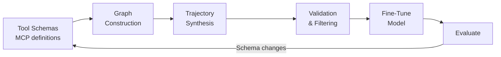

# Closed-Loop Agent Training from Tool Schemas

> Generate synthetic training trajectories from tool definitions, fine-tune small models to match frontier-model performance on domain tasks, and re-train incrementally as schemas change -- a closed-loop alternative to manual data curation.

## The Problem

Enterprise teams deploying AI agents face a trilemma: frontier models (GPT-4o, Claude) deliver capability but leak data to third parties and cost 8-10x more at inference time ([Agarwal et al., 2026](https://arxiv.org/abs/2603.21630)); small open models preserve sovereignty but lack tool-use competence; and bridging the gap with fine-tuning requires training data that nobody has time to curate manually.

The bottleneck is the training data pipeline. Most teams treat tool integration, data generation, and model training as separate concerns with different owners. This fragmentation means schema changes invalidate existing datasets, new tools require fresh annotation campaigns, and the feedback loop between deployment failures and training improvements is measured in weeks.

## The Closed-Loop Pattern

A closed-loop training pipeline unifies tool integration, data synthesis, and model optimization into a single automated cycle. The key insight: **tool schemas already encode enough structure to generate training data programmatically**.



### Step 1: Tool Graph Construction

Parse tool definitions -- MCP server schemas, OpenAPI specs, or function signatures -- into a directed graph where nodes are tools and edges represent data-flow dependencies. A `get_employee` tool that returns an `employee_id` consumed by `schedule_interview` creates a directed edge between them.

This graph encodes which tool sequences are structurally valid without requiring human annotation of "good" workflows.

### Step 2: Constraint-Aware Trajectory Sampling

Walk the tool graph using depth-first exploration with constraint tracking. At each step, maintain a memory buffer of available output values from prior tool calls. Only sample tool invocations whose required parameters can be satisfied by the buffer or by realistic synthetic inputs.

This produces multi-step trajectories that respect schema constraints by construction -- no hallucinated arguments, no impossible parameter combinations.

### Step 3: Hierarchical Task Synthesis

For each sampled trajectory, generate a natural-language task description at two levels:

- **Low-level**: describe what the tool sequence does ("Look up the job description for role R-1042, fetch matching resumes, and schedule interviews for the top 3 candidates")
- **High-level**: abstract the intent ("Find and interview the best candidates for an open role")

Use a frontier model for this step -- it runs once during data generation, not at inference time, so cost is bounded. The dual-level descriptions teach the fine-tuned model to handle both precise and vague user instructions.

### Step 4: Validation and Filtering

Not every synthesized trajectory is useful. Filter by:

- **Execution verification**: replay the trajectory against a sandboxed environment; drop failures
- **Deduplication**: remove near-duplicate task descriptions (Self-BLEU threshold)
- **Diversity selection**: sample to maintain coverage across tool domains and complexity levels

### Step 5: Fine-Tune and Evaluate

Train the target model on validated trajectories. The training approach matters:

| Method | Strength | Trajectory count needed |
|--------|----------|------------------------|
| Supervised fine-tuning (SFT) | Fast (hours), stable | 500-1,000 |
| Direct Preference Optimization (DPO) | Learns from ranked pairs | 500-1,000 + preference pairs |
| Trajectory-level RL (e.g., GRPO) | Rewards complete workflows, not tokens | 500-1,000 + reward signal |

Trajectory-level reinforcement learning -- applying group-relative advantages across complete agent episodes rather than individual tokens -- yields roughly 10% higher execution accuracy than token-level approaches on EnterpriseLab's benchmarks ([Agarwal et al., 2026](https://arxiv.org/abs/2603.21630)); the size of the gap in other settings will depend on task complexity and tool-set size.

## Evidence: Small Models Matching Frontier Performance

EnterpriseLab ([Agarwal et al., 2026](https://arxiv.org/abs/2603.21630)) validated this pattern across 15 enterprise applications with 140+ MCP-exposed tools:

- **Qwen3-8B** trained on fewer than 1,000 synthesized examples matched GPT-4o on their EnterpriseArena benchmark (500 expert-curated tasks)
- **8-10x inference cost reduction** ($0.50-$1.00 vs. $3.00-$15.00 per million tokens at time of study; costs are point-in-time)
- **Cross-benchmark generalization**: +10% over GPT-4o on EnterpriseBench and CRMArena
- **Training wall time**: SFT in 2 hours, online RL in 24-30 hours on 4xH200 GPUs

For comparison, prior work required 26,000-60,000 manually curated examples to achieve similar tool-use competence — for instance, ToolBench ([Qin et al., 2023](https://arxiv.org/abs/2307.16789)) used 126,486 instances across 16,000+ APIs to train ToolLLaMA. The data efficiency of the closed-loop approach comes from leveraging environment structure rather than brute-force annotation.

## Why It Works

The core mechanism is distribution alignment: training trajectories are derived from the exact same tool definitions the model will encounter at inference time. Unlike general-purpose instruction tuning -- where training data is drawn from a broad distribution that only partially overlaps with any given deployment -- schema-derived trajectories are guaranteed to cover the actual parameter types, argument shapes, and data-flow dependencies the model needs to navigate. The model never encounters a tool signature in production that it hasn't seen structurally during training.

Trajectory-level optimization amplifies this further. Token-level fine-tuning rewards correct individual tokens but is indifferent to whether the overall tool-call sequence succeeds. Trajectory-level RL (GRPO, PPO with episode-level rewards) directly optimizes for complete workflow success, which better matches the evaluation criterion and suppresses locally-plausible but globally-failing call sequences.

## Schema Evolution: Incremental Re-Training

The closed loop pays off when tool schemas change -- which they always do. When 30% of API schemas were modified in EnterpriseLab's evaluation, incremental training on just 200 additional trajectories (synthesized from the updated schemas) recovered 95% of original performance ([Agarwal et al., 2026](https://arxiv.org/abs/2603.21630)) -- a result measured across the 15 enterprise domains in the study, and one that larger or more heterogeneous schema diffs would not necessarily match.

The re-training workflow:

1. Detect schema diff (new/changed/removed tools)
2. Re-generate the tool graph for affected subgraphs
3. Synthesize trajectories covering changed tools
4. Fine-tune from the previous checkpoint (not from scratch)
5. Evaluate on held-out tasks spanning old and new schemas

This makes the pipeline **self-healing** against API drift -- a property manual training datasets do not have.

## Failure Modes

The most common errors in small models trained this way, from EnterpriseLab's analysis:

| Error type | Frequency | Root cause |
|-----------|-----------|------------|
| Tool parameter errors | 42% | Incorrect arguments causing API failures |
| Domain misselection | 28% | Wrong application chosen in ambiguous contexts |
| Task decomposition failures | 18% | Incomplete multi-step execution |
| Context loss | 12% | Coherence degradation over extended dialogues |

Parameter errors dominate -- the model knows *which* tool to call but struggles with *how* to call it correctly. This suggests that schema-grounded training improves tool selection more than argument precision, and that the validation/filtering step is critical for catching argument-level errors in synthetic data.

## When to Use This Pattern

**Good fit:**

- You have 10+ domain-specific tools with well-defined schemas
- Data sovereignty or cost rules out sustained frontier-model usage
- Tool schemas change frequently enough that static training data goes stale
- You need consistent performance across a bounded domain, not general-purpose capability

**Poor fit:**

- Your tool set is small and stable (manual curation is faster)
- You need frontier-level reasoning on open-ended tasks beyond your tool domain
- You lack GPU infrastructure for fine-tuning (SFT needs ~4 GPUs for a few hours minimum)

## Example

An HR platform exposes three MCP tools:

```json
[
  {
    "name": "get_open_roles",
    "parameters": {},
    "returns": { "role_ids": ["string"] }
  },
  {
    "name": "get_role_candidates",
    "parameters": { "role_id": "string" },
    "returns": { "candidate_ids": ["string"], "scores": ["number"] }
  },
  {
    "name": "schedule_interview",
    "parameters": { "candidate_id": "string", "role_id": "string" },
    "returns": { "interview_id": "string" }
  }
]
```

**Graph construction** creates edges: `get_open_roles` -> `get_role_candidates` (via `role_id`) -> `schedule_interview` (via `candidate_id` + `role_id`).

**Trajectory sampling** walks this graph and produces:

```
1. get_open_roles() -> { role_ids: ["R-1042", "R-1087"] }
2. get_role_candidates(role_id="R-1042") -> { candidate_ids: ["C-501", "C-602", "C-715"], scores: [92, 88, 85] }
3. schedule_interview(candidate_id="C-501", role_id="R-1042") -> { interview_id: "INT-3301" }
4. schedule_interview(candidate_id="C-602", role_id="R-1042") -> { interview_id: "INT-3302" }
```

**Task synthesis** generates descriptions at two levels:

- Low-level: "List open roles, retrieve candidates for role R-1042, and schedule interviews for the top two."
- High-level: "Interview the strongest candidates for an open position."

After validation against a sandboxed HR API, both the trajectory and its task descriptions become a single training example. Repeat across tool subgraphs to build a dataset of 500-1,000 examples, then fine-tune.

## Key Takeaways

- Tool schemas contain enough structure to generate training data without human annotation -- the graph of data-flow dependencies between tools defines valid trajectories
- Small models (8B) can match frontier models on domain-specific tool-use tasks with fewer than 1,000 synthesized examples
- Trajectory-level optimization outperforms token-level fine-tuning for multi-step agent workflows
- The real advantage is incremental re-training: when schemas change, regenerate affected trajectories and fine-tune from the last checkpoint instead of starting over

## Related

- [MCP Client-Server Architecture](../tool-engineering/mcp-client-server-architecture.md) -- how MCP exposes tools that this pattern uses as training signal
- [Token-Efficient Tool Design](../tool-engineering/token-efficient-tool-design.md) -- designing tool interfaces that minimize token waste, relevant to schema quality for synthesis
- [Tool Description Quality](../tool-engineering/tool-description-quality.md) -- better descriptions produce better synthetic training data
- [Compound Engineering](compound-engineering.md) -- a related learning loop, but operating at the prompt/instruction level rather than model weights
