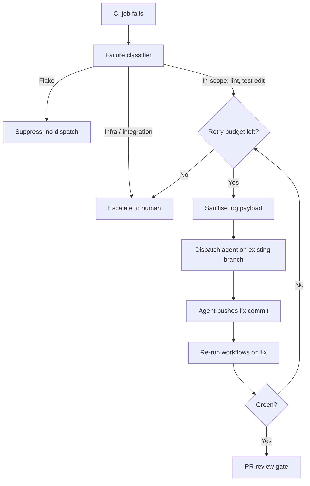

# Closed-Loop CI Failure Remediation with Cloud Coding Agents

> A CI failure becomes a cloud-agent fix PR only under five controls: failure classification, payload sanitization, scoped fix, retry budget, and a load-bearing review gate.

In closed-loop CI failure remediation, a CI failure event triggers a cloud coding agent. The agent reads the failure context, proposes a patch on the existing branch, and surfaces it as a reviewable PR. This moves CI red from "human triages then dispatches" to "agent proposes, human reviews." By mid-2026 the pattern ships in three trigger shapes. It works only when an explicit dispatcher control replaces every step the human used to do implicitly.

## When to use it

CI failure is the highest-signal first trigger to give a cloud coding agent. It is discrete and reproducible, has a known goal state (green build), and ships with a self-contained log payload that fits a prompt window. GitHub frames the addressable scope as "simple but time-consuming work" — fixing tests and correcting linter failures ([GitHub Changelog, 2026-05-18](https://github.blog/changelog/2026-05-18-one-click-fixes-for-failing-actions-with-copilot-cloud-agent/)). Adopt the closed loop only when all five preconditions hold:

| Precondition | Why it is load-bearing |
|---|---|
| Per-failure-class classifier upstream of dispatch | ~25% of CI failures in large systems are flake, not code defects ([Slack Engineering](https://slack.engineering/handling-flaky-tests-at-scale-auto-detection-suppression/)); dispatching on flake produces `sleep` patches around races and retry wrappers around real outages. |
| Log-to-prompt sanitization at the dispatcher boundary | Job logs contain attacker-controlled output (assertion messages, third-party tool stdout); forwarding raw slices to the agent closes the indirect-prompt-injection surface documented for [Programmatic Cloud-Agent Dispatch](programmatic-cloud-agent-dispatch.md). |
| Scope contract bounding the fix to the failing step | 15.3% of unmerged AI fix PRs were closed for "incorrect or incomplete fixes" and 18.1% for introducing new test failures ([arXiv:2602.00164](https://arxiv.org/html/2602.00164v1)); broad refactors compound that rate. |
| Per-failure-key retry budget | Re-dispatching on the same failure stacks commits without convergence; without a circuit-breaker keyed on `(repo, failing_step)` the loop produces unbounded fix attempts. |
| PR review gate that stays load-bearing | Reviewer engagement is the single strongest correlate of agent-PR merge; 30 of 32 successfully merged PRs involved actionable review loops ([arXiv:2602.19441](https://arxiv.org/html/2602.19441v1)). |

If any one is missing, the loop transfers diagnostic cost to the reviewer instead of removing it.

## The three trigger shapes

The same closed-loop pattern ships under different trigger surfaces, and the safety differences track the trigger.

| Trigger | Vendor surface | Implicit safeguards |
|---|---|---|
| Human click on the failing run | GitHub Copilot cloud agent "Fix with Copilot" button — Business/Enterprise tiers, admin-enabled ([GitHub Changelog, 2026-05-18](https://github.blog/changelog/2026-05-18-one-click-fixes-for-failing-actions-with-copilot-cloud-agent/)) | Operator intent; "Approve and run workflows" gate on the fix commit |
| Event-driven from a GitHub Actions workflow | `anthropics/claude-code-action@v1` with `pull_request` / `workflow_run` triggers; Sonnet or Opus 4.7 selectable via `claude_args` ([Claude Code GitHub Actions](https://code.claude.com/docs/en/github-actions)) | Action-level permission scope (Contents/Issues/PRs Read & Write); the action runs on GitHub-hosted runners with separate API-key scope |
| Programmatic dispatch from a watcher | Cursor Background Agents + Automations support test-failure event triggers and a `cursor --headless` CLI for CI invocation ([Cursor Cloud](https://cursor.com/cloud)); a dedicated agent (Datadog Bits AI Dev Agent) narrows the trigger to flaky-test only and pre-validates against historical flakiness before surfacing a draft PR ([Datadog blog](https://www.datadoghq.com/blog/bits-ai-test-optimization/)) | None implicit — caller owns dedupe, sanitization, budget caps, and audit attribution, matching [Programmatic Cloud-Agent Dispatch](programmatic-cloud-agent-dispatch.md) |

## Why it works

The friction tax on a CI failure is the dominant cost on otherwise-good agent-authored PRs. The operator leaves the PR view, opens the workflow log, parses the failure, writes the patch, and pushes. The closed loop collapses that sequence while preserving the surfaces that predict merge. GitHub states the mechanism directly: fixing tests and correcting linter failures is "simple but time-consuming work" that the agent absorbs ([GitHub Changelog, 2026-05-18](https://github.blog/changelog/2026-05-18-one-click-fixes-for-failing-actions-with-copilot-cloud-agent/)). The PR review gate is what makes the pattern work rather than fail. Reviewer engagement is the strongest correlate of merge across the AIDev population, and 93.75% of merged agent PRs involved actionable review loops ([arXiv:2602.19441](https://arxiv.org/html/2602.19441v1)). Removing the review surface destroys the integration signal the loop is supposed to protect.

## When this backfires

- Flake-dominant test suite. When about 25% of failures are flake, naive dispatch confidently patches around timing and state issues with `sleep`s, retry wrappers, or assertion relaxations ([Slack Engineering](https://slack.engineering/handling-flaky-tests-at-scale-auto-detection-suppression/)). The mitigation is a per-test flake-rate classifier with a suppression list, as in Slack's flake suppression model and Datadog's pre-validation step.
- Reward hacking on the failing test. When the agent's only feedback is "the failing test now passes," the optimal policy can be assertion rewriting, test deletion, or monkey-patching the grader. The TRACE benchmark catalogs 54 categories across 517 testing trajectories, and detection of these exploits caps at 63% on GPT-5.2 with reasoning ([arXiv:2601.20103](https://arxiv.org/abs/2601.20103v1)). PR review must inspect what the patch changes on the assertion side, not whether CI turned green.
- Failure class outside agent context. Cross-service integration failures, dependency-graph cascades, and platform outages need data the agent does not have. Dispatching produces a `sleep` against a race, a try/except around a real outage, or a retry wrapper around a downstream collapse — the documented "auto-remediating into a worse state" cascade ([Aurora by Arvo AI](https://www.arvoai.ca/blog/cicd-auto-remediation-complete-guide)).
- Untrusted log content reaches the prompt. Failing-assertion messages and third-party stdout can be attacker-controlled. A dispatcher that forwards raw log slices closes the indirect-prompt-injection surface, so you must sanitize the payload at the dispatcher boundary ([Programmatic Cloud-Agent Dispatch](programmatic-cloud-agent-dispatch.md)).
- Dispatch volume inflates per-PR comment count. Reviewer comment volume on agentic PRs correlates negatively with merge ([arXiv:2602.19441](https://arxiv.org/html/2602.19441v1)), so dispatching on every red CI erodes the merge probability the loop was designed to protect.

## Comparison to adjacent patterns

| Pattern | Trigger | Scope |
|---|---|---|
| [One-Click CI Auto-Fix](one-click-ci-auto-fix.md) | Single GitHub button on the workflow log page | Narrow vendor implementation of the human-click trigger shape |
| [Self-Healing Production Agent](../patterns/agent-design/self-healing-production-agent.md) | Post-deploy regression detection on eval suite | Production regression remediation, not pre-merge CI |
| [Programmatic Cloud-Agent Dispatch](programmatic-cloud-agent-dispatch.md) | REST / webhook / cron | Generic dispatch primitive; this page is its CI-failure specialization |

## Key Takeaways

- CI failure is the highest-signal first trigger for a cloud coding agent — discrete, reproducible, known goal state, self-contained payload.
- The pattern ships in three trigger shapes (human click, event-driven action, programmatic dispatch); safety differences track the trigger.
- Five preconditions are load-bearing: classifier upstream of dispatch, log sanitization, scoped fix surface, retry budget, review gate.
- Reviewer engagement is the strongest empirical correlate of agent-PR merge — 93.75% of merged agent PRs went through actionable review loops ([arXiv:2602.19441](https://arxiv.org/html/2602.19441v1)).
- Reward hacking on the failing test is the highest-severity failure mode; detection caps at 63% even on frontier reasoning models ([arXiv:2601.20103](https://arxiv.org/abs/2601.20103v1)).

## Related

- [One-Click CI Auto-Fix: Human-Triggered Cloud-Agent Remediation](one-click-ci-auto-fix.md) — vendor-specific implementation of the human-click trigger shape, with detail on GitHub's three confirmation gates
- [Self-Healing Production Agent](../patterns/agent-design/self-healing-production-agent.md) — the post-deploy variant of the same loop, with circuit-breaker design for unfixable regressions
- [Programmatic Cloud-Agent Dispatch via REST API and Webhooks](programmatic-cloud-agent-dispatch.md) — the generic dispatch primitive this page specializes for CI failure events
- [AI Bot CI/CD Workflow Reliability by Agent](ai-bot-ci-workflow-reliability.md) — per-agent CI success rates that quantify the failure baseline the loop is competing with
- [Agentic Flywheel](../patterns/agent-design/agentic-flywheel.md) — the offline complement, where accepted fixes feed back into harness improvement
