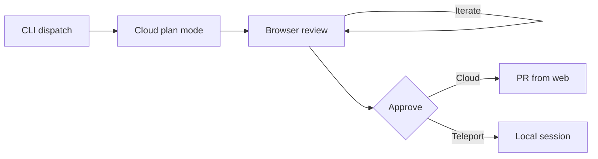

# Cloud Planning with Inline-Comment Review and Execute-Anywhere Choice

> Generate the plan in the cloud, review it inline in a browser, then choose at approval whether to execute remotely or teleport to the terminal.

Cloud planning decouples plan generation from plan execution. A cloud session running in [plan mode](../tools/claude/plan-mode.md) drafts the plan asynchronously while the dispatching terminal stays free. The plan is reviewed in a browser with highlight-and-comment feedback on individual passages. At approval time, the same plan can run in the cloud (continuing as the implementer, opening a pull request) or teleport back to the original local session for execution. Claude Code ships this triad as [ultraplan](https://code.claude.com/docs/en/ultraplan), available from v2.1.91 onward.

## Why the triad

Local plan mode binds three things that have different best runtimes: where the plan is generated, reviewed, and executed. [Anthropic's ultraplan documentation](https://code.claude.com/docs/en/ultraplan) names "Targeted feedback", "Hands-off drafting", and "Flexible execution" as the three benefits. Each maps to one of those bindings.

| Stage | Optimal surface | Why |
|-------|----------------|-----|
| Generate | Asynchronous cloud session | Drafting takes minutes; the dispatching terminal stays free for other work |
| Review | Browser with inline comments | Plans are structured documents — specific passages need specific feedback, not prose replies |
| Execute | Chosen at approval time | The plan itself reveals what runtime it needs; deferring avoids losing that information |

The teaching is deferral: the runtime choice belongs at approval, not at dispatch.

## Three implementation layers



### Layer 1: Dispatch from the CLI

Three launch paths from the local CLI, all documented in the [ultraplan reference](https://code.claude.com/docs/en/ultraplan):

- Slash command: `/ultraplan migrate the auth service from sessions to JWTs`
- Keyword: include the word `ultraplan` anywhere in a normal prompt
- From a local plan: when a local plan finishes, the approval dialog offers **No, refine with Ultraplan on Claude Code on the web** — the in-progress draft is handed up to the cloud for further iteration

The CLI's prompt input shows one of three status indicators while the remote session works: `◇ ultraplan` (drafting), `◇ ultraplan needs your input` (clarifying question waiting), `◆ ultraplan ready` (plan complete). Run `/tasks` to open a detail view with a **Stop ultraplan** action. Stopping archives the cloud session.

### Layer 2: Inline-comment review in the browser

When the status changes to `◆ ultraplan ready`, the session link opens a dedicated review view on claude.ai. The surface gives three review tools ([ultraplan docs](https://code.claude.com/docs/en/ultraplan)):

- Inline comments — highlight any passage and leave a comment for Claude to address
- Emoji reactions — react to a section to signal approval or concern without writing a full comment
- Outline sidebar — jump between sections of the plan

Ask Claude to address the comments and it produces a revised draft. Iterate as many times as needed before choosing where to execute.

### Layer 3: Execute-anywhere at approval time

The browser offers two approve buttons. Each routes the same approved plan to a different runtime.

Execute on the web — select **Approve Claude's plan and start coding** and Claude implements the plan in the same cloud session. The terminal status indicator clears. When the implementation finishes, you review the diff in the web interface and a PR is opened from there ([Claude Code on the web docs](https://code.claude.com/docs/en/claude-code-on-the-web)).

Teleport back to the terminal — select **Approve plan and teleport back to terminal**. This option appears only when you launched the session from the CLI and the terminal is still polling. The cloud session is archived so it does not continue working in parallel ([ultraplan docs](https://code.claude.com/docs/en/ultraplan)).

The waiting terminal then shows an **Ultraplan approved** dialog with three sub-options:

| Sub-option | Behavior |
|------------|-----------|
| **Implement here** | Inject the plan into the current conversation and continue from where you left off |
| **Start new session** | Clear context and begin fresh with only the plan as context; a `claude --resume` command is printed so the previous conversation can be returned to later |
| **Cancel** | Save the plan to a file without executing it; Claude prints the file path so you can return to it later |

The **Cancel** option is the failure-mode fallback. If the polling terminal closed, or you want to defer execution entirely, the plan still survives as a versioned artifact.

## Triggers and constraints

| Aspect | Detail |
|--------|--------|
| Trigger | Manual — `/ultraplan`, keyword, or hand-up from a local plan |
| Plan runtime | Anthropic-managed cloud sandbox at [claude.ai/code](https://claude.ai/code) |
| Review runtime | Browser tab on claude.ai |
| Execution runtime | Cloud (same session) or local (teleport back) — chosen at approval |
| Authority bound | The cloud session has the permissions of the connected GitHub account and the configured cloud environment ([Claude Code on the web docs](https://code.claude.com/docs/en/claude-code-on-the-web)) |
| Provider lock-in | Anthropic API only; not available on Amazon Bedrock, Google Cloud Vertex AI, or Microsoft Foundry ([ultraplan docs](https://code.claude.com/docs/en/ultraplan)) |
| Repo requirement | GitHub-connected repository (the cloud VM clones from GitHub) |

## Why it works

Plan generation and plan execution have different best runtimes. Plan generation benefits from an asynchronous, hands-off surface — the bottleneck is review quality, not iteration speed, and inline-comment review on a structured document is tighter than prose review. Plan execution benefits from a runtime that matches the plan: sometimes that is the cloud (fresh sandbox, network access, no local-config drift), sometimes that is local (working tree, secrets, local databases) — the same [cloud-local handoff](cloud-local-agent-handoff.md) choice applied at the plan stage. Forcing the choice at dispatch loses information. Deferring it to approval lets the plan itself reveal what runtime it needs. Anthropic's docs name this as "Flexible execution", one of the three top-level benefits of [ultraplan](https://code.claude.com/docs/en/ultraplan).

The mechanism is the same separation that justifies build-time versus run-time configuration boundaries: bind late, when the most information is available. The browser inline-comment surface makes this work — without per-passage feedback, "send the plan back to the planner to fix three specific things" collapses into a prose round-trip, and the cost of revising in the cloud exceeds the cost of just re-planning locally.

## Multi-tool coverage

The triad as a workflow — async cloud plan, structured review, and execute-anywhere — currently ships end-to-end only in [Claude Code's ultraplan](https://code.claude.com/docs/en/ultraplan).

Adjacent capabilities elsewhere cover individual layers:

- GitHub Copilot's coding agent and Copilot CLI: cloud execution and one-way [cloud-to-local handoff](cloud-local-agent-handoff.md) via "Continue in Copilot CLI", but the plan itself is not the reviewable artifact — the PR is. There is no inline-comment review surface on the plan.
- Local plan mode in any tool: Claude Code's `Ctrl+G` opens the plan in `$EDITOR` for direct edits; Cursor and Copilot CLI have no equivalent cloud-async planning path.

Treat this page as Claude-specific until at least one other tool ships the full triad.

## Example

A developer is mid-task on a frontend bug fix in the terminal and decides the auth service should be migrated from sessions to JWTs. Rather than break their flow, they dispatch:

```
/ultraplan migrate the auth service from sessions to JWTs — keep refresh-token semantics
```

The terminal shows `◇ ultraplan` and the developer goes back to the frontend bug. Twenty minutes later the status flips to `◆ ultraplan ready`. They open the session link in a browser, scroll to the section on token rotation, highlight three lines, and leave a comment: "don't touch the existing `refresh_token_v1` table — write to `refresh_token_v2` and dual-read."

Claude revises. The developer reviews the updated draft, approves with teleport back to terminal, and the waiting CLI shows the **Ultraplan approved** dialog. They select **Start new session** — the frontend-bug conversation is preserved with `claude --resume`, and the new session begins with the approved migration plan as its only context. The implementation runs locally because the migration touches secrets stored in `.env` that the cloud sandbox cannot see.

## When this backfires

The triad adds a cloud round-trip before any code is written. That round-trip is worth it when review quality dominates the cost, and pure overhead when it does not.

- Trivial or fast-iteration tasks — the cold-start cost of spinning up a cloud session plus the browser context-switch dominates the planning time itself; local plan mode with `Ctrl+G` to edit the plan in `$EDITOR` is faster ([plan mode docs](https://code.claude.com/docs/en/permission-modes#analyze-before-you-edit-with-plan-mode)).
- Bedrock, Vertex, or Foundry deployments — ultraplan is hard-blocked; the feature does not exist on these providers ([ultraplan docs](https://code.claude.com/docs/en/ultraplan)).
- Non-GitHub repositories — the cloud VM clones from GitHub, so GitLab, Bitbucket, and internal Gitea projects are not supported.
- Active Remote Control session — Remote Control disconnects when ultraplan starts because both features occupy the claude.ai/code interface and only one can be connected at a time ([ultraplan docs](https://code.claude.com/docs/en/ultraplan)).
- Terminal that may close before the plan is ready — if the polling terminal exits, the teleport-back option disappears and only cloud-execute or save-to-file recovery remain.
- Dirty working tree at teleport time — teleport requires a clean git state and will prompt to stash uncommitted changes; in flows where stashing breaks in-progress local work, the handoff is friction, not flow ([Claude Code on the web docs](https://code.claude.com/docs/en/claude-code-on-the-web)).
- Uncommitted local edits during the planning window — the cloud session clones the repository from GitHub at launch ([Claude Code on the web docs](https://code.claude.com/docs/en/claude-code-on-the-web)), so it plans against the pushed commit, not your working tree. If you keep editing locally while the plan drafts — renaming a column, reworking a schema — the plan can reference state that no longer exists, and you may approve it without noticing the drift. Commit or push before dispatching, or treat the plan as point-in-time against the launch commit.
- Research-preview risk — ultraplan is explicitly a research preview; "behavior and capabilities may change based on feedback" ([ultraplan docs](https://code.claude.com/docs/en/ultraplan)). Do not build durable team rituals on it without a fallback to local plan mode.

For these conditions, default to local [plan mode](../tools/claude/plan-mode.md) and reserve cloud planning for tasks where async drafting and inline-comment review pay for the round-trip.

## Key Takeaways

- The teaching is *deferral*: the runtime choice for plan execution belongs at approval, not at dispatch.
- Cloud-side plan generation frees the dispatching terminal — status indicators (`◇` / `◆`) signal progress without blocking.
- Inline highlight-and-comment review beats prose review for structured documents; it is the structural enabler for tight round-trip iteration on plans.
- Approve + start coding continues in the cloud and opens a PR; Approve + teleport back archives the cloud session and injects the plan locally.
- The teleport-back path has three sub-options including a save-to-file fallback if the polling terminal is gone.
- The feature is Claude Code-specific (v2.1.91+), Anthropic API only, GitHub-only, and explicitly a research preview — treat it as one option, not the default.

## Related

- [Plan Mode: Read-Only Exploration Before Implementation](../tools/claude/plan-mode.md) — the local equivalent; cloud planning extends, does not replace, this baseline
- [The Plan-First Loop: Always Design Before Writing Code](plan-first-loop.md) — the underlying pattern; cloud planning is one delivery vehicle
- [Cloud-Local Agent Handoff for AI Agent Development](cloud-local-agent-handoff.md) — the general handoff pattern; teleport-back is its plan-stage instantiation
- [Multi-Model Plan Synthesis](../patterns/multi-agent/multi-model-plan-synthesis.md) — combining plans from multiple planners; complementary to where the planner runs
- [Cloud Agent Session Bootstrap](../patterns/agent-design/cloud-agent-session-bootstrap.md) — the agent-design pattern that the cloud planner composes
