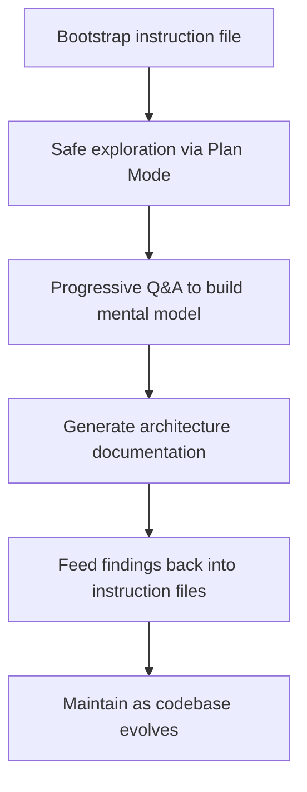

# Agent-Powered Codebase Q&A and Onboarding

> Agents with codebase search tools turn unfamiliar repositories into navigable systems: answer targeted questions about architecture, trace execution paths, and generate architecture documentation — compressing ramp-up time without requiring upfront reading of every file.

## The Problem

Program comprehension — reading code, tracing call paths, locating conventions — consumes a disproportionate share of developer time and is among the highest-friction activities in software engineering. The knowledge needed is scattered across files, commit history, [tribal knowledge](../anti-patterns/implicit-knowledge-problem.md), and documentation that drifts from implementation within weeks. Research into LLM-powered codebase documentation (e.g., [RepoAgent, arXiv 2402.16667](https://arxiv.org/abs/2402.16667)) confirms that repository-level comprehension is a primary bottleneck for both humans and agents.

Agents with code search and file reading capabilities change the economics. They can serve as always-available guides with comprehensive search over the entire codebase, answering "where does X happen?", "why is Y structured this way?", and generating documentation that stays closer to the code than static docs. Agent answers are not infallible — repository-level code Q&A remains an open research problem with documented failure modes ([SWE-QA, arXiv 2509.14635](https://arxiv.org/abs/2509.14635)) — so verify cited files and functions rather than trusting summaries blindly.

## The Workflow



### Step 1: Bootstrap an Instruction File

Start by generating a project-level instruction file. Claude Code's `/init` command analyzes the codebase and produces a CLAUDE.md covering build steps, architecture overview, coding standards, and project conventions. This file serves a dual purpose: it accelerates both human onboarding and agent effectiveness simultaneously.

```bash
# Generate a starting CLAUDE.md by analyzing the codebase
claude /init
```

The [AGENTS.md standard](https://agents.md) provides an equivalent for tool-agnostic setups — a predictable location where project conventions, build steps, and architecture notes live. The instruction file becomes the entry point for every future agent session and every new team member.

### Step 2: Safe Exploration with Plan Mode

Use [Plan Mode](plan-mode.md) (or equivalent read-only mode) for initial exploration. The agent searches, reads, and explains code without making changes -- zero risk of unintended modifications.

Start broad, then narrow:

```
Describe the high-level architecture of this project.
What are the main modules and how do they interact?
```

```
How does authentication work? Trace the flow from
the HTTP handler through middleware to the database.
Cite specific file paths and function names.
```

```
What patterns does this codebase use for error handling?
Show examples from different modules.
```

Each answer builds a mental model. The agent cites specific files and functions, so you can verify claims directly rather than trusting blindly.

### Step 3: Progressive Q&A

Move from architecture-level questions to implementation-level ones as your understanding deepens:

| Scope | Example questions |
|-------|------------------|
| Architecture | What are the main services? How do they communicate? |
| Data model | What are the core domain entities? Where are they defined? |
| Conventions | What test framework is used? Where do tests live? |
| Build & deploy | How is the project built? What does the CI pipeline do? |
| Specific flows | What happens when a user submits an order? Trace the code path. |

This mirrors how experienced developers onboard -- starting with the big picture and progressively drilling into areas relevant to their first tasks.

### Step 4: Generate Architecture Documentation

Once you have a working mental model, use the agent to produce documentation artifacts:

```
Generate an architecture overview for this project.
Include: module structure, key abstractions, data flow
between services, and external dependencies.
Format as a Markdown document with Mermaid diagrams.
```

This produces a first draft that captures the agent's analysis of the codebase structure. Review and correct it -- the agent may miss business context or misinterpret naming conventions. The corrected version becomes a living document.

### Step 5: Feed Back into Instruction Files

The knowledge extracted during onboarding feeds back into the project's instruction files. Architecture decisions, common workflows, and coding standards that you discovered (or confirmed) during Q&A belong in CLAUDE.md or AGENTS.md.

This creates a compounding loop: each onboarding session improves the instruction files, which makes the next session faster.

## Knowledge Infrastructure Tiers

As projects scale, a single instruction file is not enough. Distribute knowledge across hot (instruction file, loaded every session), warm (`docs/` directory, searched on demand), and cold (external knowledge base via MCP or retrieval tools) tiers. Keep the instruction file concise with pointers to deeper documentation -- the agent loads detailed context just-in-time.

See [Three Knowledge Tiers](../instructions/three-knowledge-tiers.md) for the full pattern.

## Auto-Accumulating Knowledge

Claude Code's auto memory saves build commands, debugging insights, and architecture notes across sessions without manual effort. Over time, a project's MEMORY.md index grows into an organic onboarding artifact -- capturing the exact knowledge that was useful during real work.

This mirrors how team knowledge actually forms: not from upfront documentation efforts, but from answers to questions that come up during work.

## Comprehension Debt

There is a real risk that over-reliance on agents for codebase understanding creates [comprehension debt](../anti-patterns/comprehension-debt.md) and [skill atrophy](../human/skill-atrophy.md). If you always ask the agent instead of reading code yourself, you may understand less of your own codebase over time.

Mitigations:

- Use agents to *accelerate* understanding, not *replace* it -- verify agent answers by reading the cited code
- Periodically implement features manually without agent assistance
- Treat agent-generated documentation as a starting point for your own understanding, not a substitute for it
- Use [Test-Driven Agent Development](../verification/tdd-agent-development.md) to force engagement with actual behavior rather than relying on agent summaries

The goal is faster ramp-up to productive understanding, not permanent dependence on an intermediary.

## Example

A developer joins a team maintaining a payments service they have never seen before.

**Day 1 -- Bootstrap and explore.** They run `/init` to generate a CLAUDE.md, then use Plan Mode to ask broad questions:

```
What is the overall architecture of this payments service?
What external APIs does it call? What database does it use?
```

The agent identifies three main modules (authorization, capture, settlement), two external payment processor integrations, and a PostgreSQL database with an event-sourcing pattern. It cites specific directories and entry points.

**Day 1 -- Trace a critical path.** They drill into the flow they will work on first:

```
Trace what happens when POST /payments/authorize is called.
Include middleware, validation, database writes, and external
API calls. Cite file paths and function names.
```

The agent produces a step-by-step trace with 12 file references. The developer opens each file to verify, building a mental model that would have taken days of unguided reading.

**Day 2 -- Generate and refine docs.** They ask the agent to produce an architecture overview and a key-file map, review both for accuracy, correct two mischaracterizations, and commit the result. They update CLAUDE.md with the conventions they discovered: the event-sourcing pattern, the naming convention for processor adapters, and the test structure.

**Result.** What typically takes one to two weeks of ramp-up compresses significantly. The instruction file improvements mean the next person onboards even faster.

## Related

- [Team Onboarding for Agent Workflows](team-onboarding.md)
- [Pre-Execution Codebase Exploration](pre-execution-codebase-exploration.md)
- [Codebase Readiness for Agents](codebase-readiness.md)
- [The AI Development Maturity Model: From Skeptic to Agentic](ai-development-maturity-model.md)
- [Getting Started with Instruction Files](getting-started-instruction-files.md)
- [Continuous Documentation](continuous-documentation.md)
- [The Plan-First Loop: Design Before Code](plan-first-loop.md)
- [Layered Context Architecture](../context-engineering/layered-context-architecture.md)
- [Three Knowledge Tiers](../instructions/three-knowledge-tiers.md)
- [CLAUDE.md Convention](../instructions/claude-md-convention.md)
- [Instruction File Ecosystem](../instructions/instruction-file-ecosystem.md)
- [Agent Memory Patterns: Learning Across Conversations](../agent-design/agent-memory-patterns.md) — how agents persist and accumulate knowledge across sessions
- [Agent-Driven Greenfield Product Development](agent-driven-greenfield.md) — bootstrapping new projects with agent assistance
- [Agent Environment Bootstrapping](agent-environment-bootstrapping.md) — setting up CLAUDE.md and AGENTS.md for new environments
- [Agent Governance Policies](agent-governance-policies.md) — onboarding governance and plan mode policies
- [Lay the Architectural Foundation by Hand Before Delegating to Agents](architectural-foundation-first.md) — establishing codebase structure before agent delegation
- [Architecting a Central Repo for Shared Agent Standards](central-repo-shared-agent-standards.md) — centralizing instruction files and documentation standards
