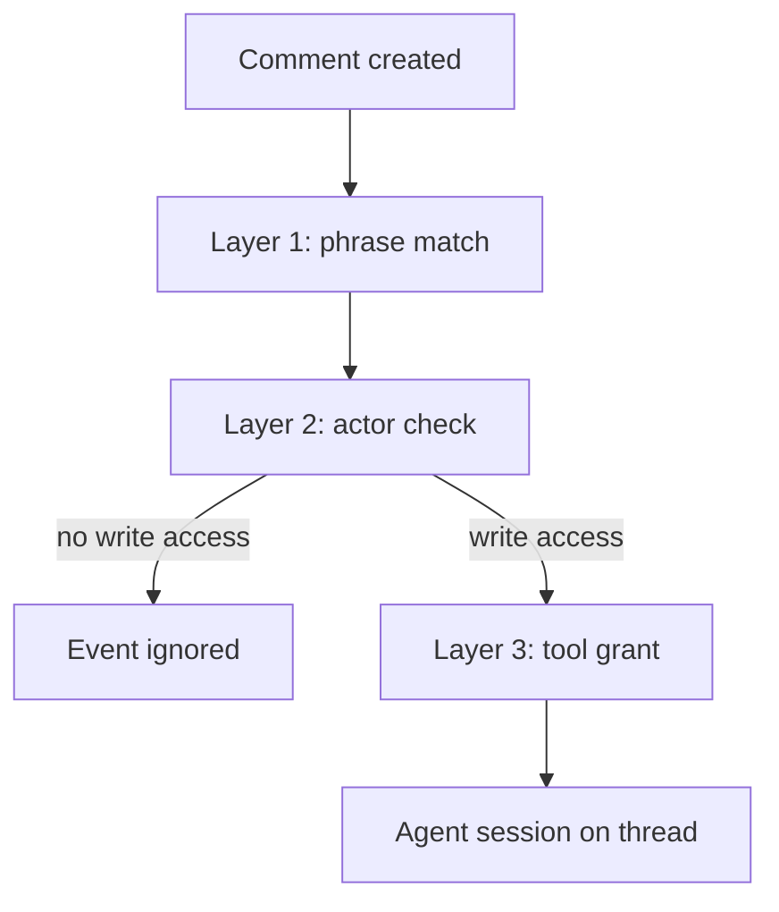

# Comment-Triggered Agent Dispatch on Issues and PRs

> Comment-triggered dispatch starts an agent from a phrase typed in an issue or pull request thread, gated only by repository write access.

Comment-triggered dispatch turns the comment box into a dispatch surface. You configure an automation with a text phrase, and any matching comment on an issue or pull request starts an agent session on that thread. GitHub shipped this for Copilot cloud agent automations on 3 August 2026: "You can now create Copilot cloud agent automations that run when an issue comment or pull request comment is created," configured by specifying "the comment text that should trigger it" ([GitHub Changelog](https://github.blog/changelog/2026-08-03-trigger-copilot-automations-with-comments)).

## Why comment triggers need their own policy

The automation triggers that predate this one are each anchored to something costly. A schedule runs on a fixed cadence the creator sets. An issue is created once, a pull request is opened once, and the synchronize trigger waits for someone to push commits ([About Copilot automations](https://docs.github.com/en/copilot/concepts/agents/cloud-agent/about-automations)). A comment is anchored to nothing: it costs a sentence, carries arbitrary text, and can be typed again on the same thread as often as anyone with write access likes.

Two more properties follow from that. The trigger phrase is plaintext on a thread anyone with read access can see, so the capability advertises itself. The automation behind it does not: "An automation is private to the user who created it. Other people, including repository administrators, can't see your automations," while every run bills GitHub Actions minutes and AI credits to that creator ([About Copilot automations](https://docs.github.com/en/copilot/concepts/agents/cloud-agent/about-automations)). A repository can therefore hold live comment triggers that no administrator can enumerate and no commenter pays for.

The comment field is also a demonstrated injection surface. In April 2026 researchers showed three agents that read GitHub events being hijacked by payloads in pull request titles, issue bodies and comments, exfiltrating credentials back through GitHub's own comment channel. The Copilot variant used a payload hidden in an HTML comment block and "relied on the agent's automated event firing" rather than invoking the agent directly ([Comment and Control, CSA Labs](https://labs.cloudsecurityalliance.org/research/csa-research-note-comment-control-github-prompt-injection-20/)).

## Preconditions

Adopt the surface only when all four hold.

| Condition | Why it is load-bearing |
|-----------|------------------------|
| Private or internal repository | Automations "are not available in public repositories" ([docs](https://docs.github.com/en/copilot/concepts/agents/cloud-agent/about-automations)), so the surface is unavailable where untrusted comment intake is heaviest |
| A narrow tool grant per automation | "Selecting tools is the main way you control the scope of an automation. Grant only the tools that the task needs" ([docs](https://docs.github.com/en/copilot/concepts/agents/cloud-agent/about-automations)) |
| A stated rule for machine-authored comments | Bots and integrations holding write access clear the only intake gate (see [Human-authored versus machine-authored triggers](#human-authored-versus-machine-authored-triggers)) |
| A trigger phrase that cannot occur in review prose | The documented configuration is a comment-text match, so a phrase resembling ordinary review language fires on threads that merely discuss the automation |

## Three implementation layers

### Layer 1: Phrase match

The configured comment text decides which comments are candidates. This layer is deterministic and runs before any model does, so a comment that fails the match never reaches a reasoning surface. It carries no authority on its own, because the phrase is visible to every reader of the thread.

### Layer 2: Actor authorization

The intake gate is a single binary check on repository role. "To reduce the risk of prompt injection, automations ignore events triggered by users who don't have write access to the repository by default," with an opt-in setting to accept the rest ([About Copilot automations](https://docs.github.com/en/copilot/concepts/agents/cloud-agent/about-automations)). For the cloud agent generally the exclusion is absolute rather than filtered: "Comments from users without write access are never presented to the agent" ([Risks and mitigations](https://docs.github.com/en/copilot/concepts/agents/cloud-agent/risks-and-mitigations)).

### Layer 3: Tool grant

What the session may do is set at creation, independently of the trigger, and an automation "can only take action in the single repository it is scoped to" ([About Copilot automations](https://docs.github.com/en/copilot/concepts/agents/cloud-agent/about-automations)). This is the layer that bounds damage. Two platform behaviors reinforce it on the output side. Pull requests are attributed to the automation's creator, who "can't approve those pull requests, which preserves the expected review controls," and Actions workflows do not run on an agent-opened pull request until a user with write access approves them ([About Copilot automations](https://docs.github.com/en/copilot/concepts/agents/cloud-agent/about-automations)).

## What belongs behind a comment trigger

Three properties decide it. The task is bounded, so a mistaken trigger costs a fixed amount of work. Its output is reversible, landing somewhere a reader discards cheaply. Verifying the result takes seconds rather than a review session.

| Task | Behind a comment trigger | Reason |
|------|--------------------------|--------|
| Regenerate documentation from the diff | Yes | Output is a draft change on a branch already under review |
| Investigate a stack trace and report findings | Yes | Produces a comment, changes nothing |
| Open a follow-up issue for refactoring work | Yes | A wrong issue is closed in one click |
| Push a fix to the pull request branch | Deliberate surface | Verification is a code review, not a glance |
| Change dependencies, CI configuration, or access | Deliberate surface | Neither bounded nor cheap to verify |

The three use cases GitHub names for the feature sit in the first group: generating documentation, investigating errors, and creating follow-up tasks ([GitHub Changelog](https://github.blog/changelog/2026-08-03-trigger-copilot-automations-with-comments)).

For anything in the second group, keep the dispatch on a surface that records an explicit decision, such as assignment on an issue or a mention a reviewer must type against a named artifact. [Issue-Tracker as Agent Dispatch Surface](issue-tracker-agent-dispatch-surface.md) covers the assignment-versus-mention convention that distinction rests on.

## Human-authored versus machine-authored triggers

The write-access gate reads repository role, not agency. A bot, a CI integration, or another automation holding write access passes it. GitHub documents the resulting chain and scopes the mitigation narrowly: "An issue or pull request opened by an automation could trigger another automation," mitigated by the rule that Actions workflows wait for human approval ([Risks and mitigations](https://docs.github.com/en/copilot/concepts/agents/cloud-agent/risks-and-mitigations)). That rule bounds workflow runs. GitHub's automations documentation records no suppression for a second automation firing on a comment the first one wrote.

GitHub Actions solves the same problem structurally in the adjacent system, by keying on the identity of the actor: "events triggered by the `GITHUB_TOKEN` will not create a new workflow run," which "prevents you from accidentally creating recursive workflow runs," with `pull_request` opened, synchronize and reopened carved out into an approval-required state ([Triggering a workflow](https://docs.github.com/en/actions/how-tos/write-workflows/choose-when-workflows-run/trigger-a-workflow)).

Until automations publish an equivalent, the durable controls are the write-access gate and the tool grant. An instruction in the automation prompt to ignore bot-authored comments is a convenience rather than a boundary, for the reason set out in [Prompt as Security Knob](../patterns/anti-patterns/prompt-as-security-knob.md). Where the distinction has to hold, express it in the tool grant instead. An automation that cannot push or open pull requests cannot start a chain worth suppressing.

## Why it works

The comment trigger works because the dispatch decision and the dispatch action occupy one artifact. A reviewer forms the judgment while reading a thread, and the comment is the artifact they were going to write anyway, so nothing stands between deciding and delegating. The gating that makes this tolerable is non-inferential and runs ahead of the model, since a phrase match plus a role check on the event actor keeps untrusted comments off the reasoning surface entirely ([Risks and mitigations](https://docs.github.com/en/copilot/concepts/agents/cloud-agent/risks-and-mitigations)).

The ergonomics are not novel to Copilot. Prow provides GitHub automation as "chat-ops via `/foo` style commands" across the Kubernetes organization ([Prow overview](https://docs.prow.k8s.io/docs/overview/)). It also carries a finer authorization model than a single repository role, described in the example below.

## When this backfires

- Public repositories. The surface does not exist there, so a review process built around it cannot move to an open-source repo ([About Copilot automations](https://docs.github.com/en/copilot/concepts/agents/cloud-agent/about-automations)).
- A broad tool grant behind a repeatable phrase. Push or pull-request tools turn a visible string into a capability any write-access holder can invoke repeatedly, billed to a creator who may not be watching ([About Copilot automations](https://docs.github.com/en/copilot/concepts/agents/cloud-agent/about-automations)).
- Automation-authored comments. A second automation matching text the first one wrote has no documented suppression ([Risks and mitigations](https://docs.github.com/en/copilot/concepts/agents/cloud-agent/risks-and-mitigations)).
- Trigger phrases drawn from natural review language. A comment explaining why not to run the automation can fire it.
- Compliance obligations to enumerate automated actors. Administrators cannot see automations they did not create ([About Copilot automations](https://docs.github.com/en/copilot/concepts/agents/cloud-agent/about-automations)).
- Treating hidden-character filtering as injection defense. GitHub strips one payload shape, where "text entered as an HTML comment in an issue or pull request comment is not passed to Copilot cloud agent" ([Risks and mitigations](https://docs.github.com/en/copilot/concepts/agents/cloud-agent/risks-and-mitigations)), and the demonstrated attacks used that shape among others ([CSA Labs](https://labs.cloudsecurityalliance.org/research/csa-research-note-comment-control-github-prompt-injection-20/)).

## Example

Kubernetes runs comment dispatch through Prow, and its authorization is per command rather than per repository role. Any collaborator may type `/lgtm`, the reviewer signal that leaves a pull request one step from merge. The merge itself is gated by the `approved` label, and `/approve` requires "an approver from the OWNERs files" for every file the pull request modifies, with approval inheriting down subdirectories ([Reviewers and approvers](https://docs.prow.k8s.io/docs/components/plugins/approve/approvers/)).

The authorization source is a versioned file in the repository, chosen over the platform's own grouping primitive for a stated reason. GitHub Team names are not supported "because there is no audit log for changes to the GitHub Teams. This way we have an audit log" ([Reviewers and approvers](https://docs.prow.k8s.io/docs/components/plugins/approve/approvers/)).

Copilot automations offer neither half today. Authorization is one binary for every trigger in the repository, and the list of live triggers is private to whoever created each one. A team that wants per-command authorization over an auditable list has to build it outside the feature. Weigh that cost before moving consequential work onto the surface.

## Key Takeaways

- Sort candidate work by three properties before wiring a trigger: bounded cost, reversible output, and verification that takes seconds.
- Treat the trigger phrase as public and the automation as private, because that is what the platform guarantees.
- Set the tool grant as though the phrase were already known to everyone with write access, since it is.
- Assume every account holding write access can fire the trigger, bots and integrations included, because the intake gate reads role rather than agency.
- Reach for a comment trigger to remove friction from cheap work, not to replace an explicit assignment on expensive work.

## Related

- [Issue-Tracker as Agent Dispatch Surface](issue-tracker-agent-dispatch-surface.md) — the assignment-versus-mention convention and ticket discipline that tracker dispatch depends on
- [Trigger-Level Gating for Autonomous Agent Intake](../patterns/agent-design/trigger-level-agent-intake-gating.md) — the trigger, tool, and approval gates for issue automations, and which of them carry authority
- [Chat-Platform Agent Delegation](chat-platform-agent-delegation.md) — the same locality argument on a Slack or Teams thread, with a different trust boundary
- [Cursor Automations: Event-Triggered Agents and /automate](cursor-automate-event-triggered-automations.md) — an adjacent vendor's event-trigger surface and how it bounds the trifecta per trigger
- [Prompt as Security Knob](../patterns/anti-patterns/prompt-as-security-knob.md) — why an instruction in the prompt is not a boundary
