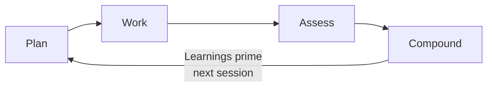
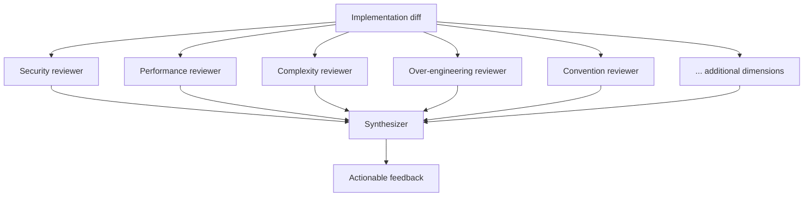
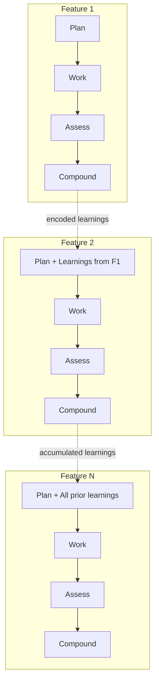

# Compound Engineering: Learning Loops That Make Each Feature Easier

> A four-step workflow -- Plan, Work, Assess, Compound -- where each feature built with agents feeds learnings back into the system as prompts, making subsequent features easier and higher quality.

## The Core Idea

Most agent workflows treat each task as independent. You prompt, the agent builds, you review, you ship. The next task starts from scratch with no memory of what went wrong or what worked.

Compound engineering breaks this by adding a deliberate **Compound** step after every feature cycle. Bugs, performance issues, novel approaches, and architectural decisions are captured as prompts that automatically prime future agent sessions. Over time, the system accumulates institutional knowledge -- the equivalent of a senior engineer's experience encoded in the repository itself.

## The Cycle



| Phase | Effort | Activity |
|-------|--------|----------|
| **Plan** | ~40% | Research, architecture, success criteria, written spec |
| **Work** | ~20% | Agent implements against the plan |
| **Assess** | ~30% | Parallel multi-dimension code review |
| **Compound** | ~10% | Extract learnings, encode as prompts in the repo |

The effort distribution is deliberately inverted from traditional development. Roughly 80% goes to planning and review; 20% to execution and compounding ([Shipper & Klaassen, Every, 2025](https://every.to/chain-of-thought/compound-engineering-how-every-codes-with-agents)). This aligns with broader findings that most agentic coding failures trace to insufficient problem definition, not implementation quality ([Osmani](https://addyo.substack.com/p/the-80-problem-in-agentic-coding)).

## Phase Details

### Plan

Planning is the highest-leverage phase. Before agents write any code:

1. **Research** the problem space -- existing code, dependencies, edge cases
2. **Define architecture** -- which files change, what patterns to follow, integration points
3. **Set success criteria** -- concrete, testable conditions the implementation must satisfy
4. **Write a spec** -- a document the agent reads at session start

This is the [plan-first loop](plan-first-loop.md) applied as organizational discipline, not just a per-task technique. The spec becomes the agent's primary context, replacing vague task descriptions with precise implementation guidance.

### Work

The agent implements against the plan. Two mechanisms improve reliability during this phase:

- **MCP-driven verification**: agents interact with running applications (via Playwright, build tools, etc.) to test functionality during implementation, not just after
- **Plan-as-constraint**: the written spec bounds what the agent should build, reducing scope drift and speculative additions

The Work phase is deliberately short. If planning was thorough, implementation is execution of a known approach rather than exploratory coding.

### Assess

Review uses parallel subagents examining the code across multiple dimensions simultaneously:



This is the [committee review pattern](../code-review/committee-review-pattern.md) applied to every feature. Each reviewer focuses on a single dimension, preventing the attention dilution that occurs when one reviewer checks everything. The synthesizer consolidates findings into actionable feedback, filtering noise from signal.

### Compound

The step most teams skip. After assessment is complete:

1. **Identify learnings** -- bugs found, performance pitfalls, patterns that worked well, architectural decisions
2. **Encode as prompts** -- write learnings into files that live in the repository (instruction files, skill files, or dedicated learnings directories)
3. **Verify priming** -- confirm new sessions pick up the encoded learnings automatically

What makes this different from simply updating documentation: the learnings are structured as **prompts that prime agent behavior**, not prose for humans to read. They live in the repo alongside the code, version-controlled and automatically loaded by agent sessions.

## Why It Compounds

Traditional engineering assumes complexity grows monotonically -- each feature makes the next harder. Compound engineering inverts this assumption: if institutional knowledge grows faster than complexity, each feature becomes easier.



The mechanism: every bug caught in Assess that gets encoded in Compound is a bug that cannot recur. Every architectural decision recorded means the next agent session does not need to rediscover it. New team members -- and new agent sessions -- inherit the equivalent of senior engineer knowledge from their first interaction.

This is the same principle described in [agent memory patterns](../agent-design/agent-memory-patterns.md) (persistence across sessions) and the [implicit knowledge problem](../anti-patterns/implicit-knowledge-problem.md) (making tacit knowledge explicit), but applied as a **systematic workflow** rather than an ad-hoc practice.

## Learnings as Prompts

The Compound step produces artifacts that look like this:

```markdown
# Learning: Database Migration Ordering

## Context
Feature #47 failed CI because migration files were created
out of dependency order.

## Rule
When generating migrations that reference other tables,
check existing migration timestamps and ensure foreign key
dependencies are created in earlier-timestamped files.

## Example
migration_001_create_users.sql  -- must exist before
migration_002_create_orders.sql -- references users.id
```

These are not documentation. They are agent instructions stored as repository artifacts, loaded into context at session start. The format follows the [skill authoring patterns](../tool-engineering/skill-authoring-patterns.md) approach: context, rule, example.

## Implementation

The compound engineering workflow is available as an open-source plugin: [EveryInc/compound-engineering-plugin](https://github.com/EveryInc/compound-engineering-plugin). It provides slash commands (`/ce:plan`, `/ce:work`, `/ce:review`, `/ce:compound`) that orchestrate the cycle within Claude Code and other tools.

You do not need the plugin to practice compound engineering. The workflow is tool-agnostic -- any team can implement Plan-Work-Assess-Compound using their existing agent setup, instruction files, and review process.

## Relationship to Existing Patterns

Compound engineering is a **workflow that orchestrates** patterns already documented on this site:

| Phase | Orchestrated pattern |
|-------|---------------------|
| Plan | [Plan-first loop](plan-first-loop.md), [rigor relocation](../human/rigor-relocation.md) |
| Work | [Agent harness](../agent-design/agent-harness.md), MCP-driven tool use |
| Assess | [Committee review](../code-review/committee-review-pattern.md), [agent self-review loop](../agent-design/agent-self-review-loop.md) |
| Compound | [Agent memory patterns](../agent-design/agent-memory-patterns.md), [implicit knowledge capture](../anti-patterns/implicit-knowledge-problem.md) |

The value is not in any individual pattern but in the **closed loop** that connects them. Without the Compound step, learnings from Assess evaporate between sessions. Without structured Plan, agents build against incomplete context. The closed loop is what converts isolated patterns into cumulative improvement.

## Key Takeaways

- Invert the effort ratio: spend ~80% on planning and review, ~20% on execution and compounding
- The Compound step -- encoding learnings as prompts in the repo -- is what separates this from a standard plan-build-review workflow
- Learnings live as version-controlled agent instructions, not human documentation
- Each encoded learning prevents an entire class of future errors, making the next feature genuinely easier
- The workflow orchestrates existing patterns (committee review, agent memory, plan-first loop) into a self-reinforcing cycle

## Unverified Claims

- Single developers using compound engineering "can do the work of five developers a few years ago" -- sourced only from the Every team self-report, no independent verification [unverified]
- The parallel review uses 12 dimensions -- the article names some but the full list is not documented in the plugin README [unverified]
- Whether learnings-as-prompts produces measurable improvement over standard project memory files -- no comparative data found [unverified]

## Related

- [Plan-First Loop](plan-first-loop.md)
- [Committee Review Pattern](../code-review/committee-review-pattern.md)
- [Agent Memory Patterns](../agent-design/agent-memory-patterns.md)
- [Implicit Knowledge Problem](../anti-patterns/implicit-knowledge-problem.md)
- [Agent Self-Review Loop](../agent-design/agent-self-review-loop.md)
- [Agentic Flywheel](../agent-design/agentic-flywheel.md)
- [Continuous Agent Improvement](continuous-agent-improvement.md)
- [Process Amplification](../human/process-amplification.md)
- [Rigor Relocation](../human/rigor-relocation.md)
- [Skill Authoring Patterns](../tool-engineering/skill-authoring-patterns.md)
- [Agent-Driven Greenfield](agent-driven-greenfield.md)
- [AI Development Maturity Model](ai-development-maturity-model.md)
- [Architectural Foundation First](architectural-foundation-first.md)
- [Central Repo & Shared Agent Standards](central-repo-shared-agent-standards.md)
