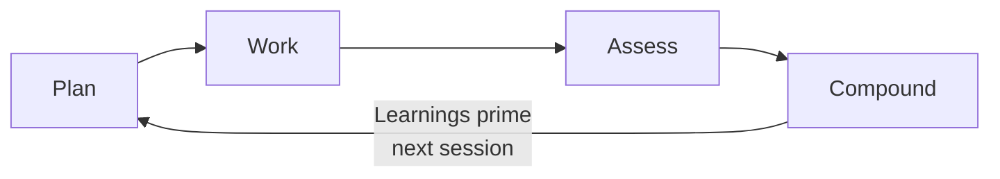
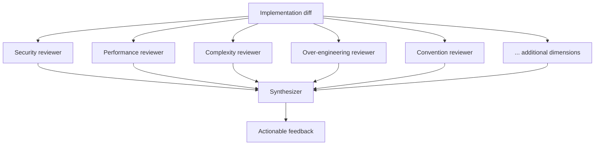
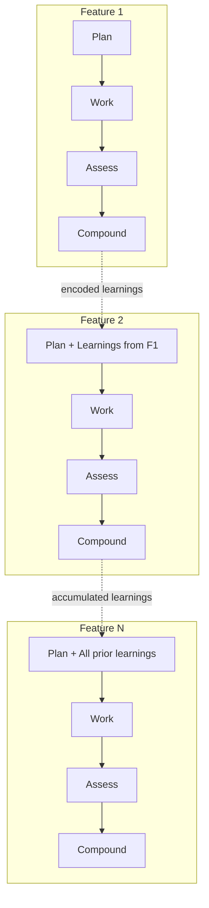

# Compound Engineering: Learning Loops That Make Each Feature Easier

> A four-step loop -- Plan, Work, Assess, Compound -- where each feature feeds learnings back as prompts, making subsequent features easier.

## The core idea

Most agent workflows treat each task as independent. You prompt, the agent builds, you review, you ship. The next task starts from scratch with no [memory](../agent-design/agent-memory-patterns.md) of what went wrong or what worked.

Compound engineering breaks this. It adds a deliberate Compound step after every feature cycle. You capture bugs, performance issues, novel approaches, and architectural decisions as prompts that prime future agent sessions. Over time, the system builds up institutional knowledge, the equivalent of a senior engineer's experience encoded in the repository itself.

## The cycle


```mermaid
graph LR
    P[Plan] --> W[Work]
    W --> A[Assess]
    A --> C[Compound]
    C -->|Learnings prime<br/>next session| P
```

| Phase | Effort | Activity |
|-------|--------|----------|
| Plan | ~40% | Research, architecture, success criteria, written spec |
| Work | ~20% | Agent implements against the plan |
| Assess | ~30% | Parallel multi-dimension code review |
| Compound | ~10% | Extract learnings, encode as prompts in the repo |

The effort split is deliberately inverted from traditional development. Roughly 80% goes to planning and review; 20% to execution and compounding ([Shipper & Klaassen, Every, 2025](https://every.to/chain-of-thought/compound-engineering-how-every-codes-with-agents)). This matches broader findings that most agentic coding failures trace to weak problem definition, not implementation quality ([Osmani](https://addyo.substack.com/p/the-80-problem-in-agentic-coding)).

## Phase details

### Plan

Planning is the phase that pays off most. Before agents write any code, do four things:

1. Research the problem space: existing code, dependencies, and edge cases.
2. Define the architecture: which files change, what patterns to follow, and where the integration points sit.
3. Set success criteria: concrete, testable conditions the implementation must satisfy.
4. Write a spec: a document the agent reads at session start.

This is the [plan-first loop](plan-first-loop.md) applied as team discipline, not just a per-task technique. The spec becomes the agent's primary context. It replaces vague task descriptions with precise implementation guidance.

### Work

The agent implements against the plan. Two mechanisms improve reliability during this phase:

- MCP-driven verification: the agent works with running applications, through Playwright or build tools, to test functionality during implementation, not just after
- plan-as-constraint: the written spec bounds what the agent should build, which reduces scope drift and speculative additions

The Work phase is deliberately short. If the planning was thorough, the agent executes a known approach rather than exploring.

### Assess

Review uses parallel subagents examining the code across multiple dimensions simultaneously:


```mermaid
graph TD
    D[Implementation diff] --> R1[Security reviewer]
    D --> R2[Performance reviewer]
    D --> R3[Complexity reviewer]
    D --> R4[Over-engineering reviewer]
    D --> R5[Convention reviewer]
    D --> RN[... additional dimensions]
    R1 --> S[Synthesizer]
    R2 --> S
    R3 --> S
    R4 --> S
    R5 --> S
    RN --> S
    S --> F[Actionable feedback]
```

This is the [committee review pattern](../code-review/committee-review-pattern.md) applied to every feature. Each reviewer focuses on a single dimension. That prevents the attention dilution that happens when one reviewer checks everything. The synthesizer pulls the findings into actionable feedback and filters noise from signal.

### Compound

This is the step most teams skip. After the assessment is complete, do three things:

1. Identify the learnings: bugs found, performance pitfalls, patterns that worked well, and architectural decisions.
2. Encode them as prompts: write the learnings into files that live in the repository, such as instruction files, skill files, or dedicated learnings directories.
3. Verify the priming: confirm new sessions pick up the encoded learnings automatically.

This differs from simply updating documentation. The learnings are written as prompts that prime agent behavior, not as prose for humans to read. They live in the repo alongside the code, version-controlled and loaded automatically by agent sessions.

## Why it compounds

Traditional engineering assumes complexity only grows: each feature makes the next harder. Compound engineering inverts that assumption. If institutional knowledge grows faster than complexity, each feature becomes easier.


```mermaid
graph TD
    subgraph "Feature 1"
        F1[Plan] --> F1W[Work] --> F1A[Assess] --> F1C[Compound]
    end
    subgraph "Feature 2"
        F2[Plan + Learnings from F1] --> F2W[Work] --> F2A[Assess] --> F2C[Compound]
    end
    subgraph "Feature N"
        FN[Plan + All prior learnings] --> FNW[Work] --> FNA[Assess] --> FNC[Compound]
    end
    F1C -.->|encoded learnings| F2
    F2C -.->|accumulated learnings| FN
```

Here is the mechanism. Every bug caught in Assess and then encoded in Compound makes [tacit knowledge explicit](../anti-patterns/implicit-knowledge-problem.md), so it cannot recur. Every architectural decision you record means the next agent session does not have to rediscover it. New team members, and new agent sessions, inherit the equivalent of senior engineer knowledge from their first interaction.

This is the same principle described in [agent memory patterns](../agent-design/agent-memory-patterns.md) (persistence across sessions), the [implicit knowledge problem](../anti-patterns/implicit-knowledge-problem.md) (making tacit knowledge explicit), and [encoding tacit knowledge into agent improvement loops](encoding-tacit-knowledge.md) (active elicitation and encoding). The difference is that compound engineering applies it as a systematic workflow rather than an ad-hoc practice.

## Learnings as prompts

The Compound step produces artifacts that look like this:

```markdown
# Learning: Database Migration Ordering

## Context
Feature #47 failed CI because migration files were created
out of dependency order.

## Rule
When generating migrations that reference other tables,
check existing migration timestamps and ensure foreign key
dependencies are created in earlier-timestamped files.

## Example
migration_001_create_users.sql  -- must exist before
migration_002_create_orders.sql -- references users.id
```

These are not documentation. They are agent instructions stored as repository artifacts and loaded into context at session start. The format follows the [skill authoring patterns](../tool-engineering/skill-authoring-patterns.md) approach: context, rule, example.

## Implementation

The compound engineering workflow comes as an open-source plugin: [EveryInc/compound-engineering-plugin](https://github.com/EveryInc/compound-engineering-plugin). It provides slash commands (`/ce-plan`, `/ce-work`, `/ce-code-review`, `/ce-compound`, and more) that run the cycle within Claude Code, Cursor, Copilot, and other tools.

You do not need the plugin to practice compound engineering. The workflow is tool-agnostic. Any team can run Plan-Work-Assess-Compound with their existing agent setup, instruction files, and review process.

## Relationship to existing patterns

Compound engineering is a workflow that orchestrates patterns already documented on this site:

| Phase | Orchestrated pattern |
|-------|---------------------|
| Plan | [Plan-first loop](plan-first-loop.md), [rigor relocation](../human/rigor-relocation.md) |
| Work | [Agent harness](../agent-design/agent-harness.md), MCP-driven tool use |
| Assess | [Committee review](../code-review/committee-review-pattern.md), [agent self-review loop](../code-review/agent-self-review-loop.md) |
| Compound | [Agent memory patterns](../agent-design/agent-memory-patterns.md), [implicit knowledge capture](../anti-patterns/implicit-knowledge-problem.md) |

The value is not in any individual pattern. It is in the closed loop that connects them. Without the Compound step, learnings from Assess evaporate between sessions. Without a structured Plan, agents build against incomplete context. The closed loop is what turns isolated patterns into cumulative improvement.

## Key Takeaways

- Invert the effort ratio: spend ~80% on planning and review, ~20% on execution and compounding
- The Compound step -- encoding learnings as prompts in the repo -- is what separates this from a standard plan-build-review workflow
- Learnings live as version-controlled agent instructions, not human documentation
- Each encoded learning prevents an entire class of future errors, making the next feature genuinely easier
- The workflow orchestrates existing patterns (committee review, agent memory, plan-first loop) into a self-reinforcing cycle

## When this backfires

Compound engineering needs sustained discipline across all four phases. Several conditions reduce its value or make it counterproductive:

- Deadline pressure collapses the Compound step. The 10% effort budget for Compound is the first cut when teams are under pressure. Without steady compounding, the workflow degrades to a standard plan-build-review cycle with no cumulative benefit.
- Stale or contradictory prompt files. Encoded learnings build up over time, the same staleness [continuous agent improvement](continuous-agent-improvement.md) prunes for. If the codebase evolves but the prompt files are not pruned, agents get conflicting instructions: older rules that no longer apply alongside current ones. The cost of maintaining a learnings library grows with the project's age.
- Front-loading the planning only pays off when the problem is well-defined. The ~40% planning budget assumes research can yield a precise spec. For genuinely exploratory work, such as novel integrations or prototyping in unknown domains, a fixed upfront plan can push agents toward premature decisions and prevent useful divergence.

## Related

- [Plan-First Loop](plan-first-loop.md)
- [Committee Review Pattern](../code-review/committee-review-pattern.md)
- [Agent Memory Patterns](../agent-design/agent-memory-patterns.md)
- [Implicit Knowledge Problem](../anti-patterns/implicit-knowledge-problem.md)
- [Agent Self-Review Loop](../code-review/agent-self-review-loop.md)
- [Agentic Flywheel](../agent-design/agentic-flywheel.md)
- [Continuous Agent Improvement](continuous-agent-improvement.md)
- [Encoding Tacit Knowledge](encoding-tacit-knowledge.md)
