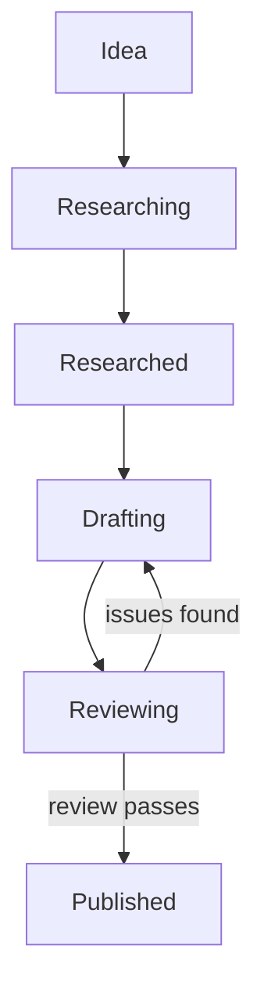

# Content Pipeline: From Idea to Published Documentation

> A label-based issue pipeline that routes content through agent-handled stages — research, draft, review — with two independent reviewers and human approval at merge.

!!! info "Also known as"
    Content Pipeline, Idea-to-Research Pipeline, Idea Capture and Research Stages

A structured content pipeline drives all content through tracked issues with label-based stages. Agents do the drafting and reviewing; humans set direction and approve merges.

## Pipeline Stages



Each stage corresponds to a label on the issue. Transitioning a label moves the issue through the pipeline. A fix track is a parallel path for corrections to existing pages — it skips research and goes straight to implementation.

## Stage 1: Idea Capture

An idea capture step is the entry point for every new content item.

The intake workflow:

1. Searches existing docs and open or closed issues for duplicates
2. If no duplicate: infers structure from the topic phrase:

   | Field | What to infer |
   |-------|---------------|
   | Concept | 1–2 sentence description |
   | Context | Why it matters for the target audience |
   | Key Points | 3–5 bullets the content should cover |
   | Category | `pattern`, `technique`, `workflow`, `anti-pattern` |
   | Scope | `tool-agnostic` or tool-specific |
   | Topic labels | One or more from the taxonomy |
   | References | Known links from the curated sources list |

3. Presents the draft for confirmation before creating anything
4. Creates the issue with stage, category, and topic labels

**Quality gate**: Duplicate check. If a matching page or issue exists, the human decides whether to proceed or close as a duplicate.

**Issue body format** — four sections are required. A thin body with vague key points produces thin research output and a weak draft:
```
## Concept
## Context
## References
## Key Points
```

## Stage 2: Research (Optional)

For ideas that need source verification before drafting, a research agent:

1. Reads the issue — concept, context, key points
2. Consults the curated sources list for supporting evidence, real-world examples, and contradicting views
3. Attaches findings as a structured comment on the issue:

   ```
   ## Research Notes

   ### Key Findings
   - <finding with source link>

   ### Source Material
   - `<url>` — <one-line summary>

   ### Content Angle
   <what makes this unique — the hook for the draft>
   ```

4. Transitions the issue to `researched`

A work item ready for drafting has sourced key findings (every claim linked to a primary source; unsourceable claims are rewritten or dropped rather than hedged), a clear content angle (not just a fact summary), no draft content in the research notes, and contradicting views noted where they exist.

Skip this stage for ideas where key points are already well-sourced, or when the author has done the research manually. Apply the `researched` tag directly and append a comment with source material in the standard format so the draft agent has the same structured input.

## Stage 3: Implementation

An implementation step presents open issues grouped by stage. Selecting an issue or batch:

1. **Branch**: use a consistent naming convention, e.g. `content/<number>-<slug>` for new content and `fix/<number>-<slug>` for fixes
2. **Path mapping**: the category determines the output directory

   | Category | Path |
   |----------|------|
   | Pattern | `docs/patterns/architecture/` |
   | Anti-pattern | `docs/patterns/anti-patterns/` |
   | Technique | `docs/techniques/` |
   | Workflow | `docs/workflows/` |
   | Security | `docs/security/` |
   | Evals | `docs/evals/` |

3. **Draft**: the agent writes the page following your content standards — frontmatter tags, blockquote summary, correct length target, Mermaid diagrams where they add value, sourced claims only
4. **Simplify pass**: a simplification review checks the draft for redundancy and cuts filler before the quality review begins

## Stage 4: Review

Two reviewers run in parallel after every draft. Each returns a structured JSON verdict.

### Reviewer 1 — Content Quality

Checks: conciseness (every sentence earns its place), accuracy (every claim links to a primary source — unsourceable claims are rewritten weaker or removed, never hedged), audience fit (experienced developers, no beginner explanations), actionability (reader can apply it immediately), tone (direct, no hype), diagram correctness.

### Reviewer 2 — Structure and Standards

Checks: file in correct directory, clean markdown, frontmatter with `tags:`, all relative links resolve, style consistent with existing pages, no credentials or sensitive data.

**Verdict handling**:

| Finding type | Action |
|---|---|
| Critical / high — genuine issue | Fix and re-review |
| Medium / low — valid but minor | Note in PR body |
| False positive or pre-existing | Dismiss silently |

Maximum **2 review rounds**. If critical issues persist after round 2, the orchestrator surfaces them to the human rather than looping.

## Stage 5: PR and Merge

After review passes:

```
git commit -m "docs(<category>): <description>\n\nCloses #<number>"
git push -u origin <branch>
gh pr create --title "..." --body "..."
```

The PR body includes: summary bullets, reviewer verdicts and round count, any noted non-blocking findings.

Merging the PR auto-closes the issue via `Closes #<number>` in the commit. The issue moves to a closed state on merge.

## Fix Track

Fix-track issues skip research. The agent reads the issue, reads the affected file, applies the fix, and goes straight to review. Fix issues are often created in batch by an automated documentation linting step.

## Batch Mode

When processing multiple issues at once, each issue gets its own branch and PR processed sequentially. After each PR, the branch switches back to the main branch before the next issue starts.

## Quality Enforcement

Beyond the review agents, automated hooks enforce baseline quality on every write:

| Hook | Trigger | Blocks |
|---|---|---|
| Diagram syntax check | File write | Malformed node labels in diagrams |
| Footer guard | Issue and PR creation | Auto-generated footers that identify the agent |

A documentation linting step runs parallel scanners (formatting, references, structure) against the full docs tree and creates issues for any findings.

## Implementing This Pipeline

The core components you need in any implementation:

1. **An intake agent** — collects a topic phrase, runs a duplicate check, infers structure, and creates a work item with structured metadata
2. **A source list** — a curated set of authoritative sources the research agent prioritizes (documentation sites, GitHub repos, reference papers)
3. **A research agent** — reads the work item, searches the source list, appends findings in the standard format, and advances the work item's tag
4. **An implementation agent** — selects from the `researched` queue, drafts the page, runs simplification and review passes, and creates a PR
5. **Tag-based routing** — the stage transitions (`idea` → `researched` → `drafting` → `reviewing`) are the only coordination signals between steps

The specific implementation (slash commands, GitHub issues, a task database) is secondary. The pattern holds across tools.

## Why It Works

Three mechanisms do the heavy lifting:

- **Labels as the state machine**: stage is persisted on the issue itself, so any agent or human can pick up work without a separate coordination doc. No handoff notes to go stale; no central scheduler to fail.
- **Independent reviewers catch independent failure modes**: the content-quality reviewer and the structure-and-standards reviewer fire on different signals (claim density, tone, filler vs. file layout, frontmatter, link resolution). Running them in parallel means one blind spot does not compound the other.
- **Structured issue bodies constrain agent input**: requiring Concept / Context / References / Key Points in the intake step forces the human to pre-commit to scope. Agents generate thinner, more focused drafts when the prompt is already narrowed, because the research step has fewer degrees of freedom.

## When This Backfires

The pipeline adds coordination overhead that only pays off when review is the bottleneck — not writing. Three conditions where it underperforms:

- **Small teams or solo projects**: multi-stage label transitions and parallel reviewer runs add ceremony that exceeds the benefit for a one- or two-person team. An ad-hoc PR review with a single reviewer is faster and adequate when output volume is low.
- **Reviewer fatigue at volume**: if agent output volume is high and the two-reviewer round runs on every draft, human merge approvals become rubber stamps. Quality enforcement degrades to theater when reviewers process more issues than they can meaningfully assess per session.
- **Thin or vague issue bodies**: the research and draft stages depend on a well-formed issue with specific key points. A poorly written idea item produces poor research output and a poor draft; the pipeline amplifies input quality in both directions.

## Example

**Topic**: "Prompt injection mitigation techniques"

1. **Idea capture** — the intake agent searches existing docs, finds no duplicate, and creates issue #142 with labels `idea`, `technique`, `security`. The body includes a concept description, context (why prompt injection matters for production agents), five key points, and two reference links.

2. **Research** — a research agent reads issue #142, consults the curated sources list, and appends a structured comment with sourced findings on input validation, sandboxed execution, and output filtering. The issue transitions to `researched`.

3. **Implementation** — an implementation agent picks issue #142 from the `researched` queue, creates branch `content/142-prompt-injection-mitigation`, writes `docs/techniques/prompt-injection-mitigation.md` with frontmatter, a blockquote summary, and sourced body content. A simplification pass trims redundant phrasing.

4. **Review** — two reviewer agents run in parallel. Reviewer 1 flags one claim as unsourced; Reviewer 2 confirms file placement and link validity. The agent researches the claim, finds a primary source, adds an inline citation, and re-reviews. Round 2 passes.

5. **PR and merge** — the agent commits with `docs(technique): prompt injection mitigation\n\nCloses #142`, pushes, and opens a PR. A human merges; issue #142 closes automatically.

## Key Takeaways

- Every content change starts as a tracked issue — no ad-hoc edits to published pages
- Two independent reviewers catch different failure modes; the orchestrator triages findings rather than auto-applying all suggestions
- The fix track (lint findings → batch implement) keeps reference quality high without manual triage
- A well-formed idea item (structured body, specific key points) produces better research output and a better draft

## Related

- [The Plan-First Loop: Design Before Code](plan-first-loop.md)
- [Continuous Agent Improvement](continuous-agent-improvement.md)
- [Content and Skills Audit](content-skills-audit.md)
- [Incremental Verification](../verification/incremental-verification.md)
- [Committee Review Pattern](../code-review/committee-review-pattern.md)
- [Agent-Driven Greenfield](agent-driven-greenfield.md)
- [Human in the Loop](human-in-the-loop.md)
- [Continuous Documentation](continuous-documentation.md)
- [Issue-to-PR Delegation Pipeline](issue-to-pr-delegation-pipeline.md)
- [Shared Link Registry for Docs Sites](link-registry.md) — central registry that keeps external references consistent across pipeline-published pages
- [OG Image Generation](og-image-generation.md) — automated social preview images produced as part of the publish step
