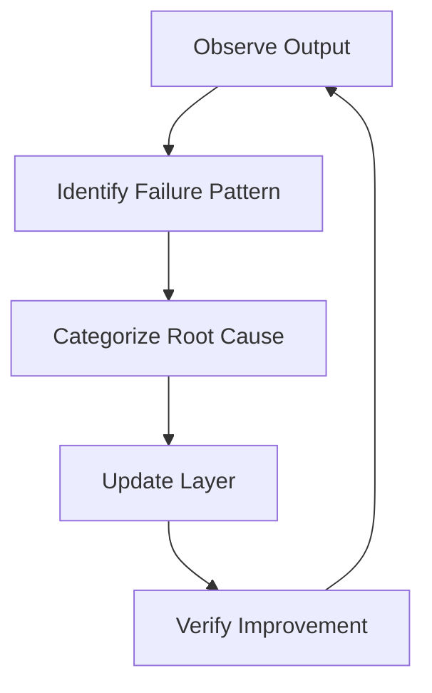

# Continuous Agent Improvement: Iterating on Agent Quality

> An observation-to-update loop for maintaining and improving agent configurations over time.

## Agent Configs Are Not Set-and-Forget

Your initial AGENTS.md and first set of skills will have gaps. The project evolves. Tools update. Conventions shift. An agent that worked well at project start produces progressively worse output if its instructions don't keep pace.

The improvement cycle is:



## The Improvement Loop

### Observe

Review agent output regularly, not just when something breaks. Issues worth tracking:

- Recurring mistakes across multiple sessions (not one-off errors)
- Output that requires consistent manual correction before use
- Tasks the agent routes around by taking a longer path
- Output that was correct six months ago and isn't now

One-off errors are noise. Patterns are signal. Batch observations before acting on them — because a single failure has many plausible causes (ambiguous input, transient context, prompt format), and only recurrence across varied sessions isolates the true root cause from coincidence.

### Categorize

Map each recurring failure to the layer responsible:

| Failure Type | Root Cause | Fix Layer |
|---|---|---|
| Agent doesn't know the convention | Knowledge gap | Update or add a skill |
| Agent knows but ignores the rule | Instruction gap or conflict | Update AGENTS.md or resolve conflict |
| Agent produces bad output that passes review | Enforcement gap | Add or tighten a hook |
| Agent scope drift (doing too much or too little) | Agent definition | Narrow or split the agent |
| Same agent, different output across sessions | Instruction inconsistency | Audit for conflicting directives |

Matching failure to layer prevents churn. Updating the instruction file when the problem is a missing hook adds words without changing behavior.

### Update

Make targeted, minimal changes to the specific layer causing the issue. Broad rewrites to instruction files introduce new conflicts and make it harder to attribute future behavior changes to a specific edit.

Apply changes in isolation where possible:

- Add one rule at a time when updating AGENTS.md
- Add one skill before reorganizing the skill hierarchy
- Add one hook before enabling a validation pipeline

Document why each change was made. Agent configuration files benefit from changelogs — the same reasoning that applies to dependency updates applies here. A rule with no documented rationale gets removed incorrectly when someone can't determine whether it's still needed.

### Verify

After updating, re-run the same task that exhibited the failure. Confirm the output improved. If the failure recurs, the root cause categorization was wrong — return to the observe step rather than stacking additional changes.

Keep the verification input fixed. Testing against a different task after a change doesn't confirm the fix — it may just shift the failure to a new instance.

### Progressive Trust

As agents demonstrate reliable output over time, reduce review overhead proportionally — but never eliminate it. No industry-standard thresholds exist for this progression; apply judgment based on task risk. A useful heuristic: start with human review of every output, move to sampling (review every nth output) once error rate drops, and move to hook-only validation only when sampling finds no issues over a sustained period.

Reducing review prematurely reintroduces risk without detection.

## Staleness: The Slow Drift Problem

Skills and instruction files become outdated as tools update, APIs change, and project conventions evolve. An AGENTS.md written for last year's toolchain silently misguides agents without throwing an error.

Signs of staleness:

- Agent references file paths, commands, or conventions that no longer exist
- Agent produces output that matches an old convention, not the current one
- Skills include documentation for deprecated APIs or removed features

Schedule periodic reviews of instruction files and skills — not in response to a specific failure, but as routine maintenance. Treat them as living documents on the same maintenance cadence as your project's README or API docs. Practitioner commentary on the ETH Zurich work reaches the same conclusion from a different angle: stale instructions referencing folders or conventions that no longer exist are [worse than no instructions at all](https://www.infoq.com/news/2026/03/agents-context-file-value-review/), because agents follow them faithfully and confidently do the wrong thing.

## What to Track

Useful signals for spotting improvement opportunities:

- **Error rate** — frequency of agent output requiring correction before use
- **Review rejection rate** — how often agent-generated PRs or tasks are sent back
- **Correction time** — how long it takes to fix agent output to an acceptable state
- **Context usage** — consistently high context usage may indicate instruction files are too verbose or skills are loading unnecessarily

You don't need formal tooling for this. A shared notes file or GitHub issue tracking patterns in agent output is sufficient for most teams.

## Anti-Patterns

**Reactive single-error updates.** Changing the instruction file after every individual error adds noise and makes it hard to identify which changes actually helped. Batch observations across multiple sessions before acting.

**Never updating after initial setup.** Agent configurations that aren't maintained diverge from the project's current state. The gap between "what the agent thinks the project is" and "what the project actually is" grows over time until output quality drops noticeably.

## When This Backfires

The improvement loop degrades under three conditions:

**[Instruction bloat](../anti-patterns/prompt-tinkerer.md).** Each targeted fix adds words. Over dozens of iterations, instruction files become verbose enough to exceed context windows or dilute the signal of any single rule. An [ETH Zurich evaluation of repository-level context files](https://arxiv.org/abs/2602.11988) reported that LLM-generated `AGENTS.md` files reduced task success rates by roughly 3 percent on average and increased inference cost by over 20 percent — a concrete argument for pruning over append-only iteration. The fix is periodic pruning: review the full file and consolidate overlapping rules rather than appending indefinitely.

**Over-fitting to recent sessions.** If observations are drawn from a narrow slice of work — a single sprint, one team member's tasks — the updates optimize for that slice and regress on other task types. Diversify the observation sample before acting.

**Conflicting rule accumulation.** Two separately-correct updates can contradict each other when applied together. Adding "always use concise commit messages" and later "always include the ticket number in commit messages" produces two rules that conflict on short-ticket-number-heavy workflows. Audit for conflicts when adding to an existing instruction set.

## Example

The following illustrates the observe-categorize-update-verify cycle applied to a concrete recurring failure.

**Observation**: Over three sessions, an agent using a Python project's AGENTS.md consistently imports `pytest.raises` directly instead of using the project's custom `assert_raises` wrapper. Manual correction is needed every time.

**Categorization**: The agent knows pytest but doesn't know the local convention — this is a knowledge gap, not an instruction gap. Fix layer: add a skill.

**Update** — add a targeted skill file rather than editing AGENTS.md:

```markdown
<!-- .claude/skills/testing-conventions.md -->
# Testing Conventions

## Exception Assertions

Always use the project wrapper, not pytest directly:

~~~python
# correct
from tests.helpers import assert_raises
with assert_raises(ValueError, match="invalid input"):
    parse_config(bad_input)

# incorrect — do not use directly
import pytest
with pytest.raises(ValueError):
    parse_config(bad_input)
~~~

The wrapper adds structured logging and integrates with the test report pipeline.
Change rationale: added 2026-02-14 — agent consistently used raw pytest.raises across sessions #42, #47, #51.
```

**Verify**: Re-run the same task from session #42 with the skill loaded. Confirm the agent now uses `assert_raises`. If it still uses `pytest.raises`, the root cause was misdiagnosed — return to the observe step rather than adding more instructions on top.

The changelog comment ("added 2026-02-14 — sessions #42, #47, #51") documents why this rule exists. Without it, a future team member cannot determine whether it is still needed when testing conventions change.

## Key Takeaways

- Patterns across sessions are signal; single errors are noise — batch before acting
- Match failures to the layer responsible (skill, instruction, hook, agent definition) before updating anything
- Document the reason for every configuration change — undocumented rules get removed incorrectly
- Schedule proactive staleness reviews rather than waiting for failures to expose outdated instructions

## Related

- [Agent Debugging](../observability/agent-debugging.md)
- [Repository Bootstrap Checklist](repository-bootstrap-checklist.md)
- [Escape Hatches: Unsticking Stuck Agents](escape-hatches.md)
- [Introspective Skill Generation](introspective-skill-generation.md)
- [Failure-Driven Iteration](failure-driven-iteration.md)
- [Skill Library Refinement Loops](skill-library-refinement-loops.md)
- [Scheduled Instruction File Fact-Checker](instruction-file-fact-checker.md)
