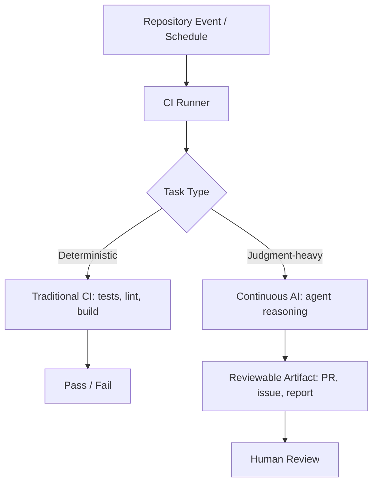

# Continuous AI (Agentic CI/CD)

> An automation paradigm where AI agents run alongside traditional CI/CD pipelines, handling judgment-heavy tasks that deterministic rules cannot express, and producing reviewable artifacts instead of autonomous commits.

## The Gap Between CI and Judgment

Traditional CI/CD handles binary outcomes: tests pass or fail, builds succeed or break, linters flag or approve. These deterministic checks work when correctness can be reduced to rules. But many repository tasks require interpretation and intent — detecting mismatches between documentation and implementation, identifying semantic regressions, or evaluating whether a refactor actually simplifies code. Continuous AI fills this gap by applying [natural-language rules and agentic reasoning continuously inside a repository](https://github.blog/ai-and-ml/generative-ai/continuous-ai-in-practice-what-developers-can-automate-today-with-agentic-ci/).

## How It Works

Continuous AI workflows execute coding agents within standard CI infrastructure (e.g., GitHub Actions), triggered by the same mechanisms as traditional pipelines: schedules, repository events, or manual dispatch. The difference is the instruction format. Instead of YAML-encoded rules, you express expectations in plain language: "Check whether documented behavior matches implementation, explain mismatches, and propose fixes." The agent interprets these instructions, reasons about the codebase, and produces [reviewable outputs like pull requests, issues, or reports](https://github.blog/ai-and-ml/automate-repository-tasks-with-github-agentic-workflows/) [unverified].



## Safe Outputs and Human Authority

The critical design constraint is that agents produce artifacts, never autonomous changes. [Workflows run with read-only repository permissions by default](https://github.blog/ai-and-ml/automate-repository-tasks-with-github-agentic-workflows/). Write operations require explicit authorization through "safe outputs" — pre-approved operations like creating pull requests or adding issue comments. Pull requests are never merged automatically; your review remains the final gate. This preserves the existing PR-based checkpoint you already trust while expanding what automation can address.

## Task Categories

The following categories of work suit this pattern, as [identified by GitHub](https://github.blog/ai-and-ml/generative-ai/continuous-ai-in-practice-what-developers-can-automate-today-with-agentic-ci/) [unverified — the source describes seven use cases; the exact taxonomy below is unconfirmed]:

- **Triage** — Label and route incoming issues based on content analysis
- **Documentation** — Detect drift between docs and implementation, propose updates
- **Code simplification** — Identify refactoring opportunities and submit focused PRs
- **Test improvement** — Generate tests for uncovered paths through iterative reasoning
- **Quality hygiene** — Investigate CI failures, flag semantic regressions
- **Reporting** — Synthesize project health summaries across multiple data sources

## When to Use Continuous AI vs. Traditional CI

Use traditional CI when correctness is binary and the check can be expressed as a deterministic rule. Use Continuous AI when the task requires reasoning about intent, context, or subjective quality. The two are complementary — Continuous AI does not replace linters, tests, or build checks. It extends automation into territory that previously required human attention on every occurrence.

## Security Considerations

Continuous AI workflows inherit the same threat surface as any agent with repository access. [Defense-in-depth protections apply](https://github.blog/ai-and-ml/automate-repository-tasks-with-github-agentic-workflows/): sandboxed execution environments, tool allowlisting, network isolation, audit logging, and prompt-injection defenses. The read-only default combined with explicit safe-output declarations creates a deterministic blast radius — anything outside declared boundaries is forbidden.

## Example

The following GitHub Actions workflow runs Claude Code as a Continuous AI agent on a nightly schedule. It uses `read` repository permissions by default and produces a pull request as its only write artifact.

```yaml
name: continuous-ai-doc-drift

on:
  schedule:
    - cron: '0 3 * * *'
  workflow_dispatch:

jobs:
  doc-drift-check:
    runs-on: ubuntu-latest
    permissions:
      contents: read
      pull-requests: write

    steps:
      - uses: actions/checkout@v4

      - name: Run Claude Code doc-drift agent
        uses: anthropics/claude-code-action@beta
        with:
          anthropic_api_key: ${{ secrets.ANTHROPIC_API_KEY }}
          prompt: |
            Scan all files under docs/ and compare them against their corresponding
            source modules under src/. For each mismatch between documented behaviour
            and implementation, open a single pull request that:
              1. Lists every discrepancy as a checklist item in the PR body.
              2. Applies the minimal patch required to correct each doc file.
            Do not modify any source files. Do not merge the pull request.
          allowed_tools: "Read,Write,Bash,mcp__github__create_pull_request"
```

The `permissions` block enforces the read-only default described in the Safe Outputs section — the agent can only write via the explicitly allowed `create_pull_request` tool. Because the agent receives a plain-language instruction rather than a YAML rule, it can reason about semantic drift that no linter could express.

## Key Takeaways

- Continuous AI extends CI/CD into judgment-heavy tasks that deterministic rules cannot handle
- Agents produce reviewable artifacts (PRs, issues, reports), never autonomous commits
- Read-only default permissions with explicit safe-output declarations contain blast radius
- Natural-language instructions replace YAML rules for tasks requiring interpretation
- Traditional CI and Continuous AI are complementary, not competing paradigms

## Related

- [Safe Outputs Pattern](../security/safe-outputs-pattern.md)
- [Agent Harness](../agent-design/agent-harness.md)
- [Blast Radius Containment](../security/blast-radius-containment.md)
- [Human-in-the-Loop](human-in-the-loop.md)
- [Continuous Documentation](continuous-documentation.md)
- [Headless Claude in CI](headless-claude-ci.md)
- [Continuous Triage](continuous-triage.md)
- [Entropy Reduction Agents](entropy-reduction-agents.md)
- [Defense-in-Depth Agent Safety](../security/defense-in-depth-agent-safety.md)
