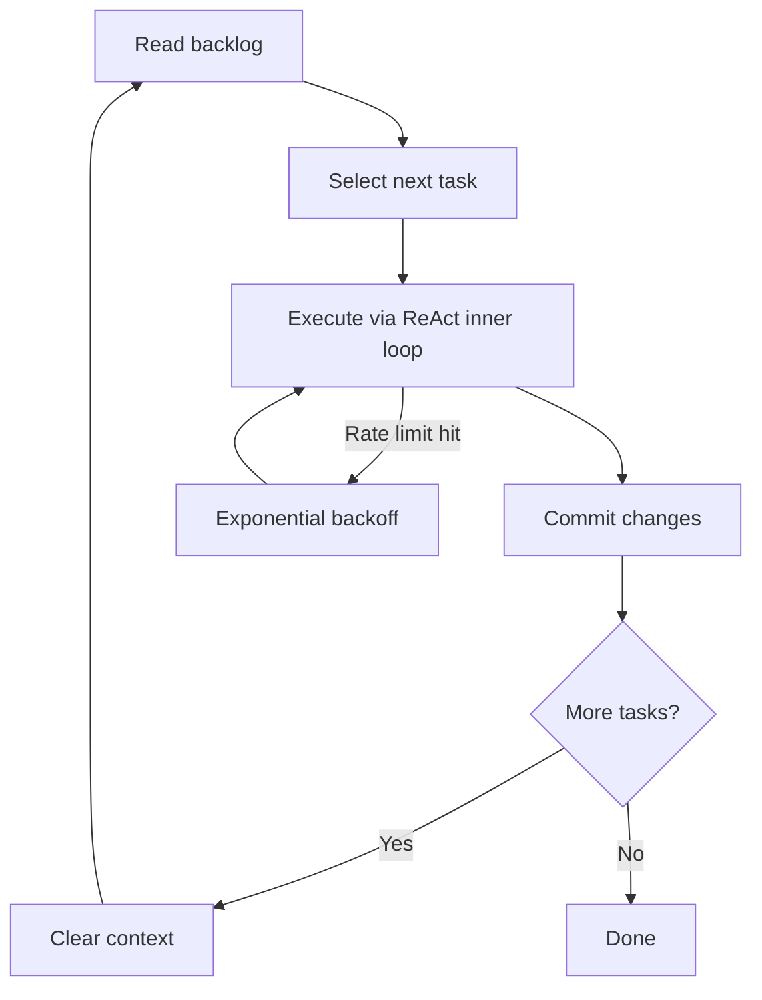

<!-- source: nibzard/awesome-agentic-patterns (Apache 2.0, https://github.com/nibzard/awesome-agentic-patterns) — retain attribution per license -->
---
title: "Continuous Autonomous Task Loop"
description: "Automate sequential task execution by running a self-directed agent loop that selects, executes, commits, and iterates — with fresh context per task and built-in rate-limit handling."
tags:
  - workflows
  - agent-design
  - tool-agnostic
aliases:
  - continuous task loop
  - autonomous task loop
---

# Continuous Autonomous Task Loop

> A self-directed agent loop that reads a task backlog, selects the next item, executes it via a ReAct inner loop, commits results, and repeats — with fresh context per iteration and exponential-backoff rate-limit handling.

## How the Loop Works

The pattern has two nested cycles: an outer task loop that iterates over the backlog, and an inner ReAct turn (Thought → Action → Observation) that executes each task.



**Outer loop** — selects the next uncompleted task from a structured backlog file (e.g., `TODO.md`), runs the agent to completion, commits results, then restarts with a clean context window. A safety limit (e.g., `MAX_ITERATIONS=50`) prevents runaway execution. [Source: [nibzard/awesome-agentic-patterns](https://github.com/nibzard/awesome-agentic-patterns/blob/main/patterns/continuous-autonomous-task-loop-pattern.md)]

**Inner loop** — the ReAct cycle: the model reasons about the task (Thought), calls tools (Action), reads results (Observation), and repeats until the task is complete or the model emits a final message with no pending tool calls. Context grows within a single inner turn; the outer loop's context reset prevents this accumulation from persisting across tasks. [Source: [Anthropic: Building Effective Agents](https://www.anthropic.com/engineering/building-effective-agents)]

**Fresh context per task** — each outer iteration starts a clean session. This eliminates [context rot](../context-engineering/context-window-dumb-zone.md): the reasoning-quality degradation that appears as context fills. Starting fresh prevents a failed or noisy earlier task from coloring later ones. [Source: [Loop Strategy Spectrum](../agent-design/loop-strategy-spectrum.md)]

**Rate-limit handling** — when the agent hits an API rate limit, the loop waits using exponential backoff (configurable; a common default is 300 seconds) and resumes automatically. No human intervention required. [Source: [nibzard/awesome-agentic-patterns](https://github.com/nibzard/awesome-agentic-patterns/blob/main/patterns/continuous-autonomous-task-loop-pattern.md)]

**Git automation** — a post-task safety net commits changes after each task completes. Whether the agent committed or not, the safety net guarantees a clean commit history per task. This is the same [post-loop safety-net](../agent-design/agent-loop-middleware.md) pattern used in other harness designs. [Source: [Agent Loop Middleware](../agent-design/agent-loop-middleware.md)]

Anthropic's two-agent harness independently validates the same structure: an initializer agent populates a feature list; the coding agent runs one item per session, commits, updates the progress file, and stops — enabling the outer loop to restart with fresh context. [Source: [Anthropic: Effective Harnesses for Long-Running Agents](https://www.anthropic.com/engineering/effective-harnesses-for-long-running-agents)]

## Backlog Design

Task backlog quality determines loop success. Tasks must be:

- **Discrete** — completable in a single agent session without external dependencies
- **Atomic** — one well-defined outcome, not a cluster of related changes
- **Unambiguous** — no interpretation required; the agent selects tasks autonomously

Ambiguous tasks cause the agent to make assumptions. Those assumptions compound silently across iterations — no human is watching each one. A task like "improve the auth module" is unsuitable; "add rate limiting to `/api/login` endpoint matching the existing middleware pattern in `src/middleware/rate-limit.ts`" is not.

The backlog file is also the state carrier across sessions. Each iteration marks its task complete before the context is cleared, so the next iteration sees an accurate picture of remaining work.

## Trade-offs

| Factor | Continuous task loop | Alternative |
|--------|---------------------|-------------|
| Human oversight | Low — the loop runs unattended | High — [issue-to-PR pipeline](issue-to-pr-delegation-pipeline.md) has human triggers per task |
| Throughput | High — no inter-task idle time | Lower — each task requires a human handoff |
| Scope | Well-defined, discrete backlogs | Exploratory or high-judgment work |
| Error surface | Compounding across tasks if backlog is ambiguous | Isolated — one task fails, human resets |
| Horizontal scaling | Sequential only | [Parallel sessions](parallel-agent-sessions.md) add concurrency |

This pattern trades oversight for momentum. It is not appropriate for exploratory work, architectural decisions, or any task where mid-stream human judgment would change the direction. [Source: [nibzard/awesome-agentic-patterns](https://github.com/nibzard/awesome-agentic-patterns/blob/main/patterns/continuous-autonomous-task-loop-pattern.md)]

## Required Guardrails

- **Iteration cap** — set `MAX_ITERATIONS` before starting. Without it, a backlog that never empties (due to tasks that keep failing and resetting) will run indefinitely.
- **Version control per task** — one commit per completed task provides rollback points. Without this, a bad task leaves the repository in an unknown state.
- **Validate with a small batch first** — run 3–5 tasks manually before enabling unattended mode. Catch backlog design failures before they replicate across 50 iterations.
- **Execution monitoring** — stream JSON output or log iteration counts so you can detect unexpected behavior without watching every step.

## Permissions Consideration

Unattended execution at this scale typically requires elevated agent permissions (e.g., skipping interactive prompts). Review your tool's permission model before enabling unattended mode — the blast radius of an ambiguous task grows proportionally with the permissions granted. [unverified — specific flag requirements vary by tool and version]

## Example

A bash wrapper implementing the outer loop over a `TODO.md` backlog:

```bash
#!/usr/bin/env bash
# continuous-loop.sh — runs until backlog is empty or MAX_ITERATIONS reached

TASK_FILE="TODO.md"
MAX_ITERATIONS=50
RATE_LIMIT_BACKOFF=300
ITERATION=0

while [[ $ITERATION -lt $MAX_ITERATIONS ]]; do
  remaining=$(grep -c "^- \[ \]" "$TASK_FILE" 2>/dev/null || echo 0)

  if [[ "$remaining" -eq 0 ]]; then
    echo "Backlog empty. Done."
    exit 0
  fi

  echo "=== Iteration $((ITERATION + 1)) / $MAX_ITERATIONS ==="

  # Run agent with fresh context; capture exit code
  claude --no-cache --print \
    "Read $TASK_FILE. Select the next unchecked task. Complete it. \
     Mark it done in $TASK_FILE. Commit all changes with a descriptive message. Stop."
  EXIT_CODE=$?

  if [[ $EXIT_CODE -ne 0 ]]; then
    echo "Agent exited with code $EXIT_CODE. Waiting ${RATE_LIMIT_BACKOFF}s before retry..."
    sleep "$RATE_LIMIT_BACKOFF"
    continue
  fi

  ITERATION=$((ITERATION + 1))
done

echo "Max iterations reached." && exit 1
```

The `--no-cache` flag ensures a genuinely clean context each cycle. Non-zero exit codes (including rate-limit responses) trigger a configurable backoff before the next iteration. The task file serves as both backlog and state: checked items persist across restarts.

## Key Takeaways

- The pattern nests a ReAct inner loop inside an outer task loop; fresh context per outer iteration prevents context rot from accumulating across tasks
- Backlog quality is the primary lever — discrete, atomic, unambiguous tasks are a prerequisite for autonomous selection to work
- Rate-limit handling and git safety nets eliminate the two most common sources of manual interruption in long-running unattended loops
- This is sequential execution; combine with [parallel agent sessions](parallel-agent-sessions.md) to add horizontal throughput
- Guardrails (iteration cap, per-task commits, small-batch validation) are structural requirements, not optional enhancements

## Unverified Claims

- Skipping interactive permission prompts (e.g., `--dangerously-skip-permissions` in Claude Code) may be required for fully unattended execution — verify against your tool's current documentation before use [unverified]
- Whether 300 seconds is a hardcoded or configurable default in the nibzard reference implementation [unverified]

## Related

- [The Ralph Wiggum Loop](../agent-design/ralph-wiggum-loop.md) — the foundational fresh-context loop pattern this workflow extends
- [Loop Strategy Spectrum](../agent-design/loop-strategy-spectrum.md) — when to use fresh-context vs accumulated-context vs compression strategies
- [Agent Loop Middleware](../agent-design/agent-loop-middleware.md) — post-loop safety nets and pre-call injection patterns
- [Issue-to-PR Delegation Pipeline](issue-to-pr-delegation-pipeline.md) — human-triggered per-task delegation; the supervised alternative
- [Parallel Agent Sessions](parallel-agent-sessions.md) — horizontal scaling via simultaneous sessions; complements this pattern's sequential execution
- [Agent Turn Model](../agent-design/agent-turn-model.md) — the ReAct inner loop mechanics
- [Worktree Isolation](worktree-isolation.md) — filesystem isolation for each iteration
- [Idempotent Agent Operations](../agent-design/idempotent-agent-operations.md) — designing tasks for safe retry across loop iterations
