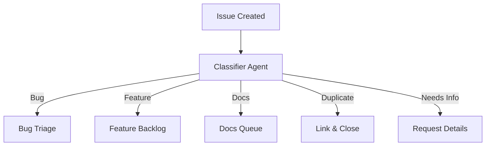

# Continuous Triage

> Replacing manual issue triage with AI agents that classify, label, and route issues on every event or schedule — running continuously with read-only defaults and constrained write operations.

## Three Triage Operations

Continuous triage decomposes into three discrete operations, each independently automatable:

| Operation | Input | Output | Frequency |
|-----------|-------|--------|-----------|
| **Summarize** | Issue body, comments | Structured summary for triagers | On issue creation |
| **Label** | Issue content, repo context | Category labels (bug, feature, docs) | On issue creation/update |
| **Route** | Labels, team assignments | Assignment to team or individual | After labeling |

These operations compose into a pipeline: summarize provides context, labeling classifies, and routing dispatches. Each can run independently or chain sequentially.

## Implementation with GitHub Agentic Workflows

[GitHub Agentic Workflows](../tools/copilot/github-agentic-workflows.md) provide the primary implementation vehicle for continuous triage. Each workflow is defined as a Markdown file with YAML frontmatter specifying triggers, permissions, and safe outputs, compiled to a `.lock.yml` file for GitHub Actions execution ([GitHub Blog](https://github.blog/ai-and-ml/automate-repository-tasks-with-github-agentic-workflows/)).

A triage workflow operates read-only by default. Write operations require explicit declaration as safe outputs — pre-approved actions like `add-label`, `create-comment`, or `add-assignee`. Each safe output is volume-limited and content-sanitized before execution ([GitHub Blog](https://github.blog/ai-and-ml/automate-repository-tasks-with-github-agentic-workflows/)).

```yaml
# Frontmatter for a triage workflow
on:
  issues:
    types: [opened]
permissions:
  contents: read
  issues: write
  models: read
safe-outputs:
  - add-label:
      allowed-labels: [bug, feature, docs, duplicate, needs-info]
  - add-comment:
      max-count: 1
```

This permission model enables running agents continuously — the agent can classify thousands of issues without risk of unbounded mutations.

## Pre-Built Triage Actions

GitHub ships two dedicated Actions for AI-powered triage, both using the workflow `GITHUB_TOKEN` with `models: read` permission — no external API keys required ([GitHub Changelog](https://github.blog/changelog/2025-09-05-github-actions-ai-labeler-and-moderator-with-the-github-models-inference-api/)):

**AI Assessment Comment Labeler** (`github/ai-assessment-comment-labeler`) — runs multiple prompt files in parallel against issue content, applies structured labels (`ai:<prompt-stem>:<assessment>`), supports comment suppression for silent classification, and outputs JSON for downstream workflow steps.

**AI Moderator** (`github/ai-moderator`) — detects spam, link spam, and AI-generated content on issues and comments. Auto-labels flagged content and can minimize it. Supports custom prompt overrides for team-specific moderation rules.

## Classify-Then-Route Pattern

The routing pattern from Anthropic's agent design maps directly to triage: a classifier agent determines the issue category, then routes to specialized follow-up processes. This prevents performance degradation from optimizing a single prompt for heterogeneous inputs ([Anthropic: Building Effective Agents](https://www.anthropic.com/engineering/building-effective-agents)).



Each downstream handler can use a different prompt, different model, or different safe-output set — specialized for its category rather than handling all categories in one pass.

## Tool Design for Classification

Label definitions in triage tools should be explicit, mutually exclusive, and include concrete examples showing when each label applies. Anthropic's advanced tool use guidance recommends 1-5 examples per tool to reduce classification ambiguity ([Anthropic: Advanced Tool Use](https://www.anthropic.com/engineering/advanced-tool-use)).

Effective label definitions include:

- **Name and description** — what the label means in this project's context
- **Inclusion criteria** — concrete examples of issues that receive this label
- **Exclusion criteria** — what this label does not cover, to prevent overlap
- **Priority signal** — whether this label implies urgency

## Context Loading for High-Volume Repos

JIT context loading applies directly to triage: load issue metadata lightly (title, labels, first paragraph), then retrieve full details only when classification requires deeper analysis. This avoids context exhaustion on repos processing hundreds of issues per day ([Anthropic: Context Engineering](https://www.anthropic.com/engineering/effective-context-engineering-for-ai-agents)).

For high-volume repos, schedule batch triage rather than triggering on every event. This amortizes the cost — each run processes accumulated issues in a single agent session rather than spawning separate sessions per issue.

## Rollout Sequencing

1. **Read-only first** — start with summarization only (no labels, no routing). Observe classification quality in comments before enabling writes.
2. **Label with review** — enable `add-label` safe outputs but review label accuracy for 1-2 weeks. Adjust prompts based on misclassifications.
3. **Route to teams** — once labeling accuracy is validated, add assignment rules that route labeled issues to the appropriate team or individual.
4. **Close duplicates** — the highest-risk operation. Enable only after the classifier demonstrates reliable duplicate detection.

## Cost Model

Copilot-powered triage workflows typically cost two premium requests per run — one for agent work, one for guardrail checks. For event-triggered workflows, this cost scales linearly with issue volume. Scheduled batch workflows (daily or weekly) amortize the cost across all accumulated issues ([GitHub Blog](https://github.blog/ai-and-ml/automate-repository-tasks-with-github-agentic-workflows/)) [unverified].

## Key Takeaways

- Decompose triage into three independent operations (summarize, label, route) — each can be automated and validated separately
- Safe outputs with volume limits and content sanitization enable continuous agent operation without risk of unbounded writes
- Use the classify-then-route pattern to specialize prompts per issue category rather than one prompt for all types
- Start read-only, prove accuracy, then progressively enable write operations
- Batch scheduling reduces cost and context load compared to per-event triggers on high-volume repos

## Example

A repository uses GitHub Agentic Workflows to triage every new issue through a three-stage pipeline: summarize, label, and route.

**Workflow file** (`.github/workflows/triage.md`):

```yaml
on:
  issues:
    types: [opened]
permissions:
  contents: read
  issues: write
  models: read
safe-outputs:
  - add-label:
      allowed-labels: [bug, feature, docs, duplicate, needs-info]
  - add-comment:
      max-count: 1
  - add-assignee:
      max-count: 1
```

**Prompt instructions** (`.github/prompts/triage-classify.prompt.md`):

```markdown
Classify this issue into exactly one category:

- **bug** — the user reports broken behavior with reproduction steps or error output
- **feature** — the user requests new functionality or a change to existing behavior
- **docs** — the issue concerns documentation: typos, missing pages, or unclear instructions
- **duplicate** — the issue restates a problem already tracked in an open issue
- **needs-info** — the issue lacks enough detail to classify; request reproduction steps or expected behavior
```

**Result**: when a new issue is opened, the workflow runs the classifier prompt against the issue body, applies the matching label, posts a structured summary comment, and assigns the issue to the team mapped to that label. The entire pipeline executes within the safe-output constraints — at most one label, one comment, and one assignee per run.

## Unverified Claims

- Copilot-powered triage workflows typically cost two premium requests per run [unverified]

## Related

- [GitHub Agentic Workflows](../tools/copilot/github-agentic-workflows.md)
- [GitHub Models in Actions](../tools/copilot/github-models-in-actions.md)
- [Safe Command Allowlisting](../human/safe-command-allowlisting.md)
- [Continuous Agent Improvement](continuous-agent-improvement.md)
- [Continuous Documentation](continuous-documentation.md)
- [Continuous AI (Agentic CI/CD)](continuous-ai-agentic-cicd.md)
- [AI-Powered Vulnerability Triage](ai-powered-vulnerability-triage.md)
- [Agent Composition Patterns](../agent-design/agent-composition-patterns.md)
- [Safe Outputs Pattern](../security/safe-outputs-pattern.md)
