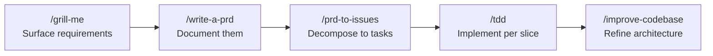

# Daily-Use Skill Library: Encoding Your Process as Agent Skills

> A small library of purpose-built skills that encode your engineering process beats general instructions — each skill is a process gate that compensates for agent statelessness.

## The Core Problem: Engineers with No Memory

AI agents have no persistent memory across sessions. They don't remember decisions made last week, patterns established last sprint, or the reasoning behind architectural choices. Each session starts cold.

The implication: process must be embedded in the tooling, not assumed from context. A general instruction file helps, but it doesn't force an agent through a specific sequence of decisions at the right moment. Purpose-built skills do.

Matt Pocock's [five daily-use skills](https://www.aihero.dev/5-agent-skills-i-use-every-day) demonstrate this: a library covering ideation through architecture refinement, invoked at specific decision points throughout the engineering day. Each skill enforces a process gate rather than leaving the agent to infer how to proceed.

## The Five-Skill Pipeline

The skills form a sequential workflow, each producing an artifact that feeds the next:

### /grill-me — Reach Shared Understanding First

A three-sentence skill that directs the agent to interview you relentlessly about a plan or design until every branch of the decision tree is resolved. One question at a time, with a recommended answer for each. The agent explores the codebase rather than asking questions the codebase can answer.

The design-tree framing — walking every branch before implementation — prevents the most expensive failure mode: building the wrong thing because a key assumption went unexamined. Pocock's [grill-me SKILL.md](https://github.com/mattpocock/skills/blob/main/grill-me/SKILL.md) is only three sentences long.

### /write-a-prd — Convert Understanding to Specification

Takes the output of the grill-me session and produces a Product Requirements Document through interactive interview and codebase exploration. The PRD is filed as a GitHub issue, making it a durable, addressable artifact. The skill prevents the common anti-pattern of starting implementation against verbal or implicit requirements.

### /prd-to-issues — Decompose Using Vertical Slices

Breaks the PRD into independently-grabbable GitHub issues. Each issue is a vertical slice — a thin, end-to-end cut through all integration layers — rather than a horizontal layer of one module. This is the tracer-bullet decomposition: each slice can be implemented and verified independently, without requiring other slices to be complete first.

Horizontal decomposition (e.g., "issue 1: database layer, issue 2: API layer") creates dependency chains that block parallel work and delay integration feedback. Vertical slices expose integration issues early and enable parallel agent sessions. ([Tracer Bullets — AI Hero](https://www.aihero.dev/tracer-bullets))

### /tdd — Implement with Red-Green-Refactor

Forces a strict test-driven development loop: write a failing test, implement until it passes, refactor. Builds features and fixes bugs one vertical slice at a time, matching the decomposition from prd-to-issues. ([My Skill Makes Claude Code GREAT At TDD — AI Hero](https://www.aihero.dev/skill-test-driven-development-claude-code))

The skill's value is enforcement: without it, agents tend to implement first and add tests after, which produces tests that verify the implementation rather than the requirement.

### /improve-codebase-architecture — Weekly Structural Refinement

Explores the codebase for architectural improvement opportunities, focusing on deepening shallow modules and designing thin interfaces. Run weekly rather than per-feature. The explicit goal is making the codebase easier for agents to navigate in future sessions — architectural clarity reduces the amount of context an agent must load to orient itself.

This skill closes the feedback loop: better architecture reduces the context burden that forces agents into shallow, surface-level implementations.

## Skill Length Is Not the Signal

The grill-me skill is three sentences. It works because it fires at the right moment (before implementation begins) and enforces the right constraint (resolve every decision branch). Longer is not better.

Skill design questions:

- What decision point does this skill address?
- What would the agent do without it that it shouldn't?
- What is the minimum text that changes that behavior?

A skill that answers these three questions will outperform a comprehensive instruction document that the agent treats as reference material.

## Building Your Own Library

Start from your actual failure modes. If your agents regularly skip requirement clarification and jump to code: build a grill-me equivalent. If they implement entire features horizontally instead of delivering thin slices: build a prd-to-issues equivalent.

The mattpocock/skills repository is public and forkable from [github.com/mattpocock/skills](https://github.com/mattpocock/skills) — use it as a starting point, replace skills that don't match your process, add skills for your specific toolchain or domain.

Key constraints:

- Each skill should address exactly one decision point
- Skills should compose — the output of one becomes the input for the next
- Keep descriptions specific enough to trigger reliably, narrow enough to avoid over-triggering

## When This Backfires

The pattern assumes skills fire at the right moment and that their cost is covered by the process gates they enforce. Several failure conditions break that assumption:

- **Trigger reliability is probabilistic.** At startup, agents see only the `name` and `description` from each installed skill's YAML frontmatter — the body, including any "When to Use" section, is not indexed. A vague description, keyword collisions with neighbouring skills, or a user phrasing that doesn't match the description will leave the skill sitting there unused while the agent proceeds without it. ([Skill authoring best practices — Claude docs](https://platform.claude.com/docs/en/agents-and-tools/agent-skills/best-practices))
- **Description budgets shrink as the library grows.** Descriptions are capped at 1024 characters individually and share an aggregate budget that scales with context window size. Past a few dozen skills, practitioners report descriptions getting truncated or deprioritised, which strips the keywords needed for matching. ([Skill authoring best practices — Claude docs](https://platform.claude.com/docs/en/agents-and-tools/agent-skills/best-practices))
- **Process gates can rigidify exploration.** A strict `/grill-me → /write-a-prd → /prd-to-issues → /tdd` sequence is appropriate for well-understood feature work. For exploratory spikes, migrations, or incident response, the ceremony cost can exceed the information it surfaces — a plain CLAUDE.md plus direct prompting is often faster.
- **Maintenance cost is real.** Every skill needs evaluations, description tuning, and periodic re-testing against new model releases. Solo developers and small teams frequently find that a single well-edited instruction file outperforms a library of five skills they don't exercise often enough to keep calibrated.

Audit whether each skill is firing when expected before adding the next one. A three-skill library that triggers reliably beats a ten-skill library half of which sit idle.

## Key Takeaways

- Agent statelessness means process must be embedded in skills, not assumed from context
- A small library of focused skills (five or fewer) covering your full workflow outperforms a single comprehensive instruction file
- Vertical slice decomposition (tracer-bullet) enables parallel work and early integration feedback
- Skill length is not the signal — the right words at the right decision point matter more than coverage
- Weekly architecture refinement makes future agent sessions cheaper by reducing navigation context

## Related

- [Skill Authoring Patterns](../tool-engineering/skill-authoring-patterns.md)
- [Skill Library Evolution](../tool-engineering/skill-library-evolution.md)
- [Introspective Skill Generation](introspective-skill-generation.md)
- [Test-Driven Agent Development](../verification/tdd-agent-development.md)
- [Red-Green-Refactor with Agents](../verification/red-green-refactor-agents.md)
- [The Research-Plan-Implement Pattern](research-plan-implement.md)
- [Parallel Agent Sessions](parallel-agent-sessions.md)
