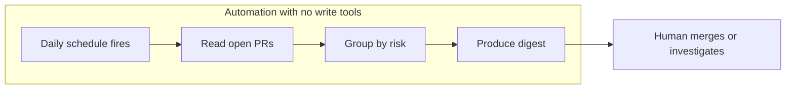

# Delegating Dependabot Pull Request Triage to an Agent

> Delegate Dependabot triage to a scheduled agent that only produces a digest, and set the boundary with the automation's tool grant.

Three conditions decide whether this is worth building. Your CI has to exercise the dependencies it covers, or the agent's central signal means nothing. Grouping and cooldown have to be configured already, because those solve the volume problem deterministically and for free. And the automation has to hold no write tool, because the agent's summary is a claim about risk that nothing in the pipeline verifies. Miss any of the three and you have added a confident narrator to a queue you were already approving too fast.

## The volume argument, and its limit

Dependency PRs are repetitive and high-volume, which is what makes them a delegation candidate. GitHub reports one repository where "92 of its 578 commits, roughly one in six, were Dependabot version bumps, with 61 in the previous 12 months alone, sometimes several in a single day" ([GitHub Blog: Tame Dependabot](https://github.blog/security/supply-chain-security/tame-dependabot-group-your-updates-slow-the-cadence-keep-security-fast/)). Opening each one to read a version delta and a check mark is work no one wants and no one does carefully by the fortieth PR.

The limit is that the same post answers the volume problem without an agent. Grouping bundles updates so that "instead of 10 pull requests, you get one pull request." Dependabot "now waits until a new release has been on its registry for at least three days before opening a version-update pull request." Configure those first. An agent layered on a queue that has neither grouping nor a cooldown is a premature answer, and the more expensive one.

## Three implementation layers

### Layer 1: Trigger

GitHub Copilot cloud agent automations run "on an interval (hourly, daily, or weekly), when a new issue is created or when a pull request is created or updated" ([GitHub Changelog: Schedule and automate tasks](https://github.blog/changelog/2026-06-02-schedule-and-automate-tasks-with-copilot-cloud-agent/)). A daily interval timed before the working day suits this loop, because the queue's contents change on Dependabot's schedule rather than on yours.

### Layer 2: Classification

GitHub's walkthrough gives the automation this instruction verbatim: "Review the open Dependabot pull requests, group them by risk, identify the safe patch and minor version updates, verify that CI is passing for each pull request, and provide a short summary of the recommended next steps" ([GitHub Blog: Automate Dependabot pull request triage](https://github.blog/ai-and-ml/github-copilot/github-copilot-app-for-beginners-automate-dependabot-pull-request-triage/)). Everything that instruction asks for sits in the PR metadata. The agent never reads your application.

### Layer 3: Output

In the walkthrough the output is a digest and nothing else. "When the automation finishes, Copilot returns a summary instead of a list of individual pull requests." The automation applies no label, writes no comment, approves nothing, and merges nothing. That is the version worth copying, and it is a weaker claim than the phrase "agent triage" usually carries.

## Where the boundary is enforced

Copilot automations bind tools per automation. You configure "the tools available to the agent, such as 'create pull request' or 'update issue labels', so you have full control over what your automation can do" ([GitHub Changelog](https://github.blog/changelog/2026-06-02-schedule-and-automate-tasks-with-copilot-cloud-agent/)). An automation granted no write tool cannot act on a PR whatever the model concludes about it. That grant is the boundary.

A suggest-then-apply approval step is not. GitHub says so about its own, writing of the automation controls it shipped for GitHub Issues: "Approvals are a workflow convenience, not a security control. They don't enforce a server-side boundary, and an agent with permission to change issues can directly apply changes rather than suggest them" ([GitHub Changelog: Agent automation controls](https://github.blog/changelog/2026-07-23-agent-automation-controls-in-github-issues-in-public-preview/)). The same feature has agents "rate each supported action high, medium, or low confidence," and "High-confidence changes apply automatically." The statement is scoped to issue automations, and the shape generalizes: a threshold the agent scores itself against is not a gate on the agent. This is the [enforced-versus-advisory distinction](../security/enforced-versus-advisory-controls.md) in a vendor's own words.

Summarizing, grouping, reading CI status, and naming which PRs need a look are verdicts the agent may issue alone. Merging a bump, widening a version range, and dismissing an alert are not. The way to make that split hold is to withhold the tool rather than to instruct the model.

## Why it works

Dependency PRs are delegable because triage is a classification over a small machine-readable feature set: the semver delta, the CI conclusion, the release age, and the changelog text. None of those require reading the application, which is why an automation with no repository-code access still produces a useful digest ([GitHub Blog](https://github.blog/ai-and-ml/github-copilot/github-copilot-app-for-beginners-automate-dependabot-pull-request-triage/)). The queue is repetitive in the way that makes it a poor use of a person's attention and a fair use of a model's.

The mechanism fails where the feature set stops predicting the outcome. A version number is a claim by the publisher, not a measurement of compatibility. A systematic review of 97 studies found that "approximately one in five non-major Maven releases introduce public API breaks," that behavioral changes "account for the largest share (1,034 of 1,519, 68.1%)" of npm breaking changes, and that the 43 surveyed detection approaches "reach high accuracy on syntactic breaks but limited coverage on behavioral ones" ([arXiv:2605.24397v1](https://arxiv.org/abs/2605.24397v1)). That review names the failure of semantic versioning as a trust mechanism among its open challenges. The agent classifies on the axis that lies.

## When this backfires

- CI that does not exercise the dependency. The safe bucket rests entirely on a green check. Where tests never touch the upgraded path, the agent turns an absence of evidence into a recommendation, and the digest reads the same either way.
- Security updates during a live compromise. Dependabot security updates bypass the three-day cooldown by design: "Security updates still open immediately, so critical fixes are never held back by the cooldown" ([Tame Dependabot](https://github.blog/security/supply-chain-security/tame-dependabot-group-your-updates-slow-the-cadence-keep-security-fast/)). The malicious axios releases `1.14.1` and `0.30.4` went up at 00:21 UTC on 2026-03-31 and came down at 03:15, injecting `plain-crypto-js@4.2.1`, a cross-platform remote access trojan ([axios post-mortem](https://github.com/axios/axios/issues/10636)). Roughly three hours. Microsoft's mitigation guidance was to "Disable automated dependency bots (such as Dependabot or Renovate) by disabling or restricting Axios updates in their config" ([Microsoft Security Blog](https://www.microsoft.com/en-us/security/blog/2026/04/01/mitigating-the-axios-npm-supply-chain-compromise/)). The remedy is to stop the bot for the affected package, which is a decision about one dependency taken under time pressure. An agent that makes the urgent bucket faster to clear pushes the other way.
- Transitive bumps. Transitive changes account for 20.36% of client-impacting source breaks ([arXiv:2605.24397v1](https://arxiv.org/abs/2605.24397v1)). The agent reads the manifest diff, not the resolved tree, so the package named in the PR title is not the package that breaks the build.
- Ecosystems where semver is decorative. Patch, minor, and major is the agent's primary output axis. Where publishers ship breaks in non-major releases, that grouping sorts the queue on the wrong property and gives no signal that it has done so.
- Granting write tools to save a step. Once the automation holds label or PR write tools, the prompt is the only thing between it and the repository. GitHub disclaims its own approval step as a boundary for issue automations, so assume the same of any suggest-then-apply gate you did not enforce server-side. The step you saved is the boundary.

## Key Takeaways

- The GitHub walkthrough builds a read-only summarizer; treat "agent triage" claims that go further as a change in risk, not a change in convenience.
- Enforce the boundary with the automation's tool grant. GitHub states its own approval step for issue automations enforces no server-side boundary.
- Configure grouping and the three-day cooldown before adding an agent. They solve the volume problem deterministically.
- The agent classifies on the semver delta, and 68.1% of npm breaking changes are behavioral rather than syntactic.
- Security updates skip the cooldown, so the bucket with the least platform protection is the one an agent is most likely to mark urgent and safe.

## Related

- [Dependabot Agent Assignment](../tools/copilot/dependabot-agent-assignment.md) — assigning an alert to the coding agent for a fix, the acting half of this loop
- [Enforced Versus Advisory Controls](../security/enforced-versus-advisory-controls.md) — why an approval prompt is not a boundary
- [The Delegation Decision](../patterns/agent-design/delegation-decision.md) — deciding whether a task class is worth an agent at all
- [Supply-Chain Security Debt in Agent Pull Requests](../security/supply-chain-security-debt-agent-prs.md) — where security debt concentrates in agent-authored diffs
- [LLM-Pinned Vulnerable Versions](../security/llm-pinned-vulnerable-versions.md) — the model-side half of the dependency-version risk
