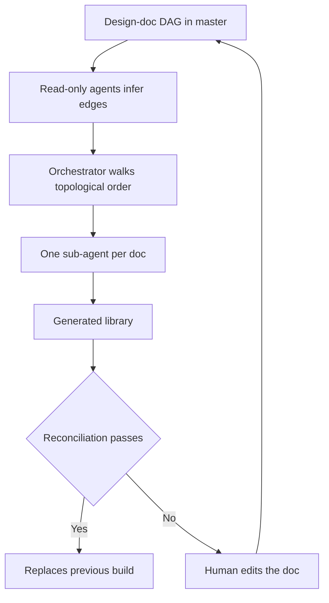

# Design Docs as the Durable Artifact

> Keep the design docs as the artifact humans edit and rebuild the implementation from them each version, where an exact test gates the result.

Three conditions have to hold before this is a workflow rather than a gamble. The correct output must be statable as an exact value a test can assert. The abstractions must be few and stable enough that a rebuild does not reorganize the system. Your fix cadence must tolerate a rebuild measured in hours. The SMART performance-modeling library meets all three, and its authors report that regenerated implementations reproduce hand-audited reference models, including DeepSeek-V3 serving on a TPU pod slice, to round-off precision ([Kushnir et al., 2026](https://arxiv.org/abs/2609.05364v1)). Outside those conditions the property that makes the rebuild safe is gone.

## The refactoring-treadmill problem

Performance-modeling frameworks "sit at the intersection of the two fastest-moving parts of the stack", model architectures above and accelerators below, "so they absorb this churn from both directions" and each change lands as another patch on an aging abstraction ([Kushnir et al., 2026](https://arxiv.org/abs/2609.05364v1)). The SMART authors name two failure modes that compound out of that. Incremental generation debt: the generator is handed the previous implementation, and "incremental patches inevitably introduce compromises that compound with every spec revision". Context-window myopia: an agent revising a mature codebase is fed "fragmented, localized code snippets" and cannot see the global invariants it needs to keep the structure coherent.

Regenerating from scratch removes the first one by construction. Nothing is handed forward except the prose. The same claim has been demonstrated at single-agent scale, where a 926-word specification is enough to reproduce a coding agent ([bootstrapping coding agents](../emerging/bootstrapping-coding-agents.md)). What follows is the version that survives a 50-doc library and a numeric acceptance test.

## Three implementation layers

### Layer 1: the doc DAG

SMART's main branch holds almost no code. It holds 50 design docs, about 9,000 lines of specification prose, covering TPU topology, collective cost models, numerics, schedulers, and a catalog of model families. Master "is reduced to the docs plus a handful of leaf utilities, and the library is rebuilt by sub-agent orchestration" ([Kushnir et al., 2026](https://arxiv.org/abs/2609.05364v1)). Each doc is self-contained, and the dependency edges between docs are machine-discovered rather than hand-maintained: read-only agents analyze the docs and infer them.

### Layer 2: orchestrated regeneration

Once the graph resolves, "an orchestrator agent walks the DAG in topological order, assigning a dedicated coding sub-agent to implement each self-contained doc" ([Kushnir et al., 2026](https://arxiv.org/abs/2609.05364v1)). This is the [orchestrator-worker](../patterns/multi-agent/orchestrator-worker.md) shape with the docs supplying both the work units and their ordering. The authors also describe routing by difficulty: foundational documents "(such as the core DSL design) might be routed to a larger, more capable LLM", while "many downstream design docs can be successfully translated into working code using smaller, more cost-effective models" ([Kushnir et al., 2026](https://arxiv.org/abs/2609.05364v1)).

### Layer 3: reconciliation and repair

The output does not become the library by default. It has to pass reconciliation against hand-built reference models, plus parameter guards and unit tests, before it replaces the previous build. Repair is prose-only: humans edit docs, never generated code.

The run leaves behind an artifact worth copying even if you never regenerate anything. The orchestrator keeps a central log of where sub-agents struggled to interpret the prose and what bugs surfaced from earlier topological waves, which tells the team "exactly which documents require prose refinement and clarification for the next version" ([Kushnir et al., 2026](https://arxiv.org/abs/2609.05364v1)). The generation run doubles as a ranked defect report on your own writing.

## Triggers and constraints

The trigger is a version change, not a schedule or a push. A full clean-slate rebuild takes between 1.5 and 3 hours at around 100 USD of API cost using Claude Code ([Kushnir et al., 2026](https://arxiv.org/abs/2609.05364v1)), and that price is why the cadence is coarse.

Nothing much bounds the agent, since the code it writes is discarded on the next run anyway. The binding constraint sits on the humans. A fix applied to generated code rather than to a doc is silently reverted by the next rebuild, so the no-human-edits rule has to be enforced rather than encouraged. That rule defines the spec-as-source tier, where "the specification is the only artifact humans edit directly" and generated code "should never be manually modified" ([Piskala, 2026](https://arxiv.org/abs/2602.00180v1)).

Tool-agnostic. The paper reports costs against Claude Code, and nothing in the loop depends on a specific assistant.

## Why it works

The obstacle is that two runs of the same prompt do not produce the same program. Across 829 problems from CodeContests, APPS, and HumanEval, "the ratio of coding tasks with zero equal test output across different requests is 75.76%, 51.00%, and 47.56%" respectively, and "setting the temperature to 0 does not guarantee determinism in code generation" ([Ouyang et al., 2024](https://arxiv.org/abs/2308.02828v2)). A library rebuilt from prose should inherit that divergence. Two doc-writing rules and one orchestration rule push back against it.

Worked examples do the narrowing. Writing out how a piece of pseudo-code executes on a given input, step by step with intermediate shapes and values, "is what maintains consistency across independent agentic code-generations", because "a concrete trace pins down semantics that prose alone leaves ambiguous" ([Kushnir et al., 2026](https://arxiv.org/abs/2609.05364v1)). Prose admits several readings and a trace admits one, so the example narrows the interpretations available to an agent before it writes a line.

Reconciliation anchors catch whichever reading the agent chose. In SMART, "every number-bearing doc ends with a reconciliation anchor: a small preset whose expected outputs are stated exactly and enforced by generated tests" ([Kushnir et al., 2026](https://arxiv.org/abs/2609.05364v1)). That turns an interpretation question into a numeric equality that holds or does not, and drift between two builds stops being invisible.

One sub-agent per self-contained doc keeps each generation step small, which "avoids overwhelming the model, significantly increasing the probability of correct code generation for each isolated task" ([Kushnir et al., 2026](https://arxiv.org/abs/2609.05364v1)). Splitting the spec is what puts the anchors within reach.

## Example

SMART's docs favor what the authors call executable-in-your-head vignettes. One reads: "on a 2×2×2 torus with wraparound, the per-node link count is 3, not 6; the all-gather of V bytes therefore costs …" ([Kushnir et al., 2026](https://arxiv.org/abs/2609.05364v1)).

Two things are doing work in that sentence. It states a number an agent would otherwise guess, and it names the wrong answer next to the right one, closing off a plausible misreading instead of leaving it open. The doc then ends with a preset whose expected outputs are written down exactly, and the generated tests assert them. A regeneration that read the prose differently fails the assertion instead of shipping.

## When this backfires

The correct output is a judgment call. An anchor is "a small preset whose expected outputs are stated exactly" ([Kushnir et al., 2026](https://arxiv.org/abs/2609.05364v1)), so the workflow inherits that requirement: where nobody can write the expected output down exactly, there is no anchor to generate a test from, and a regeneration drifts with nothing reporting it. SMART clears the bar because its build product is a symbolic cost model whose numbers reconcile to round-off.

The abstractions are what keep changing. The authors state the limit themselves: "Reliable regeneration also constrains the artifact being specified: the abstractions must be few, orthogonal, and stable under architecture churn" ([Kushnir et al., 2026](https://arxiv.org/abs/2609.05364v1)). If the factoring is the thing in flux, rebuilds stop converging on it.

You need the fix in ten minutes. At 1.5 to 3 hours per clean-slate rebuild ([Kushnir et al., 2026](https://arxiv.org/abs/2609.05364v1)), an incident forces you to patch the generated code, which breaks the one rule the workflow rests on.

The project is small or still exploratory. Spec-driven development is already overkill for throwaway prototypes, solo developers on short-lived projects, exploratory coding where requirements stay uncertain, and simple CRUD with unambiguous requirements ([Piskala, 2026](https://arxiv.org/abs/2602.00180v1)). Regeneration is its most expensive tier.

The doc is wrong. Anchors check agreement with the spec, not correctness: "A passing spec test doesn't guarantee correct software—it only guarantees that the software matches the spec. If the spec is wrong, the code will faithfully implement the wrong thing" ([Piskala, 2026](https://arxiv.org/abs/2602.00180v1)). Review pressure moves entirely onto the prose, and a green rebuild says nothing about whether the prose was right. The same source places this tier as "currently practical only in domains where that trust has been established".

## Key Takeaways

- Check for an exact oracle before adopting this. No assertable expected value means no reconciliation anchor, and without anchors a rebuild is an unreviewed rewrite.
- Add worked examples and reconciliation anchors to docs you already have. Both transfer to a codebase you never regenerate, and both are cheap.
- Let the rebuild price set your release cadence. Anything that needs a same-hour fix needs a different workflow for that path.
- Treat the orchestrator's struggle log as next version's prose-editing queue, not as run noise.
- Enforce the no-edits rule on generated files. A fix applied to code instead of a doc disappears at the next rebuild.

## Related

- [Spec-Driven Development with Spec Kit](spec-driven-development.md) — the tier below this one, where the spec drives generation but the code stays maintained
- [Spec-Anchored Drift-Gated Architecture (Spec Growth Engine)](spec-growth-engine.md) — gates spec-code divergence at merge instead of discarding the code
- [Bootstrapping Coding Agents](../emerging/bootstrapping-coding-agents.md) — the same durable-spec claim demonstrated on one self-hosting agent rather than a 50-doc library
- [Documentation-Guided Legacy Migration](documentation-guided-legacy-migration.md) — a one-way generation from architecture docs, validated by redocumenting the output
- [Orchestrator-Worker](../patterns/multi-agent/orchestrator-worker.md) — the delegation shape Layer 2 runs on
