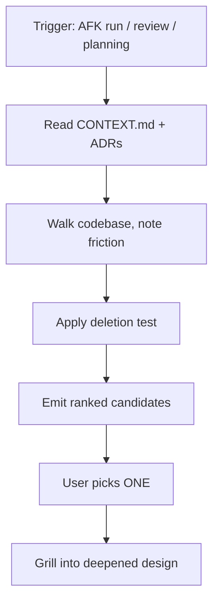

# Discovery-Only Refactor Pass: Surface Candidates Before Touching Code

> A separate read-only pass scans the codebase for *deepening opportunities* — refactors that make modules easier to test, change, and navigate — and emits a ranked candidate list. It does not propose edits. The human picks one, then a follow-up session does the work.

A discovery-only refactor pass is a named agent skill whose sole job is to produce a ranked list of refactor candidates against a fixed vocabulary, with zero code edits in the same session. Matt Pocock's open-source `/improve-codebase-architecture` skill is the worked example ([SKILL.md, mattpocock/skills](https://github.com/mattpocock/skills/blob/main/skills/engineering/improve-codebase-architecture/SKILL.md); [AIHero guide](https://www.aihero.dev/skills-improve-codebase-architecture)). The pattern matters because feature-driven agents either skip refactors entirely (off-task) or fold low-leverage cleanup into the feature diff — agentic refactoring in the wild is dominated by Change Variable Type (11.8%), Rename Parameter (10.4%), and Rename Variable (8.5%) edits ([Agentic Refactoring empirical study, arXiv:2511.04824](https://arxiv.org/abs/2511.04824)). Splitting discovery from action lets the model spend reasoning budget on candidate evaluation rather than diff synthesis.

## When This Holds

The pattern is conditional. It works when all four are true:

- **A domain vocabulary file exists.** Pocock's skill reads `CONTEXT.md` (or equivalent glossary) and any ADRs in the touched area *first* ([SKILL.md](https://github.com/mattpocock/skills/blob/main/skills/engineering/improve-codebase-architecture/SKILL.md)). Without that grounding, "deepening" collapses into the agent's default low-level refactoring bias.
- **The codebase has accumulated real friction.** Pocock lists the trigger signals plainly: "understanding one concept requires bouncing through many files," "tests only work by reaching into implementation details," "the agent keeps choosing the wrong place to edit" ([AIHero guide](https://www.aihero.dev/skills-improve-codebase-architecture)). On a new or small repo, there is nothing to deepen.
- **The output is treated as candidates-to-pick-from, not a backlog.** The skill produces a numbered list and asks "Which would you like to explore?" — a team that actions all of them at once destroys the locality the next feature would have established.
- **The pass runs after friction has surfaced**, not on a cron — typically after an AFK agent run, code review, or planning session ([AIHero guide](https://www.aihero.dev/skills-improve-codebase-architecture)).

Outside these conditions the pass produces churn. See [When This Backfires](#when-this-backfires).

## The Discovery Loop



Three stages, each with a fixed output shape:

1. **Read the grounding artifacts.** The skill reads the project's domain glossary and any ADRs in the area before exploring code ([SKILL.md](https://github.com/mattpocock/skills/blob/main/skills/engineering/improve-codebase-architecture/SKILL.md)). The glossary tells the skill what concepts deserve deep modules; the ADRs record decisions that should not be re-litigated.
2. **Walk the codebase organically.** Not heuristic-driven. The exploration looks for four friction signals: bouncing-between-many-modules-to-understand-one-concept, shallow modules (interface nearly as complex as the implementation), helpers extracted for testability that left the real bugs hiding in how they're called (no locality), and tightly-coupled modules leaking across their seams ([SKILL.md](https://github.com/mattpocock/skills/blob/main/skills/engineering/improve-codebase-architecture/SKILL.md)).
3. **Emit candidates, then stop.** Each candidate has a fixed shape: files involved, current friction, plain-English proposed change, benefits framed in locality + leverage + how tests would improve ([SKILL.md](https://github.com/mattpocock/skills/blob/main/skills/engineering/improve-codebase-architecture/SKILL.md)). The skill explicitly does *not* propose interfaces yet — that happens in a follow-up grilling session on the chosen candidate.

## The Vocabulary Constraint

The skill is strict about architecture language. Vague words ("component," "service," "boundary") produce vague refactors, so it refuses them and uses a fixed glossary ([SKILL.md](https://github.com/mattpocock/skills/blob/main/skills/engineering/improve-codebase-architecture/SKILL.md)):

| Term | Meaning |
|------|---------|
| **Module** | Anything with an interface and an implementation (function, class, package, slice) |
| **Interface** | Everything a caller must know — types, invariants, error modes, ordering, config |
| **Implementation** | The code inside |
| **Depth** | Leverage at the interface. Deep = high leverage; shallow = interface nearly as complex as the implementation |
| **Seam** | Where an interface lives — a place behaviour can change without editing in place |
| **Adapter** | A concrete thing satisfying an interface at a seam |
| **Locality** | Change, bugs, and knowledge concentrated in one place |

Two load-bearing rules sit on top of the vocabulary:

- **Deletion test**: imagine deleting the module. If complexity vanishes, it was a pass-through. If complexity reappears across N callers, it was earning its keep ([SKILL.md](https://github.com/mattpocock/skills/blob/main/skills/engineering/improve-codebase-architecture/SKILL.md)).
- **One adapter = hypothetical seam. Two adapters = real seam.** Don't introduce a port unless at least two adapters (typically production + test) are justified — a single-adapter seam is just indirection ([DEEPENING.md](https://github.com/mattpocock/skills/blob/main/skills/engineering/improve-codebase-architecture/DEEPENING.md)).

This is the same constraint-as-prompt mechanism that gives [structured tool use](https://www.anthropic.com/engineering/advanced-tool-use) its reliability — the model picks a slot rather than writing free-form.

## The Dependency-Category Gate

A candidate is only usable if its dependencies admit a test strategy. The skill classifies dependencies into four categories ([DEEPENING.md](https://github.com/mattpocock/skills/blob/main/skills/engineering/improve-codebase-architecture/DEEPENING.md)):

| Category | Example | Deepening strategy |
|----------|---------|-------------------|
| In-process | Pure computation, in-memory state | Merge modules, test through the new interface directly |
| Local-substitutable | Postgres (PGLite), filesystem (in-memory fs) | Test with the stand-in; seam is internal |
| Remote-but-owned | Microservices, internal APIs | Port at the seam, HTTP adapter for prod, in-memory adapter for tests |
| True external | Stripe, Twilio | Inject port, mock adapter for tests |

A candidate that requires a remote-but-owned seam with only one viable adapter does not qualify — the deletion test would route the complexity right back. The dependency-category gate is what stops the discovery pass from producing speculative seams.

## Why It Works

The pattern compounds two effects.

First, **separating "what should improve?" from "make this change" lets the model spend reasoning budget on candidate evaluation rather than diff synthesis.** The empirical agentic-refactoring study shows that when agents do both inside one feature task, refactoring is targeted in 26.1% of commits but concentrates on Change Variable Type (11.8%), Rename Parameter (10.4%), and Rename Variable (8.5%) — low-level, consistency-oriented edits ([arXiv:2511.04824](https://arxiv.org/abs/2511.04824)). A dedicated read-only pass with a ranked-list output format gives the model a different task shape, which surfaces different candidates.

Second, **constraining the ranking lens to Ousterhout-style depth narrows the solution space.** Generic "code smell" framings invite extract-a-helper suggestions that fail the deletion test. The deletion test plus the one-adapter-vs-two rule explicitly reject candidates that would just move complexity rather than concentrate it. The indirect mechanism — once friction is removed before the next feature lands — is the CodeScene finding that LLMs refactoring against Healthy CodeHealth code (CH ≥ 9) have 15-30% lower break rates than against unhealthy code ([Code for Machines, Not Just Humans](https://arxiv.org/abs/2601.02200)). Deepening before the next feature run improves the surface that future agent runs refactor against.

## When This Backfires

The conditions above are not optional. When any is missing, the pattern produces churn rather than leverage.

- **No domain glossary.** Without `CONTEXT.md` or equivalent, the skill ranks against the LLM's default refactor disposition — which is the low-level edit mix the empirical study documents ([arXiv:2511.04824](https://arxiv.org/abs/2511.04824)). The ranked list will surface renames and pass-through helpers rather than genuine deepening.
- **Small or new codebase.** The deepening signals require many callers, repeated bug locations, and accumulated extract-a-helper damage. On a service under ~5K LOC or a six-month-old repo, the pass produces premature consolidation — the same caveat the project-level [audit-agent-built-code-health](../agent-readiness/audit-agent-built-code-health.md) flags for its own applicability.
- **Imminent feature work in the same modules.** The discovery pass reads only the glossary and ADRs, not the active issue queue or open PRDs. A deepening landed before a feature touches the same area destroys the locality the feature was about to establish and creates merge conflicts.
- **Treating the candidate list as a TODO.** The skill is designed to produce candidates the user *picks one of* before a separate grilling session. Multi-Agent Coordinated Rename Refactoring found that heuristic-based approaches "produce an overwhelming number of false positives" while vanilla LLMs produce incomplete suggestions ([arXiv:2601.00482](https://arxiv.org/abs/2601.00482)) — a team that actions every candidate inherits this signal-to-noise ratio at PR-review cost.
- **No prior friction surfaced.** Running the pass on a cron or before any AFK run, code review, or planning session has exposed friction produces candidates ranked on static signals alone. The Pocock trigger conditions are post-friction by design ([AIHero guide](https://www.aihero.dev/skills-improve-codebase-architecture)).

A reasonable contrarian position: refactor discovery should not be separated from feature work at all. Agents already refactor in 26.1% of feature commits ([arXiv:2511.04824](https://arxiv.org/abs/2511.04824)), and the right place to deepen is when the file is already open. The discovery-only pass is worth the overhead only when the four conditions above hold; otherwise, folding refactoring into the feature flow is the lower-cost path.

## Example

Pocock's `/improve-codebase-architecture` skill, when invoked, walks an open-source project after the user notices "the agent keeps choosing the wrong place to edit." A representative candidate emitted by the skill takes the shape ([SKILL.md](https://github.com/mattpocock/skills/blob/main/skills/engineering/improve-codebase-architecture/SKILL.md)):

```
3. Order intake module
   - Files: src/orders/handler.ts, src/orders/validators/*.ts,
            src/orders/transformers/email.ts
   - Problem: Order intake logic is split across a handler, three
     validators, and an email transformer. Tests reach into the
     validators directly because the handler is too coupled to test
     end-to-end. Bugs in intake invariants surface as test failures
     in unrelated files.
   - Solution: Collapse the intake path into a single deep "Order intake"
     module. Interface accepts the raw request and returns the typed
     Order or a structured validation error. Internal seams hide the
     three validation stages.
   - Benefits: Locality — intake bugs concentrate in one file. Leverage
     — callers learn one type, not five. Tests assert on observable
     outcomes through the interface (the test surface IS the interface)
     and survive internal refactors.
```

The skill stops here. The user picks candidate 3, and a follow-up grilling session walks the design tree — what sits behind the seam, what tests survive, whether any decision warrants an ADR.

## Key Takeaways

- A discovery-only refactor pass produces ranked candidates and stops — no edits in the same session.
- The pattern is **Qualified**: it requires a domain glossary, an established codebase, a candidates-not-backlog treatment, and a post-friction trigger.
- Constrain the ranking vocabulary to module/interface/depth/seam/adapter — generic "code smell" framings invite low-leverage extract-a-helper edits.
- The deletion test and the one-adapter-vs-two rule are the load-bearing guardrails against speculative seams.
- Classify each candidate's dependencies (in-process, local-substitutable, remote-but-owned, true-external) before promoting it — the category determines whether a test strategy exists.
- Agents in feature flows already refactor in 26.1% of commits, but concentrate on renames and type changes — separating discovery is what surfaces high-leverage candidates.

## Related

- [Backlog Triage as a Named Agent Skill](backlog-triage-skill.md) — Sibling Pocock skill; same fixed-output, no-side-effects-without-explicit-pick discipline, applied to issue intake rather than refactor surfacing.
- [Throwaway-Prototype Skill: Build to Discard, Keep Only the Answer](throwaway-prototype-skill.md) — Another scoped Matt Pocock skill — same constrained-output discipline applied to design-question prototyping rather than refactor candidate surfacing.
- [Audit Agent-Built Code Health](../agent-readiness/audit-agent-built-code-health.md) — The post-hoc counterpart: this pass surfaces deepening candidates before feature work; the audit catches bloat after agent PRs have merged.
- [Code-Health-Gated LLM Tier Routing](../agent-design/code-health-gated-tier-routing.md) — Complement: the discovery pass tells you *where* refactor cycles should be spent; tier routing tells you *which model* spends them.
- [Demand-Driven Repository Auditing](../verification/demand-driven-repo-auditing.md) — Adjacent skill shape with a different goal: traces specific data flows to find bugs rather than ranking deepening opportunities.
