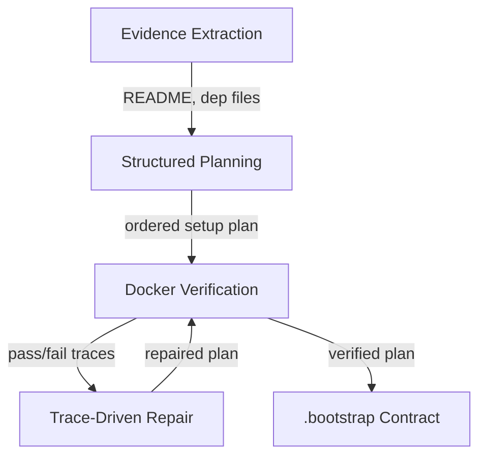

# Distilled Bootstrap Contract: Agent-Authored Repo Setup

> Run a discovery agent once against a fresh repo, verify every step in a Docker container, then version the resolved heuristics as a `.bootstrap` contract that future agents read instead of re-deriving — converting per-session discovery cost into amortised lookup cost.

A distilled bootstrap contract is an agent-authored, version-controlled artefact that records the dependencies, repair steps, and verification commands a coding agent discovered while bootstrapping a repository from a bare environment. Subsequent agent sessions consume the contract directly, skipping the trial-and-error phase. The pattern was introduced as BootstrapAgent, a multi-agent framework that combines evidence extraction, structured planning, Docker-based verification, and trace-driven repair to produce a `.bootstrap` contract, and reports a 92.9% bootstrap success rate alongside a 25.9% reduction in downstream agent token usage and a 22.3% reduction in build time ([arXiv 2605.15815](https://arxiv.org/abs/2605.15815)).

## When This Applies

The pattern pays back only under three conditions. Use it when all three hold; prefer an operator-authored bootstrap file (e.g. `copilot-setup-steps.yml`) or a working `make bootstrap` target otherwise.

- **Multiple agent sessions will bootstrap the same repo.** A single throwaway session does not amortise the discovery cost. The amortisation logic is the same as for caching: cost shifts from per-session to one-time-plus-lookup, and only pays back at reuse.
- **A deterministic build or test target exists.** The discovery agent needs a pass/fail signal it can verify against — `pytest`, `npm test`, `cargo build`, or an equivalent that returns a clean exit code on success ([arXiv 2605.15815](https://arxiv.org/abs/2605.15815)). Without it, distillation degenerates into uncritical transcription of trial-and-error steps.
- **The build system is stable on the order of weeks, not days.** A `pyproject.toml` or `package.json` that churns weekly produces a contract that goes stale faster than it gets reused. Each consumer either re-verifies (eroding the time saving) or trusts a stale contract (eroding correctness).

## How the Pipeline Works

BootstrapAgent decomposes bootstrap discovery into four stages, each producing an artefact the next stage consumes ([arXiv 2605.15815](https://arxiv.org/abs/2605.15815)):



1. **Evidence extraction** parses `README`, dependency manifests, CI files, and other in-repo signals to seed an initial setup plan.
2. **Structured planning** orders the candidate steps into a verifiable sequence rather than a flat list.
3. **Docker-based verification** runs the plan in a clean container and captures execution traces. The deterministic pass/fail signal is what makes the trace usable as a distillation source ([arXiv 2605.15815](https://arxiv.org/abs/2605.15815)).
4. **Trace-driven repair** consumes failed traces and proposes fixes. The paper introduces two optimisations:
   - **Warm repair with clean replay** — debug iteratively against a warm container for speed, but re-validate against a fresh container so the contract remains cold-start reproducible.
   - **Delta repair with sanity check** — guards against the agent gaming verification by overfitting to a spurious pass.

The resulting contract captures environment setup, diagnostic checks, minimal verification commands, and accumulated repair knowledge ([arXiv 2605.15815](https://arxiv.org/abs/2605.15815)). It is version-controlled in the repo so future agents discover and consume it through ordinary file-system reads.

## Why It Works

The pattern works because it converts a per-session **discovery cost** into a one-time **amortised cost** plus per-session **lookup cost**. Each agent session that bootstraps a repo from scratch spends tokens and time on the same evidence-gathering and trial-and-error work; SetupBench measures this waste directly, finding that 38–89% of agent actions during bootstrap are unnecessary compared to optimal human behaviour ([arXiv 2507.09063](https://arxiv.org/abs/2507.09063)). The contract caches the resolved heuristics in a deterministically-verifiable, agent-consumable form so subsequent sessions skip the discovery phase. Docker-based verification is load-bearing: it gives the discovery agent a deterministic pass/fail signal, which is what makes the trial-and-error trace usable as a distillation source ([arXiv 2605.15815](https://arxiv.org/abs/2605.15815)) — without it, no objective ground truth exists from which to extract a contract.

This is the same logic that underlies build artefact caching and the operator-authored `copilot-setup-steps.yml` surface that GitHub Copilot consumes ([GitHub Docs](https://docs.github.com/en/copilot/how-tos/use-copilot-agents/coding-agent/customize-the-agent-environment)). The contract is the *agent-authored* counterpart — automating the production of an artefact previously written by a human.

## When This Backfires

- **One-shot or short-lived repositories.** The multi-agent discovery pipeline (evidence extraction + Docker verification + trace-driven repair) is heavier than a single agent rediscovering setup. If no second session will reuse the contract, the cost is not amortised.
- **Maintainer-authored bootstrap already exists.** When `copilot-setup-steps.yml`, a devcontainer, or a working `make bootstrap` target is in place, an agent-distilled contract duplicates the surface and creates two sources of truth. Prefer the [Repository Bootstrap Checklist](repository-bootstrap-checklist.md) approach.
- **No deterministic verification target.** Repos without `pytest`, `npm test`, or an equivalent give the discovery agent nothing to verify against. Without a pass/fail signal, the agent cannot distinguish a working setup from one that compiles but does not run ([arXiv 2605.15815](https://arxiv.org/abs/2605.15815)).
- **Hallucination-sensitive environments.** SetupBench documents that agents "generate constraints not present in original tasks" during bootstrap ([arXiv 2507.09063](https://arxiv.org/abs/2507.09063)). A distilled contract durably encodes those phantom steps; downstream agents will follow them as if they were necessary.
- **Rapidly changing build system.** If dependency files churn weekly, the contract goes stale faster than agents reuse it. The cheaper non-persistent alternative is Repo2Run-style per-session iterative Docker synthesis, which reports 86.0% success on 420 Python repos without any contract layer ([arXiv 2502.13681](https://arxiv.org/abs/2502.13681)).

## Example

The contract is the agent-authored counterpart of Copilot's operator-authored bootstrap file. Both produce a deterministic setup sequence; they differ in authorship and granularity.

**Operator-authored** — `.github/workflows/copilot-setup-steps.yml` ([GitHub Docs](https://docs.github.com/en/copilot/how-tos/use-copilot-agents/coding-agent/customize-the-agent-environment)):

```yaml
jobs:
  copilot-setup-steps:
    runs-on: ubuntu-4-core
    steps:
      - uses: actions/checkout@v5
      - uses: actions/setup-node@v4
        with:
          node-version: "20"
          cache: "npm"
      - run: npm ci
```

**Agent-authored** — a `.bootstrap` contract produced by the BootstrapAgent pipeline records the same kinds of steps, plus the *diagnostic checks*, the *minimal verification commands*, and the *accumulated repair knowledge* the discovery agent gathered from failed-then-fixed trial-and-error iterations ([arXiv 2605.15815](https://arxiv.org/abs/2605.15815)). The contract format is defined by the BootstrapAgent paper; subsequent agents read it instead of re-running the discovery loop.

## Key Takeaways

- A distilled bootstrap contract caches the resolved repo-setup heuristics that an agent discovered during initial exploration, converting per-session discovery cost into amortised lookup cost.
- The pipeline has four stages — evidence extraction, structured planning, Docker-based verification, and trace-driven repair — and depends on a deterministic build or test target to produce a usable pass/fail signal.
- The pattern is Qualified, not universal: it pays back only when multiple agents will reuse the contract, a verification target exists, and the build system is stable.
- Operator-authored alternatives like `copilot-setup-steps.yml` remain preferable when a maintainer is willing to write one — they are deterministic by construction and avoid encoding agent hallucinations as durable truth.
- The non-persistent baseline (Repo2Run-style per-session iterative Docker synthesis) already hits 86.0% success ([arXiv 2502.13681](https://arxiv.org/abs/2502.13681)), so the marginal value of the contract is bounded by reuse frequency.

## Related

- [Agent Environment Bootstrapping](agent-environment-bootstrapping.md) — Operator-authored `copilot-setup-steps.yml` and the deterministic alternative to agent-discovered setup.
- [Agent-Led Dev-Environment Iteration with Validation and Rollback](agent-led-dev-environment.md) — Adjacent agent-authored bootstrap pattern that synthesises a Dockerfile with rollback per attempt.
- [Repository Bootstrap Checklist](repository-bootstrap-checklist.md) — Dependency-ordered sequence for adding agent support to an existing repo, the operator-authored counterpart to this workflow.
- [Memory Synthesis from Execution Logs](../agent-design/memory-synthesis-execution-logs.md) — General mechanism for extracting durable lessons from agent execution traces; bootstrap distillation is one applied instance.
- [Agent-Generated Onboarding Guide as a Durable Artefact](agent-generated-onboarding-guide.md) — Companion pattern that produces a human-consumable ramp-up guide; the bootstrap contract is the agent-consumable equivalent.
