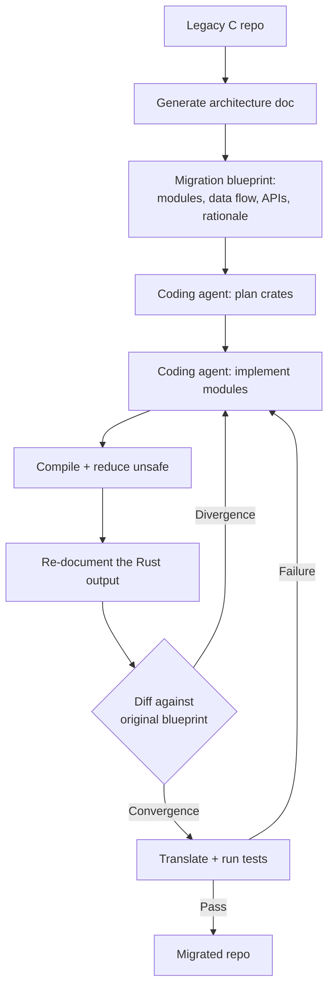

# Documentation-Guided Legacy Migration

> Document a legacy C repository's architecture, hand that blueprint to coding agents, then validate by redocumenting the Rust output and diffing against the original.

File-by-file and function-by-function LLM translators lose architectural intent. They mirror C syntax into unsafe Rust that compiles, passes some tests, and silently violates ownership invariants the original codebase enforced implicitly. The documentation-guided approach inserts a structured intermediate representation — a human-readable architecture document — between the source and the agent that writes the target language.

RustPrint, the system that introduced this pattern, reported 93.26% feature preservation against a 52.52% Claude Code agentic baseline and a 95.17% test pass rate against 79.85%, evaluated on eight real-world C repositories from 11K to 84K LoC ([arXiv:2605.14634](https://arxiv.org/abs/2605.14634v3)).

## Why source-level translation fails

Transpilation tools like [c2rust](https://github.com/immunant/c2rust) produce unsafe Rust that mirrors C control flow. The project itself documents the constraint: "the translator produces unsafe Rust code that closely mirrors the input C code" and "generating safe and idiomatic Rust code from C ultimately requires manual effort." LLM-based translators improve on this — [SACTOR](https://arxiv.org/abs/2503.12511v3) reaches 85% semantic preservation through a two-step unidiomatic-then-idiomatic pass — but idiomatic refinement still fails 48% of the time on CRust-Bench because the agent reasons about syntax, not intent.

The failure is structural. C ownership and lifetimes are implicit in pointer arithmetic, allocator pairing, and naming conventions. When an agent reads C and writes Rust, those implicit conventions never get reified. The Rust output is plausible, but it does not encode the model the original maintainer carried in their head.

## The pattern



Five stages, each with a measurable exit signal.

### 1. Generate the blueprint

Run an agent over the source repository and have it emit architecture-aware documentation: module structure, data flow between modules, public and internal API contracts, and the design rationale for non-obvious decisions. The output is not API reference docs. It is a structured description of what the system does and why, deep enough that a new engineer could reimplement it from the document alone ([arXiv:2605.14634](https://arxiv.org/abs/2605.14634)).

This pass is the most expensive part of the workflow. It pays for itself only when no current maintainer holds the full architecture in their head — exactly the legacy-repo case the pattern targets.

### 2. Plan crates from the blueprint

The agent reads the blueprint and proposes a Rust crate layout — workspace structure, module boundaries, public types. This step is structurally identical to [laying the architectural foundation first](architectural-foundation-first.md), but it operates on derived documentation rather than human intent. The blueprint is the contract: every C module in scope must map to a Rust crate or module, and every C API must map to a public Rust signature.

### 3. Implement modules and reduce unsafe

Coding agents implement crates following the blueprint, check compilability after each module, and reduce `unsafe` blocks step by step. Compilation is a hard gate: non-compiling output cannot proceed. Unsafe reduction is a soft gate: the agent surfaces remaining `unsafe` regions for human review rather than forcing them through on its own.

### 4. Re-document and diff

This validation step distinguishes the pattern. Once the Rust compiles, run the same documentation-generation pass over the translated Rust and diff the resulting document against the original blueprint. Discrepancies are repair signals: a module whose data-flow diagram differs, an API whose contract has drifted, a design rationale the Rust version no longer expresses ([arXiv:2605.14634](https://arxiv.org/abs/2605.14634)). The agent uses these diffs as targeted fix prompts rather than re-running the full translation.

### 5. Test-guided refinement

Translate the C test suite to Rust and execute it against the new code. Runtime failures point to specific assertions, which point to specific modules, which the agent fixes in isolation. Without a usable test suite this step yields nothing — the absence of tests is a hard failure condition for the whole workflow, the same convergence dependency that [staged literal porting](staged-literal-port-with-numeric-oracle.md) resolves with a numeric oracle.

## When to apply

The pattern earns its cost on large legacy repos with no current architectural owner. That is the case where the alternatives — hand-port plus c2rust scaffold, or pure LLM transpilation — both fail because the implicit knowledge has been lost.

Skip the pattern when:

- the codebase is small (under 5K LoC) and single-author. Blueprint extraction adds overhead the maintainer's head already provides, and `c2rust transpile` plus targeted refactoring is faster
- the repo is dominated by inline assembly, compiler intrinsics, or hardware-register access. The blueprint captures intent at module granularity but loses bit-level invariants, so the agent produces idiomatic Rust that compiles and silently misbehaves on real hardware
- there is no usable test suite. The [eval-driven validation loop](eval-driven-development.md) has nothing to converge against
- the repo uses heavy macro-driven metaprogramming. Macros expand to context-specific code, the documentation layer abstracts past variation that matters, and the Rust output collapses cases the macros covered

The pattern generalizes beyond C-to-Rust. Any cross-language legacy migration where the source language encodes invariants implicitly and the target language requires them explicitly — COBOL to Java, Perl to Go, Fortran to modern numerical Rust — has the same structural mismatch the blueprint layer solves.

## Example

Documentation diff as repair signal, from the RustPrint methodology ([arXiv:2605.14634](https://arxiv.org/abs/2605.14634)):

Original blueprint excerpt, generated from C:

```text
Module: cache
  Ownership: producer allocates, consumer frees via cache_release()
  Lifetime: entries valid until cache_clear() or process exit
  API: cache_get() returns borrowed pointer; caller must not free
```

Re-generated documentation, from translated Rust:

```text
Module: cache
  Ownership: Arc<CacheEntry> returned to caller
  Lifetime: entries dropped when last Arc is dropped
  API: cache_get() returns Arc<CacheEntry>; caller drops normally
```

The diff surfaces a real bug: the Rust version changed ownership semantics from caller-managed to reference-counted. That may be intentional or may break callers that relied on the C lifetime model. Either way, the divergence is now a reviewable signal rather than a silent semantic regression.

## Key Takeaways

- Treat documentation as an intermediate representation, not as a human deliverable — the agent reads it, not (only) the maintainer.
- Validate by re-documenting the translation and diffing against the original blueprint; documentation divergence is a measurable proxy for semantic drift.
- Compilation, test pass rate, and blueprint-diff convergence are 3 independent exit gates — pass all three before declaring a module migrated.
- The pattern's cost is the blueprint pass; skip when a maintainer can produce the blueprint from memory, or when the source encodes invariants below module granularity.

## Related

- [Spec-Driven Development with Spec Kit](spec-driven-development.md) — Specification as source of truth for new code; this page covers the legacy-migration analogue.
- [Lay the Architectural Foundation by Hand Before Delegating](architectural-foundation-first.md) — Greenfield analogue: human-authored architecture as the agent's anchor.
- [Monolith-to-Sub-Agents Refactor](monolith-to-subagents-refactor.md) — Sibling pattern for migrating brittle agent prototypes through schema-first contracts.
- [The Research-Plan-Implement Pattern](research-plan-implement.md) — The general three-phase shape this workflow specializes for legacy migration.
- [Staged Literal Porting with a Per-Stage Numeric Oracle](staged-literal-port-with-numeric-oracle.md) — Sibling workflow for the case where a verified executable reference exists; uses production output as the IR rather than a generated architecture document.
