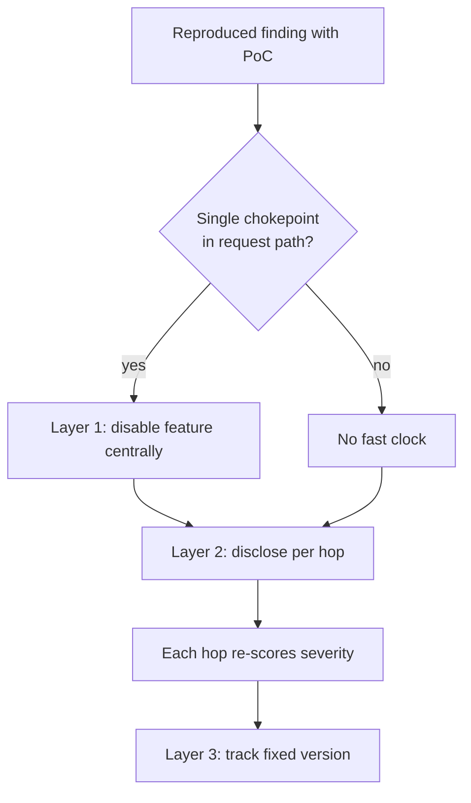

# Downstream Disclosure Coordination for Agent-Found Defects

> A defect an agent finds in a vendored library needs a separate fix and a separate severity call at each hop downstream.

That traversal, not the detection, sets your exposure window. Three conditions decide whether this cycle is worth running. The finding is reproduced with a working proof of concept; below that bar your problem is triage rather than coordination. The vulnerable code reaches you transitively, through a library you consume rather than one you own, so there is a fan-out at all. And the reachable feature can be turned off, which is what gives you something to ship while the upstream fix is in flight. Lose that last one and your exposure window equals the full upstream release cycle however well you coordinate.

## The coordination problem

The August 2026 libheif case is a logistics story, and the logistics are the part you have to staff.

Hacktron, which describes itself as "an AI-native security platform for code reviews and penetration tests" ([Hacktron](https://www.hacktron.ai/)), reported what looked like remote code execution in Next.js image optimization. The bug was not there. "Their investigation found that the vulnerable code was not in Next.js itself, but upstream in libheif, an AVIF image decoder used by Next.js, ImageMagick, WordPress, sharp, and much of the web" ([Vercel, 2026-09-18](https://vercel.com/blog/reproducing-disclosing-and-fixing-the-libheif-vulnerability-with-hacktron-and-the-maintainers)). One decoder defect, four release trains, three maintainer teams to reach, and separate advisories at libheif, sharp, and Next.js.

The receiving queues are already over capacity. GitHub's advisory team reports three numbers from 2026: "Private vulnerability reports across the platform increased from ~550/week in January to more than 3,000/week for most of May." May produced "1,560 reviewed advisories—more than five times our typical monthly output and the highest in its history." And the queue is visibly behind, because "Processing times extended first to about a week, then to multiple weeks for a meaningful share" ([GitHub Blog](https://github.blog/security/supply-chain-security/inside-the-advisory-database-and-what-happens-when-vulnerability-volume-breaks-records/)).

Vercel expects the input side to keep growing. "As LLMs accelerate vulnerability research, we expect to see more upstream vulnerabilities like the libheif RCE surface across the OSS ecosystem" ([Vercel](https://vercel.com/blog/reproducing-disclosing-and-fixing-the-libheif-vulnerability-with-hacktron-and-the-maintainers)).

## Three implementation layers

### Layer 1: central mitigation on the fast clock

Find the narrowest component every vulnerable request passes through and disable the reachable feature there. Vercel closed customer exposure within two days of the report by disabling "AVIF optimization and resizing in that central service". The post states the effect: "Any incoming AVIF images were not passed to libheif for decoding and RCE was not possible on Vercel" ([Vercel](https://vercel.com/blog/reproducing-disclosing-and-fixing-the-libheif-vulnerability-with-hacktron-and-the-maintainers)).

This layer needs a chokepoint and an optional feature. Without both, skip it. The same post is blunt about who does not get it: "Protecting self-hosted applications required a Next.js release" ([Vercel](https://vercel.com/blog/reproducing-disclosing-and-fixing-the-libheif-vulnerability-with-hacktron-and-the-maintainers)).

### Layer 2: per-hop disclosure

Write the chain from your entry point to the vulnerable function before you send the first email. The libheif chain had four hops: `<Image>` invokes `/_next/image`, `/_next/image` calls sharp, sharp calls libvips, libvips uses libheif to decode the image ([Vercel](https://vercel.com/blog/reproducing-disclosing-and-fixing-the-libheif-vulnerability-with-hacktron-and-the-maintainers)).

Each hop is a separate disclosure with its own owner and its own channel. Vercel's security team emailed the sharp and libvips maintainers and opened coordination with libheif through a GitHub Security Advisory. The Next.js team then met the libvips maintainer on 19 August to align across all three ([Vercel](https://vercel.com/blog/reproducing-disclosing-and-fixing-the-libheif-vulnerability-with-hacktron-and-the-maintainers)).

Expect the severity to move as the report travels. Two of the defects were rated "Critical" under CVSSv3 upstream. sharp re-scored the same bug and says why: "sharp does not provide any networking features", so the advisory records a "High" severity under CVSSv4 instead ([GHSA-rgj7-g3m4-5g8c](https://github.com/advisories/GHSA-rgj7-g3m4-5g8c)).

That advisory also carries the scope the upstream framing drops. Impact is "possible remote code execution (RCE) on glibc-based Linux when run under certain conditions", and "Those processing untrusted input with versions of sharp prior to 0.35.4 are affected" ([GHSA-rgj7-g3m4-5g8c](https://github.com/advisories/GHSA-rgj7-g3m4-5g8c)). Take your affected-version range and your conditions from the hop nearest you, never from the top of the chain.

### Layer 3: propagation tracking

The upstream release is a milestone, not the end. Next.js shipped a feature disable rather than a version bump because "the patched libheif release was still propagating downstream, this was the most timely option" ([Vercel](https://vercel.com/blog/reproducing-disclosing-and-fixing-the-libheif-vulnerability-with-hacktron-and-the-maintainers)). The number to track is when a fixed version reaches your lockfile, which here meant sharp 0.35.4 and the libheif 1.23.2 it provides ([GHSA-rgj7-g3m4-5g8c](https://github.com/advisories/GHSA-rgj7-g3m4-5g8c)).

Do not rely on the advisory database to tell you. The sharp record was published in `lovell/sharp` on 27 August and reached the GitHub Advisory Database, where scanners read it, on 8 September ([GHSA-rgj7-g3m4-5g8c](https://github.com/advisories/GHSA-rgj7-g3m4-5g8c)). Once the bump does arrive as a pull request, it competes with every other dependency update in the queue, which is the problem [repair routing by budget](dependency-update-repair-routing.md) addresses.

## Triggers and constraints

The cycle starts on one event: a reproduced finding, not a candidate. It is tool-agnostic. Nothing here depends on which assistant produced the finding. The same shape applies whether the report arrives from an internal agent run, a bug bounty, or a vendor.

Two constraints bound the agent's authority. An agent may map the dependency chain, draft the advisory text, and prepare the mitigation diff, all of which are checkable against the repository. It may not send the disclosure or set the severity. Layer 2 is a judgment about a different attack surface at each hop, and the receiving maintainer carries the cost of getting it wrong. Gate the finding itself first with a [reproduce-before-report verification gate](../code-review/reproduce-before-report-verification-gate.md).

File with the affected version range, the registry the package lives on, and the fix commit in the first message. GitHub asks reporters to "submit complete vulnerability data, coordinate closely with maintainers and researchers, and request CVEs only when there is a clear intention to publish" ([GitHub Blog](https://github.blog/security/supply-chain-security/inside-the-advisory-database-and-what-happens-when-vulnerability-volume-breaks-records/)).

## Why it works

The fix crosses a chain of independently governed release trains, and the latency adds up because each hop waits on a decision nobody else can make for it. Each link re-does the assessment in its own threat context rather than inheriting it. That is why the same defect arrives at sharp with a lower score and a narrower attack vector than it had at libheif ([GHSA-rgj7-g3m4-5g8c](https://github.com/advisories/GHSA-rgj7-g3m4-5g8c)). That call cannot be derived from the upstream record, and it happens once per hop. GitHub names the compounding from the receiving side: "At this scale, small gaps in coordination can become large inconsistencies downstream" ([GitHub Blog](https://github.blog/security/supply-chain-security/inside-the-advisory-database-and-what-happens-when-vulnerability-volume-breaks-records/)).

The lag continues past the upstream release. A study of 1,290 npm package-side fixing releases across a network of 1,553,325 releases found that "stale clients require additional migration effort, even if the package-side fixing release was quick" ([arXiv:1907.03407v5](https://arxiv.org/abs/1907.03407v5), abstract). Detection is a parallel search an agent makes cheap. This chain is a serial handoff that it does not.

## When this backfires

- The finding is not reproduced. curl's confirmed-vulnerability rate fell from "somewhere north of 15% of the submissions" to "below 5%", and the project says slop submissions "take a serious mental toll to manage and sometimes also a long time to debunk" ([daniel.haxx.se, 2026-01-26](https://daniel.haxx.se/blog/2026/01/26/the-end-of-the-curl-bug-bounty/)). Coordination machinery aimed at unvalidated agent output adds to that load. See [Agent-Laundered Bug Reports](../patterns/anti-patterns/agent-laundered-bug-reports.md).
- You own the code end to end. A first-party service with no vendored dependency in the path has one release train and no second clock, so the cycle is pure overhead.
- There is no chokepoint. Layer 1 has nowhere to land, and the plan collapses to waiting on upstream plus your framework's security release.
- The reachable feature is load-bearing. Both mitigations here worked by turning AVIF off. When you cannot disable the feature, Layer 1 is unavailable and the exposure window is the full upstream cycle.
- Read the other way, this incident is coordination succeeding. Fourteen days from proof of concept to a patched upstream release, with three maintainer teams aligned in between, is fast. And the volume figures above measure validation load, not coordination load: report counts, confirmation rates, and review backlogs. Spend on triage precision first.

## Example

The libheif timeline, from the report to the record reaching the scanners ([Vercel](https://vercel.com/blog/reproducing-disclosing-and-fixing-the-libheif-vulnerability-with-hacktron-and-the-maintainers); [GHSA-rgj7-g3m4-5g8c](https://github.com/advisories/GHSA-rgj7-g3m4-5g8c); [sharp v0.35.4 release](https://github.com/lovell/sharp/releases/tag/v0.35.4)):

| Date | Event | Days from report |
|------|-------|------------------|
| 11-12 Aug 2026 | Hacktron reports to Vercel; both reproduce the RCE with a working proof of concept | 0 |
| 13 Aug 2026 | Vercel applies a platform mitigation in its Image Optimization Service | 2 |
| 19 Aug 2026 | Next.js team meets the libvips maintainer; coordination opens across sharp, libvips, libheif | 8 |
| 24 Aug 2026 | Next.js informs its security partners | 13 |
| 25 Aug 2026 | libheif v1.23.2 released, six days after the 19 August meeting; Next.js ships a security release disabling AVIF optimization | 14 |
| 26 Aug 2026 | sharp v0.35.4 released, with libheif 1.23.2 | 15 |
| 27 Aug 2026 | sharp advisory published in `lovell/sharp` | 16 |
| 8 Sep 2026 | The advisory reaches the GitHub Advisory Database, where scanners read it | 28 |

Detection and central mitigation consumed the first two days. The remaining 26 went to coordination, release, and publication. The Next.js release on day 14 disabled a feature rather than bumping a version, so a self-hosted reader who wanted the real fix waited past it.

## Key Takeaways

- Answer "which clock am I on" in the first hour, before the disclosure work starts. The answer is whether one component you operate sits in every vulnerable request path.
- The hop list is the work plan: one owner, one channel, one severity call per line. Draft it before the first email, because each line you discover later restarts the coordination you thought was finished.
- The upstream score can overstate your risk, and the upstream write-up can omit the conditions that bound it. Read the advisory at your own hop for both, and carry its qualifier into whatever you brief.
- Set your own reminder on the fixed version, keyed to your lockfile. Here the scanner-visible record trailed the shipped sharp release by 13 days ([sharp v0.35.4 release](https://github.com/lovell/sharp/releases/tag/v0.35.4)).
- Below a reproduction gate, more findings buy queue load rather than fixes. curl's confirmed rate fell under 5% before it ended its bug bounty.

## Related

- [AI-Powered Vulnerability Triage](ai-powered-vulnerability-triage.md) — the staged decomposition that gets a finding to the point where this cycle starts
- [Agent-Driven Fuzzing with Human-Gated Crash Triage](agent-driven-fuzzing-human-gated-triage.md) — where the human gate sits in the loop that produces these findings
- [Reproduce-Before-Report Verification Gate](../code-review/reproduce-before-report-verification-gate.md) — the precondition this cycle assumes
- [Agent-Laundered Bug Reports](../patterns/anti-patterns/agent-laundered-bug-reports.md) — what happens when the reproduction step is skipped
- [Routing Dependency Updates to Repair Agents by Budget](dependency-update-repair-routing.md) — what happens to the fixed version once it reaches your pull-request queue
