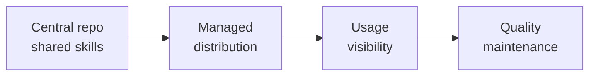
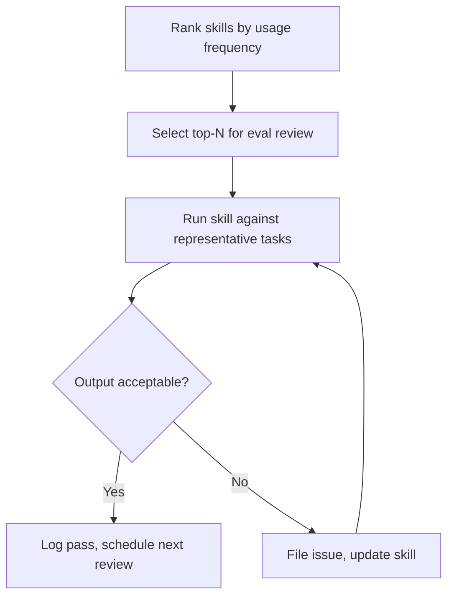

# Enterprise Skill Marketplace: Distribution, Usage Reporting, and Quality Evals

> At 50+ engineers, a shared GitHub repo is no longer sufficient. Skills need managed distribution, usage instrumentation, and a quality maintenance process.

A central repo solves the canonical-source problem — see [Architecting a Central Repo for Shared Agent Standards](central-repo-shared-agent-standards.md). At scale it introduces a new set of concerns: how do skills reach every developer machine reliably, which skills are actually being used, and how do high-traffic skills stay correct over time?

These are operational concerns, not authoring concerns. They require platform infrastructure.

## Maturity Arc



Each stage builds on the previous. Distribution without visibility is fire-and-forget. Visibility without quality maintenance turns popular skills into unreviewed technical debt.

## Stage 1: Managed Distribution

A shared repo requires every developer to clone it and configure their tool. This breaks whenever someone onboards, switches machines, or the repo URL changes.

Claude Code provides two managed distribution paths:

**MDM-managed settings** — Deploy `managed-settings.json` via any MDM (JAMF, Intune, Mosyle, Kandji) or as a macOS plist / Windows registry key. Settings apply to all users on managed devices at OS level and cannot be overridden by user or project settings. This is the highest-trust distribution path. [Source: [Claude Code settings](https://code.claude.com/docs/en/settings)]

**Server-managed settings** — For teams without MDM infrastructure, server-managed settings push policy via Anthropic's servers at every startup and on an hourly poll. Weaker security guarantees than endpoint-managed settings (no OS-level enforcement), but requires zero MDM setup. [Source: [Server-managed settings](https://code.claude.com/docs/en/server-managed-settings)]

Both paths support configuring `extraKnownMarketplaces` and `enabledPlugins` — which defines what the next layer handles.

### Private Plugin Marketplace

Skills distribute via a `marketplace.json` catalog hosted in a private GitHub or GitLab repo. The catalog lists plugin bundles, each containing skill files, agent definitions, hooks, and supporting assets.

Key controls:

| Control | Mechanism | Effect |
|---|---|---|
| Restrict to approved sources | `strictKnownMarketplaces` in managed settings | Block unapproved plugin installs |
| Auto-install on startup | `enabledPlugins` in managed settings | Skills land on every machine at launch |
| Version pinning | `sha` field in marketplace.json | Reproducible deploys, no silent updates |
| Release channels | Separate `ref` values (e.g., `stable` vs `latest`) | Staged rollouts |
| Container seeding | `CLAUDE_CODE_PLUGIN_SEED_DIR` at image build time | Pre-populated dev containers, no runtime cloning |

[Source: [Plugin marketplaces](https://code.claude.com/docs/en/plugin-marketplaces)]

Governance is controlled at the git repo level: who can merge to the marketplace repo determines who can publish skills to the organization.

## Stage 2: Usage Visibility

Without usage data, skill investment is a guess. Two data sources are available:

**Analytics dashboard** — The claude.ai analytics dashboard tracks lines accepted, suggestion accept rate, DAUs, PRs with Claude Code assistance, and a per-user leaderboard. Covers aggregate productivity signals, not skill-specific adoption. [Source: [Analytics](https://code.claude.com/docs/en/analytics)]

**OpenTelemetry events** — The `claude_code.tool_result` OTel event includes `skill_name` when `OTEL_LOG_TOOL_DETAILS=1` is set. Route events to any OTel-compatible backend (Datadog, Honeycomb, Grafana). Tag by team using `OTEL_RESOURCE_ATTRIBUTES`. [Source: [Monitoring](https://code.claude.com/docs/en/monitoring-usage)]

### The Telemetry Gap

The platform tracks whether a skill was invoked. It does not track whether it worked well. A skill called 500 times per week may be producing subtly wrong output on 30% of those invocations — OTel will not surface this.

Usage frequency and output quality are independent signals. High invocation count without quality review is a liability, not a success metric.

Derive per-skill frequency from OTel logs:

```bash
# Aggregate skill invocation counts from OTel logs
# Adjust field names to match your OTel export format
jq -r 'select(.name == "claude_code.tool_result") | .attributes.skill_name' otel-export.jsonl \
  | sort | uniq -c | sort -rn
```

Rank skills by invocation count. This ranking drives the quality maintenance prioritization in Stage 3.

## Stage 3: Quality Maintenance

No built-in eval infrastructure for skills exists in the Claude Code platform. Quality maintenance is a manual practice, not a platform feature.

The core loop:



### Practical Eval Cadence

A lightweight process that scales:

| Usage tier | Invocations/week | Review cadence |
|---|---|---|
| High | >100 | Monthly |
| Medium | 10–100 | Quarterly |
| Low | <10 | On significant platform updates |

For each high-traffic skill, maintain a small set of representative test inputs and expected outputs. Run the skill against these inputs manually or via a CI job that triggers on skill file changes. An LLM-as-judge evaluation can score outputs against a rubric without requiring exact match — see [LLM-as-Judge Evaluation](llm-as-judge-evaluation.md). Anthropic's enterprise guidance requires skill authors to submit evaluation suites and re-run them to detect drift, but provides no built-in eval runner — the suite and harness are the team's responsibility. [Source: [Skills for enterprise](https://platform.claude.com/docs/en/agents-and-tools/agent-skills/enterprise)]

### Quality Gates for Updates

Skills above the high-usage threshold should require eval coverage before updates ship:

1. Developer modifies skill file in the marketplace repo
2. CI runs the skill's eval suite against the representative task set
3. An LLM-as-judge scores outputs — must meet a minimum score threshold
4. PR requires approval from a platform team member before merge

This prevents a popular skill from silently regressing after an update. The gate does not need to be sophisticated — even a one-prompt eval run by CI that flags obvious failures is better than shipping blind.

## Governance Model

| Concern | Mechanism |
|---|---|
| Who can publish | Git repo access controls on marketplace repo |
| What gets installed | `strictKnownMarketplaces` + `enabledPlugins` in managed settings |
| Version stability | SHA pinning in marketplace.json |
| Rollback | Revert marketplace.json commit; pinned SHAs make this deterministic |
| Audit trail | Git history on marketplace repo |

## Key Takeaways

- MDM-managed settings and private plugin marketplaces are the production distribution path; server-managed settings work without MDM infrastructure
- OTel `skill_name` events give invocation counts; they don't measure output quality
- High invocation count without quality review creates liability — usage data and eval cadence must be paired
- Quality evals are a manual practice; no native eval infrastructure exists in the platform
- Governance lives in the git repo hosting the marketplace: access control = publish control

## Related

- [Architecting a Central Repo for Shared Agent Standards](central-repo-shared-agent-standards.md)
- [LLM-as-Judge Evaluation](llm-as-judge-evaluation.md)
- [Content & Skills Audit Workflow](content-skills-audit.md)
- [Agent Skills Standard](../standards/agent-skills-standard.md)
- [OpenTelemetry Agent Observability](../standards/opentelemetry-agent-observability.md)
