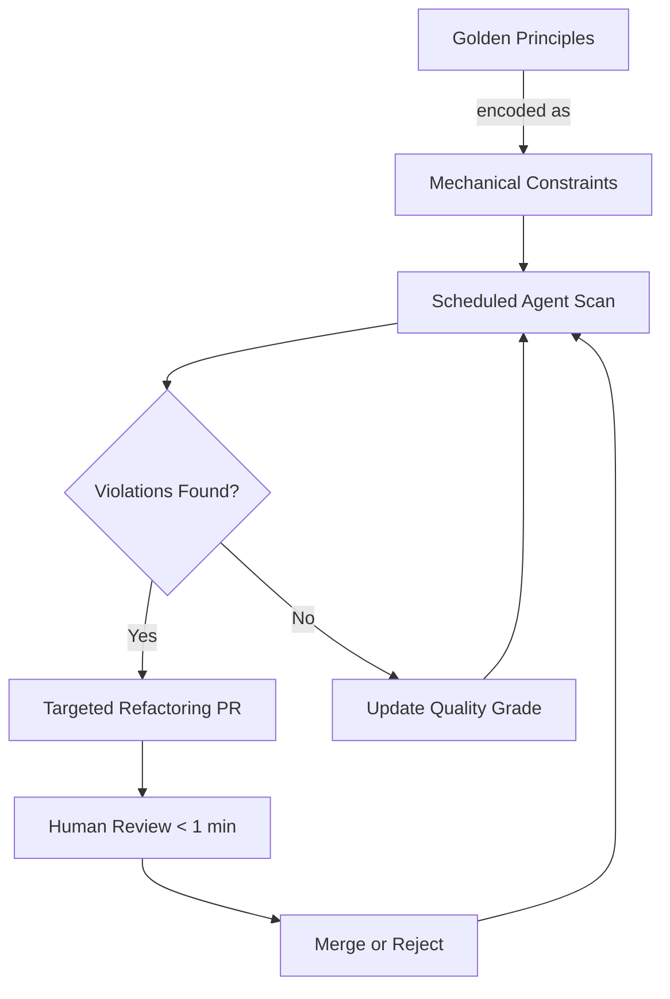
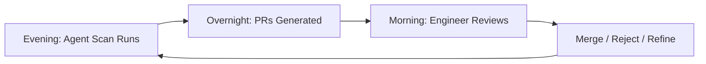

# Entropy Reduction Agents: Automated Codebase Hygiene

> Scheduled background agents that scan for architectural violations, documentation drift, and tech debt, producing targeted refactoring PRs for human review.

## The Problem: Silent Decay

Entropy reduction agents are scheduled background processes that scan a codebase for violations of encoded standards — outdated docs, deprecated patterns, architectural drift — and open targeted PRs for human review. They run on a cadence whether or not anyone pushes a commit, catching decay that reactive CI misses entirely.

Codebases accumulate entropy between changes. Documentation drifts from implementation. Deprecated patterns propagate as agents replicate existing code indiscriminately. Convention violations accumulate in corners no one actively watches. OpenAI's harness engineering team calls this proactive scanning **"garbage collection"** of technical debt ([Martin Fowler — Harness Engineering](https://martinfowler.com/articles/exploring-gen-ai/harness-engineering.html)).

Before adopting this pattern, the OpenAI harness team spent 20% of weekly capacity on cleanup — "AI slop" that proved unsustainable at scale ([Alex Lavaee — OpenAI Agent-First Codebase Learnings](https://alexlavaee.me/blog/openai-agent-first-codebase-learnings/)).

## How It Works



The pattern has three mechanisms ([Alex Lavaee](https://alexlavaee.me/blog/openai-agent-first-codebase-learnings/)):

1. **Encode golden principles** as mechanical constraints in the repo (lint rules, architectural tests, agent instructions)
2. **Run background agents on a cadence** scanning for deviations from those constraints
3. **Auto-generate targeted refactoring PRs** reviewable in under one minute

The core design principle: *"Human taste is captured once, then enforced continuously on every line of code"* ([Alex Lavaee](https://alexlavaee.me/blog/openai-agent-first-codebase-learnings/)).

## CI vs. Entropy Reduction

| Dimension | Traditional CI | Entropy Reduction Agents |
|---|---|---|
| Trigger | Code push / PR | Schedule (nightly, weekly) |
| Posture | Reactive | Proactive |
| Scope | Changed files | Entire codebase |
| Rule format | Deterministic (lint, test) | Judgment + deterministic |
| Output | Pass / fail | Refactoring PR |

The two are complementary. Deterministic linters (ArchUnit, NetArchTest, PyTestArch) catch rule-expressible violations; LLM-based agents handle judgment-heavy ones. The combination covers both categories ([Martin Fowler](https://martinfowler.com/articles/exploring-gen-ai/harness-engineering.html)).

## Why It Works

Entropy accumulates because the cost of fixing each individual violation is low, but the cost of *noticing* it is high — no developer is paid to scan the entire codebase weekly for drift. Entropy reduction agents eliminate the noticing cost. Because violations are caught continuously on a short cadence, each one is small and isolated; the PR required to fix it is proportionally small and reviewable in under a minute. By contrast, entropy caught once per quarter or during a refactoring sprint has compounded into a larger, riskier change.

The second mechanism is behavioral: encoding a standard as a machine-checkable rule forces the team to express it precisely. Vague principles ("keep things clean") cannot be enforced. Precise ones ("all retry logic must use `retry_with_backoff`") can. The act of encoding creates shared, durable, executable understanding that survives team turnover.

## The Tech Debt Tracker

OpenAI tracks debt in a versioned file (`docs/exec-plans/tech-debt-tracker.md`) that agents can both read and update — a living audit log of known deviations and remediation tasks ([Alex Lavaee](https://alexlavaee.me/blog/openai-agent-first-codebase-learnings/)).

This file serves two purposes:

- **Agent-readable input** — the scan prompt references it to avoid re-raising known issues
- **Agent-writable output** — new violations are appended with severity and suggested fix

## Operational Cadence

The nightly-run / morning-review cadence is well-documented at OpenAI: Codex runs overnight, and every morning engineers review the issues it identified, with fixes already waiting ([Pragmatic Engineer — How Codex Is Built](https://newsletter.pragmaticengineer.com/p/how-codex-is-built)).



## Scheduling Mechanisms

| Tool | Mechanism | Durability |
|---|---|---|
| GitHub Actions | `schedule` cron trigger | Durable, repo-scoped |
| Copilot Coding Agent | DailyOps archetype via cron-triggered issues assigned to `@copilot` | Durable, repo-scoped |
| Claude Code | `/loop` skill, [`CronCreate`](../tools/claude/session-scheduling.md) tool | Session-scoped (3-day expiry) |
| External scheduler | OS cron / Task Scheduler invoking CLI | Durable, machine-scoped |

For durable scheduling, GitHub Actions with a cron trigger is the most portable option. Claude Code's `/loop` and cron tools are useful for session-scoped experimentation but expire after three days.

At scale, Pamela Fox's GitHub Repo Maintainer tool demonstrates the pattern across hundreds of repos: it searches for maintenance needs, creates detailed issues assigned to `@copilot`, and receives PRs within minutes ([Pamela Fox — Automated Repo Maintenance](https://blog.pamelafox.org/2025/07/automated-repo-maintenance-with-github.html)).

## Minimal Starting Point

You do not need a full infrastructure to start. The minimal implementation ([Alex Lavaee](https://alexlavaee.me/blog/openai-agent-first-codebase-learnings/)):

1. **One golden principle** encoded as a lint rule or agent instruction (e.g., "all retry logic must use the shared `retry_with_backoff` utility")
2. **A `tech-debt-tracker.md` file** agents can read and update
3. **One periodic prompt** asking the agent to scan for violations (e.g., "find all hand-rolled retry loops bypassing the shared utility")

Start with a weekly manual run. Graduate to automated nightly runs once the false positive rate is acceptable.

## Example

A GitHub Actions workflow that runs a weekly scan for architectural violations:

```yaml
name: entropy-reduction-scan

on:
  schedule:
    - cron: '0 2 * * 1'  # Weekly, Monday 2 AM
  workflow_dispatch:

jobs:
  scan:
    runs-on: ubuntu-latest
    permissions:
      contents: read
      pull-requests: write

    steps:
      - uses: actions/checkout@v4

      - name: Run entropy reduction agent
        uses: anthropics/claude-code-action@beta
        with:
          anthropic_api_key: ${{ secrets.ANTHROPIC_API_KEY }}
          prompt: |
            Read docs/tech-debt-tracker.md for known issues.
            Scan the codebase for violations of the architectural
            principles in AGENTS.md. For each new violation:
              1. Open a focused PR fixing one violation per PR.
              2. Update tech-debt-tracker.md with findings.
            Keep each PR reviewable in under one minute.
            Do not merge any PR.
          allowed_tools: "Read,Write,Bash,mcp__github__create_pull_request"
```

## Quality Validation

This pattern is not fire-and-forget. CodeScene data shows AI breaks code in approximately two-thirds of refactoring attempts without proper validation ([CodeScene — Automated AI Refactoring](https://codescene.com/blog/automatically-fix-technical-debt-with-ai-refactoring)). Safeguards:

- **Human review remains non-negotiable** — every generated PR requires approval
- **Run existing tests** against proposed changes before opening the PR
- **Scope PRs narrowly** — one violation per PR makes review fast and revert trivial
- **Track false-positive rate** — if the agent consistently flags non-issues, refine the golden principle

## When This Backfires

Entropy reduction agents are only as good as the golden principles they enforce. Failure conditions:

- **Poorly specified principles** — vague instructions produce high false-positive rates. Agents flag non-issues, reviewers start ignoring PRs, and the pattern collapses into noise.
- **Missing test coverage** — without running tests against each generated PR, the agent ships breakage. The CodeScene two-thirds failure rate applies to unsupervised refactors; test gates bring this down substantially.
- **Review fatigue** — generating too many PRs per cadence degrades review culture. Scope agents narrowly (one violation per PR) and tune cadence until false positives are rare before scaling up.
- **Drift in the tracker** — if `tech-debt-tracker.md` is not kept current, agents re-raise resolved issues or skip newly identified ones. The tracker requires ongoing maintenance, not just initial setup.

The pattern is not appropriate as a substitute for improving the root-cause process that generates debt. If agents are producing entropy faster than scheduled cleanup can address it, fix the upstream problem first.

## Key Takeaways

- Entropy reduction agents are proactive and scheduled, distinct from reactive CI
- The "garbage collection" pattern encodes human taste once and enforces it continuously
- Start minimal: one principle, one tracker file, one periodic prompt
- Every agent-generated PR requires human review — two-thirds of unsupervised AI refactors introduce breakage ([CodeScene](https://codescene.com/blog/automatically-fix-technical-debt-with-ai-refactoring))
- Combine deterministic architectural tests with LLM-based judgment scanning for full coverage

## Related

- [Continuous AI (Agentic CI/CD)](continuous-ai-agentic-cicd.md)
- [Continuous Agent Improvement](continuous-agent-improvement.md)
- [Agent Harness](../agent-design/agent-harness.md)
- [Hooks Beat Prompts](../verification/hooks-vs-prompts.md)
- [Repository Bootstrap Checklist](repository-bootstrap-checklist.md)
- [Architectural Foundation First](architectural-foundation-first.md)
- [AI Development Maturity Model](ai-development-maturity-model.md)
- [Scheduled Instruction File Fact-Checker](instruction-file-fact-checker.md)
- [The Velocity-Quality Asymmetry](velocity-quality-asymmetry.md)
