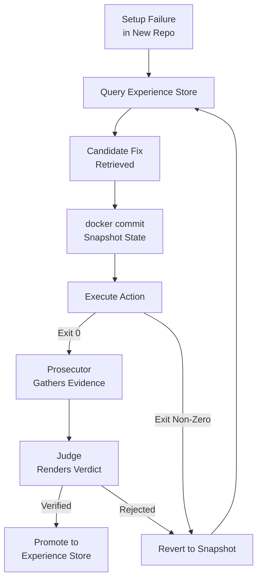

# Experiential-Learning Setup Agents with Snapshot Rollback (SetupX)

> Capture repo-setup fixes as dual-modality records, trial them under Docker snapshot rollback, verify with prosecutor-judge — only when prebuilt environments are off the table.

An experiential-learning setup pipeline is a repository-setup workflow in which the agent stores each successful repair as a portable experience record, replays candidate fixes against a snapshotted Docker state it can revert from, and verifies the outcome with two distinct reasoning roles. SetupX ([Zhou et al., 2026](https://arxiv.org/abs/2605.26186)) introduces this composition under the names XPU (experience-representation unit), experience-augmented speculative execution backed by a LIFO Docker-snapshot stack, and prosecutor-judge verification.

## When to Use

The pattern is **not** the default answer for repository setup. Three preconditions must hold:

1. **No usable dev-environment artifact upstream.** When the target repo ships a maintained devcontainer, Nix flake, or pinned `Dockerfile`, a single declarative pull beats any trial-and-repair loop on latency and reliability. See [Prebuilt Agent Environments](../agent-design/prebuilt-agent-environments.md) and [Agent Environment Bootstrapping](agent-environment-bootstrapping.md) for those alternatives.
2. **Heterogeneous repos with shared substrate.** Cross-repo experience reuse only pays back when the executable actions transfer — repos using the same package manager family (`pip`/`uv`/`poetry`) share installable fixes; a `pnpm` monorepo and a `cargo` workspace share almost none.
3. **Ambiguous verification.** Surface build success does not always imply the repo's documented features run. Multi-service apps with integration-test gates surface this; single-package libraries with one `make test` invocation usually do not.

Setup is independently documented as a weak point for general agents: [SetupBench](https://arxiv.org/abs/2507.09063) — 93 tasks across seven language ecosystems and five databases — found OpenHands hit only 38.9–57.4% on repo-setup tasks and 20.0–53.3% on local database configuration, with 38–89% of agent actions unnecessary compared to optimal human behaviour. That gap is the failure surface this pattern targets.

## Steps

### 1. Capture Experience as a Dual-Modality Record (XPU)

Each verified fix is stored as a record that pairs **textual guidance** (the symptom and reason) with the **executable action** (the exact command sequence that resolved it). The executable half is what makes the experience portable across repos; the textual half is what makes it retrievable.

The dual-modality format is critical. Prior cross-task transfer work shows that low-abstraction memories actively degrade performance on new tasks ([Memory Transfer Learning](../agent-design/memory-transfer-learning.md)) — executable-action records without retrieval-friendly guidance produce negative transfer. The XPU format addresses this by carrying both.

This is a domain specialisation of the general experiential-learning agent pattern that [ExpeL (Zhao et al., 2023)](https://arxiv.org/abs/2308.10144) introduced. See also [Experience Graphs as Structured Memory for Self-Evolving Agents](../agent-design/experience-graphs-self-evolving-agents.md) for the broader memory architecture this composition sits inside.

### 2. Retrieve Candidate Fixes from the Experience Store

When the agent encounters a setup failure in a new repo, it queries the experience store by symptom (build output, error message, missing-tool signature) and produces candidate actions to trial. The textual-guidance half of each XPU record is what makes this retrieval possible — executable actions alone cannot be searched by failure signature.

This step is where the cross-repo amortisation pays off — without it, every setup is solved from scratch.

### 3. Trial Each Candidate Under Snapshot Rollback

Before each state-modifying command, the agent issues `docker commit` to capture the current container state. If the command exits non-zero — or if subsequent verification fails — the agent reverts to the snapshot. This converts irreversible system mutations into reversible ones.

[Repo2Run (Hu et al., 2025)](https://arxiv.org/abs/2502.13681) independently validates this mechanism for Python-repo Dockerfile generation: documenting "environment pollution" as a distinct failure mode (e.g., `pip install tensorflow-gpu` failing but installing `python-version`), Repo2Run's atomic `docker commit`/rollback design hit 86.0% vs. 6.0%/9.0%/22.1% for `pipreqs`, `SWE-agent`, and a README-only LLM baseline. SetupX layers cross-repo experience reuse on top of this same primitive.

Only state-modifying commands trigger snapshots; read-only commands (`ls`, `cat`, `grep`) are excluded ([Repo2Run](https://arxiv.org/abs/2502.13681)) — otherwise per-command overhead dominates wall-clock time.

This step is an applied instance of [Rollback-First Design](../agent-design/rollback-first-design.md) — reversibility is chosen before the action, not bolted on after failure.

### 4. Verify with a Prosecutor-Judge Protocol

After a candidate sequence appears to succeed, a two-role verification protocol decides whether setup is actually complete:

- **Prosecutor** gathers evidence — runs the documented test commands, exercises the entry points named in the README, checks service health endpoints.
- **Judge** reads the evidence and produces the binary verdict.

The split exists because surface exit-code success and "the documented feature actually runs" are not the same property. [SetupBench](https://arxiv.org/abs/2507.09063) names this gap explicitly as "verification-strategy mismatches" — agents declaring setup done when only the install ran, not the feature.

When verification rejects, the agent reverts to the most recent successful snapshot and pulls the next candidate from step 2.

### 5. Promote the Successful Sequence Back to the Store

The verified action sequence — together with the symptom it resolved and the verification evidence — is written back to the experience store as a new XPU record. The next repo that hits the same symptom retrieves this fix in step 2 instead of re-deriving it.

This closes the loop. Without it, the agent learns nothing across repos and the speculative-execution machinery serves only the current run.

## Diagram



## When This Backfires

- **Repos with maintained dev-environment artifacts.** A devcontainer, Nix flake, or pinned Dockerfile produces a working environment in one declarative pull — no agentic reasoning, no snapshot overhead, no verification protocol. Reach for [Prebuilt Agent Environments](../agent-design/prebuilt-agent-environments.md) or [Agent Environment Bootstrapping](agent-environment-bootstrapping.md) before this pattern.
- **Heterogeneous repos with no shared substrate.** When repos span fundamentally different toolchains (`pnpm` monorepo vs. `cabal` vs. `cargo` workspace vs. `uv`), the executable-action half of XPU records shares little reusable content. Prior cross-task transfer work documents that low-abstraction memories cause negative transfer in this regime ([Memory Transfer Learning](../agent-design/memory-transfer-learning.md)).
- **CI hot path with many parallel matrix entries.** Per-command `docker commit` adds seconds of overhead per state-modifying step. On CI runners executing setup across hundreds of matrix entries, this compounds — pre-bake the image instead.
- **Single-shot or rarely-run setups.** XPU's value is amortised reuse. A one-time bootstrap of a single repo never pays back the cost of building, storing, and querying the experience store. The first run dominates.
- **Binary, cheap verification.** When a single `make test` cleanly signals setup success, the prosecutor-judge protocol is overkill. The protocol earns its keep only when "did setup work?" is itself ambiguous.

## Why It Works

The pipeline closes three distinct gaps that general LLM agents leave open in repository setup, and the three mechanisms compose multiplicatively. **Cross-repo experience reuse** through XPU's dual-modality records lets an agent apply a verified fix from repo A to repo B without re-deriving it from logs — the same insight [ExpeL](https://arxiv.org/abs/2308.10144) formalised for general agents, here specialised to setup's executable-action surface. **Safe trial-and-repair under non-invertible state** via `docker commit`/revert converts irreversible system mutations into reversible ones, removing the "environment pollution" failure mode that [Repo2Run](https://arxiv.org/abs/2502.13681) identified independently. **Verification beyond exit codes** through the prosecutor-judge split prevents the failure mode [SetupBench](https://arxiv.org/abs/2507.09063) surfaced — agents declaring setup complete when only the install ran, not the documented feature. Without speculative execution, experience reuse re-pollutes the environment on every failed candidate; without experience reuse, speculative execution re-derives every fix from scratch; without prosecutor-judge, both produce false-positive "done" signals. SetupX reports a 92% pass rate, +19% over its strongest baseline ([Zhou et al., 2026](https://arxiv.org/abs/2605.26186)).

## Example

The setup workflow's decision point — choose pre-bake or experiential trial-and-repair — looks like this:

**Repo audit before setup:**

```
$ ls .devcontainer/ Dockerfile flake.nix
ls: cannot access '.devcontainer/': No such file or directory
ls: cannot access 'Dockerfile': No such file or directory
ls: cannot access 'flake.nix': No such file or directory
```

No dev-environment artifact upstream — pre-bake is not viable for this repo. The agent falls through to the experiential pipeline:

```
$ git log --oneline -5 -- README.md
a1b2c3d docs: update install steps for postgres 17
$ # Symptom signature for retrieval
$ grep -i "postgres" README.md
- PostgreSQL 17+ with the pgvector extension
```

The agent queries the experience store with `postgresql 17 pgvector setup` and retrieves a candidate XPU record from a prior repo (executable action: install via `apt` + enable extension via `psql`). It snapshots the container, runs the candidate, prosecutor runs the documented `make integration-test`, judge confirms the documented feature works. The verified sequence — with this repo's specific symptom — is promoted back to the store, available to the next repo that hits the same constraint.

If the repo had shipped a devcontainer, the entire pipeline above is replaced by a single declarative pull.

## Key Takeaways

- Use this pattern only when prebuilt-environment alternatives are unavailable, repos share enough substrate for experience to transfer, and verification is ambiguous enough to need a two-role protocol.
- The three mechanisms — XPU experience records, snapshot-stack speculative execution, prosecutor-judge verification — compose multiplicatively; dropping any one re-introduces a distinct failure mode.
- Snapshot rollback is independently validated by Repo2Run for Python-repo setup; SetupX generalises it with cross-repo experience reuse.
- The dual-modality XPU format addresses negative-transfer risk by pairing executable actions with retrieval-friendly guidance.
- Promote verified sequences back to the experience store — without the writeback step, the agent learns nothing across repos.

## Related

- [Agent Environment Bootstrapping for AI Agent Development](agent-environment-bootstrapping.md)
- [Prebuilt Agent Environments](../agent-design/prebuilt-agent-environments.md)
- [Rollback-First Design](../agent-design/rollback-first-design.md)
- [Memory Transfer Learning](../agent-design/memory-transfer-learning.md)
- [Experience Graphs as Structured Memory for Self-Evolving Agents](../agent-design/experience-graphs-self-evolving-agents.md)
- [Repository Bootstrap Checklist](repository-bootstrap-checklist.md)
