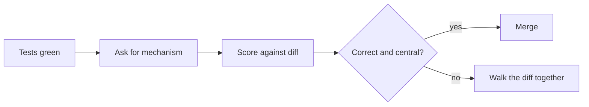

# Explain-the-Change Review Gates for Agent Code

> One developer passed 112 of 136 tests and could not explain the solution. This review gate is where that surfaces before the merge.

An explain-the-change review gate is a review step where the author of a change explains its central mechanism before the change merges, scored against the committed diff rather than against the ticket. A person runs it at merge time, after the test suite and independently of it.

Use the gate where someone will maintain the code, where the change carries core logic, and where you have review minutes to spend. On boilerplate, scaffolding, and throwaway scripts it is overhead. The one study that built this gate and measured it doubts it transfers to experts on routine work: for expert developers "the Explanation Gate would represent purely extraneous load with no germane benefit" ([Sankaranarayanan, arXiv:2602.20206v2](https://arxiv.org/abs/2602.20206v2)).

## Why a green suite is not a maintainable change

Ten experienced developers used GitHub Copilot on an unfamiliar codebase of roughly 67,000 lines. Crossing test performance against explanation scores agreed for eight of them and split for two. P06 passed 112 tests but scored 0 for understanding and said, "No understanding; I didn't really look at any files." P08 passed only 31 tests but scored 10 of 14 on the Tasks 1 and 2 understanding rubric ([Qiao et al., arXiv:2609.33712v1](https://arxiv.org/abs/2609.33712v1)). Ten people in one lab session is a lens, not a distribution, and the authors state the findings "cannot be generalized beyond this sample." What the sample does show is that the two measures come apart inside one person's session.

A 54-participant study separates the same two variables statistically. Initial task accuracy barely predicted comprehension, and the authors conclude that "task completion and comprehension are distinct optimization goals" ([Balepur et al., arXiv:2607.26375v1](https://arxiv.org/abs/2607.26375v1)). A test suite cannot stand in for this gate, because it measures the other variable.

## Three implementation layers



### Layer 1: ask for the mechanism, not the summary

Ask where the functionality lives, how data moves through it, and what triggers the behavior. The primary study proposes the same shape for practitioners, and marks it untested: "Reviewers might ask a developer to explain a central mechanism, point to the relevant changes, describe a runtime check, or predict an edge case. The workflow would let them weigh these explanations separately from passing tests and from requests for agent checks. Whether this adds useful evidence in everyday development remains untested" ([Qiao et al., arXiv:2609.33712v1](https://arxiv.org/abs/2609.33712v1)).

### Layer 2: score correctness before breadth, against the diff

The published rubric runs 0 to 4. Copy the two failing levels into the review template, since those are the ones a reviewer has to recognize under time pressure.

| Score | Level | What the answer does |
|---|---|---|
| 0 | No demonstrated understanding | No explanation of how the implemented solution works |
| 1 | Central model incorrect | Misstates a central mechanism, such as where functionality resides, how data flows, or what triggers the behavior |
| 2 | Partial or mixed | Carries an important error, leaves the central mechanism unexplained, or explains only peripheral parts of the change |
| 3 | Correct but limited | Explains the central mechanism correctly, but is narrow in scope or lacks mechanistic detail across the change |
| 4 | Correct, mechanistic, and broad | Explains multiple mechanisms specifically and covers a substantial portion of the implemented change |

Rubric from [Qiao et al., arXiv:2609.33712v1](https://arxiv.org/abs/2609.33712v1), where "Q2 is graded against the participant's actual implementation, not an ideal solution or a general description of the feature." Grade against an idealized account of the feature instead and the score measures how well the author read the ticket.

Keep the account of the work separate from the account of the code. A coherent story about how the session went earns its own credit even when the implementation is unfinished, and it is not evidence about the change.

### Layer 3: refuse a delegated check as evidence

Asking an agent to verify its work is a message, not a check, and the gate should not accept one in place of an explanation. In the same sample, the two personas that most often asked for agent verification spent the least time testing on the command line; the low-understanding group requested verification in 21.9% of prompts against 15.2% for the high-understanding group ([Qiao et al., arXiv:2609.33712v1](https://arxiv.org/abs/2609.33712v1)). Those are participant-level descriptions from ten people, so treat the direction as the finding and not the size.

## Why it works

Explaining a change forces recall of its causal chain, which is a different act from recognizing that a diff looks right. The gate study calls its intervention "a direct operationalization of the self-explanation effect (Chi et al., 1989), which demonstrates that generating explanations during learning produces substantially deeper encoding than passive study" ([Sankaranarayanan, arXiv:2602.20206v2](https://arxiv.org/abs/2602.20206v2)).

The payoff lands downstream rather than at merge. In the same 54-participant study, comprehension scores predicted how well a user could extend their own code with the agent taken away, and the authors read the pattern as agents that "generate higher-quality code scaffolds but sacrifice comprehension, impairing users' website extension when agents disappear" ([Balepur et al., arXiv:2607.26375v1](https://arxiv.org/abs/2607.26375v1)).

One controlled test of the gate exists, and it ran on novices. Across 78 participants in three conditions, repair success on a 30-minute maintenance task after AI access was revoked was 69.2% for the manual group (18 of 26), 23.1% unrestricted (6 of 26), and 61.5% gated (16 of 26), with chi-square(2)=13.8, p=.001, V=0.42. Both AI groups beat the manual group on functional utility in the build phase (p<.001) and did not differ from each other (p=.64) ([Sankaranarayanan, arXiv:2602.20206v2](https://arxiv.org/abs/2602.20206v2)). The gate recovered most of the maintenance competence that unrestricted use lost, at no measurable cost in build quality.

## When this backfires

- The change is scaffolding or a one-off script. There is no comprehension to protect. The comprehension study grants the case, noting "there are cases that short-term productivity may be sufficient, such as personal projects just for fun" ([Balepur et al., arXiv:2607.26375v1](https://arxiv.org/abs/2607.26375v1)).
- A model grades the explanation and the rubric rewards fluency. When reviewers judged generated assertions, natural-language explanations gave no overall accuracy benefit, and an under-specified explanation scored worse than an exactly matching one (OR=0.58, p=0.037) while raising the reviewer's confidence above having no explanation at all (4.25 of 5 against 3.99, p=0.005) ([Kaufman et al., arXiv:2607.08885v1](https://arxiv.org/abs/2607.08885v1)). Prose is the artifact best able to buy confidence without correctness.
- The author is terse by habit. A low score then records a short answer. The primary study says so directly: "Understanding scores describe the explanations participants gave, not everything they knew" ([Qiao et al., arXiv:2609.33712v1](https://arxiv.org/abs/2609.33712v1)).
- The team reads session activity as understanding instead. Screen time does not carry that signal, since "Monitoring time may therefore overstate attention, and code-viewing time may understate reading" ([Qiao et al., arXiv:2609.33712v1](https://arxiv.org/abs/2609.33712v1)).
- Review capacity is already the constraint. In the one study that timed it, gate interventions took a median of 14.2 minutes out of a 90-minute build session, a significant velocity penalty against unrestricted use (p<.001, d=1.52) ([Sankaranarayanan, arXiv:2602.20206v2](https://arxiv.org/abs/2602.20206v2)), and [review capacity is the binding constraint](../human/author-to-reviewer-role-inversion.md) on most agent-era teams.
- Nobody enjoys it. 72% of gated participants initially called the gate "annoying" or "an obstacle", though 64% of those who went on to fix the planted bug said it was the only reason they knew where to look ([Sankaranarayanan, arXiv:2602.20206v2](https://arxiv.org/abs/2602.20206v2)).

## Triggers and constraints

The gate fires on a pull request that is already green, never on a schedule, because its input is the committed diff and its output is a human decision about merging. Three constraints bound it.

- The gate blocks the merge and nothing else. It does not reject the code, order a rewrite, or score the author. A failing explanation routes to walking the diff together.
- Only a person who did not write the change may run it. An author who scores their own explanation is grading the artifact they just produced.
- Scope is set before dispatch, not at review. Decide which changes are gate-eligible when you decide what to delegate, using the tiers in [delegation decision](../patterns/agent-design/delegation-decision.md).

The workflow is tool-agnostic. The cited evidence comes from GitHub Copilot sessions and a Cursor plugin, and nothing in the three layers depends on either.

## Example

A weak gate question invites a summary of the ticket:

```text
Can you explain what this PR does?
```

A gate question that forces a lookup in the diff:

```text
Which module owns the uniqueness check on the short name, what calls it,
and what happens on the second request? Point me at the lines.
```

The second version names the mechanism, asks for the trigger, and demands a pointer into the committed change. An author who delegated the work and never opened the files cannot produce it. That failure is the signal.

## Key Takeaways

- Read a green suite as evidence about the code, never about the team. The two measures split for 2 of the 10 developers in the primary study.
- Grade the explanation against the committed diff. Graded against the ticket, it measures reading the ticket.
- Score correctness before breadth. An answer that misstates where the functionality lives fails whatever else it covers.
- "I asked the agent to verify it" is not a verification. In the one sample that measured both, the developers who asked most checked least themselves.
- Gate core logic somebody will maintain, and skip boilerplate. The gate's own authors expect it to be dead weight for experts on routine work.
- The gate has one controlled test, on 78 novices. Treat the 23.1% against 61.5% repair-success split as directional.

## Related

- [Comprehension Debt: When Developers Understand Less of Their Own Codebase](../patterns/anti-patterns/comprehension-debt.md) — the debt this gate is a payment against
- [Stated-Understanding Checks: Asking the Agent to Correct You](../human/stated-understanding-checks.md) — the in-session mirror, where the developer states a belief and the agent checks it
- [Author-to-Reviewer Role Inversion in AI-Assisted Teams](../human/author-to-reviewer-role-inversion.md) — why the review minute this gate spends is the scarce one
- [Per-Task Verification Budget: Size the Task to Fit the Check](per-task-verification-budget.md) — the sizing rule that decides whether a change fits a gate at all
- [The Delegation Decision: When to Use an Agent vs Do It Yourself](../patterns/agent-design/delegation-decision.md) — where gate eligibility gets set, before dispatch

## Sources

- [Qiao, Haque and Hundhausen, "Beyond the Prompt: Linking What Developers Ask, Do, and Understand with Coding Agents", arXiv:2609.33712v1](https://arxiv.org/abs/2609.33712v1)
- [Sankaranarayanan, "Mitigating Epistemic Debt in Generative AI-Scaffolded Novice Programming using Metacognitive Scripts", arXiv:2602.20206v2](https://arxiv.org/abs/2602.20206v2)
- [Balepur et al., "(Im)Paired Programming: Coding Agents Improve Productivity but Harm Understanding", arXiv:2607.26375v1](https://arxiv.org/abs/2607.26375v1)
- [Kaufman et al., "Programmers Are Poor and Overconfident Judges of LLM-Generated Assertions", arXiv:2607.08885v1](https://arxiv.org/abs/2607.08885v1)
