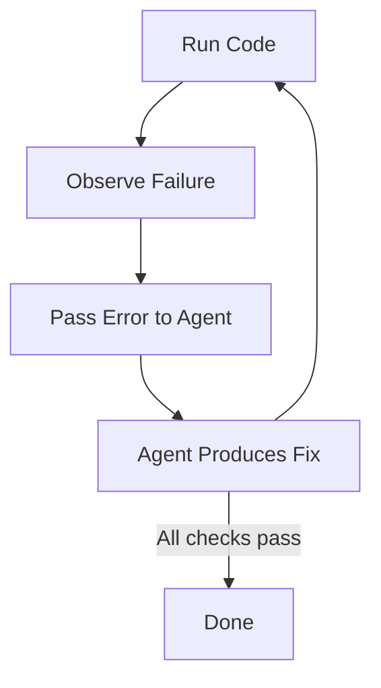

# Failure-Driven Iteration

> A development technique where you deliberately run code to generate error output, then feed that output to the agent as the primary context for the next fix — grounding solutions in real signals rather than speculative descriptions.

## Core Loop

The technique follows a four-step cycle: run the code, observe the failure, pass the error to the agent, verify the fix. This loop is sourced directly from GitHub's [Copilot CLI](../tools/copilot/copilot-cli-agentic-workflows.md) guide, which describes it as "run, inspect, ask, review diff — keeps the agent grounded in real output instead of abstract prompts" ([GitHub Blog](https://github.blog/ai-and-ml/github-copilot/from-idea-to-pull-request-a-practical-guide-to-building-with-github-copilot-cli/)).



Claude Code best practices call this "the single highest-leverage thing you can do" — giving the agent a way to verify its own work. The recommended prompt pattern: paste the error, ask the agent to fix it and verify the build succeeds, and address root cause rather than suppress the error ([Claude Code Best Practices](https://code.claude.com/docs/en/best-practices)).

## Why Error Output Is Superior Context

Error output contains structured, machine-generated information with higher signal density than human descriptions:

| Error Signal | Information Provided |
|-------------|---------------------|
| Stack trace | Exact file, line number, call chain |
| Compiler error | Type mismatch, missing import, syntax location |
| Test failure | Expected vs. actual values, failing assertion |
| Lint violation | Rule name, file location, auto-fix suggestion |

A stack trace tells the agent exactly where the problem is, what type of error occurred, and the execution path that led there. A human description ("the login page is broken") provides none of this. Pasting the actual error output eliminates ambiguity and reduces wasted iterations.

## Fast Feedback Tools

The technique works best with tools that produce immediate output — seconds, not minutes:

- **Type checkers** (TypeScript `tsc`, mypy, Rust `cargo check`) — catch type errors without running the program
- **Linters** (ESLint, Ruff, Clippy) — catch style and correctness issues with auto-fix suggestions
- **Unit tests** — validate behavior against specific expectations
- **REPL sessions** — test individual functions in isolation
- **Build systems** — catch compilation errors before runtime

Slow feedback (full integration suites, manual QA, staging deployments) breaks the iteration cadence. Invest in fast verification loops to make this technique effective.

## Prompt Patterns

Effective failure-driven prompts share a structure: paste the error, request a fix, and specify verification ([Claude Code Best Practices](https://code.claude.com/docs/en/best-practices)):

**Root cause fix**: "The build fails with this error: [paste error]. Fix it and verify the build succeeds. Address the root cause, don't suppress the error."

**Test-driven fix**: "This test fails: [paste output]. Write a fix that makes the test pass without modifying the test."

**Cascading fix**: "Running `npm test` produces these 3 failures: [paste output]. Fix them one at a time and verify each fix before moving to the next."

The key constraint in each pattern: the agent must verify via the same tool that produced the error, closing the loop.

## Relationship to TDD

Failure-driven iteration is broader than TDD. TDD requires writing tests first; failure-driven iteration works with any error signal — compiler output, linter warnings, runtime exceptions, even build system errors. The technique applies whenever a tool produces structured failure output that can be passed to the agent.

When combined with TDD, failure-driven iteration accelerates the red-green cycle: the failing test provides the error context, the agent generates the fix, and the test re-run verifies it.

## Structured Verification Cycles

Anthropic's [evaluator-optimizer](../agent-design/evaluator-optimizer.md) pattern formalizes this loop: one LLM generates a response while another provides evaluation and feedback, iterating until quality criteria are met. Agents "iterate on solutions using test results as feedback" ([Anthropic: Building Effective Agents](https://www.anthropic.com/engineering/building-effective-agents)).

For long-running agents, Anthropic recommends running "a basic end-to-end test before implementing a new feature" at session start, catching undocumented bugs from previous sessions. Git-based recovery ("use git to revert bad code changes and recover working states") creates structured fallback points when iteration stalls ([Anthropic: Effective Harnesses](https://www.anthropic.com/engineering/effective-harnesses-for-long-running-agents)).

LangChain's harness engineering research validates the approach with a structured "Plan & Discovery, Build, Verify, Fix" cycle. [Pre-completion checklists](../verification/pre-completion-checklists.md) force verification before the agent exits, preventing premature completion without testing ([LangChain: Harness Engineering](https://blog.langchain.com/improving-deep-agents-with-harness-engineering/)).

## When to Stop Iterating

The failure mode of this technique is the doom loop — iterating on the same error without making progress. Signs to watch for:

- The same error reappears after a fix attempt
- The agent alternates between two conflicting fixes
- Fix complexity increases with each iteration without convergence

When iteration stalls, stop the agent, revert to the last working state, and re-approach the problem with a different strategy. Loop detection middleware (edit-count tracking, identical-failure detection) automates this judgment.

## Example

A TypeScript project fails its CI build. The engineer pastes the compiler output directly into the agent prompt:

**Error output**:
```
src/api/auth.ts(42,18): error TS2345: Argument of type 'string | undefined' is not assignable to parameter of type 'string'.
  Type 'undefined' is not assignable to type 'string'.
```

**Prompt**: "The build fails with this error: [paste above]. Fix the root cause and verify `tsc --noEmit` passes. Do not suppress with a type cast."

**Agent fix**: The agent reads `auth.ts` at line 42, finds that `process.env.JWT_SECRET` is typed as `string | undefined`, and adds a null check that throws a startup error if the variable is absent — addressing the root cause rather than suppressing the type error.

**Verification**: The agent runs `tsc --noEmit`. Output: no errors. The loop closes.

The full cycle — paste error, fix root cause, re-run tool — took one iteration. No description of "the auth module is broken" was needed; the compiler error provided complete, unambiguous context.

## Key Takeaways

- Paste actual error output rather than describing the problem — structured errors provide higher-signal context than prose
- Close the verification loop by requiring the agent to re-run the same tool that produced the error
- Invest in fast feedback tools (type checkers, linters, unit tests) to keep the iteration cadence tight
- Address root causes explicitly in prompts — "fix the error" invites suppression, "fix the root cause" invites understanding
- Watch for doom loops and stop iterating when the same error recurs or fix complexity grows without convergence

## Related

- [Red-Green-Refactor with Agents: Tests as the Spec](../verification/red-green-refactor-agents.md)
- [Test-Driven Agent Development: Tests as Spec and Guardrail](../verification/tdd-agent-development.md)
- [Incremental Verification](../verification/incremental-verification.md)
- [Context-Injected Error Recovery](../context-engineering/context-injected-error-recovery.md)
- [Loop Detection](../observability/loop-detection.md)
- [Eval-Driven Development](eval-driven-development.md)
- [Escape Hatches](escape-hatches.md)
- [Plan-First Loop](plan-first-loop.md)
- [Verification-Centric Development](verification-centric-development.md)
- [Evaluation-Driven Tool Development](eval-driven-tool-development.md)
- [Vibe Coding](vibe-coding.md)
