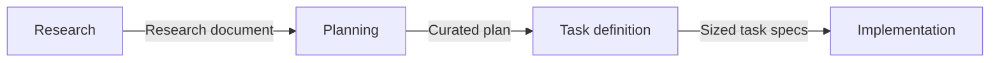

# Four-Phase Agent Delegation with Curated Artifacts

> Four phases, each closing with a curated artifact that replaces the conversation, so human effort concentrates upstream and delegation widens as artifacts firm up.

The report scopes itself to hard work: "For non-trivial tasks, how practitioners structure their work with the coding agents determines whether reliable results follow." Treat that as the entry condition. Where the change is routine, or a failing test names its own fix, the four artifacts are cost you do not get back. Infobip's AI research team published this as an experience report, and the honest framing is theirs: they have no measurement showing the workflow beats unstructured delegation ([Kapetanovic et al., arXiv:2608.30701v1](https://arxiv.org/abs/2608.30701v1)).

## Why the phases exist

Long conversations degrade. Across six generation tasks, models lose an average 39% moving from single-turn to multi-turn, and the decomposition blames unreliability rather than lost ability: "when LLMs take a wrong turn in a conversation, they get lost and do not recover" ([Laban et al., arXiv:2505.06120v1](https://arxiv.org/abs/2505.06120v1)). Agent-assisted work that runs as one long thread accumulates exactly that liability, and the failed corrections stay in context alongside the good ones.

The phased response is to stop carrying the thread. Each phase ends by condensing what was learned into a document, and the next phase starts fresh from that document.

## The four phases

Every quotation in this section is from the Infobip report ([Kapetanovic et al., arXiv:2608.30701v1](https://arxiv.org/abs/2608.30701v1)).

### Phase 1: research

The agent explores with "access limited to read operations, codebase search, and domain-specific tools such as literature search". The practitioner steers direction without fixing an answer early. Output is "a curated research document that captures validated findings", where validated means a human checked them rather than the agent asserted them.

### Phase 2: planning

The research document goes in, and practitioner and agent develop the implementation approach through discussion. The team then cuts that discussion down to the decisions that survived. That reduction is the point: "The act of manual curation is the primary application of the compress strategy in the workflow."

Infobip plans in the agent's default mode rather than a dedicated planning mode, because "dedicated planning modes push the agent to finalize prematurely, producing plan artifacts before the problem is sufficiently understood". That runs against the tooling advice most vendors give. The model-side evidence agrees: LLMs "make assumptions in early turns and prematurely attempt to generate final solutions, on which they overly rely" ([Laban et al., arXiv:2505.06120v1](https://arxiv.org/abs/2505.06120v1)).

### Phase 3: task definition

The plan becomes machine-readable tasks. Each records "a stable identifier, goal, dependencies, relevant code paths, acceptance criteria, and validation method". The sizing rule is the load-bearing part: "Tasks are sized to complete in a fresh session and split when the required context would exceed the agent's effective operating range, which can be substantially below nominal capacity."

A task that does not fit a fresh session is not a task yet. It is two.

### Phase 4: implementation

Each task runs in its own fresh session loaded with project-level instructions and one task definition. Workflow state lives outside the code: "The task registry stores status, dependencies, acceptance criteria, and the latest outcome; an append-only activity log records actions, validation results, changed files or commits, failures, and the next action."

The split is the point: "Git stores code state, while the registry and log store workflow state, making conversation state disposable." After an interruption a fresh session reads those artifacts, inspects the working tree and latest commit, and resumes or reverts.

## Which context strategy each phase applies

The four operations are not the report's own. It takes them from Lance Martin and maps the phases onto them: "write (persist information outside the context window), select (retrieve relevant information into the window), compress (retain only required tokens), and isolate (split context across sessions or agents)" ([Kapetanovic et al., arXiv:2608.30701v1](https://arxiv.org/abs/2608.30701v1)). The report pairs them against four failure modes it credits to Breunig: distraction, confusion, poisoning, and clash.

| Phase | Primary operations | How it shows up |
|-------|--------------------|-----------------|
| Research | Select, isolate | Read-only tool access; a session scoped to exploration |
| Planning | Compress | Manual curation of the discussion into validated decisions |
| Task definition | Isolate | Tasks sized to a single fresh session |
| Implementation | Isolate, write, compress | One session per task; registry and log outside context |

Compare [phase-specific context assembly](../context-engineering/phase-specific-context-assembly.md), which answers what content each phase's agent receives. This table answers which operation the phase performs.

## Why it works

Two mechanisms, and only the first is about context. Replacing conversation history with a curated artifact restarts each phase near the top of the model's effective operating range instead of deep in the degraded thread the multi-turn drop above measures. [Reasoning retention and compaction](../context-engineering/reasoning-retention-and-compaction.md) covers that degradation on its own terms.

The second is error-cost asymmetry, and it is why the human effort sits where it does: "In our experience, flawed research can propagate into flawed plans and code, while correcting generated code can introduce bloat and fragility" ([Kapetanovic et al., arXiv:2608.30701v1](https://arxiv.org/abs/2608.30701v1)). A research error is wrong once and gets copied forward. A code error gets corrected by adding code. So "human involvement is highest in the upstream phases, where errors carry the greatest cost, and decreases as artifacts mature".

## When this backfires

- Fast verification. The whole argument rests on correction being expensive. Where a suite runs in seconds and failures are compile or assertion errors, try-and-fix converges before the research document is written.
- Routine changes in familiar code. The artifacts restate what the engineer already holds. Reloading project-level instructions into every fresh session then buys measured cost with no measured gain: providing repository-level context files "does not generally improve task success rates, while increasing inference cost by over 20% on average" ([Gloaguen et al., arXiv:2602.11988v2](https://arxiv.org/abs/2602.11988v2)).
- Requirements that move mid-build. A curated plan is persistent and authoritative by design, so a stale one misleads harder than a live conversation would.
- Task specs without an executable check. Drop the acceptance criteria and validation method and the handoff to a fresh session becomes the planner-coder gap, which a mutation study traced to 75.3% of multi-agent code-generation failures ([Lyu et al., arXiv:2510.10460v2](https://arxiv.org/abs/2510.10460v2)).
- Solo, short-lived work. A dependency-carrying registry and an append-only log are coordination machinery. One engineer on a two-day change has nobody to coordinate with.

The unresolved cost is measurement. The authors state it plainly: "There are no established metrics for workflow effectiveness. Practitioners cannot measure whether their phased workflow improves outcomes compared to unstructured delegation" ([Kapetanovic et al., arXiv:2608.30701v1](https://arxiv.org/abs/2608.30701v1)). One team, no comparison arm. Treat the phases as a structure to try, not a result to cite.

## Triggers and tool coverage

The workflow is human-triggered at every boundary. Nothing schedules a phase transition. A practitioner decides the research document is complete, decides which decisions survive curation, and decides a task is small enough. Agent authority widens across the four phases: read-only in research, conversational in planning, and write-capable only in implementation, where the task definition bounds what it may touch.

Tool-agnostic. The report specifies artifact shapes and session boundaries, not a vendor. The one detail that binds to tooling is the planning-mode finding, which applies wherever the agent offers a dedicated plan mode.

## Key Takeaways

- Size the task to a fresh session before you dispatch it. A task that needs more context than one clean session holds should be split, not summarized harder.
- Keep workflow state in a registry and an append-only log, separate from git. Code state and progress state answer different questions and neither reconstructs the other.
- A dedicated planning mode can push an agent to finalize before the problem is understood; Infobip plans in the default mode and curates by hand instead.
- Curation is the compression step, not a formality. What you cut from the planning conversation is what stops propagating into the code.
- Skip the phases when correction is cheap. Front-loading only pays back where a wrong assumption survives to production.

## Related

- [The Research-Plan-Implement Pattern](research-plan-implement.md) — the three-phase per-task inner loop this extends with a task-definition stage
- [The 7 Phases of AI-Assisted Feature Development](7-phases-ai-development.md) — the feature-lifecycle model, one scope up
- [Phase-Specific Context Assembly](../context-engineering/phase-specific-context-assembly.md) — what each phase's agent receives, as against which operation it performs
- [Context Compression Strategies](../context-engineering/context-compression-strategies.md) — the compress operation the planning phase applies by hand
- [Spec-Driven Development](spec-driven-development.md) — the adjacent practice of writing the specification before the code

## Sources

- [A Phased Workflow for Operating LLM-Based Coding Agents (arXiv:2608.30701v1)](https://arxiv.org/abs/2608.30701v1) — Kapetanovic, Duricic, Mercep, and Lacic, Infobip; CIKM '26
- [LLMs Get Lost In Multi-Turn Conversation (arXiv:2505.06120v1)](https://arxiv.org/abs/2505.06120v1) — Laban, Hayashi, Zhou, and Neville
- [Evaluating AGENTS.md: Are Repository-Level Context Files Helpful for Coding Agents? (arXiv:2602.11988v2)](https://arxiv.org/abs/2602.11988v2) — Gloaguen, Mündler, Müller, Raychev, and Vechev
- [Understanding and Bridging the Planner-Coder Gap (arXiv:2510.10460v2)](https://arxiv.org/abs/2510.10460v2) — Lyu et al.
