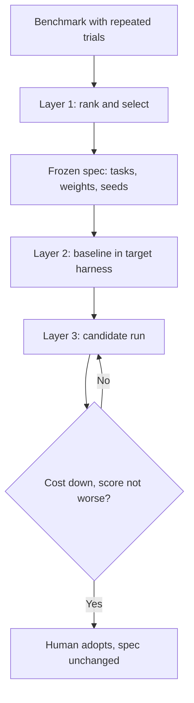

# Frozen Task Sets for Affordable Agent A/B Testing

> A frozen task set turns one public benchmark's repeated trials into a cheap instrument you rerun after every change to skills and instructions.

Build the instrument once, then stop touching it. You take tasks from a benchmark that publishes repeated per-task trials and keep only the ones whose single run tracks the full-benchmark score. You re-run those in your own harness to get a real baseline. Then the tasks, the scoring and the weights stay fixed for every comparison after that. DeltaSelect is the published implementation of this cycle, and its case study ran 13 evaluations over an eight-task set for $27.86 in recorded model cost ([Conn, 2026](https://arxiv.org/abs/2609.19607v1)).

What you end up with settles cost questions and leaves score questions open. That asymmetry is the thing to plan around.

## The cost of measuring every change

Full benchmarks "remain the right tool for broad comparisons, but their cost prevents routine use during development" ([Conn, 2026](https://arxiv.org/abs/2609.19607v1)). In the published DeepSWE trial data, 898 scored trials across two configurations cost $3,063.63. So the decisions that recur most, an instruction edit or a reasoning-level change, are the ones that price excludes from measurement.

Cutting to one run per task does not fix it on its own, because most tasks are weak evidence at one run. Resampling a single trial per configuration 10,000 times from DeepSWE's four published runs, the median task reached a fifth-percentile Pearson correlation of 0.321 against the full configuration score; only 22 of 113 tasks reached 0.50 and only two exceeded 0.70 ([Conn, 2026](https://arxiv.org/abs/2609.19607v1)). That 0.50 mark is a reporting cut rather than a selection rule, and allocation walks the complete ranking ([Conn, 2026](https://arxiv.org/abs/2609.19607v1)). A low-ranked task is not a broken task. It is a task whose single run tells you little about this particular decision, which is why the order you walk matters more than the count you can afford.

## Conditions this workflow needs

Four things have to be true before the cycle returns a number you can act on.

- The benchmark you draw from publishes repeated per-task trials across several configurations. DeltaSelect's input snapshot holds 22,417 usable trials over 18 models, 50 model-effort configurations and 113 tasks ([Conn, 2026](https://arxiv.org/abs/2609.19607v1)). Without repeated trials there is no distribution to rank tasks by.
- Its verifier records partial credit, not just pass or fail. Ranked on the fraction of new fail-to-pass tests passed, 22 tasks cleared the 0.50 cut; on binary pass/fail the same procedure left 11, and on preserved pass-to-pass tests alone it left zero ([Conn, 2026](https://arxiv.org/abs/2609.19607v1)).
- Your candidate stays inside the range the snapshot covers. Across 11 benchmark-prediction methods on 19 benchmarks, effectiveness "sharply declines when new models have higher accuracy than previously seen models", and in that extrapolation setting none of them consistently beat a simple average over random samples ([Zhang, Dorner and Hardt, 2026](https://arxiv.org/abs/2506.07673v2)).
- The change you want to detect is large. The case study's adopted configuration moved the calibrated score by 5.90 percentage points with a standard error of 5.90 points and a two-sided *p* of 0.326 ([Conn, 2026](https://arxiv.org/abs/2609.19607v1)). A small edit will not clear that.

Miss one and you are better served by [a purpose-built suite drawn from your own traces](../verification/purpose-built-eval-suites.md).

## Three implementation layers

### Layer 1: Rank and select under a dollar budget

Rank every task by the fifth percentile of its resampled one-run correlation, then scan that fixed order greedily against a per-arm dollar budget, skipping tasks that no longer fit and continuing to cheaper ones further down ([Conn, 2026](https://arxiv.org/abs/2609.19607v1)). Price never reorders the ranking. It only decides how far down the ranking your budget reaches, which keeps a cheap unreliable task from displacing an expensive reliable one.

Export the result as one specification: the selected tasks, repetition count, calibration coefficients, weights, price assumptions, source checksum and random seeds ([Conn, 2026](https://arxiv.org/abs/2609.19607v1)).

### Layer 2: Re-baseline in your own harness

Published numbers describe the harness that produced them, and they do not carry over. Running the same model, reasoning level and eight tasks under a different harness, the recorded cost was $0.32, $1.34 and $3.00 at low, medium and high reasoning against published estimates of $0.13, $0.38 and $2.04, between 1.5 and 3.5 times higher ([Conn, 2026](https://arxiv.org/abs/2609.19607v1)). Scores moved further. The published low-reasoning estimate of -0.54% became 20.43% in the target harness, a gap of 21.0 points ([Conn, 2026](https://arxiv.org/abs/2609.19607v1)).

So the published budget is a planning input and your first baseline run is the operating number. Check headroom here too, and read it from the raw pass fractions rather than the calibrated score, which is unbounded and has no literal distance from 100% ([Conn, 2026](https://arxiv.org/abs/2609.19607v1)).

### Layer 3: Iterate with the spec frozen

Every subsequent evaluation reuses the same tasks, calibration, weights and repetition count. Changing any of them "would define a different benchmark, so its results would not be combined with the original series" ([Conn, 2026](https://arxiv.org/abs/2609.19607v1)). That constraint is what makes the thirteenth point comparable to the first.

Over 13 such evaluations the adopted configuration cost 58.1% less than the initial one, and every one of the eight matched task costs fell, which a two-sided exact paired sign-flip test puts at *p*=0.008 ([Conn, 2026](https://arxiv.org/abs/2609.19607v1)). Recorded model calls fell from 55 to 37.

## Why it works

Ranking on the fifth percentile of a resampled correlation distribution selects for one property: whether one execution of that task still carries the signal four executions carried. One trial is drawn independently from each configuration's four published runs, the resulting one-run vector is correlated against the fixed full-score vector, and the draw repeats 10,000 times. A task ranks highly "only if most one-run combinations preserve a strong relationship with full-score variation across the observed configurations" ([Conn, 2026](https://arxiv.org/abs/2609.19607v1)).

That is a different quantity from mean difficulty, which is why a low-ranked task is not a bad task. It means only that one execution of it provides weak evidence for this particular decision. Keeping fractional verifier results rather than collapsing them to pass or fail is the other half of the mechanism, because partial progress is the signal that separates a near-complete attempt from a failed one, and binary scoring throws it away ([Conn, 2026](https://arxiv.org/abs/2609.19607v1)).

## Triggers and constraints

The cycle is manual and tool-agnostic. It triggers on a change you made to the agent's skills, instructions, reasoning level, or model, and it produces a score and a recorded cost for a human to weigh. Nothing in it merges or ships anything.

The adoption decision stays human, and the case study is candid about why. The adopted revision was kept because it corrected an observed scope-expansion defect, cost less on all eight tasks, and showed no material score regression, even though its score gain was not significant ([Conn, 2026](https://arxiv.org/abs/2609.19607v1)). Requiring significance on every edit would stop development. Treating the measurement as a veto on harm rather than as proof of benefit is what keeps the loop usable.

## When this backfires

- Your candidate is better than anything in the snapshot. Per-task calibration onto a published full score is benchmark prediction, and benchmark prediction "fails just when it is most needed: at the evaluation frontier" ([Zhang, Dorner and Hardt, 2026](https://arxiv.org/abs/2506.07673v2)). A ranking fitted on last quarter's models is ranking tasks for a system that no longer resembles them.
- You expected the selector to earn its keep over a random sample. It has not been shown to. A random sample with a regression fitted on it outperformed most of 11 published selection methods across 19 benchmarks ([Zhang, Dorner and Hardt, 2026](https://arxiv.org/abs/2506.07673v2)), and DeltaSelect's own limitations concede that matched-cost comparisons against random, cheapest-first and median-correlation selection were never run ([Conn, 2026](https://arxiv.org/abs/2609.19607v1)).
- You read the score as a ranking. Micro-benchmark evidence is blunt here. No method tested could consistently rank model pairs 3.5 accuracy points apart on MMLU-Pro or 4 points apart on BIG-bench Hard, and ranking close pairs consistently often took as many as 250 examples ([Yauney, Warraich and Swayamdipta, 2026](https://arxiv.org/abs/2510.08730v2)). An eight-task set is an A/B instrument for one system, never a leaderboard.
- A selected task is broken. Small sets magnify bad tasks, and OpenAI withdrew its recommendation of SWE-Bench Pro after estimating a roughly 30% broken-task rate ([Conn, 2026](https://arxiv.org/abs/2609.19607v1)). One bad task is an eighth of an eight-task instrument.
- The set saturates. An earlier six-task pilot at high reasoning left five of six tasks at 96.7% to 100% of checks passed, with no room left to measure an improvement ([Conn, 2026](https://arxiv.org/abs/2609.19607v1)).
- You keep tuning against the same tasks. Repeated development on a fixed set "can also specialize a system to their repositories, graders, or workflow patterns" ([Conn, 2026](https://arxiv.org/abs/2609.19607v1)). This is the held-out gap covered in [Eval Blind Spots](../verification/eval-blind-spots.md), and freezing the set makes it worse.

## Example

The published case study froze eight DeepSWE tasks, selected under a $0.65 one-run budget at low reasoning, then ran 13 evaluations of successive skill and instruction revisions against them ([Conn, 2026](https://arxiv.org/abs/2609.19607v1)).

| Case-study evaluation | Calibrated score | Recorded price (eight tasks) | Raw F2P |
|---|---|---|---|
| Initial skills and instructions | 36.46% | $4.18 | 251/411 |
| Adopted skills and instructions | 42.36% | $1.75 | 265/411 |

The path between those two rows was not a climb. Restricting plan review cut cost to $2.01 and then $1.86 in evaluations 3 and 4, and scores fell to 30.38% and 29.71%. Evaluation 8 made the coordinator resume the implementer until it reported completion, which took one task from zero to 46 of 48 checks, raised total cost to $2.40, and did not improve the aggregate ([Conn, 2026](https://arxiv.org/abs/2609.19607v1)).

Evaluation 13 added two scope checks so plan-review and code-review findings could be accepted only when they stayed inside the user's request. It scored 42.36% at $1.75 against evaluation 12's 39.75% at $1.82 ([Conn, 2026](https://arxiv.org/abs/2609.19607v1)). Three configurations were repeated unchanged and moved by 0.7 to 4.3 calibrated points, which is the size of wobble to expect before reading a single-run difference as a result.

## Key Takeaways

- Rank tasks on one-run reliability before price enters. Only 22 of 113 DeepSWE tasks cleared a fifth-percentile correlation of 0.50, and the median task sat at 0.321.
- Check what your verifier records before anything else. The same ranking kept 22 tasks on fractional scores and 11 on pass/fail, so a binary-only benchmark halves your candidate pool.
- Never plan a budget from published prices. The same tasks and model cost 1.5 to 3.5 times the published estimate in a different harness.
- Freeze tasks, calibration and weights before the first comparison, and treat any later change to them as starting a new series.
- Read the cost column first. The published case study reached *p*=0.008 on cost and *p*=0.326 on score.
- The selector is unproven against a random sample at equal cost, so spend your doubt there rather than on the freeze.

## Related

- [Purpose-Built Eval Suites for Model and Harness Swaps](../verification/purpose-built-eval-suites.md) — the alternative starting point, where the tasks come from your own traces instead of a public benchmark.
- [Adaptive Validation Task Selection](../verification/adaptive-validation-task-selection.md) — the opposite move, resampling a different subset each round instead of freezing one.
- [Harness Hill-Climbing](../patterns/agent-design/harness-hill-climbing.md) — the single-agent tuning loop that reads whatever instrument you build here.
- [Audit the Noise Floor Before Trusting a Benchmark Gap](../verification/benchmark-noise-floor-audit.md) — the variance source this selection procedure does not measure.
- [Eval Blind Spots](../verification/eval-blind-spots.md) — what a frozen set stops being able to see over a long tuning series.
