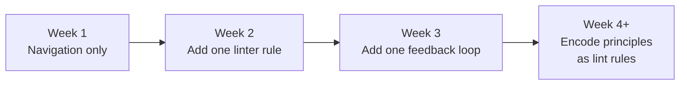

# Getting Started: Setting Up Your Instruction File

> The instruction file is the single highest-leverage artifact for agent-assisted development. It gives agents the context they need to navigate your codebase, follow your conventions, and run your toolchain from the first interaction.

## Pick Your File

Each tool reads a different file. Pick the one that matches your tool, or maintain multiple if your team uses more than one:

| Tool | File | Location |
|------|------|----------|
| Claude Code | `CLAUDE.md` | Repo root or `.claude/CLAUDE.md` |
| GitHub Copilot | `copilot-instructions.md` | `.github/copilot-instructions.md` |
| Any AGENTS.md-compatible tool | `AGENTS.md` | Repo root |

If you use multiple tools, see [Project Instruction File Ecosystem](../instructions/instruction-file-ecosystem.md) for convergence strategies. The rest of this page is tool-agnostic -- the content principles apply regardless of file name.

## Bootstrap or Start from Scratch

**Claude Code users**: run `/init`. Claude analyzes your codebase -- build systems, test frameworks, code patterns -- and generates a starting file. If a `CLAUDE.md` already exists, `/init` suggests improvements rather than overwriting.

**Everyone else**: create the file manually. A blank file with four sections is better than no file at all.

## Minimal Viable Structure

Start with these four sections. Each one answers a question the agent will ask within its first few actions:

```markdown
# project-name

Brief description of what the project does and its primary language/framework.

## Commands

- Build: `npm run build`
- Test: `npm test`
- Lint: `npm run lint`
- Single test: `npm test -- path/to/file.test.ts`

## Conventions

- Commits follow Conventional Commits format
- Use 2-space indentation
- Error handling: return errors, don't throw

## Architecture

- API handlers: `src/api/handlers/`
- Database models: `src/models/`
- Shared utilities: `src/lib/`
- See `docs/architecture.md` for full system design
```

That is roughly 20 lines. It gives the agent enough to navigate, build, test, and follow your conventions from the first interaction.

## What Belongs In vs. Out

| Include | Exclude |
|---------|---------|
| Build, test, lint commands | Full documentation (link instead) |
| Conventions that deviate from defaults | Generic advice ("write clean code") |
| Architectural constraints and navigation pointers | Task-specific instructions (put in the prompt) |
| Things the agent gets wrong repeatedly | Knowledge the agent can discover from code |

**Pruning test**: for each line, ask "Would removing this cause the agent to make mistakes?" If not, cut it.

## Iterate, Don't Prewrite

The most effective instruction files are grown, not designed upfront. The recommended progression:



**Week 1**: project identity, build/test commands, directory layout. ~20 lines. Enough to stop the agent from guessing where things live.

**Week 2**: add the convention the agent violates most often. One rule, stated specifically. "Use `unknown` over `any` in TypeScript" is useful; "follow TypeScript best practices" is not.

**Week 3**: add a feedback loop -- a command the agent should run to verify its own output. "Run `npm test` before committing" or "Run `npx eslint --fix` after editing `.ts` files."

**Week 4 onward**: when you find yourself adding the same instruction repeatedly, encode it as a lint rule or pre-commit hook instead. Deterministic enforcement beats probabilistic compliance.

## Keep It Short

Target under 200 lines per file. Every line consumes context budget before the agent starts working on your actual task. Long instruction files reduce adherence — instruction-following accuracy degrades as instruction density increases, with even leading frontier models achieving only 68% accuracy at 500 instructions ([IFScale, 2025](https://arxiv.org/abs/2507.11538)).

When you outgrow 200 lines:

- **Claude Code**: split into [`@path` imports](../instructions/import-composition-pattern.md) or `.claude/rules/` files with path-scoped frontmatter
- **Copilot**: use `.github/instructions/*.instructions.md` files with `applyTo` globs
- **AGENTS.md**: break into multiple `AGENTS.md` files in subdirectories

## Instructions Are Context, Not Enforcement

Agents read instruction files on a best-effort basis. They are not configuration. Specificity and conciseness improve compliance, but they cannot guarantee it.

For rules that must never be violated, use deterministic mechanisms:

- Pre-commit hooks
- CI checks
- Linter rules
- File permission restrictions

The instruction file tells the agent what to aim for. Hooks and CI tell it what it cannot ship. Both are necessary; neither is sufficient alone.

## Let the Agent Write Its Own File

An effective bootstrapping technique: ask the agent to draft or improve the instruction file after it has explored the codebase. The agent surfaces context it actually needs rather than what you guess it needs.

```
Analyze this codebase and draft a CLAUDE.md that covers:
build/test commands, key conventions, and directory layout.
Keep it under 50 lines.
```

Review and edit the output. The agent often discovers conventions you follow implicitly but never documented.

## Example: From Zero to Effective

A real progression for a TypeScript API project:

=== "Day 1"

    ```markdown
    # billing-api

    TypeScript + Express API for subscription billing.

    ## Commands

    - Test: `pnpm test`
    - Build: `pnpm build`
    - Dev: `pnpm dev`
    ```

=== "Week 2"

    ```markdown
    # billing-api

    TypeScript + Express API for subscription billing.

    ## Commands

    - Test: `pnpm test`
    - Build: `pnpm build`
    - Dev: `pnpm dev`
    - Single test: `pnpm test -- --testPathPattern=<file>`

    ## Conventions

    - Use `unknown` over `any`
    - Errors return Result types, never throw
    - All handlers in `src/handlers/` export a single default function
    ```

=== "Month 2"

    ```markdown
    # billing-api

    TypeScript + Express API for subscription billing. Monorepo with
    `packages/api`, `packages/shared`, `packages/worker`.

    ## Commands

    - Test: `pnpm test`
    - Build: `pnpm build`
    - Lint: `pnpm lint` (run before committing)
    - Single test: `pnpm test -- --testPathPattern=<file>`

    ## Conventions

    - Use `unknown` over `any`
    - Errors return Result types, never throw
    - All handlers in `src/handlers/` export a single default function
    - Database queries use the repository pattern in `src/repos/`
    - Shared types live in `packages/shared/src/types/`

    ## Architecture

    - See `docs/architecture.md` for system design
    - Webhook processing: `packages/worker/src/webhooks/`
    - Do not modify `src/generated/` — these files are auto-generated
    ```

Each version adds only what the agent needed and did not have. Nothing is added speculatively.

## When This Backfires

Instruction files create value when they are maintained. They create liability when they are not:

- **Stale structural references mislead.** Directory paths, file names, and module boundaries change. An instruction file that documents `src/api/handlers/` after a refactor actively directs the agent to the wrong place. Update the file or remove the reference when the codebase changes.
- **Auto-generated files underperform.** Asking the agent to draft its own instruction file is a useful bootstrapping technique, but LLM-generated context files tend to be generic and verbose. The output works as a first draft — not a finished file. Review and trim aggressively before committing.
- **Over-specification reduces adherence.** Adding more rules does not guarantee more compliance. Instruction-following accuracy degrades as instruction density increases. A file with 30 specific, high-signal rules outperforms one with 150 that includes noise.

## Related

- [CLAUDE.md Convention](../instructions/claude-md-convention.md)
- [AGENTS.md: A README for AI Coding Agents](../standards/agents-md.md)
- [Project Instruction File Ecosystem](../instructions/instruction-file-ecosystem.md)
- [Hierarchical CLAUDE.md](../instructions/hierarchical-claude-md.md)
- [Cargo-Cult Agent Setup](../anti-patterns/cargo-cult-agent-setup.md)
- [Agent-Driven Greenfield Product Development](agent-driven-greenfield.md)
- [Repository Bootstrap Checklist](repository-bootstrap-checklist.md)
- [Central Repo and Shared Agent Standards](central-repo-shared-agent-standards.md)
- [Team Onboarding for Agent Workflows](team-onboarding.md)
- [Agent-Powered Codebase Q&A and Onboarding](codebase-qa-onboarding.md)
- [Agent Environment Bootstrapping](agent-environment-bootstrapping.md)
- [CLI-IDE-GitHub Context Ladder](cli-ide-github-context-ladder.md)
- [Continuous Agent Improvement](continuous-agent-improvement.md)
- [Continuous Documentation](continuous-documentation.md)
- [Permutation Frameworks](permutation-frameworks.md)
- [Instruction File Fact Checker](instruction-file-fact-checker.md)
- [Runbooks as Agent Instructions](runbooks-as-agent-instructions.md)
- [Codebase Readiness](codebase-readiness.md)
- [Pre-Execution Codebase Exploration](pre-execution-codebase-exploration.md)
- [Failure-Driven Iteration](failure-driven-iteration.md)
