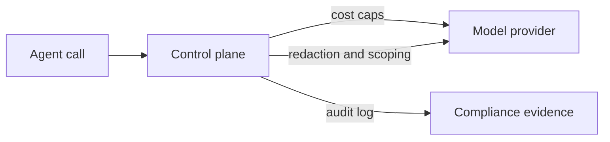

# A Governance Framework for Production Agents

> Govern production agents on three axes at once — cost, control, and compliance — as one enforced system, not per-incident fixes.

Production agent governance designs cost, control, and compliance rules as one enforced system that applies to every model, tool, and agent call, rather than adding controls one incident at a time. The framework comes from LangChain's model for running agents in production, which organizes the problem on those three axes ([LangChain: Building Governed Agents](https://www.langchain.com/blog/building-governed-agents-a-framework-for-cost-control-and-compliance)).

This is a way to think about governance, not a product setting. It differs from vendor policy toggles such as [agent governance policies](agent-governance-policies.md), which configure one tool's controls. The three axes describe what any production agent deployment must cover, whatever tools enforce it.

## Why governance can't be bolted on

Agents are becoming production infrastructure: they answer customers, write and deploy code, and act across business systems. As their autonomy grows, the question is how to apply policy to every interaction without slowing adoption ([LangChain](https://www.langchain.com/blog/building-governed-agents-a-framework-for-cost-control-and-compliance)).

Per-incident controls fail here because agent behavior is unbounded. Spend has no natural ceiling — one request can cascade into hundreds of calls, and a retry loop can burn thousands of dollars overnight before anyone notices ([Finout: Agentic AI Cost Governance](https://www.finout.io/blog/agentic-ai-cost-governance-controlling-spend-before-it-controls-you)). Finout, citing Gartner, reports a forecast that more than 40% of agentic AI projects will be cancelled by 2027, with escalating cost and weak controls among the drivers. Designing governance as a system means the next unplanned behavior is already covered.

## The three axes

### Cost

Cost governance sets budgets and attributes spend before an invoice arrives. Apply hard limits at the organization, team, user, or API-key level, and layer daily, weekly, and monthly caps ([LangChain](https://www.langchain.com/blog/building-governed-agents-a-framework-for-cost-control-and-compliance)). One key per agent or workload turns spend into something you can attribute without a separate tracking system. Pair the caps with per-request and per-session limits and circuit breakers that stop an agent when a threshold is hit ([Finout](https://www.finout.io/blog/agentic-ai-cost-governance-controlling-spend-before-it-controls-you)). Model routing then matches each task to an approved model that meets the required quality, latency, and cost — cheaper models for narrow tasks, capable models reserved for deep reasoning.

### Control

Control governance decides what an agent may do, not just what it may say. For agents, the larger risk is often the action, not the output ([LangChain](https://www.langchain.com/blog/building-governed-agents-a-framework-for-cost-control-and-compliance)). Scope which tools an agent can call and which credentials it receives ([blast radius containment](../security/blast-radius-containment.md)), route consequential actions through a [human approval gate](../security/human-in-the-loop-confirmation-gates.md), and redact sensitive data before it reaches a model. Guardrails detect patterns — regular expressions for structured data like card numbers, model-based detection for names or jailbreak attempts — but they reduce risk rather than remove it, so back them with deterministic limits over content filtering alone ([LangChain](https://www.langchain.com/blog/building-governed-agents-a-framework-for-cost-control-and-compliance)).

### Compliance

Compliance governance produces evidence that the controls work. Regulations including GDPR, HIPAA, and the risk-tiered EU AI Act require organizations to show not only that a policy exists but that it is applied consistently ([LangChain](https://www.langchain.com/blog/building-governed-agents-a-framework-for-cost-control-and-compliance)). That means audit logs that capture who ran a workload, which policy version applied, what outcome followed, and which tools or providers were used — retained under access and retention rules. Wire these into [agent observability](../observability/agent-observability-otel.md) so the audit trail is a byproduct of running the agents, not a separate pipeline.

## How enforcement works

The three axes converge on one enforcement point. LangChain frames it as an LLM gateway that sits between agents and providers: a single place to authenticate usage, select approved models, minimize exposed context, enforce spend and data policies, and retain decision evidence ([LangChain: LangSmith LLM Gateway](https://www.langchain.com/blog/introducing-llm-gateway)). Governance sets the rules; the gateway applies them to every request. When a spend cap is hit, the agent receives a clear error rather than a surprise invoice; when a policy fires, it is logged as evidence.

## Why it works

A single enforcement point makes policy consistent and provable. When every model, tool, and agent hop passes one control plane, the same rule is applied the same way each time and each decision is recorded — so you can demonstrate to a regulator that a policy was applied, not just written ([LangChain](https://www.langchain.com/blog/building-governed-agents-a-framework-for-cost-control-and-compliance)). Per-team reimplementation drifts and cannot be shown to hold. The cost half works for the same reason: upstream limits prevent overruns before they happen, because agent spend is driven by behavior with no natural ceiling and cannot be caught reliably after the fact ([Finout](https://www.finout.io/blog/agentic-ai-cost-governance-controlling-spend-before-it-controls-you)). A central chokepoint also separates applications from model volatility, so you can change providers or prices behind a stable policy surface.

## When this backfires

Governance as a system earns its cost only in production. It backfires when:

- The agent is a prototype or a solo project. A single spend cap and a sandbox cover nearly the same risk for far less effort, and the full framework is premature.
- The control plane has no failure design. Sitting in the critical path, a gateway without fail-open or fail-closed rules, fallbacks, and load balancing becomes a single point of failure and a latency tax on every call ([LangChain](https://www.langchain.com/blog/building-governed-agents-a-framework-for-cost-control-and-compliance)).
- Approval cycles run slower than delivery. Developers route around slow allowlists with personal subscriptions and sideloaded servers, which erases the visibility the framework was meant to create — the same shadow-IT failure that [agent governance policies](agent-governance-policies.md) warns about.
- Teams over-trust guardrails. Pattern detection misses novel formats and model-based detection produces false positives and negatives, so content filtering cannot gate consequential actions on its own.

## Example

A team ships a customer-support agent that can issue refunds. Cost: each agent instance gets its own API key with a daily cap, and a circuit breaker halts it after 500 calls in an hour. Control: the refund tool is scoped to amounts under $50, and anything above routes to a [human approval gate](../security/human-in-the-loop-confirmation-gates.md); social-security and card numbers are redacted before any model sees them. Compliance: every refund decision logs the policy version, the model used, and the outcome, retained for audit. When a prompt-injection attempt drives a burst of refund attempts, the cost cap and the approval gate both fire, and the audit log shows exactly what was blocked and why.

## Key Takeaways

- Production agent governance covers three axes at once — cost, control, and compliance — designed as one enforced system rather than per-incident fixes.
- Cost is budgets and attribution (per-key caps, circuit breakers, model routing); control is what the agent may do (tool scoping, approvals, redaction); compliance is provable evidence (audit logs, policy versioning) for regulations like GDPR, HIPAA, and the EU AI Act.
- The axes converge on a single enforcement point — a control plane applied to every model, tool, and agent call — which makes policy consistent and demonstrable.
- The framework is for production: prototypes, control planes without failure design, slow approval cycles, and over-trusted guardrails are where it backfires.

## Related

- [Agent Governance Policies](agent-governance-policies.md) — the vendor product-policy layer that enforces these axes in GitHub Copilot; relate, do not confuse.
- [Agent Development Lifecycle for Agent Products](../patterns/agent-design/agent-development-lifecycle.md) — the build-test-deploy-monitor loop these controls gate.
- [Blast Radius Containment: Least Privilege for AI Agents](../security/blast-radius-containment.md) — the control axis in depth.
- [Human-in-the-Loop Confirmation Gates](../security/human-in-the-loop-confirmation-gates.md) — approvals for consequential actions.
- [Agent Observability in Practice: OTel, Cost Tracking, and Trajectory Logging](../observability/agent-observability-otel.md) — the cost and audit evidence layer.
- [Canary Rollout for Agent Policy Changes](canary-rollout-agent-policy.md) — rolling out a policy change safely.
