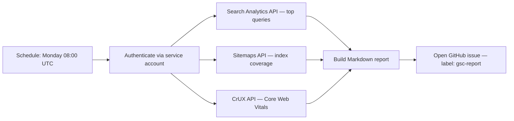

# Google Search Console Monitoring Workflow

> Automate organic search health monitoring with GSC and Bing WMT: one-time verification, weekly API-driven reports, and an on-demand `/gsc-report` skill — replacing manual dashboard checks with structured, actionable summaries.

## Why Automate Search Console

GSC is the authoritative source for how Google sees the site. It exposes index coverage gaps, real CrUX performance (not lab data), crawl anomalies, schema errors, and query performance. Without a reporting loop, regressions are invisible until traffic drops.

Bing WMT provides the same data for Bing and Microsoft Copilot Search. It has no public API `[unverified]` — setup is manual, monitoring is dashboard-only.

## One-Time Setup

### Google Search Console

1. Verify ownership at [search.google.com/search-console](https://search.google.com/search-console):
   - DNS TXT record (preferred — survives server changes)
   - HTML meta tag (requires deploying to the site)
2. Submit sitemap: `https://agentpatterns.dev/sitemap.xml`
3. Add the site as an `sc-domain:` property to cover all subdomains and protocols
4. Add the service account email: Settings → Users and permissions → Add user → Restricted

### Bing Webmaster Tools

1. Verify ownership at [bing.com/webmasters](https://www.bing.com/webmasters) — DNS TXT or HTML meta tag
2. Submit sitemap: `https://agentpatterns.dev/sitemap.xml`
3. Enable IndexNow: Bing WMT → IndexNow → Auto-submit

### GCP Service Account for API Access

```bash
# Create service account
gcloud iam service-accounts create gsc-reporter \
  --display-name="GSC Reporter"

# Create JSON key
gcloud iam service-accounts keys create gsc-key.json \
  --iam-account=gsc-reporter@<project-id>.iam.gserviceaccount.com

# Enable APIs
gcloud services enable searchconsole.googleapis.com chromeuxreport.googleapis.com
```

Add the service account email to GSC via Settings → Users and permissions → Add user.

Store credentials as GitHub Actions secrets:

| Secret | Value |
|--------|-------|
| `GSC_SERVICE_ACCOUNT_JSON` | Full content of `gsc-key.json` |
| `GSC_SITE_URL` | `sc-domain:agentpatterns.dev` |
| `CRUX_API_KEY` | GCP API key restricted to Chrome UX Report API |

## Automated Weekly Report

A scheduled GitHub Actions workflow runs every Monday at 08:00 UTC, calls the GSC and CrUX APIs, and opens a GitHub issue with the results.



Workflow: `.github/workflows/gsc-weekly-report.yml`
Report script: `scripts/gsc_report.py`

Report sections:

| Section | API | Notes |
|---------|-----|-------|
| Index coverage | GSC Sitemaps API | Submitted vs indexed counts per sitemap |
| Core Web Vitals | CrUX API | Real user data, trailing 28 days, mobile |
| Top queries | Search Analytics API | Top 10 by impressions, last 7 days |
| Crawl anomalies | GSC dashboard | No bulk API — links to GSC Indexing → Pages |
| Schema errors | GSC dashboard | No bulk API — links to GSC Enhancements |

## On-Demand: `/gsc-report`

Run `/gsc-report` to fetch the latest data without waiting for the weekly schedule.

The `gsc-report` skill (`.github/skills/gsc-report/SKILL.md`) provides:

- Authentication pattern using service account credentials
- API call templates for queries, sitemaps, and CrUX
- Output format matching the weekly report structure
- Tips on rate limits, data lag, and CrUX dataset coverage

Trigger via GitHub CLI:

```bash
gh workflow run gsc-weekly-report.yml --repo agentpatterns-ai/content
```

Or run locally:

```bash
# Requires GSC_SERVICE_ACCOUNT_JSON, GSC_SITE_URL, CRUX_API_KEY in env
uv pip install google-auth requests
python scripts/gsc_report.py
cat /tmp/gsc_report.md
```

## Data Constraints

| Constraint | Detail |
|------------|--------|
| Search Analytics lag | ~3 days — report end date is `today - 3` |
| CrUX window | Trailing 28 days — not the past 7 days |
| URL Inspection rate limit | 2,000 requests/day — spot-check only |
| Bing WMT | No public bulk export API — dashboard-only |
| CrUX origin eligibility | Insufficient real-user traffic returns 404 from CrUX API |

## Related

- [Content & Skills Audit Workflow](content-skills-audit.md) — URL health and staleness detection for published docs
- [Continuous Triage](continuous-triage.md) — label-based routing for automated issue handling
- [Agent Observability in Practice](../observability/agent-observability-otel.md) — structured monitoring patterns applicable beyond GSC

## Sources

- [Google Search Console API reference](https://developers.google.com/webmaster-tools/v1/api_reference_index)
- [Chrome UX Report API](https://developer.chrome.com/docs/crux/api/)
- [Core Web Vitals thresholds — web.dev](https://web.dev/articles/vitals)
- [Bing Webmaster Tools](https://www.bing.com/webmasters/about)
- [IndexNow protocol](https://www.indexnow.org/)

## Unverified Claims

- Bing WMT has no public API — no official documentation explicitly states there is no API; this claim reflects current practical state but is not sourced `[unverified]`
- Bing WMT IndexNow auto-submit covers all Bing crawl ping use cases without a separate workflow `[unverified]`
