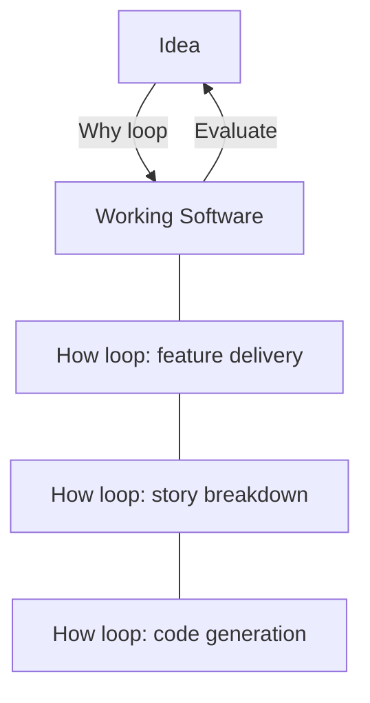

# Humans and Agents in Software Engineering Loops

> Position humans to manage the loop, not to inspect every artefact — throughput and quality compound when humans engineer the harness rather than gate its outputs.

## The Loop Hierarchy

Software delivery runs as two nested feedback loops, as described by Kief Morris in [Humans and Agents in Software Engineering Loops](https://martinfowler.com/articles/exploring-gen-ai/humans-and-agents.html):

**The why loop** iterates over ideas and working software. A human has an idea, the software gets built, the human evaluates it, and the cycle continues. Humans always own this loop — they set the goals and evaluate whether outcomes match them.

**The how loop** iterates over intermediate artefacts: specs, code, tests, infrastructure. It is a means to an end. The how loop itself nests further:

- Outer how loop: feature-level delivery (spec → implementation → validation)
- Middle how loop: story-level breakdown (decompose → implement → integrate)
- Inner how loop: code generation and testing (write → run → fix)

Where humans sit within this hierarchy determines throughput, quality, and the long-term compounding of agent capability.

## Three Positioning Modes

### Humans Outside the Loop

Humans run the why loop only. Agents run the entire how loop without human direction of intermediate steps. This is the pattern Kief Morris associates with vibe coding and some interpretations of [spec-driven development](spec-driven-development.md) — humans invest in describing the desired outcome, but not in steering the path to it.

The appeal is real: the how loop is where software development accumulates the most friction (over-engineering, technical debt, approval queues). Delegating it entirely removes that friction.

The risk: agents working in messy or poorly-structured codebases spiral more, take longer, and cost more. Internal code quality still matters, not for its own sake, but because a clean codebase improves agent velocity and reduces inference cost. External quality — correctness, performance, compliance — remains the measure, but it is harder to achieve without internal structure.

### Humans in the Loop

Humans gate specific steps of the how loop, typically the innermost coding loop. The common form: a developer inspects every diff the agent produces before accepting it.

This mode preserves high control over internal quality and catches spiraling agents quickly. Experienced developers can resolve in seconds what an agent might spiral on for minutes.

The cost: it creates a throughput bottleneck. Agents generate code faster than humans can review it. The [human-in-the-loop placement pattern](human-in-the-loop.md) formalizes when gating is worth the cost (irreversible or high-impact actions) and when it is waste (reversible execution steps that automated checks already cover).

Classic shift-left thinking applies here: rather than inspecting outputs, embed quality signals so agents can gauge their own output. Agents produce better results when they can verify their own work through tests and automated checks, rather than relying on human inspection after the fact.

### Humans on the Loop

Humans define and continuously improve the harness — the collection of specs, quality checks, workflow guidance, and automated verification that governs each level of the how loop — rather than reviewing what the harness produces.

The key distinction: when unsatisfied with an output, "in the loop" means fixing the artefact; "on the loop" means fixing the harness that produced it ([source](https://martinfowler.com/articles/exploring-gen-ai/humans-and-agents.html)).

The same concept surfaced independently as the "middle loop" at [The Future of Software Development Retreat](https://martinfowler.com/bliki/FutureOfSoftwareDevelopment.html): move human attention to a higher-level loop than the coding loop.

Operationally, the shift looks like this:

| Activity | In the loop | On the loop |
|----------|-------------|-------------|
| Agent produces wrong output | Edit the output directly | Update the spec or quality check that governs the step |
| Agent spirals on a bug | Step in and fix the bug | Add a guardrail or verification step to the harness |
| Code quality degrades | Review and reject diffs | Add linting, architectural rules, or pattern enforcement to harness |
| New requirements | Prompt the agent with corrections | Update the spec layer of the harness |

[Harness engineering](../agent-design/harness-engineering.md) is the practice of building these environments. The harness is the primary artifact of on-the-loop work.

## Making the Transition

Teams shifting from in-loop to on-loop typically pass through a recognition: the bottleneck is not agent capability, it is the harness. The transition involves three moves:

1. **Instrument the loop** — add tests, automated quality checks, and verification stages so agents can self-evaluate without human review of each artefact
2. **Capture patterns as harness rules** — when a human would have caught a recurring class of error, convert that judgment into an automated check that catches it upstream
3. **Review harness performance, not artefact quality** — shift the human review cadence from per-PR diff review to periodic harness evaluation: are the checks catching what they should? Are new failure modes emerging?

This is not a one-time migration. The harness is continuously maintained. New workload types, model changes, and scope expansions each require harness updates.

## The Agentic Flywheel

The on-the-loop mode opens a further evolution: directing agents to analyze their own traces and propose harness improvements. This is the [agentic flywheel](../agent-design/agentic-flywheel.md) — a closed loop where agents evaluate the performance of the loop they run and recommend changes to it.

The graduation path for flywheel recommendations mirrors the in/on/out spectrum:

- **Interactive**: human reviews each recommendation before applying
- **Backlog**: agent adds suggestions to the queue for later triage
- **Autonomous**: high-confidence, narrow-scope changes auto-apply with monitoring

Moving to autonomous requires a track record. Start interactive. Promote specific categories to autonomous only after they prove safe.

At scale, this starts to resemble humans-outside-the-loop again — but the difference is that the harness was engineered deliberately, not abandoned. The system is not just "good enough"; it is capable of catching and correcting its own failure modes.

## Key Takeaways

- Software delivery nests two loops: the why loop (idea → working software, human-owned) and the how loop (artefacts → working software, increasingly agent-owned)
- The how loop itself nests: feature delivery wraps story breakdown wraps code generation
- Three human positioning modes exist: outside (delegate the how loop), in (gate each step), on (engineer the harness)
- "In the loop" scales poorly: agent throughput exceeds human review capacity; use gates only for irreversible or high-impact steps
- "On the loop" compounds quality: each harness improvement applies to every future agent run, not just the current artefact
- The agentic flywheel extends "on the loop" by having agents propose harness improvements — the end state is a system that improves itself within human-defined bounds

## Related

- [Harness Engineering](../agent-design/harness-engineering.md)
- [Agentic Flywheel: Building Self-Improving Agent Systems](../agent-design/agentic-flywheel.md)
- [Human-in-the-Loop Placement: Where and How to Supervise](human-in-the-loop.md)
- [Spec-Driven Development](spec-driven-development.md)
- [Vibe Coding: Outcome-Oriented Agent-Assisted Development](vibe-coding.md)
- [Continuous Agent Improvement](continuous-agent-improvement.md)
- [Plan-First Loop](plan-first-loop.md)
