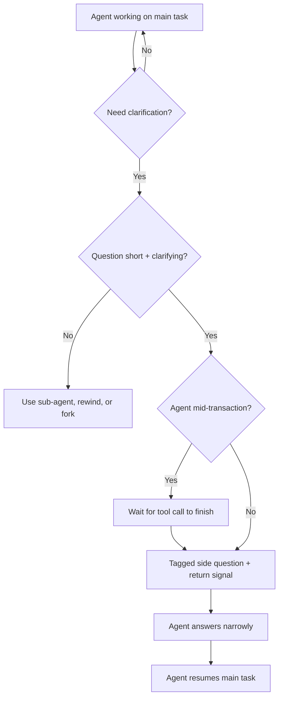

# In-Thread Side-Channel

> Ask a mid-task clarifying question inside the current session using a bounded, tagged sub-conversation that returns the agent to the prior goal — applies only when the question is short, the session is long, and the agent is not mid-transaction.

## When the Pattern Applies

The in-thread side-channel is a narrow tool, not a general-purpose one. Use it when all three conditions hold:

- **The session is long enough for attention decay to matter.** Long sessions drift off-objective — earlier instructions fall into the low-attention middle zone of the context window ([Liu et al., "Lost in the Middle," TACL 2023](https://arxiv.org/abs/2307.03172)), and goal drift has been measured empirically on 100k+ token sequences ([Arike et al., 2025](https://arxiv.org/abs/2505.02709)). In short sessions the cost of a plain interruption is low.
- **The question is short and clarifying, not a new task.** The side-channel's value is in signalling bounded scope. A substantive question (architectural review, design debate) leaves its reasoning in the main thread regardless of framing.
- **The agent is not mid-transaction.** Interrupting during an atomic tool sequence risks breaking work the agent cannot re-synchronise.

Outside these conditions, pick a different mechanism — see [Alternatives](#alternatives).

## The Mechanism

A side-channel trades a small, explicit token cost against two larger costs the alternatives incur.

Compared to stopping and restarting, it preserves the warm context the agent has built: files read, decisions made, progress artifacts. Compared to asking inline without framing, the tagged markers signal that the question is bounded — cueing the agent to answer narrowly and resume the prior goal rather than treating the question as a new implicit objective.

The causal chain is well-grounded:

- Summarisation favours high-frequency content and drops one-off constraints ([LangChain, "Context management for deep agents"](https://blog.langchain.com/context-management-for-deepagents/)) — an untagged mid-task question is indistinguishable from a new instruction
- Semantically adjacent but inapplicable content reduces compliance with applicable instructions ([Shi et al., 2023](https://arxiv.org/abs/2302.00093)) — a side question about an unrelated sub-topic competes for attention
- Middle-zone attention decay means the original goal, stated early, is already at risk in a long session; extending the session with an unframed side discussion compounds the effect ([Liu et al., 2023](https://arxiv.org/abs/2307.03172))

The tagged marker does not give technical isolation — the tokens still land in the same context window. It gives *framing*: an explicit cue to the agent that this is an interruption to answer and return, not a topic change.

## The Tool-Specific Form

Cursor CLI shipped `/btw` on 2026-04-14: "Ask a quick side question without derailing the agent's main task. `/btw` allows you to get clarification on the change Cursor is making without stopping the current run." ([Cursor changelog](https://cursor.com/changelog/04-14-26))

```
/btw why did you choose the async variant for this function?
```

The agent answers the question and returns to its prior task without treating the question as a new instruction.

## The Tool-Agnostic Form

In tools without a side-channel primitive, the same pattern works with explicit framing. The framing needs three elements:

- A marker that this is a side question (not a new task)
- The question itself, narrow in scope
- An explicit return signal pointing back to the main goal

```
[SIDE QUESTION — do not change current task]
Why did you choose the async variant for this function?
[RESUME: continue the WebSocket refactor in progress]
```

The discipline is in the return signal. Without it, the agent may treat the clarification as an objective shift, especially in long sessions where the original goal has decayed.

## Alternatives

The in-thread side-channel is the wrong choice outside its narrow conditions. The adjacent mechanisms:

| If | Use |
|----|-----|
| Question requires major reasoning | Sub-agent, parallel chat, or fork — keeps heavy tokens out of the main thread |
| Main task is near done and you want the tail | [Seamless Background-to-Foreground Handoff](background-foreground-handoff.md) |
| You want a different answer, not an additional one | Rewind / branch conversation — no side question, just re-roll the main thread |
| Session is short (~< 20 tool calls) | Plain inline question — framing adds ceremony without benefit |
| Agent is mid-transaction | Wait for the current tool call to complete before asking anything |

## Failure Modes

- **Scope creep.** The "side" question becomes the new task, and the agent never returns. The marker does not prevent this — explicit return framing is the only defence, and even that fails when the side question is substantive.
- **Substantial side questions contaminate anyway.** If the question triggers heavy reasoning, the tokens stay in the context window and push the original goal further into the middle zone. The marker does not create isolation.
- **Overuse.** Once the side-channel is cheap, users ask more questions. The pattern was meant to protect context budget; used liberally, it consumes the budget faster than plain interruptions would.
- **Empty framing.** In a tool without a side-channel primitive, a `[SIDE]` tag is just prose — effective only if the user consistently includes the return signal and the agent reliably honours it. Neither is guaranteed without practice.

## Flow



## Key Takeaways

- The in-thread side-channel is a framing technique, not an isolation primitive — tokens still land in the same context window
- It applies only when the session is long, the question is short and clarifying, and the agent is not mid-transaction
- The load-bearing element is the explicit return signal, not the opening tag
- For substantive questions, prefer a sub-agent, fork, or parallel chat — the side-channel contaminates the main thread with heavy reasoning tokens

## Related

- [Seamless Background-to-Foreground Handoff](background-foreground-handoff.md) — cross-session handoff, not same-session
- [Objective Drift](../anti-patterns/objective-drift.md) — the failure mode this pattern partially mitigates
- [Goal Recitation](../context-engineering/goal-recitation.md) — complementary technique: restate objectives at context tail
- [Distractor Interference](../anti-patterns/distractor-interference.md) — why semantically adjacent content reduces compliance
- [Context Poisoning](../anti-patterns/context-poisoning.md) — what happens when contamination goes unmanaged
