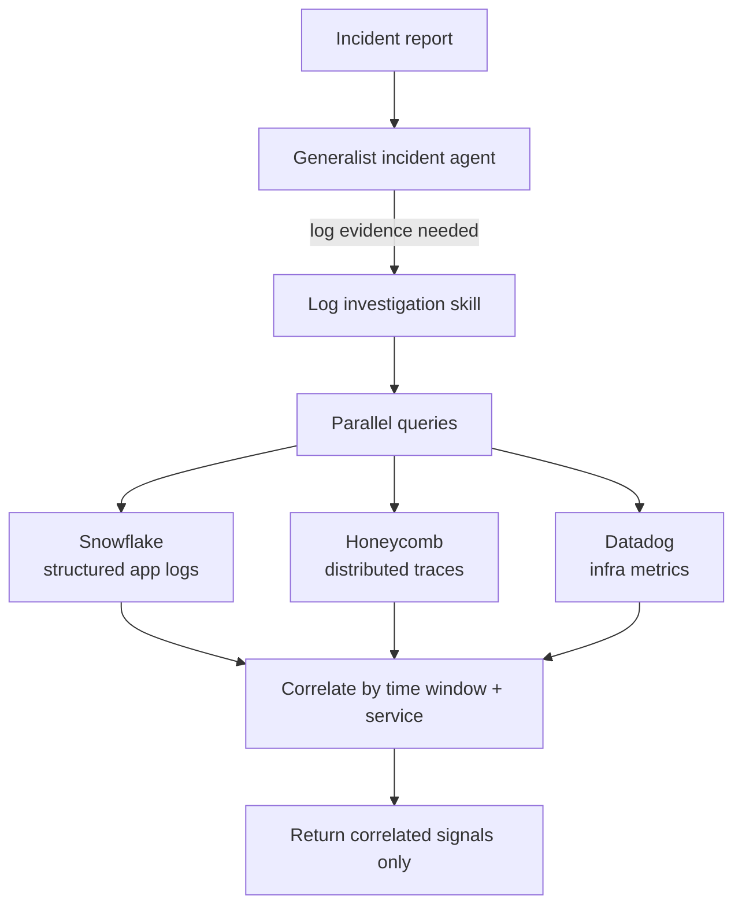

# Incident Log Investigation Skill

> A log investigation skill that returns *any* logs during an incident is worse than no skill — a false signal under time pressure actively misleads. Precision is non-negotiable, and precision without evals is unmeasurable.

## The Framing

Incident investigation is one of the highest-leverage agentic use cases. The blast radius of a slow investigation is high; the relevant signals are scattered across multiple observability systems. A well-designed skill can navigate all of them and surface correlated evidence — but only if its output is trustworthy. The patterns here (parallel tool calls, context-budget discipline, eval-backed precision) apply beyond this specific three-system setup.

## Architecture

The skill sits at the end of a delegation chain. A generalist incident agent accepts the initial report, determines that log evidence is needed, and forks to this specialist skill.



The skill does not return raw query results. It aggregates before surfacing — only the signals that correlate across systems reach the incident context.

## The Multi-System Orchestration Recipe

Querying three systems sequentially is slow and bloats the context with irrelevant intermediate data. The correct pattern is programmatic parallel dispatch.

**Step 1 — Translate the incident description to queries**

The skill accepts a structured input: incident description, affected service, approximate time window, and optional error signature. It translates these into system-specific queries without human intervention.

**Step 2 — Dispatch queries in parallel**

```python
# Pseudocode — adapt to your agent framework
results = await asyncio.gather(
    query_snowflake(service=service, window=window, pattern=error_sig),
    query_honeycomb(service=service, window=window),
    query_datadog(service=service, window=window),
)
```

Parallel dispatch prevents any single slow backend from blocking the others. Each tool fetches, filters, and returns only relevant rows — not full result sets. [Source: [Advanced Tool Use](https://www.anthropic.com/engineering/advanced-tool-use)]

**Step 3 — Correlate and return**

Align results on the shared time window and service identifier. Discard signals that appear in only one system and are not corroborated. Return a ranked summary with the most actionable signal first.

The model never sees the raw telemetry — it sees the post-aggregation summary. This is what prevents [context pollution](../anti-patterns/session-partitioning.md) from large log volumes.

## Context Budget Discipline

Each observability backend has its own MCP server or tool definition. Loading all three tool schemas unconditionally adds ~55K tokens when five or more backends are connected. The Tool Search Tool pattern defers discovery: the skill loads only the tool definitions it actually needs for this incident, reducing per-lookup cost to ~3K tokens. `[unverified for incident workloads]` [Source: [Advanced Tool Use](https://www.anthropic.com/engineering/advanced-tool-use)]

| Loading strategy | Token cost (5 backends) |
|-----------------|------------------------|
| All tool definitions always loaded | ~55K tokens |
| On-demand via Tool Search Tool | ~3K tokens per lookup |

At 50 incidents per week across a five-person team, the difference between strategies is roughly 2.5M vs 150K tokens per week — about a 16× reduction in tool-definition overhead.

## Progressive Disclosure Routing

The generalist incident agent delegates to this skill via `context: fork`. The skill is self-contained — it does not require the parent agent's full context to operate.

```yaml
# SKILL.md frontmatter (Claude Code / Agent Skills standard)
name: incident-log-investigation
context: fork
agent: incident-agent
description: |
  Investigate log evidence for an active incident.
  Accepts: incident description, service name, time window, optional error signature.
  Returns: ranked list of correlated signals, each with source system, timestamp,
    signal text, and corroboration count (number of systems where it appeared).
```

The `context: fork` declaration tells the runtime to spawn a clean sub-agent context rather than passing the full parent context. The parent receives only the skill's output — a ranked list of correlated signals — not the intermediate query results. [Source: [Claude Code Skills Docs](https://code.claude.com/docs/en/skills)]

This matches the orchestrator-workers pattern for scenarios where subtask discovery is unpredictable: the generalist agent cannot know in advance which observability system will hold the root-cause signal. [Source: [Building Effective Agents](https://www.anthropic.com/engineering/building-effective-agents)]

## Eval Design

Precision is the core quality metric. An eval suite that tests whether the skill "returned logs" will pass on a skill that returns misleading signals. The grader must test whether the skill surfaced the **correct root-cause signal**.

### Building the Test Set

Hold out a set of known incidents with verified root causes. For each:

- Record the incident description, affected service, and time window used as input
- Record the ground-truth root-cause signal (the log line, trace ID, or metric spike that explains the incident)
- Optionally record known red herrings — correlated-but-unrelated signals that should *not* be surfaced

### Metrics

| Metric | What it measures |
|--------|-----------------|
| Precision | Fraction of surfaced signals that are correct root-cause evidence |
| Recall | Fraction of ground-truth signals actually surfaced |
| Tool call count | Efficiency; high count signals the skill is fetching broadly and discarding |
| Token consumption | Context cost per investigation |

High tool call counts are the key signal that the skill is not filtering effectively — it is fetching everything and relying on the model to discard irrelevant results. [Source: [Evaluation-Driven Development for Agent Tools](eval-driven-tool-development.md)]

### Anti-Reward-Hacking Grader

A grader that accepts "any correlated log" passes a skill that returns noise. Design the grader to evaluate against the held-out ground-truth signal set:

```python
def grade(output, ground_truth):
    surfaced = extract_signals(output)
    correct = [s for s in surfaced if s in ground_truth.root_cause_signals]
    false_positives = [s for s in surfaced if s in ground_truth.red_herrings]
    precision = len(correct) / len(surfaced) if surfaced else 0
    recall = len(correct) / len(ground_truth.root_cause_signals)
    penalty = len(false_positives) * 0.5  # penalize red-herring surfacing
    return {"precision": precision, "recall": recall, "score": precision + recall - penalty}
```

False positives on known red herrings should reduce the score — surfacing a misleading signal during an incident is an active harm, not a neutral outcome. [Source: [Agentic Handbook](https://www.nibzard.com/agentic-handbook)]

## What Makes a Good Eval Task

- Incidents where one system holds the root cause and the others are noise — tests that the skill does not over-surface
- Incidents where the signal appears across all three systems — tests correlation logic
- Incidents with tight time windows (seconds, not hours) — tests time-window precision
- Incidents where the service name is ambiguous (multiple services with similar names) — tests disambiguation

## Example

A payment processing service (`checkout-api`) starts returning elevated 500 errors at 14:32 UTC. The on-call engineer triggers the incident agent with:

```
Incident: checkout-api 500 spike
Service: checkout-api
Time window: 14:25–14:45 UTC
Error signature: "connection refused: payment-gateway:5432"
```

**Query translation** — the skill generates three parallel queries:

```sql
-- Snowflake: structured app logs
SELECT timestamp, level, message, trace_id
FROM app_logs
WHERE service = 'checkout-api'
  AND timestamp BETWEEN '2025-07-10 14:25:00' AND '2025-07-10 14:45:00'
  AND message ILIKE '%connection refused%'
ORDER BY timestamp;
```

```jsonc
// Honeycomb: distributed traces
{
  "time_range": 1200,
  "breakdowns": ["trace.parent_id", "duration_ms"],
  "filters": [
    {"column": "service.name", "op": "=", "value": "checkout-api"},
    {"column": "error", "op": "=", "value": true}
  ],
  "filter_combination": "AND"
}
```

```
# Datadog: infra metrics
avg:system.net.tcp.retransmits{service:checkout-api} by {host}
  .rollup(max, 60)
  .last("20m")
```

**Parallel dispatch** returns three result sets. **Correlation** aligns on the 14:30–14:35 window:

| Source | Signal | Corroborated |
|--------|--------|-------------|
| Snowflake | `connection refused: payment-gateway:5432` — 342 log lines between 14:30–14:35 | Yes (all 3) |
| Honeycomb | Trace `abc-123` shows `checkout-api → payment-gateway` call failing at 14:31, p99 latency spike to 30s | Yes (all 3) |
| Datadog | TCP retransmits on `host-07` spike from 2/min to 840/min at 14:30 | Yes (all 3) |
| Honeycomb | Trace `def-456` shows `checkout-api → inventory-svc` slow query at 14:28 | No (1 system only) |

The skill discards the uncorroborated `inventory-svc` signal and returns:

```
Root-cause signal: payment-gateway database (port 5432) unreachable from host-07
  starting 14:30 UTC. 342 connection-refused errors in app logs, confirmed by
  trace abc-123 (30s timeout) and TCP retransmit spike (840/min).
Corroboration: 3/3 systems.
Confidence: high.
```

The generalist incident agent receives only this summary — not the raw query results — and routes to the database on-call team.

## Unverified Claims

- The specific Intercom implementation (Snowflake + Honeycomb + Datadog combination, high-quality evals, progressive disclosure routing) is sourced from a Twitter/X post that requires authentication and could not be independently verified. All architectural claims above are sourced independently.
- The 37% token reduction figure for programmatic tool calling is reported by Anthropic for complex research tasks and may not transfer directly to incident investigation workloads `[unverified for this specific domain]`.

## Related

- [Evaluation-Driven Development for Agent Tools](eval-driven-tool-development.md)
- [Eval-Driven Development: Write Evals Before Building Agent Features](eval-driven-development.md)
- [Runbooks as Agent Instructions](runbooks-as-agent-instructions.md)
- [Progressive Disclosure for Agent Definitions](../agent-design/progressive-disclosure-agents.md)
- [Advanced Tool Use](../tool-engineering/advanced-tool-use.md)
- [Orchestrator-Worker Pattern](../multi-agent/orchestrator-worker.md)
- [LLM-as-Judge Evaluation](llm-as-judge-evaluation.md)
