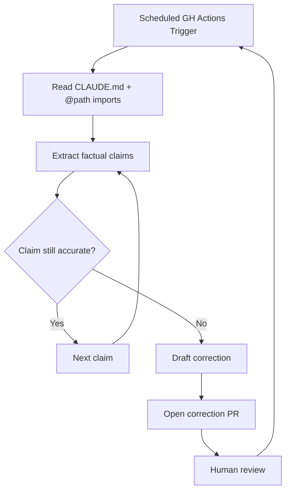

# Scheduled Instruction File Fact-Checker

> A scheduled GitHub Actions agent that reads CLAUDE.md and all `@path`-referenced instruction files, verifies each factual claim against the live codebase, and opens a correction PR — keeping instruction files accurate as the project evolves.

## The Problem

Instruction files are written at a point in time. The codebase changes continuously. File paths move, command names change, deprecated patterns propagate, new conventions emerge. The agent following CLAUDE.md silently degrades as the gap between "what the file says" and "what the project actually is" widens.

[Continuous agent improvement](continuous-agent-improvement.md) documents this as the staleness problem and prescribes periodic manual review. This page documents the automated version: a scheduled agent that runs the review for you.

## What This Differs From

| Page | Covers | Does Not Cover |
|------|--------|----------------|
| [Continuous Documentation](continuous-documentation.md) | Code → docs drift | Instruction file → codebase drift |
| [Entropy Reduction Agents](entropy-reduction-agents.md) | Architectural violations in code | Inaccurate claims in instruction files |
| [Continuous Agent Improvement](continuous-agent-improvement.md) | Manual observation → update loop | Automated fact-checking |

The unique angle here is **closed-loop automation** applied specifically to instruction files: not just detecting drift after a human notices it, but running a scheduled agent that reads the file, verifies each claim against the codebase, and proposes corrections.

## Mechanism



Three things the agent verifies per claim:

1. **File paths exist** — does `src/handlers/` still exist? Did it move to `src/api/handlers/`?
2. **Commands work** — does `npm run lint` still exist in `package.json`? Has it been renamed?
3. **Patterns are current** — is the referenced convention still the recommended approach, or has it been superseded?

The agent does not rewrite strategy or intent — only verifiable facts that can be checked against disk.

## Implementation

Claude Code GitHub Actions supports scheduled triggers with `anthropics/claude-code-action@v1` and a `prompt` parameter. CLAUDE.md is read from disk on every invocation — not cached — so the agent always sees the current file state ([Claude Code docs](https://code.claude.com/docs/en/github-actions)).

```yaml
name: instruction-file-fact-check

on:
  schedule:
    - cron: '0 6 * * 1'  # Weekly, Monday 06:00 UTC
  workflow_dispatch:

jobs:
  fact-check:
    runs-on: ubuntu-latest
    permissions:
      contents: write
      pull-requests: write

    steps:
      - uses: actions/checkout@v4

      - name: Fact-check instruction files
        uses: anthropics/claude-code-action@v1
        with:
          prompt: |
            Read CLAUDE.md and all files it imports via @path syntax.
            For each factual claim — file paths, command names, directory
            structures, referenced conventions — verify the claim is still
            accurate against the current codebase.
            For each inaccuracy found:
              - State what the file claims
              - State what is actually true
              - Propose a minimal correction
            Collect all corrections and open a single PR.
            Do not modify strategy, intent, or non-factual guidance.
            Do not commit directly to main.
          claude_args: "--allowedTools Read,Write,Bash,mcp__github__create_pull_request"
        env:
          ANTHROPIC_API_KEY: ${{ secrets.ANTHROPIC_API_KEY }}
          GITHUB_TOKEN: ${{ secrets.GITHUB_TOKEN }}
```

### Scope: What to Fact-Check

| Claim type | Verifiable? | Example |
|-----------|-------------|---------|
| File path exists | Yes | `src/handlers/` → check `ls` |
| Command name | Yes | `npm run lint` → check `package.json` scripts |
| Directory structure | Yes | `packages/api/` → check `ls` |
| Deprecated API usage | Partial | import path exists? |
| Architectural intent | No — skip | "use the repository pattern" |
| Style rules | No — skip | "prefer named exports" |

Restrict the agent to verifiable facts. Style rules and architectural intent cannot be fact-checked against the codebase and should be left unchanged.

## Output Constraints

The agent's output must always be a reviewable PR — never a direct commit to main. This is consistent with the safe-output model that GitHub's agentic workflow documentation requires ([GitHub Blog](https://github.blog/ai-and-ml/automate-repository-tasks-with-github-agentic-workflows/)).

A well-scoped correction PR is typically small and fast to review:

- One PR per weekly run (not one PR per correction)
- Each correction states the old claim, the new reality, and the proposed fix
- No rewrites — minimal, surgical edits only

## Cadence

Weekly is the right default cadence for most projects. Daily runs produce noise if the codebase changes slowly. The right trigger is the same trigger that drives entropy reduction agents: a slow-moving background process that catches drift the reactive CI pipeline misses.

For high-churn projects, augment the schedule with a push trigger scoped to instruction files' direct dependencies — the directories and files they reference:

```yaml
on:
  schedule:
    - cron: '0 6 * * 1'
  push:
    paths:
      - 'src/**'
      - 'package.json'
      - '.claude/**'
```

## Extension: Learning From Session Logs

Brian Scanlan (Intercom) noted [unverified] that a weekly CLAUDE.md fact-checker "needs to go further and continually learn" — meaning the next step is not just verifying existing claims but surfacing new patterns from agent session logs worth adding to the instruction file.

That extension is a separate workflow from fact-checking. The fact-checker answers "is what we wrote still true?" Session log mining answers "what should we add?" Conflating them in one agent produces a low-precision output that is harder to review.

## Example

A Node.js project has this in its CLAUDE.md:

```
Project structure:
- src/handlers/ contains all API route handlers
- Run `npm run lint` before committing
- Use the repository pattern for all data access (see src/repositories/)
```

The team renames `src/handlers/` to `src/api/routes/` and replaces `npm run lint` with `npm run check`. No one updates CLAUDE.md.

On Monday at 06:00 UTC the scheduled workflow runs. The agent reads CLAUDE.md, extracts three verifiable claims, and checks each:

1. **`src/handlers/` exists** — `ls src/handlers/` fails. Agent finds `src/api/routes/` via `find src -type d -name routes`. Proposes correction: `src/handlers/` → `src/api/routes/`.
2. **`npm run lint` exists** — `jq '.scripts.lint' package.json` returns null. Agent finds `npm run check` instead. Proposes correction: `npm run lint` → `npm run check`.
3. **`src/repositories/` exists** — `ls src/repositories/` succeeds. No correction needed.

The agent opens a single PR with two surgical edits to CLAUDE.md. A human reviews and merges.

## Key Takeaways

- Instruction file drift is the same problem as documentation drift — same detection pattern, same PR-based output
- Restrict the agent to verifiable facts (paths, commands, directories) — leave strategy and style instructions untouched
- Weekly schedule is the right default; add push triggers for high-churn projects
- One PR per run with surgical corrections is faster to review than per-correction PRs
- Learning from session logs is a separate workflow — do not conflate with fact-checking

## Related

- [Continuous Agent Improvement](continuous-agent-improvement.md)
- [Continuous Documentation](continuous-documentation.md)
- [Entropy Reduction Agents](entropy-reduction-agents.md)
- [Getting Started: Instruction Files](getting-started-instruction-files.md)
- [CLAUDE.md Convention](../instructions/claude-md-convention.md)
- [Architecting a Central Repo for Shared Agent Standards](central-repo-shared-agent-standards.md)
- [CLI, IDE, GitHub Context Ladder](cli-ide-github-context-ladder.md)
- [Headless Claude in CI](headless-claude-ci.md)
- [Continuous AI-Agentic CI/CD](continuous-ai-agentic-cicd.md)
