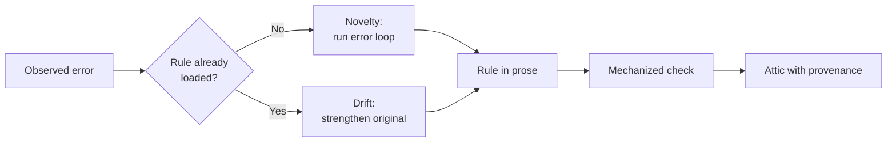

# The Error-Class Governance Loop for Instruction Libraries

> Govern instruction rules as a running loop: classify each recurrence as novelty or drift, then retire the rule into a mechanized check.

An error-class governance loop is the operating cycle that runs after a correction has already been written into an instruction file. It watches for the corrected error class coming back and moves every rule along a fixed path from prose to a mechanized check to an archive. George Andrikopoulos argues that persistence mechanisms for corrections already ship while the discipline for governing them does not, and names the missing pieces as versioning with provenance, recurrence monitoring, counter-metrics, and retirement of stale rules ([arXiv 2608.19125v1](https://arxiv.org/abs/2608.19125v1)). His paper is a proposed operating model drawn from his own practice, with no control group and no measured results. The loop earns its cost only above a threshold, so start with the conditions.

## When this loop pays off

Run the loop only when all four of these hold. Skip it, or expect false signals, when any one fails.

- The surface is large enough that nobody re-reads it. Across 1,867 repositories the observed median instruction file held 39 instructions ([arXiv 2608.11095v1](https://arxiv.org/abs/2608.11095v1)). Below a few dozen rules, a quarterly pass that deletes whatever no one defends reaches the same outcome with none of the machinery.
- You track recurrence as a rate over attempts, not as an event count. Instruction adherence binds probabilistically, and even the best frontier models reach only 68% accuracy at a density of 500 instructions ([arXiv 2507.11538v1](https://arxiv.org/abs/2507.11538v1)). A single recurrence against a loaded rule sits inside the expected variance.
- Someone owns the cut list. Retirement is the one stage that produces nothing shippable, and it loses every planning cycle it enters unowned.
- Corrections arrive in a stream you can observe: review comments, incident write-ups, or session transcripts. The loop has no other input.

## Why instruction libraries decay

Accumulation is the measured default. Chakrabarti tracked 247,694 instruction lifetimes across 1,867 repositories and found files gaining 4.9 net instructions per commit, with the log-hazard of deletion falling 0.032 per commit of instruction age ([arXiv 2608.11095v1](https://arxiv.org/abs/2608.11095v1)). Older rules are removed less often than young ones, which is the reverse of what staleness alone would predict.

The cause is an asymmetry in cost. Adding a rule is one edit. Proving a rule is safe to remove means testing subsets, because overlapping rules can each look redundant while the group is load-bearing ([arXiv 2608.11095v1](https://arxiv.org/abs/2608.11095v1)). Wholesale rewrites do not fix it: growth measured 4.1% per commit before a rewrite and 4.9% after one. The [catastrophic remembering anti-pattern](../patterns/anti-patterns/catastrophic-remembering-instruction-files.md) covers that failure at the write site; this loop is what runs afterward.

## Three implementation layers

### Layer 1: Detection

Classify every observed error against the rule set that was loaded at the time. A first occurrence is novelty and enters rule creation. An occurrence against a live rule is drift, and drift never earns a second rule. Andrikopoulos is direct on the handling: "When an error recurs against an existing rule, strengthen the original; never lay a duplicate beside it" ([arXiv 2608.19125v1](https://arxiv.org/abs/2608.19125v1)). He ranks it above every adoption statistic: "recurrence as the loud negative, outranking any usage statistic."

Detection needs a denominator. Record how many attempts gave the class a chance to appear, so a rising rate separates a weak rule from ordinary sampling noise.

### Layer 2: Orchestration

Novelty runs through a five-stage error loop before anything is written down.

1. Fix the instance. The correction comes before the ceremony.
2. Name the error class. It qualifies only if it would prevent at least two different future errors.
3. Draft the rule as an imperative carrying its rationale and its own check.
4. Choose one home. A rule lives in the global, domain, or project layer, never duplicated across them.
5. Version and record the date, the class, and the triggering incident.

Stage 2 is the gate that keeps the library from filling with one-off corrections. The same discipline governs what comes out, since the library retires classes rather than accumulating anecdotes ([arXiv 2608.19125v1](https://arxiv.org/abs/2608.19125v1)). Stage 5 is what [rule lifecycle metadata](../instructions/rule-lifecycle-metadata.md) formalizes as a per-rule schema.

### Layer 3: Action

Every rule occupies one of three positions, and the loop's job is to move it rightward. Andrikopoulos describes the trajectory as running from incident to prose rule to a mechanized check wherever the rule is checkable, and finally to "an attic, archived outside the loaded paths with provenance intact" ([arXiv 2608.19125v1](https://arxiv.org/abs/2608.19125v1)).

| Position | How it binds | How you measure it |
|---|---|---|
| Prose rule | Probabilistically, and it competes for context budget | Recurrence rate against attempts |
| Mechanized check (hook, CI job, type) | Deterministically, at zero context cost | Blocked events, which leave logs |
| Attic | Not at all; kept for provenance | Nothing, by design |

Prose is a holding pen rather than a destination. Promoting a rule into a [hook or CI check](../instructions/enforcing-agent-behavior-with-hooks.md) also dissolves its measurement problem, because a prevented failure produces no evidence while a blocked event produces a log line.

## Counter-metrics

Each number carries a paired opposite, so improving one cannot quietly wreck the other. Andrikopoulos proposes four pairs ([arXiv 2608.19125v1](https://arxiv.org/abs/2608.19125v1)):

| Primary | Counter-metric |
|---|---|
| Error-class recurrence | Rule usage plus cut-list volume |
| First-time-right rate | Severity-weighted review catches |
| Rework rate | Lead time |
| Time-to-competence | Escalation quality |

His summary of the intent: "Speed pairs with rework, conformance with alert noise. Usage, the most gameable measure in the field, is replaced entirely by outcomes." The first row shows why: "zero recurrence is uninformative on its own, since a library padded with dead rules scores the same as one whose live rules are doing the work" ([arXiv 2608.19125v1](https://arxiv.org/abs/2608.19125v1)).

Pairing narrows the gaming surface without closing it. Thomas and Uminsky argue that a slate of metrics is only one of three mitigations, alongside qualitative accounts and input from the people most affected ([arXiv 2002.08512](https://arxiv.org/abs/2002.08512)). Treat the table as a floor.

## Triggers and constraints

Detection fires per correction, in the session where the correction happens. Orchestration runs immediately after, because a class named a week later has lost the incident detail that makes stage 5 useful. Retirement review runs on a schedule, because nothing else creates pressure to subtract.

The cut-list review is what moves rules along the pathway, and one verdict is off the table for it. Andrikopoulos rules out "zero fires, therefore delete" outright ([arXiv 2608.19125v1](https://arxiv.org/abs/2608.19125v1)). A prose rule that has recorded no violations may be working, so retirement needs a positive reason: the class is mechanized, or the risky context no longer arises.

Authority splits by stage. An agent can propose a class name, draft a rule, and flag a retirement candidate from recurrence data. A person confirms the archive and stays the last line of review for errors no check can catch. Safety-scoped rules stay out of the automated retirement path.

## Multi-tool coverage

Tool-agnostic. The layers describe a surface any assistant loads, so the loop runs over `CLAUDE.md`, `AGENTS.md`, or `copilot-instructions.md` unchanged. Only the mechanization step differs: the deterministic check becomes a Claude Code hook, a CI job, a pre-commit rule, or a type, depending on what the stack already enforces.

## Why it works

Recurrence data works because it changes the cost class of the retirement decision rather than adding rigor. Verifying that an instruction is superfluous is a subset search, exponential in the number of overlapping rules. Recording which failure produced the rule and how often that failure recurred collapses the check to a single re-run of one scenario ([arXiv 2608.11095v1](https://arxiv.org/abs/2608.11095v1)). The measured effect is large and attributable, across two separate arms. Over 51 steps, comments encoding latent reasoning "remove 99.3% of excess instructions (+211.3% to +1.4%)". A 15-step ablation then isolates which field does the work: that arm runs from a +60.4% control to −5.8% under informative comments, and within it "dropping the recurrence count alone costs 37% of it" ([arXiv 2608.11095v1](https://arxiv.org/abs/2608.11095v1)). Retirement in turn defends adherence, because the [instruction compliance ceiling](../instructions/instruction-compliance-ceiling.md) bites harder as the surface grows ([arXiv 2507.11538v1](https://arxiv.org/abs/2507.11538v1)).

## When this backfires

- Recurrence counted as events. With probabilistic binding, one return of a class is expected. A team that treats each one as drift keeps strengthening rules that were already correct, growing the surface the loop exists to shrink ([arXiv 2507.11538v1](https://arxiv.org/abs/2507.11538v1)).
- Corrections with no mechanization target. Design taste and API-shape preferences cannot become a hook or a type, so they sit in prose permanently and keep the deterrence problem: you cannot count the failures a rule silently prevented.
- Provenance recorded without outcomes. Half-adoption measured worse than doing nothing at all, with a narrative of attempts carrying no record of what followed scoring +70.0% excess against a +60.4% control ([arXiv 2608.11095v1](https://arxiv.org/abs/2608.11095v1)).
- Counter-metrics adopted as the whole answer. Pairs alone leave a purely quantitative regime that moves gaming around instead of removing it ([arXiv 2002.08512](https://arxiv.org/abs/2002.08512)).
- Evidence weight. The seven-principle model behind this loop comes from one practitioner's cases, and its author proposes challenge trials that run a task with and without the rule loaded as the study still required to test it ([arXiv 2608.19125v1](https://arxiv.org/abs/2608.19125v1)).

## Example

Andrikopoulos reports a pre-deployment review of an IP allowlist in his own home-lab service mesh that caught two defects functional development had missed. A configuration handoff emitted newline-separated output where JSON was expected, so "the allowlist would have booted inert — present, passing smoke tests, enforcing nothing." A single trailing character, `192.168.1.0/` instead of `192.168.1.0/24`, parsed as `/0` and matched everything. His summary of the second one: "One character separated an allowlist from an allow-everything list" ([arXiv 2608.19125v1](https://arxiv.org/abs/2608.19125v1)).

That is stage 2 doing its work. Neither defect becomes a rule about allowlists or about output formats. Both belong to one class, a control silently becoming the exact harm it exists to prevent ([arXiv 2608.19125v1](https://arxiv.org/abs/2608.19125v1)). That class reaches a future auth middleware or rate limiter, and it still names something you can check.

Layer 3 decides where the rule ends up. A parsed-result-versus-intent assertion is checkable, so its destination is a schema validator in CI rather than a permanent line of prose. Once that validator runs, its blocked events show up in logs, and the prose rule can move to the attic carrying the incident and its recurrence record.

## Key Takeaways

- Detection classifies each error as novelty or drift; drift strengthens the existing rule and never adds a parallel one.
- Track recurrence as a rate over attempts, because probabilistic adherence makes single returns expected rather than diagnostic.
- The retirement pathway runs prose, then mechanized check, then attic with provenance intact. Prose is a holding pen.
- Recurrence data is the load-bearing field. In the 15-step comment-content ablation, dropping it alone costs 37% of that arm's reduction.
- Give the cut list an owner and a cadence, or the loop collapses into the accumulation it was built to stop.
- The operating model is a practitioner argument awaiting a controlled study; the numbers here come from separate measured work.

## Related

- [Rule Lifecycle Metadata for Prunable Instruction Surfaces](../instructions/rule-lifecycle-metadata.md) — the per-rule schema that stage 5 of the error loop writes.
- [Catastrophic Remembering: Instruction Files That Only Grow](../patterns/anti-patterns/catastrophic-remembering-instruction-files.md) — the write-site failure this loop governs after the fact.
- [Accumulated Behavioral Rules from Review Feedback](accumulated-behavioral-rules.md) — the intake half, turning accepted review comments into rules this loop then retires.
- [Continuous Agent Improvement](continuous-agent-improvement.md) — the broader observe-and-update cycle this governance loop specializes.
- [Enforcing Agent Behavior with Hooks](../instructions/enforcing-agent-behavior-with-hooks.md) — the mechanization step that ends a rule's time in prose.
